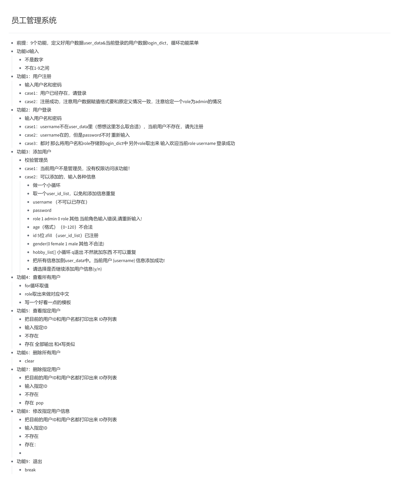

# 1 当前知识总梳理

```python
# 【一】计算机的五大组成部分
# 控制器：调度整个计算机的硬件部分
# 运算器：负责处理数据和逻辑运算
# 存储器：负责存储数据和程序（外存和内存）
# 输入设备：向电脑中输入内容
# 输出设备：计算机向用户输出内容

# 【二】计算机的三大核心硬件
# CPU：控制器+运算器 整个计算机的大脑 负责整个计算机的协调和运算
# 硬盘：机械硬盘(便宜，读取速度慢) 固态硬盘(贵，读取速度快)
# 内存：负责临时存储计算机中运行产生的数据

# 程序执行流程：
# 双击应用图标开始 --->
# 将应用数据从硬盘中读取到内存中 --->
# CPU会将临时的程序数据从内存中读取出来 --->
# CPU发送指令集交给固定硬件 --->
# 硬件执行完毕后 --->
# 将结果从内存中读取出来 --->
# 显示器将结果显示出来 --->
# 程序结束 --->
# CPU发送指令集 关闭程序 --->
# 硬盘要将数据从内容中读取出来 然后保存到本地的硬盘中

# 【三】什么是编程和编程语言
# 编程语言就是 人与计算机之间交流沟通的媒介
# 编程就是将人能识别的代码转换为计算机可以识别的数据

# 【四】编程语言的分类
# 【1】机器语言
# 计算机是基于电运行的，高低电频之分 0 / 1 ,最开始控制电流高低电频的变化从而控制硬件
# 由 0 / 1 二进制数据组成的数字串
# 优点：直接操作硬件 效率高
# 缺点：学习成本高 不好学

# 【2】汇编语言
# 基于机器语言知识之上，用字符代替上面的一串机器指令 字符就是指 英文大小写字母 / 标点符号
# 优点：直接操作硬件 效率高
# 缺点：学习成本高

# 【3】高级语言
# 用人类能看懂的字符来操作操作系统然后在底层操作硬件
# 先写代码 ---> 操作系统转义成机器语言 ---> 交给底层硬件执行
# (1)编译型语言
# 边编译边执行 将源代码根据操作系统的不同转换为自己系统的源文件
# 整个文章翻译后使用
# c c++ Java
# 优点：一次编译 处处运行 效率高
# 缺点：跨平台性差

# (2)解释型语言
# 边解释边执行
# 翻译一部分使用，再翻译一部分使用
# Python Go Php
# 优点：跨平台性好
# 缺点：效率低（对于计算机来说）

# 【五】Python介绍
# 创始人：龟叔
# 世界排名：第一
# 发展历史：1989开始-1991第一版本-2016发布3.6
# 我们使用的是Cpython 解释器底层是c写起来的

# 【六】Python安装
# 傻瓜式安装

# 【七】Pycharm安装
# 同上

# 【八】Python知识点补充
# 【1】虚拟环境
# 创建一个独立的python执行环境
# 为了隔离每个项目之间不同的版本
# 创建虚拟环境的三种方式：
# 自带 venv
# 第三方 virtualenv 先安装才能使用 pip install virtualenv
# pycharm

# 【2】pip假面
# 默认的安装源是国外的下载速度慢
# 各大机构在国内开设了安装源，下载速度会很快
# 临时换源 pip install 模块 -i 源地址
# 永久换源 pip set global.index-url 源地址

# 【九】Pycharm快捷键和插件操作
# ctrl + d 复制行
# ctrl + v 粘贴
# ctrl + x 剪切
# ctrl + alt + l 格式化代码
# ctrl + / 注释

# 【十】常量和变量
# 【1】什么是常量
# 是程序在执行过程中不会变化的量
# python中定义 全大写
# python中 可以修改 不建议
# 其他语言一旦定义无法修改

# 【2】什么是变量
# 是程序在执行过程中不断变化的量
# 为了能够使用和处理这些数据
# 变量名 = 变量值

# 【3】命名规范
# 数字+字母+下划线任意组合
# 数字不开头
# 关键字不能作为变量名

# 【4】变量名的命名风格
# 驼峰体
# 大驼峰 单词字母开头都大写
# 小驼峰 除第一个其余单词字母开头都大写
# 下划线组合
# 下划线+数组+字母

# 【5】变量的三大特性
# 变量值 直接打印
# 变量类型 type
# 内存地址 id

# 【十一】基本数据类型概述程序运行过程中会产生各种自己独有的数据
# int
# float
# str
# bool
# list
# dict
# tuple
# set

# 【十二】流程顺序结构
# 顺序结构：程序从上至下依次执行
# 分支结构
# 单分支
# 双分支
# 多分支
# 循环结构
# while循环 continue/break关键字 标志位 死循环
# for
# range

# 【十三】三元运算
# 为真的值 if 条件 else 条件为假的值
# ()[表达式] 取布尔值0/1 取索引对应的元素
# {}[表达式] 取布尔值True/False 取字典中索引为True、False的值

# 【十四】数据类型的内置方法
# 【1】整数类型的内置方法
# 强制类型转换 int
# bin 2 oct 8 hex 16
# int 其他进制转为10进制

# 【2】浮点数
# 强制类型转换 float
# 字符串.isdigit() 字符是否是整数类型

# 【3】字符串
# 字符串拼接 + 号 / ''.join(可迭代类型)
# 索引取值 正向0开始 负向从右向左-1开始
# 切片 [a:b:walk]
# 计算数据长度 len
# 成员运算in / not in
# 去除特殊字符.strip() 默认是去除空格和换行/ .lstrip() / .rstrip()
# 切分 split() 切分字符串 默认是空格 切分的字符会消失
# 替换字符 replace(旧字符,新字符) 替换字符串中的字符 默认是全部替换
# 遍历字符串 for 循环 / while 循环
# 字符串重复 字符串 * 数字
# 字符串大小写转换 upper() lower()
# 首尾字符判断 startswith() endswith()
# 字符串格式化输出语法 %s站位 / '{}'.format(元素) / f"{name}"
# find 查找当前字符在字符串中所在的索引位置默认是从左向右找 并且找打一个旧不找了 如果找不到 就返回 -1 rfind 从右向左找
# index  查找当前字符在字符串中所在的索引位置默认是从左向右找 并且找打一个旧不找了 如果找不到 就报错 rindex  从右向左找
# 计算当前字符所在字符串中出现的次数 count()
# center(原字符串的长度 + 填充的字符个数,字符) 居中填充
# ljust(原字符串的长度 + 填充的字符个数,字符) 左对齐 填充在右侧
# rjust(原字符串的长度 + 填充的字符个数,字符) 右对齐 填充在左侧
# zfill(原字符串的长度 + 填充的字符个数) 用0填充至指定长度
# capitalize() 一句话的首字母大写
# title() 一句话的每个单词的首字母大写
# swapcase() 把大写字母转换为小写 把小写字母转换为大写
# isdigit()  判断当前字符是否是数字类型的数据格式

# 【4】列表
# 强制类型转换 将可迭代类型转换为 列表
# 索引取值 正向索引取值(从0开始 从左向右) 负向索引取值 (从-1开始 从右向左)
# 切片取值 列表[开始索引:结束索引:步长] 顾头不顾尾
# 计算数据长度 len
# 成员运算 in / not in
# 增加元素 .append() 默认追加在结尾 .insert(索引位置,元素) 插入到指定索引位置 extend(可迭代类型) 追加多个元素
# 删除元素 .remove(元素) 删除指定的元素 .pop(索引位置) 删除指定的索引位置的元素 del 列表[索引位置] 删除指定的索引位置的元素
# 颠倒元素 .reverse()
# 列表元素排序 .sort(reverse=True)
# 遍历循环 for  / while

# 【5】元组类型
# 元组一个元素的时候也要加 , 不加 , 就是当前元素的类型
# 一个字符串或者一个数字的时候不要加 , 编程了元组
#  强制类型转换 将可迭代类型转换为 元组
# 索引取值 正向索引取值(从0开始 从左向右) 负向索引取值 (从-1开始 从右向左)
# 列表可以索引取值并修改值但是元组不行
# 切片取值 列表[开始索引:结束索引:步长] 顾头不顾尾
# 成员运算  in / not in
# 计算长度 len
# 遍历循环 for / while
# 元组拼接 元祖 + 元组 新的元组
# 元祖重复 元祖 * 数字

# 【6】布尔
# 1/0 True/False
# 为假； 0, 空, False

# 【7】字典
# {}包裹的K：V键值对数据
# 取值： 字典[key] 取值 没有就报错  字典.get(key) 如果没有默认就是 None
# 计算长度 len
# 成员运算 in / not in
# 增加 元素 字典[key] = value 没有就新增 有就修改 字典.update(字典) 没有就新增 有就修改 字典.setdefault(key,value) 没有就新增 有就修改
# 删除 元素 字典.pop(key) 删除指定的key 字典.popitem() 随机删除一个key 字典.clear() 清空字典
# 键对 字典.keys()
# 值对 字典.values()
# 键值对 字典.items()

# 【8】集合类型
# 无序且去重
# 向集合中添加元素 集合.add(元素) 集合.update(可迭代类型)
# 从集合中删除元素 集合.remove(元素) 集合.discard(元素)
```

# 2 登录注册功能实现

```python
# 列表生成式
# print([i.upper() for i in name_list])
# 字典推导式

# 【一】登录注册
# 多用户的登录注册
menu = '''
######### 功能菜单 #########
          1.注册
          2.登录
          3.退出
######### 功能菜单 #########
'''

# 声明数据存储位置
user_data = {}

while True:
    # 【1】打印功能菜单
    print(menu)
    # 【2】用户输入功能ID
    func_id = input("请输入功能ID：>>>").strip()
    # 【3】判断当前是否为整数
    if not func_id.isdigit():
        print(f"当前ID不合法")
        continue
    func_id = int(func_id)
    # 【4】判断id是否存在
    if func_id not in [1, 2, 3]:
        print("当前功能ID不存在")
        continue
    # 【5】进入登录或注册逻辑
    if func_id == 1:
        print(f"欢迎来到注册功能")
        # （1）让用户输入用户名和密码
        username = input("请输入用户名：>>>").strip()
        password = input("请输入密码 ：>>>").strip()
        # （2）判断当前用户是否存在 如果不存在才能注册
        if user_data.get(username):
            print(f"当前用户 {username} 已存在，请登录！")
            continue
        # 密码需为3位：
        if len(password) != 3:
            print(f"密码长度必须为3位")
            continue
        # 密码必须包含数字/大小写字母
        num_list = []
        for i in range(0, 10):
            num_list.append(str(i))
        _data = {}
        for i in password:
            if i in num_list:
                _data[i] = 1
        if len(_data) == 0:
            print(f"密码必须包含数字！")
            continue
        # （3）注册用户信息
        user_data[username] = {
            "username": username,
            "password": password
        }
        print(f"当前用户 {username} 注册成功！")
    elif func_id == 2:
        print(f"欢迎来到登录功能")
        # （1）让用户输入用户名和密码
        username = input("请输入用户名：>>>").strip()
        password = input("请输入密码 ：>>>").strip()
        # （2）判断当前用户是否存在 存在才可以登录
        if username not in user_data.keys():
            print(f"当前用户 {username} 不存在！请先注册！")
            continue
        # （3）取出用户名和密码进行登录
        if password != user_data[username]["password"]:
            print(f"当前用户 {username} 密码错误！")
        else:
            print(f"登录成功")
```

# 3 员工管理系统

```python
# 用户登录和注册 -> 验证
# 增删查改


# 【一】定义功能菜单
menu = '''
********** 功能菜单 **********
          1.用户注册
          2.用户登录
          3.添加用户
          4.查看所有用户
          5.查看指定用户
          6.删除所有用户
          7.删除指定用户
          8.修改指定用户信息
          9.退出
********** 功能菜单 **********

'''

# 【二】分析流程
# 每一个工作的流程和主流程
# 【1】声明数据存储方式
# 【2】起整体逻辑
# 【3】分化每一个功能

# 以字典存储用户数据
# user_data = {
#     "username": {
#         "username": "username",
#         "password": "password",
#         "role": "role",
#         "user_id": "user_id",
#         "age": "age",
#         "gender": "gender",
#         "hobby": "hobby"
#     }
# }

# 存储所有用户信息
user_data = {
    "sheenagh": {
        "username": "sheenagh",
        "password": "526",
        "role": "admin",
        "age": "23",
        "id": "00001",
        "gender": "female",
        "hobby": ["music", "run"]
    }
}

# 存储当前登录的用户信息
login_dict = {
    "username": None,
    "role": None
}

while True:
    # 【1】打印菜单
    print(menu)
    # 【2】让用户输入功能ID
    func_id = input("请输入功能ID：>>> ").strip()
    if not func_id.isdigit():
        print(f"当前功能ID非法！")
        continue
    func_id = int(func_id)
    if func_id not in list(range(1,10)):
        print(f"当前功能ID不存在！")
        continue

    # 【3】分化功能
    if func_id == 1:
        print(f"欢迎来到注册功能！")
        # (1)让用户输入用户名和密码
        username = input("请输入用户名：>>>").strip()
        password = input("请输入密码 ：>>>").strip()
        # 用户存在，循环功能
        if username in user_data:
            print(f"用户 {username} 已经存在，请登录！")
            continue
        # (2)用户不存在则继续注册
        # 指定注册信息为特殊值时，用户为管理员，否则为普通用户
        if username == "sheenagh" and password == "526":
            role = "admin"
        else:
            role = "user"
        user_data[username] = {
            "username": username,
            "password": password,
            "role": role,
            "user_id": None,
            "age": None,
            "gender": None,
            "hobby": []
        }
        print(f"{role} {username} 注册成功！")

    elif func_id == 2:
        print(f"欢迎来到登录功能！")
        # (1)让用户输入用户名和密码
        username = input("请输入用户名：>>>").strip()
        password = input("请输入密码 ：>>>").strip()
        user_detail = user_data.get(username)
        if not user_detail:
            # 没有取到值，则username不存在
            print(f"当前用户 {username} 不存在，请先注册！")
            continue
        # (2)用户存在，继续登录
        # 密码错误
        if password != user_detail.get("password"):
            print(f"当前密码错误，请重新输入！")
            continue
        login_dict["username"] = username
        login_dict["role"] = user_detail.get("role")
        # 将当前用户的用户名和角色存入到login_dict中 其中user_detail是上面提取的user_data[username]
        if user_detail.get("role") == "admin":
            role = "admin"
        else:
            role = "user"

        print(f"欢迎当前 {role} {username} 登陆成功！")
    elif func_id == 3:
        print(f"欢迎来到添加用户功能!")
        # 先校验当前用户是否是管理员
        if login_dict.get("role") != "admin":
            print("当前用户不是管理员,没有权限访问该功能!")
            continue
        # 管理员才能添加用户信息
        while True:
            # 实时更新当前用户ID列表
            user_id_list = []
            for username, user_detail in user_data.items():
                user_id = user_detail.get("user_id")
                user_id_list.append(user_id)
            username = input("请输入用户名 :>>>> ").strip()
            if username in user_data:
                print("当前用户名已存在,请重新输入!")
                continue
            password = input("请输入密码 :>>>> ").strip()
            role = input("请输入用户角色(1 admin / 0 user) :>>>> ").strip()
            if role == "1":
                role = "admin"
            elif role == "0":
                role = "user"
            else:
                print("当前角色输入错误,请重新输入!")
            age = input("请输入用户年龄 :>>>>").strip()
            if not age.isdigit():
                print(f"当前年龄非法")
                continue
            age = int(age)
            if age < 0 or age > 120:
                print(f"当前年龄非法，不能是非人类!")
                continue
            user_id = input("请输入用户ID :>>>>").strip()
            user_id = user_id.zfill(5)
            if user_id in user_id_list:
                print(f"当前用户ID {user_id} 已经被使用，请重新输入!")
                continue
            gender = input("请输入用户性别(0 女 / 1 男) :>>>>").strip()
            if gender == "0":
                gender = "女"
            elif gender == "1":
                gender = "男"
            else:
                print(f"不合法的性别!重新输入！")
                continue
            hobby_list = []
            while True:
                hobby = input("请输入用户爱好(输入q退出) :>>>>").strip()
                if hobby == "q":
                    break
                else:
                    if hobby in hobby_list:
                        print(f"当前爱好已存在,请重新输入!")
                        continue
                    else:
                        hobby_list.append(hobby)
            user_data[username] = {
                "username": username,
                "password": password,
                "role": role,
                "user_id": user_id,
                "age": age,
                "gender": gender,
                "hobby": hobby_list,
            }
            print(f"当前用户 {username} 信息添加成功!")
            continue_choice = input("请选择是否继续添加用户信息(y/n) :>>>> ")
            if continue_choice == "y":
                continue
            else:
                print(f"当前功能已退出！")
                break
    elif func_id == 4:
        print(f"欢迎来到查看所有用户功能!")
        for username, user_info in user_data.items():
            role = user_info.get("role")
            if role == "admin":
                role = "管理员"
            else:
                role = "普通用户"
            print(f"""
            ################# 当前用户 {username} 信息如下 ################# 
                                用户名 :>>>> {username}
                                用户ID :>>>> {user_info.get("user_id")}
                                权限   :>>>> {role}
                                年龄   :>>>> {user_info.get("age")}
                                性别   :>>>> {user_info.get("gender")}
                                爱好   :>>>> {', '.join(user_info.get("hobby"))}
            ################# 当前用户 {username} 信息如上 ################# 
                """)
    elif func_id == 5:
        print(f"欢迎来到查看指定用户功能!")
        # 实时更新当前用户ID列表
        user_id_dict = {}
        for username, user_detail in user_data.items():
            user_id = user_detail.get("user_id")
            print(f"当前用户ID :>>>> {user_id} 用户名 :>>>> {username}")
            user_id_dict[user_id] = username
        user_id_input = input("请输入查看用户的指定ID :>>>> ").strip()
        if user_id_input not in user_id_dict.keys():
            print(f"当前用户ID不存在!")
            continue
        username = user_id_dict[user_id_input]
        user_info = user_data.get(username)
        role = user_info.get("role")
        if role == "admin":
            role = "管理员"
        else:
            role = "普通用户"
        print(f"""
            ################# 当前用户 {username} 信息如下 ################# 
                                用户名 :>>>> {username}
                                用户ID :>>>> {user_info.get("user_id")}
                                权限   :>>>> {role}
                                年龄   :>>>> {user_info.get("age")}
                                性别   :>>>> {user_info.get("gender")}
                                爱好   :>>>> {', '.join(user_info.get("hobby"))}
            ################# 当前用户 {username} 信息如上 ################# 
                """)

    elif func_id == 6:
        print(f"欢迎来到删除指定用户功能!")
        # 实时更新当前用户ID列表
        user_id_dict = {}
        for username, user_detail in user_data.items():
            user_id = user_detail.get("user_id")
            print(f"当前用户ID :>>>> {user_id} 用户名 :>>>> {username}")
            user_id_dict[user_id] = username
        user_id_input = input("请输入查看用户的指定ID :>>>> ").strip()
        if user_id_input not in user_id_dict.keys():
            print(f"当前用户ID不存在!")
            continue
        username = user_id_dict[user_id_input]
        user_info = user_data.pop(username)
    elif func_id == 7:
        print(f"欢迎来到删除所有用户功能!")
        user_data.clear()
    elif func_id == 8:
        print(f"欢迎来到修改指定用户信息功能!")
        user_id_dict = {}
        for username, user_detail in user_data.items():
            user_id = user_detail.get("user_id")
            print(f"当前用户ID :>>>> {user_id} 用户名 :>>>> {username}")
            user_id_dict[user_id] = username
        user_id_input = input("请输入查看用户的指定ID :>>>> ").strip()
        if user_id_input not in user_id_dict.keys():
            print(f"当前用户ID不存在!")
            continue
        username = user_id_dict[user_id_input]
        user_info = user_data[username]
        password = input("请输入密码 :>>>> ").strip()
        role = input("请输入用户角色(1 admin / 0 user) :>>>> ").strip()
        if not role:
            role = user_info.get("role")
        if role == "1":
            role = "admin"
        elif role == "0":
            role = "user"
        else:
            print("当前角色输入错误,请重新输入!")
        age = input(f"请输入用户年龄{user_info.get('age')} :>>>>").strip()
        if not age.isdigit():
            print(f"当前年龄非法")
            continue
        age = int(age)
        if age < 0 or age > 120:
            print(f"当前年龄非法，不能是非人类!")
            continue
        user_id = input("请输入用户ID :>>>>").strip()
        user_id = user_id.zfill(5)
        if user_id in user_id_dict.keys():
            print(f"当前用户ID {user_id} 已经被使用，请重新输入!")
            continue
        gender = input("请输入用户性别(0 女 / 1 男) :>>>>").strip()
        if gender == "0":
            gender = "女"
        elif gender == "1":
            gender = "男"
        else:
            print(f"不合法的性别!重新输入！")
            continue
        hobby_list = []
        while True:
            hobby = input("请输入用户爱好(输入q退出) :>>>>").strip()
            if hobby == "q":
                break
            else:
                if hobby in hobby_list:
                    print(f"当前爱好已存在,请重新输入!")
                    continue
                else:
                    hobby_list.append(hobby)
        user_data[username] = {
            "username": username,
            "password": password,
            "role": role,
            "user_id": user_id,
            "age": age,
            "gender": gender,
            "hobby": hobby_list,
        }
        print(f"当前用户 {username} 信息添加成功!")
    elif func_id == 9:
        print(f"欢迎下次使用!")
        break
```





TASK：

1. 复习前面所学内容 √

2. 员工管理系统 理一遍  √

3. 写逻辑导图 √

4. 再写一遍 √

5. 推导式 其他内容 研究

   