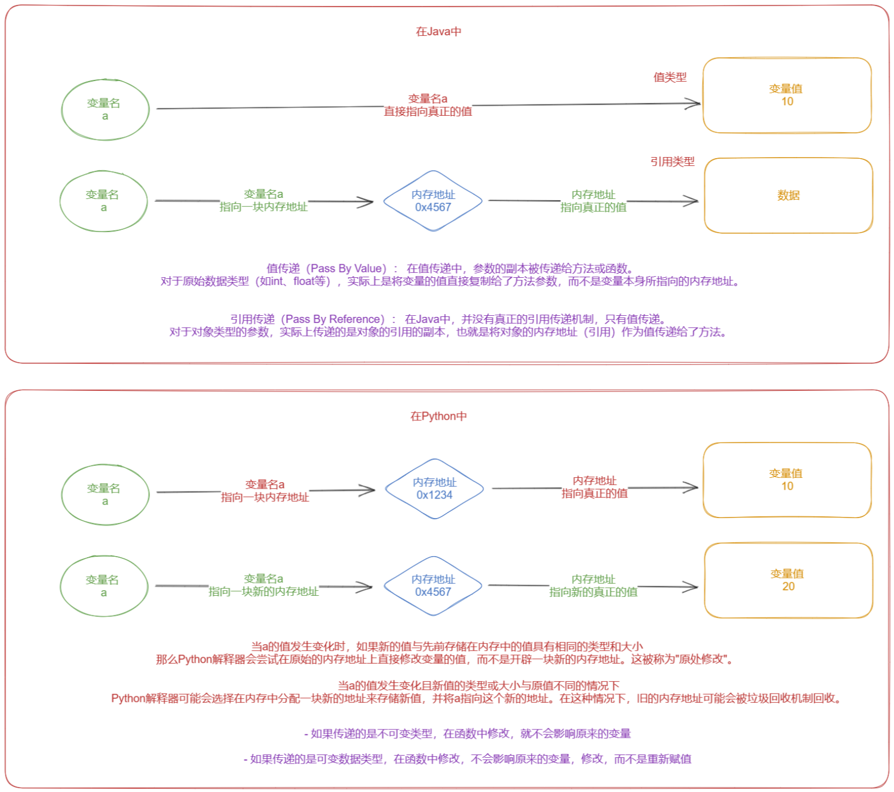
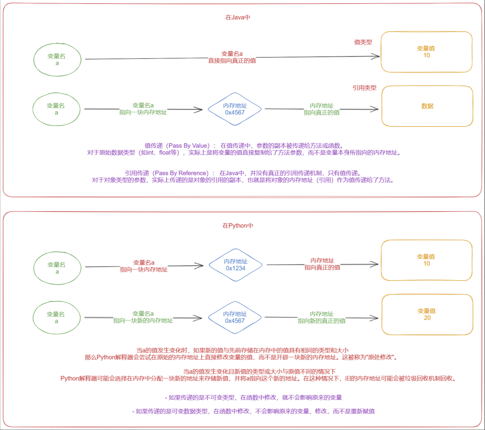

# 1 可变类型和不可变数据类型

## 1.1  数据类型概述

```python
# 整数类型 int
# 浮点数类型 float
# 字符串类型 str
# 布尔类型 bool
# 列表类型 list
# 字典类型 dict
# 元组类型 tuple
# 集合类型 set
```

## 1.2 数据类型分类

```python
# 【1】按照存值个数
# 只能存一个 int float str bool
# 能存很多个 list dict tuple set

# 【2】按照访问方式
# 直接访问 int float str bool
# 索引访问 str list tuple
# 按照键 dict

# 【3】按可变类型和不可变类型
# 可变类型 list dict set
# 不可变类型 str int float bool tuple
```

## 1.3 什么是可变和不可变类型

```python
# 【1】堆和栈的概念
# 堆是一种数据结构：队列先进先出
# 栈是一种数据结构：栈先进后出

# 【2】在python中如何实现堆和栈
# 堆(队列)就是先进先出
num_list = []
for i in range(0, 10):
    num_list.append(i)
print(num_list)

# 堆：先进先出
for i in range(0, len(num_list)):
    print(num_list.pop(0))

# 栈：先进后出
for i in range(0, 10):
    num_list.append(i)
print(num_list)

for i in range(0, len(num_list)):
    print(num_list.pop())  # 默认最后一个
```

```python
# 【3】可变类型和不可变数据类型
# 可变类型和不可变数据类型 区别在于
# 当指定值被修改的时候
# 内存空间地址是否变化
# 如果不变就是可变数据类型-->就算我值变了，地址也不变，所以值可变
# 反之就是不可变数据类型-->值变了，地址也变，所以值不可变，变了就不是自己了
# 查看内存地址 id
# (1)整数 不可变
num = 1
print(id(num))
num = 2
print(id(num))

# (2)浮点数 不可变
num = 1.0
print(id(num))
num = 2.0
print(id(num))

# (3)字符串 不可变
name = "aka"
print(name, type(name), id(name))
name = "really"
print(name, type(name), id(name))

# (4)布尔 不可变
name = True
print(name, type(name), id(name))
name = False
print(name, type(name), id(name))

# (5)元组类型 不可变
name = (1, 2, 3)
print(name, type(name), id(name))
name = name.__add__((4, 5, 6))
print(name, type(name), id(name))

# (6)列表类型 可变！
name = [1, 2, 3]
print(name, type(name), id(name))
name.append(8)
print(name, type(name), id(name))

# (7)字典类型 可变！
name = {"name": "sheenagh"}
print(name, type(name), id(name))
name["age"] = 23
print(name, type(name), id(name))

# (8)集合类型 可变！
name = {"name", "dream"}
print(name, type(name), id(name))
name.add("18")
print(name, type(name), id(name))

# 数据变，地址没变，则数据可变
# 数据变，地址变动，则数据不可变

# 小结
# 在Python中可变类型和不可变类型的区分依据就是当前值被修改后的内存空间地址是否改变

# Python是值传递还是引用传递
# @ 值传递 每一次的值都会有一个自己的内存空间地址
# @ 引用传递 是在中间有一块内存地址负责中转对应的值

# 严格意义来说，Python既不是值传递，也不是引用传递，她有自己的传递方式
# 规则是：
# 如果传递的是不可变类型，在函数中修改，就不会影响原来的变量
# 如果传递的是可变数据类型，在函数中修改，不会影响原来的变量，修改，而不是重新赋值

# 可变数据类型就是修改原来的值但是内存空间地址不变
# 不可变数据类型就是修改原来的值但是内存空间地址会改变
```






# 2 垃圾回收机制

- 垃圾是什么？
- 我们在写代码的时候你会经常对某些变量不管
- 垃圾不管 内存占用就会越来越多

## 2.1 引入

```python
# ● 解释器在执行到定义变量的语法时，会申请内存空间来存放变量的值，而内存的容量是有限的，这就涉及到变量值所占用内存空间的回收问题
# ● 当一个变量值没有用了（简称垃圾）就应该将其占用的内存给回收掉，那什么样的变量值是没有用的呢？
# ● 单从逻辑层面分析，我们定义变量将变量值存起来的目的是为了以后取出来使用，而取得变量值需要通过其绑定的直接引用（如x=10，10被x直接引用）或间接引用（如l=[x,]，x=10，10被x直接引用，而被容器类型l间接引用）
# ● 所以当一个变量值不再绑定任何引用时，我们就无法再访问到该变量值了，该变量值自然就是没有用的，就应该被当成一个垃圾回收。
# ● 毫无疑问，内存空间的申请与回收都是非常耗费精力的事情，而且存在很大的危险性，稍有不慎就有可能引发内存溢出问题
# ● 好在Cpython解释器提供了自动的垃圾回收机制来帮我们解决了这件事。
```

## 2.2 什么是垃圾回收机制

```python
# ● 垃圾回收机制（简称GC）是Python解释器自带的一种机制
# ● 专门用来回收不可用的变量值所占用的内存空间（在内存中，没有变量名指向的数据都是垃圾数据）
```

## 2.3 为什么要有垃圾回收机制

```python
# ● 程序运行过程中会申请大量的内存空间，而对于一些无用的内存空间如果不及时清理的话会导致内存使用殆尽（内存溢出），导致程序崩溃
# ● 因此管理内存是一件重要且繁杂的事情，而python解释器自带的垃圾回收机制把程序员从繁杂的内存管理中解放出来。
```

## 2.4 GC原理

```python
# 先进先出 后进先出
# 先进后出
# 【1】堆区和栈区
# ● 在定义变量时，变量名与变量值都是需要存储的
# ● 分别对应内存中的两块区域：
# （1）栈区
# ● 变量名与值内存地址的关联关系通常被存放于程序的栈区
# # 1. 栈区的特性与作用
#    栈（Stack）是计算机内存中的一种数据结构，其主要特点是后进先出（LIFO）。在编程语言执行过程中，栈区用于存储局部变量、函数参数以及函数调用时的返回地址等临时性信息。
#    栈区的操作快速且高效，因为它遵循简单的压栈（push）和弹栈（pop）规则，适合处理那些生命周期短、使用频繁且需要保持特定顺序的数据。
#
# # 2. 变量生命周期管理
#    变量名与值内存地址的关联关系本质上是一种符号表信息，它记录了源代码中定义的变量名与其所对应的内存地址之间的映射。
#    这种信息具有明显的生命周期特征：当进入一个作用域（如函数或代码块）时，新声明的变量及其关联关系应被创建；
#    当离开该作用域时，这些变量及关联关系应被自动清理以释放资源。
#    栈区恰好符合这种对变量生命周期进行严格管理的需求。
#    每当函数调用发生时，会在栈顶为该函数分配一块空间，用于存放其内部声明的变量及其关联关系；
#    函数调用结束时，这部分栈空间会被自动回收。
#
# # 3. 性能优化
#    栈区访问速度极快，因为它的内存地址通常连续且靠近CPU寄存器。
#    将变量名与值内存地址的关联关系放在栈上，可以确保编译器和运行时系统能以较低的时间成本查找并操作这些信息。
#    特别是在递归调用、循环等频繁涉及变量访问的场景下，栈区的高效访问对于提升程序整体性能至关重要。
#
# # 4. 内存安全性
#    栈区的内存由编译器自动分配和释放，不易出现内存泄漏问题。
#    将变量名与值内存地址的关联关系存储在栈上，有助于防止因程序员手动管理内存不当而导致的错误。
#    此外，栈区的大小通常有限制，这有助于防止因局部变量过度使用内存而导致的堆栈溢出问题，从而提高程序稳定性。
#
# # 5. 线程安全性
#    每个线程都有自己的栈空间，这意味着不同线程中的同名局部变量各自拥有 ** 的内存地址和关联关系，互不影响。这一特性保证了并发环境下的数据安全，避免了线程间的数据混淆。
#
# # 综上所述
#     将变量名与值内存地址的关联关系存放于栈区，既利用了栈区的特性实现了高效的内存管理、快速访问和严格的生命周期控制，又确保了内存安全性与线程安全性，有利于编写稳定、高效且易于维护的程序代码。
#   当然，需要注意的是，上述讨论主要针对局部变量。
#   对于静态变量、全局变量或动态分配的对象，它们的内存地址关联关系可能存在于数据段（Data Segment）或堆区（Heap），而非栈区。

# （2）堆区
# ● 变量值存放于堆区，内存管理回收的则是堆区的内容
# # 在Python中，变量和它们所引用的对象（如数值、字符串、列表、字典等）的存储位置与内存管理机制密切相关。
# # 这里提到的“变量值存放于堆区”主要涉及两个概念：变量本身和它所引用的对象。
#
# # 1. 变量
#    变量是程序中用于标识数据的一个符号或名字，它并不直接存储数据，而是指向（或引用）实际存储数据的内存地址。
#    在Python解释器内部，变量名通常保存在栈（Stack）中。栈是一种后进先出（LIFO）的数据结构，用于高效地管理函数调用时的局部变量、返回地址等信息。
#    当创建一个变量时，Python会在当前作用域（如全局作用域或函数局部作用域）的栈空间内为该变量分配一个名称，并将其关联到相应的对象。
#
# # 2. 对象及值
#    Python中的对象（即变量所引用的实际数据）通常存储在堆（Heap）中。
#    堆是一种动态分配内存的区域，相比于栈，其大小更为灵活且无固定上限。
#    堆用于存储需要大量、不固定大小内存空间的数据结构，如大数组、复杂的数据类型（如类实例）、以及那些生命周期可能跨越多个函数调用或作用域的对象。
#
# # 将对象值存放在堆区有以下几个原因：
#
# # - 灵活性
#      堆内存的大小可以动态调整，能够适应不同大小和复杂度的对象。
#     这使得Python可以在运行时根据需要创建任意大小的对象，无需预先确定其具体尺寸，非常适合处理变长数据结构（如列表、字典）。
#
# # - 共享性
#      多个变量可以同时引用同一块堆内存中的对象，实现对象的共享。
#     这种机制允许通过赋值、参数传递、返回值等方式高效地复制“引用”，而不是复制整个对象内容，节省了内存资源并提高了效率。
#
# # - 垃圾回收
#      由于堆内存中的对象可能存在多个引用，Python使用垃圾回收（Garbage Collection, GC）机制自动追踪和管理对象的生命周期。
#     当一个对象不再有任何引用时，GC会识别并释放其占用的堆内存，防止内存泄漏。
#     堆区便于实施这样的垃圾回收策略，确保程序长期运行时内存的有效利用。
#
# # 综上所述
#      Python将变量值（即对象）存放于堆区，主要是为了提供灵活的内存分配、支持对象共享以及实现自动化的垃圾回收，这些特性对于编写高效、健壮的Python程序至关重要。
#     而变量本身作为对象的引用，则通常存储在栈区，便于快速访问和管理其生命周期。
```

## 2.5 垃圾回收机制原理

- 引用计数为主，分代回收、标记清除为辅。
- Python的GC模块主要运用了“引用计数”（reference counting）来跟踪和回收垃圾。
- 在引用计数的基础上，还可以通过“标记-清除”（mark and sweep）解决容器对象可能产生的循环引用的问题，并且通过“分代回收”（generation collection）以空间换取时间的方式来进一步提高垃圾回收的效率。

```python
# 【1】引用计数
num = 1  # 变量1的引用次数就是1
age = num = 1  # 变量1的引用次数就是2
age = num = 2  # 变量1的引用次数就是0
num = 1  # 变量1的引用次数就是1

# 【2】标记清除
# 内存在每一次运行的时候都会扫描一遍内存
# 第一次扫描 发现 1 挂了 变成垃圾 ---> 立马清除
# 不会立即清除 可能在某块代码 又对1 进行了引用
# 而是在发现是垃圾后给垃圾打上一个标签 这个垃圾已经出现一次了
# 第二次扫描 发现 1 挂了 变成了垃圾 ---> 立马清除
# 而是在发现是垃圾后给这个垃圾打上一个标签 这个垃圾已经出现二次了
# 这个垃圾出现 10 次 提一下权重

# 【3】分代回收
# 每一次扫描都会发现垃圾 垃圾未必是当前必须清除掉的垃圾 打上标签
# 新生代：隔10min扫描一次 一直发现有一个垃圾存在 当他的标记次数达到100次给他提权
# 青春代：隔20min扫描一次 一直发现有一个垃圾存在 当他的标记次数达到200次给他提权
# 老年代：隔30min扫描一次 一直发现有一个垃圾存在 当他的标记次数达到300次给他清除

# 垃圾可能被捡起来重新使用
# 为了避免重复开销内存
# 就有了上面的机制
```

## 2.6 小整数池

```python
# ● python中经常使用的一些数值定义为小整数池，小整数池的范围是[-5,256]，python对这些数值已经提前创建好了内存空间
#   即使多次重新定义也不会在重新开辟新的空间，但是小整数池外的数值在重新定义时都会再次开辟新的空间。
# ● 所以对于小整数池中的数，内存地址一定是相同的，小整数池中外的数，内存地址是不同的。

# 补充：对is和内存空间地址又多了一些理解，如：

a = 10
b = 10
print(a, id(a))
print(b, id(b))
print(a is b)  # True
```

# 3 深浅拷贝

- 深浅拷贝是用来复制对象的
- 浅拷贝 只会复制一层
- 深拷贝 复制全部

## 3.1 浅拷贝

```python
# 借助 内置模块 copy
import copy

original_list = [1, 2, 3, 4, 5, 6]
shallow_copy_list = copy.copy(original_list)

original_list.append(999)
shallow_copy_list.append(888)

print(f"原来的列表:>>> {original_list}")
print(f"浅拷贝的列表:>>> {shallow_copy_list}")

# 原来的列表:>>> [1, 2, 3, 4, 5, 6, 999]
# 浅拷贝的列表:>>> [1, 2, 3, 4, 5, 6, 888]

original_list = [1, 2, 3, [7, 8, 9]]
shallow_copy_list = copy.copy(original_list)

original_list[3][-1] = 999
print(f"原来的列表:>>> {original_list}")
print(f"浅拷贝的列表:>>> {shallow_copy_list}")
# 原来的列表:>>> [1, 2, 3, [7, 8, 999]]
# 浅拷贝的列表:>>> [1, 2, 3, [7, 8, 999]]

# 浅拷贝 创建一个新对象，并将原始对象的元素复制到新对象中。
# 并且新对象和源对象中对可变数据类型的引用一致
```

## 3.2 深拷贝

```python
original_list = [1, 2, 3, 4, 5, 6]
shallow_copy_list = copy.deepcopy(original_list)

original_list.append(999)

print(f"原来的列表:>>> {original_list}")
print(f"深拷贝的列表:>>> {shallow_copy_list}")
# 原来的列表:>>> [1, 2, 3, 4, 5, 6, 999]
# 深拷贝的列表:>>> [1, 2, 3, 4, 5, 6]

original_list = [1, 2, 3, [7, 8, 9]]
shallow_copy_list = copy.deepcopy(original_list)

original_list[3][-1] = 999
print(f"原来的列表:>>> {original_list}")
print(f"深拷贝的列表:>>> {shallow_copy_list}")
# 原来的列表:>>> [1, 2, 3, [7, 8, 999]]
# 深拷贝的列表:>>> [1, 2, 3, [7, 8, 9]

# 深拷贝：深拷贝是指创建一个新对象，并将原始对象的元素复制到新对象中。
# 并且新对象和源对象中对可数据类型的引用不一致
```

- 【总结】
- 深拷贝是创建一个完全独立的对象，并且递归地复制对象中所有关系
- 浅拷贝就是创建一个新对象，但是新对象共享原对象中的关联关系


# 4 字符编码

## 4.1 字符编码引入

- 字符串类型由字符组成，但凡涉及到字符的问题都会有字符编码的问题

- 和外国人交流 用英文 但我会用 中文 需要统一一个语言进行交流
- 在写程序的时候 有中文 英文 日文 韩文等

## 4.2 什么是字符编码

- 人类与计算机进行交互的时候我们只认识中文 英文 西班牙语等
- 计算机只认识 二进制数据
- 想要从人类的角度去控制计算机 就要让计算机去识别我们的中文
- 这之间 就有了一个翻译过程 ---> 应该要有一个可以参考的模板
- 翻译的过程 就是将字符和模板中的对应关系一一找到的过程
- 编码就是指向我们的中文转换成计算机可以识别的二进制数据 或者将计算机可以识别

## 4.3 字符编码的发展历史

【1】阶段一：一家独大

- 计算机起源于美国，先考虑到的就是让计算机可以识别英文字符
- 只有英文字符与数字的一一对应关系
- 一个英文字符对应1Bytes，1Bytes=8bit，8bit最多包含256个数字，可以对应256个字符，足够表示所有英文字符
- ASCII码表
- 0 -9 48 - 57
- A - Z 65 - 90
- a - z 97 - 122

【2】阶段二：诸侯割据

- 计算机的科普和发展，每一个国家都出现了计算机，大家就想用自己本国的字符来代表二进制数之间的映射关系
- 英文和二进制的映射表 ASCII
- 日文和二进制的映射表 Shift_JIS
- 中文和二进制的映射表 gbk

- 美国人用计算机 ---> 下载自己的 ASCII 码表进行编码 ---> 计算机只能识别 ASCII 码表中的字符
- 中国人拿到美国人开发的程序 ---> 下载美国的 ASCII 码表 ---> 转码 ---> 编码
- 国际社交特别频繁的程序员 ---> 需要很多不同的码表
- 为了解决每一个国家都有自己的编码表而无法统一的情况
  于是就想开发出一种统一的编码表

【3】阶段三：一统天下 --- unicode

- 从 1990 年开始制定 unicode 编码表 1994年 正式发布
- 存在所有语言中的所有字符与数字的一一对应关系，即兼容万国字符
- 与传统的字符编码的二进制数都有对应关系，详解如下
  - 很多地方或老的系统、应用软件仍会采用各种各样传统的编码，这是历史遗留问题。
  - 此处需要强调：软件是存放于硬盘的，而运行软件是要将软件加载到内存的，面对硬盘中存放的各种传统编码的软件，
  - 想让我们的计算机能够将它们全都正常运行而不出现乱码，内存中必须有一种兼容万国的编码，
  - 并且该编码需要与其他编码有相对应的映射/转换关系，这就是unicode的第二大特点产生的缘由
- 英文 ---> unicode 编码 找到一个字符代表 这个 英文字符 ---> 存到计算机中 ASCII 表编码存
- 中文 ---> unicode 编码 找到一个字符代表 这个 中文字符 ---> 存到计算机中 gbk 表编码存

【4】诞生了一种编码格式

- utf-8
- 英文 ---> unicode 编码 找到一个字符代表 这个 英文字符 ---> 存到计算机中 utf-8 编码
- 中文 ---> unicode 编码 找到一个字符代表 这个 中文字符 ---> 存到计算机中 utf-8 编码

【5】编码和解码

- 统一的编码格式进行编码 存储到内存中 再用指定的格式进行解码

```python
# (1)编码
# 将字符串数据转换为二进制数据
# 字符串 ---> utf-8 二进制数据
name = "中国"
age = "d梦"
print(name.encode())  # b'\xe4\xb8\xad\xe5\x9b\xbd'
print(age.encode())  # b'd\xe6\xa2\xa6'
print(age.encode(encoding="gbk"))  # b'd\xc3\xce'
print(age.encode(encoding="shift-jis"))  # b'd\x9a\xeb'

# 在进行编码的时候 一个英文占 1 个字节 而一个中文占 3 个字节

# (2)解码
# 将二进制数据转换为字符串数据
name_b = b'\xe4\xb8\xad\xe5\x9b\xbd'
age_b = b'd\xe6\xa2\xa6'
age_c = b'd\xc3\xce'
age_d = b'd\x9a\xeb'

print(name_b.decode())
print(age_b.decode())
print(age_c.decode(encoding="gbk"))
print(age_d.decode(encoding="shift-jis"))
```


# 5 文件操作

- 将数据存储到内存中 列表或者字典中 每一次启动的时候 原来的数据都会消失
- 将数据持久化保存到本地的文件中

## 5.1 文件操作的两种语法

```python
# 【1】打开后赋给句柄 句柄操作文件
# 句柄 = open(文件路径, 操作模式, 编码格式)
# 操作模式 三种
# r 模式 read 读取
# w 模式 write 写入
# a 模式 append 追加

'''
# 打开文件
fp = open("1.txt", "w", encoding="utf-8")
# 操作句柄操作文件
fp.write("hello world")
# 关闭文件
fp.close()
'''
```

```python
# 【2】Python提供了一种文件操作语法
# 使用 with 关键字 自动打开和自动关闭文件
#
# with open("1.txt", "r", encoding="utf-8") as fp:
#     fp.write("Hello World")

# r 模式 read : 读取文件数据模式
# w 模式 write : 写入文件数据模式
# a 模式 append : 追加文件数据模式
```

## 5.2 文件的五种模式

```python
# 【一】r模式: read
# 只读不写
# 不存在会报错
# with open("1.txt", "w", encoding="utf-8") as fp:
#     data = fp.read()
#     print(data)
```

```python
# 【二】w模式: write
# 只写不读
# 不存在的时候自动创建一个当前文件
# 覆盖写，每一次写入数据的时候都会将原本的内容清空掉 然后写入新的数据
# with open("1.txt", "w", encoding="utf-8") as fp:
#     data = fp.write("hello!")
#     print(data)
```

```python
# 【三】a模式: append 追加
# 不存在则新建
# 追加新的数据
# with open("2.txt", "a", encoding="utf-8") as fp:
#     data = fp.write("nonono!")
#     print(data)
```

```python
# 【四】+模式 让原本的模式拓展出新的模式
# a+
# r+ 既能读又能写
# w+ 既能写又能读
# 写是覆盖写
# with open("2.txt", "r+", encoding="utf-8") as fp:
#     data = fp.write("helloa!")
#     print(data)

# 不建议使用+模式
# 对一个文件来说要么存储
# 要么读取
```

```python
# 【五】b模式: 操作二进制数据格式
# 二进制数据: 图片 音频 视频 压缩包

# 读取二进制数据
# with open("img.png", "rb") as fp:
#     data = fp.read()
#     print(data)

# 写入二进制数据 根据网页的图片链接获取到图片的二进制数据 ---> 保存到本地
# with open("a.png", "wb") as fp:
#     fp.write(data)
```

```python
# 【零】一些写法
# 先写入一个列表
# 只能写str
num_list = "sda|829"
with open("1.txt", "w", encoding="utf-8") as fp:
    fp.write(str(num_list))

# 再读取出来
with open("1.txt", "r", encoding="utf-8") as fp:
    data = fp.read()
print(data, type(data))  # [1, 2, 3] <class 'str'>

with open("1.txt", "a", encoding="utf-8") as fp:
    fp.write(f"\ndream|5123\n")

user_data = {}
with open("1.txt", "r", encoding="utf-8") as fp:
    data = fp.read()
print(data, type(data))
for i in data.split():
    username, password = i.split("|")
    user_data[username] = {
        "username": username,
        "password": password
    }
print(user_data)
```

## 5.3 文件的操作方法

```python
【一】r模式
fp.read() : 一次性全部将内容读取出来
data = fp.readline() : 只读取一行的数据
fp.readlines():读取所有数据但是每一行数据是列表中的每一个元素
for i in fp : 句柄对象可以被遍历 遍历得到的每一个元素是当前行
fp.readable() : 判断当前句柄对象是否可读
fp.read() 一次性全部将内容读取出来
with open("1.txt", "r") as fp:
    data = fp.read()
    print(data)
    data = fp.readline()
    print(data)
    data = fp.readlines()
    print(data)
    for i in fp:
        print(i)
    print(fp.readable())
```

```python
【二】w模式
fp.write("hello world") ： 一次性将所有内容全部写入
fp.writelines(列表) : 将列表中的每一个元素首尾拼接后再一次性写入
fp.writable() : 判断当前句柄对象是否可写
在没有退出 with 语句之前 连续 write 是可以持续写入数据的
with open("2.txt", "w") as f:
    # f.write("hello world")
    # f.writelines(["hello", "python", "java"])
    f.write("hello world")
    f.write("hello world")
    f.write("hello world")
```


TASK：

1. 整理一遍代码 √&笔记 √
2. 进一步扩充知识，搜集资料去理解可变不可变 √+垃圾回收机制 √+深浅拷贝 √+字符编码 √
3. 研究文件操作方法，写一下如何用新打开文件的方式去实现用户账号登陆注册