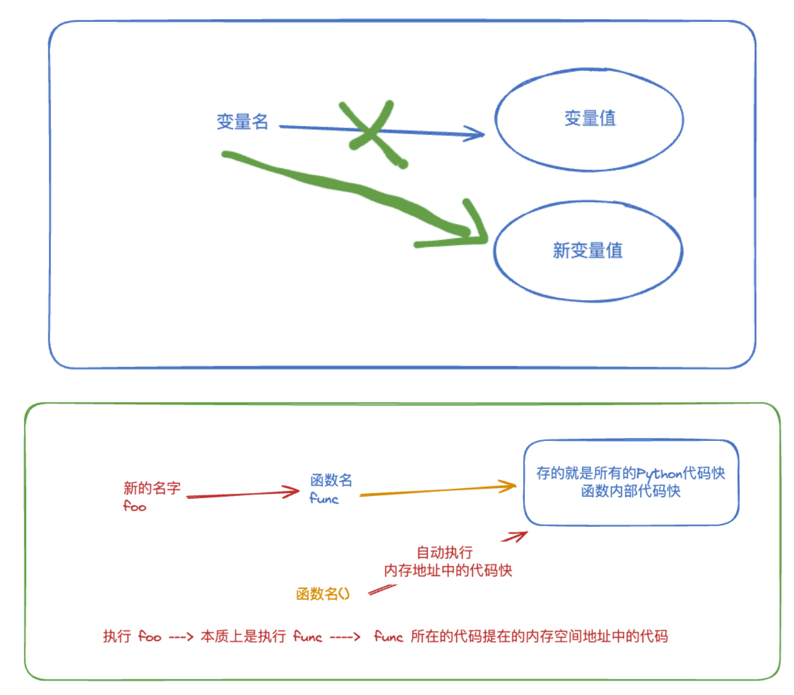
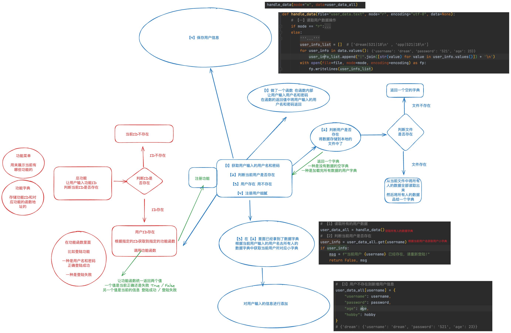

# 0 知识回顾

```python
# 【一】seek方法
# 用来控制文件指针移动的
# 并且是由句柄进行操作的

# 打开文件--> 获取对象 --> 句柄对象.seek(字节数,模式) ---> 操作

# 句柄对象.seek(字节数,模式)
# 字节数：一个中文占三个字节 一个英文占一个字节 特殊符号也占一个字节
# 生僻字可能会占4个
with open("1.txt", "w", encoding="utf-8") as f:
    f.write("我爱我家")
    print(f.tell())

# 模式：
# 字节数 ： 正数是从前向后 负数是从后向前
# 0 ： 相对于文件开头进行向后移动
# 1 ： 相对于当前位置进行向后移动（必须是二进制数据）
# 2 ： 相对于文件结尾进行向后移动 fp(0, 2)

# 句柄.tell() 查看当前句柄所在的字节位置，默认-1，末尾
# 在移动光标的时候 避免移动奇数字节数 中文

# 【二】异常捕获
# 异常就是程序在运行过程中产生的错误，这种错误会导致正常的程序崩溃报错

# 异常捕获语法

"""
try:
    正常执行但是可能会发生错误的代码
except:
    如果try中的代码发生异常，执行except中的代码
"""

"""
data = {}
try:
    with open("user_data.text", "r", encoding="utf-8") as fp:
        for line in fp:
            username, password = line.strip().split("|")
            data[username] = {
                "username": username,
                "password": password
            }
except:
    # 对上述的错误进行修正
    # data = {}

    print(f"报错了")
"""

# try 捕获指定异常类型
# 【1】不捕获异常信息
"""
try: 
    ...
except:
    ...
"""

# 【2】捕获指定的异常信息
# 只能捕获特定的异常信息 其他类型的异常信息不会捕获 还是会报错
"""
try:
    ...
except 异常类型 as e:
    print(e)
"""

"""
try:
    int("a")
except ZeroDivisionError as e:
    print(f"{e}")
"""

# 【3】捕获多个异常信息

"""
try:
    ...
except (异常类型1, 异常类型2) as e:
    print(e)
"""
"""
try:
    # int("a")
    print(1/0)
except (ZeroDivisionError,ValueError) as e:
    print(f"{e}")
"""

# 【4】捕获所有异常类型
"""
try:
    ...
except Exception as e:
    print(e)
"""

# 额外的关键字
"""
try:
    ...
except Exception as e:
    print(e)
else:
    # 正常执行try代码以后执行的代码
    ...
finally:
    # 无论是否报错 都会走入finally
    ...
"""

# 【主动抛出异常】
# 在程序运行过程中某个代码对于正常的程序来说是错误的，但是识别不出来
# 于是我们就想到了让程序对这个错误主动抛出异常
# raise 异常类型(异常信息)
# 异常类型是Python解释器自带的

# 【断言关键字】
# 用于判断运行过程中当条件为真的情况的时候自动抛出的异常
# assert 表达式, 异常信息
# 当前面表达式为真的的时候，就会主动抛出后面的异常信息
# 并且异常类型是 AssertError

# 【四】推导式
# 1.列表推导式
# [变量 for 变量 in 可迭代类型 if 表达式]
# [变量 for 变量 in [变量 for 变量 in 可迭代类型] if 表达式]

# 2.字典生成式
# {key:value for 变量 in 可迭代类型 if 表达式}

"""
print({
    i: j for i in range(5) for j in range(5, 10)
})

data = {}
for i in range(5):
    for j in range(5, 10):
        data[i] = j
        print(data)
"""

# 代码需要常写 进行优化
```


# 1 函数介绍

## 1.1 引入

- 在前面已经学会了 Python 最基础的部分
- 基本数据类型 + 流程控制语句
- 随着开发的功能越来越多的时候
- 会发现代码越来越冗余
- 输入用户名的时候 登录 / 注册；输入后，要对用户进行校验

- 所以在开发过程中应该尽量减少冗余的代码 而是实现代码的重用性

## 1.2 例子

- 你在盖房子的时候 需要锯子斧头锤子

  在我们前面的学习过程中就是用斧子的时候就现场造一把

  我们在日常生活中别人生产好的斧头我们拿过来就直接用

- 在我们开发过程中我们应该也有上面的这种思想

  先把工具造好，造好了以后，哪里用就直接拿到哪里去使用

- 在Python中我们称这种工具就是函数

- 函数能够帮助我们实现重复代码的输出

## 1.3 例子-重复打印

```python
# 打印100遍 Hello
# 【1】for循环 100 遍
"""
for i in range(100):
    print("Hello")  # 在这例对 Hello 不断地进行处理 加额外的逻辑和代码
"""

# 【2】用函数来封装指定的功能代码
'''
def print_hello_one():
    print(...)
def print_hello():
    print_hello_one()
    print("Hello")

for i in range(100):
    print_hello()
'''
```


# 2 函数定义和调用

- 函数必须先定义才能被调用
- 变量名要先声明才能使用变量

## 2.1 函数的定义

```python
# 借助关键字 def
"""
def 函数名(参数):
    函数体代码

def:关键字必须
函数名:自定义 字母+下划线组合
参数:需要向函数传入的使用的参数
函数体代码:正常书写的代码逻辑
"""

# 【1】基本函数定义
"""
def login():
    print(f"欢迎来到登陆功能！")
# 调用函数
# 函数名
login()
"""

# 【2】有一个参数但是没有返回值的函数
"""
def login(username):
    print(f"欢迎 {username} 来到登陆功能！")
# 调用函数
# 函数名(传入值)
# login()
# TypeError: login() missing 1 required positional argument: 'username'
login("sheenagh")
"""

# 【3】有多个参数但是没有返回值
"""
def add(x, y):
    result = x + y
    print(f"结果为 {result}")
# 有几个参数就必须传几个参数
add(1, 2)
# add(1) # add() missing 1 required positional argument: 'y'
# add(1, 2, 3)  # add() takes 2 positional arguments but 3 were given
"""

# 【4】有参数有返回值
"""
def add(x, y):
    result = x + y
    return result

result = add(1, 2)
print(result) # name 'result' is not defined
"""
```

## 1.2 函数的调用

```python
# 【1】直接调用
# 直接根据函数名调用函数

# 【2】间接调用
"""
def add(x, y):
    return x * y
print(add) # <function add at 0x00000234A4ED6830>
# 用新的变量名来存储原本函数的内存空间地址然后再调用原本的函数
res = add
print(res) # <function add at 0x000001C00A296830>
print(res(2, 3))
"""

# 【3】表达式调用
# 在函数的返回值中如果一个返回值就是一个返回值
# 如果多个返回值 那返回的结果是一个元祖 ---> 解包赋值
'''
def get_username_password():
    username = input("请输入用户名 :>>>> ").strip()
    password = input("请输入密码 :>>>> ").strip()
    return username, password
'''

# 函数的返回值
# 函数的返回值就是函数体代码执行完毕后最后一行代码的值
# 函数的返回值可以被其他变量接收
# 函数的返回值可以被其他函数接收

"""
def login(username, password):
    if username == "sheenagh" and password == "526":
        print("登陆成功")
    else:
        print("登陆失败")
"""

# get_username_password() --->  ('dream', '666')
# username, password = get_username_password()
# login(username, password)

# 在调用一个函数的同时调用另一个函数获取到返回值并将其作为参数传入
# login(get_username_password()[0], get_username_password()[1])
# 这样写不对

'''
def add(x, y):
    return x * y

def func(a, b):
    return a + b

print(func(add(1, 6),3))
'''


# 【4】函数作为参数
def get_username_password():
    username = input("请输入用户名 :>>>> ").strip()
    password = input("请输入密码 :>>>> ").strip()
    return username, password


def login():
    username, password = get_username_password()
    if username == "dream" and password == "521":
        print(f"登陆成功")
    else:
        print(f"登陆失败")


def register():
    username, password = get_username_password()
    print(f"当前用户 {username} 注册成功!")


menu = '''
$$$$$$$ 功能菜单 $$$$$$$ 
        1.登陆
        2.注册
'''
func_dict = {
    "1": login,
    "2": register
}

while True:
    print(menu)
    func_id = input("请输入功能ID :>>>> ").strip()
    if func_id not in func_dict:
        print(f"当前功能不存在")
        continue
    func = func_dict.get(func_id)
    # func 可以是 login 的地址 也可以是register 的地址
    func()

# 我们以前的写法
'''
while True:
    print(menu)
    func_id = input("请输入功能ID :>>>> ").strip()
    func_id = int(func_id)
    if func_id == 1:
        register()
    elif func_id == 2:
        login()
'''
```




# 3 函数参数之形参和实参

- 在函数定义阶段定义在函数名后面的小括号里面的变量

```python
# 1.形参
# 形参就是在定义函数的时候放在函数名后面的参数
# 可以让函数在内部使用上面定义好的形参

# 2.实参
# 在函数调用的时候实际传入的值就是实参
"""
def add(x, y):
    return x + y
add(1, 2)
"""

# add后面的 x和y就是函数的形参
# 在调用的时候传入的1和2就是函数的实参
```


# 4 关键字参数和位置参数

```python
def login(username, password):
    print(f"当前 username: >>> {username}")
    print(f"当前 password: >>> {password}")

# 1.按照位置传递参数
# 在函数调用的时候 要按照函数定义的参数位置传递指定的参数
# login("521", "sheenagh")
# 这样就错了

# 2.按照关键字传递参数
# 在函数定义的时候时制定了当前函数的参数名是什么
# 按照指定的变量名进行传递
# login(password="526", username="sheenagh")

# 3.在函数传递参数的时候
# 如果传少了会报错 需要指定个数但没有传够
# login("sheenagh")
# login() missing 1 required positional argument: 'password'

# 如果传多了会报错 需要指定个数但传多了
# login("sheenagh", "526", "aka")
# login() takes 2 positional arguments but 3 were given

# 4.关键字和位置参数混合使用
# 当你的关键字参数和位置参数混合使用的时候
# 关键字参数必须放到位置参数后面，否则就会报错
# login("sheenagh", password="526")
# login(password="526", "sheenagh") # SyntaxError: positional argument follows keyword argument
```


# 5 默认参数

```python
# 在函数定义阶段的时候可以给指定的变量赋值一个初始的值
# 如果当前值被传入新的值 则会被新值覆盖
# 如果当前值没有传入新的值则会使用原本就存在的默认值
# 在定义默认参数的时候一定是默认参数放在位置参数后面
# def student(name, age, class_no, gender="female"):
#     print(f"当前学生是: {name} 年龄是 {age} 性别是 {gender} 当前班级是 {class_no}")

# 在一个班级里面一定会是 男生多或者女生多
# 那么对于 女生居多的情况 就可以指定一个默认值 即 gender="female"
# student(name="sheenagh", age=23, gender="female", class_no="0001")
# 如果没传入 是默认值
# 如果传入 就会使用新值覆盖
# student(name="bob", age=20, gender="male", class_no="0002")
# student(name="to", age=22, class_no="0002")

# 默认参数的特殊情况
# def append_list(num, num_list = []):
#     num_list.append(num)
#     return num_list


# 因为列表是可变数据类型所以
# 在每次添加新的元素之后影响到的都是原本的列表
# print(append_list(1))  # [1]
# print(append_list(2))  # [1, 2]
# print(append_list(3))  # [1, 2, 3]

def append_list(num, num_list=None):
    if not num_list:
        num_list = []
    num_list.append(num)
    return num_list

# 因为列表是可变数据类型所以 在每次添加新的元素后影响到的都是原本的列表
# 列表中添加 1 2 3 ---> [1,2,3]
print(append_list(1))  # [1]
print(append_list(2))  # [2]
print(append_list(3))  # [3]
```


# 6 可变长参数

```python
# 当我们在调用函数的时候会向函数内传递参数
# 遇到传递的参数个数大于 需要的 位置参数的个数
def add(x, y, *args):
    print(x, y)
    print(args)

add(1, 2, 3, 4)

# * 是解包的意思
num_list = [1, 2, 3]
print(num_list)
print(*num_list)

def login(username, password):
    print(username)
    print(password)

user_data = ["dream",526]
login(*user_data)

# 可变长关键字参数
def add(x, y, *args, **kwargs):
    print(x, y)
    print(args)
    print(kwargs)
# **kwargs 变字典

add(x=1, y=2, z=3, u=5)
```


# 7 多用户注册登录函数

```python
# 用文件存储用户信息
# 做一个登录和注册
# 以函数来写多用户登录和注册
def get_username_password():
    username = input("请输入用户名 :>>>> ").strip()
    password = input("请输入密码 :>>>> ").strip()
    return username, password


def handle_data(file="user_data.text", mode="r", encoding="utf-8", data=None):
    # 【一】读取用户数据操作
    if mode == "r":
        # 【1】声明一个空字典
        user_data = {}
        # 【2】如果是第一次注册 是没有 user_data.text 这个文件的所以会报一个错 告诉我们没有当前文件
        try:

            with open(file=file, mode=mode, encoding=encoding) as fp:
                for line in fp:
                    username, password, age = line.strip().split("|")
                    user_data[username] = {
                        "username": username,
                        "password": password,
                        "age": age
                    }
        # 【3】没有 user_data.text 文件 不做处理
        except Exception as e:
            print(f"第一次注册,欢迎!")
        # 【4】走完 try 和 except 是表明 上面的代码执行完毕了 但是是顺序结构所以会走到 return
        # 最终将 读取的数据返回出去
        # 第一次来 : data = {}
        # 第二次来 :
        '''
        data = {
            "dream":{
                "username":"dream",
                "password":"521",
                "age":18
                },
            "opp":{
                "username":"opp",
                "password":"521",
                "age":18
                }          
        }
        '''
        return user_data
    else:
        '''
        data = {
            "dream":{
                "username":"dream",
                "password":"521",
                "age":18
                },
            "opp":{
                "username":"opp",
                "password":"521",
                "age":18
                }          
        }
        '''
        user_info_list = []  # ['dream|521|18\n' , 'opp|521|18\n']
        for user_info in data.values():
            user_info_list.append("|".join([str(value) for value in user_info.values()]) + '\n')
        with open(file=file, mode=mode, encoding=encoding) as fp:
            fp.writelines(user_info_list)


def register():
    print(f"欢迎来到注册功能!")
    # 【一】获取用户名和密码
    username, password = get_username_password()
    age = input("请输入年龄 :>>>> ").strip()
    hobby = input("请输入爱好 :>>>> ").strip()
    age = int(age)
    # 【二】校验当前用户是否存在
    # 【1】读取所有的用户数据
    user_data_all = handle_data()
    # 【2】判断当前用户是否存在
    user_info = user_data_all.get(username)
    if user_info:
        msg = f"当前用户 {username} 已经存在，请重新登陆!"
        return False, msg
    # 【3】用户不存在则新增用户信息
    user_data_all[username] = {
        "username": username,
        "password": password,
        "age": age,
        "hobby": hobby
    }
    # {'dream': {'username': 'dream', 'password': '521', 'age': 23}}
    # print(user_data_all)
    handle_data(mode="w", data=user_data_all)


def login():
    print(f"欢迎来到登陆功能!")
    username, password = get_username_password()
    # 【1】读取所有的用户数据
    user_data_all = handle_data()
    # 【2】判断当前用户是否存在
    user_info = user_data_all.get(username)
    if not user_info:
        msg = f"当前用户 {username} 不存在，请重新注册!"
        return False, msg
    if user_info.get("password") != password or user_info.get('username') != username:
        msg = f"当前用户 {username} 用户名和密码校验失败!"
        return False, msg
    else:
        msg = f"当前用户 {username} 登录成功!"
        return True, msg


menu = '''
********** 功能菜单 ********** 
            1.注册
            2.登陆
'''

# 做一个功能字典
func_dict = {
    "1": register,
    "2": login
}

# 启动登陆注册成功
while True:
    print(menu)
    func_id = input("请输入功能ID :>>>> ").strip()
    if func_id not in func_dict.keys():
        print("当前功能ID不存在！")
        continue
    # 根据用户的ID获取到指定的功能函数地址
    func = func_dict.get(func_id)
    flag, msg = func()
    if flag:
        print(msg)
        break
    else:
        print(msg)
        continue
```



TASK

1. 整理代码√ 笔记√

2. √求助了chatgpt

```python
# 在上述功能的基础上写一个文件拷贝功能 ---> 是管理员才能拷贝
# 先输入一个原来的文件地址 ---> 复制到新的位置 可以对新文件重命名
```

重写部分：

```python
# 获取用户名和密码
def get_username_password():
    username = input("请输入用户名 :>>>> ").strip()
    password = input("请输入密码 :>>>> ").strip()
    return username, password

# 对文件操作
def handle_data(file="user_data.text", mode="r", encoding="utf-8", data=None):
    # 【一】读取用户数据操作
    if mode == "r":
        # 【1】声明一个空字典
        user_data = {}
        # 【2】如果是第一次注册 是没有 user_data.text 这个文件的所以会报一个错 告诉我们没有当前文件
        try:
            with open(file=file, mode=mode, encoding=encoding) as fp:
                for line in fp:
                    username, password, age, hobby, role = line.strip().split("|")
                    user_data[username] = {
                        "username": username,
                        "password": password,
                        "age": age,
                        "hobby": hobby,
                        "role": role
                    }
        # 【3】没有 user_data.text 文件 不做处理
        except Exception as e:
            print(f"第一次注册,欢迎!")
        # 【4】走完 try 和 except 是表明 上面的代码执行完毕了 但是是顺序结构所以会走到 return
        # 最终将 读取的数据返回出去
        # 第一次来 : data = {}
        # 第二次来 :
        return user_data
    else:
        user_info_list = []
        for user_info in data.values():
            user_info_list.append("|".join([str(value) for value in user_info.values()]) + '\n')
        with open(file=file, mode=mode, encoding=encoding) as fp:
            fp.writelines(user_info_list)


def register():
    print(f"欢迎来到注册功能!")
    # 【一】获取用户名和密码
    username, password = get_username_password()
    age = input("请输入年龄 :>>>> ").strip()
    hobby = input("请输入爱好 :>>>> ").strip()
    age = int(age)
    if username == "sheenagh" and password == "526":
        role = "admin"
    else:
        role = "user"
    # 【二】校验当前用户是否存在
    # 【1】读取所有的用户数据
    user_data_all = handle_data()
    # 【2】判断当前用户是否存在
    user_info = user_data_all.get(username)
    if user_info:
        msg = f"当前用户 {username} 已经存在，请重新登陆!"
        return False, msg
    # 【3】用户不存在则新增用户信息
    user_data_all[username] = {
        "username": username,
        "password": password,
        "age": age,
        "hobby": hobby,
        "role": role
    }
    # {'dream': {'username': 'dream', 'password': '521', 'age': 23}}
    # print(user_data_all)
    handle_data(mode="w", data=user_data_all)
    msg = f"用户 {username} 注册成功!"
    return True, msg


def login():
    print(f"欢迎来到登陆功能!")
    username, password = get_username_password()
    # 【1】读取所有的用户数据
    user_data_all = handle_data()
    # 【2】判断当前用户是否存在
    user_info = user_data_all.get(username)
    if not user_info:
        msg = f"当前用户 {username} 不存在，请重新注册!"
        return False, msg
    if user_info.get("password") != password or user_info.get('username') != username:
        msg = f"当前用户 {username} 用户名和密码校验失败!"
        return False, msg
    else:
        msg = f"当前用户 {username} 登录成功!"
        return True, msg

def copy_file():
    username, password = get_username_password()
    user_data_all = handle_data()
    user_info = user_data_all.get(username)
    if not user_info or user_info["role"] != "admin":
        return False, f"当前用户 {username} 不是管理员，无法执行拷贝操作!"
    elif user_info.get("password") != password:
        return False, f"当前管理员 {username} 密码校验失败!"
    else:
        print("您已进入拷贝功能中！")
        file_old = input("请输入原文件名 :>>> ").strip()
        user_data_all = handle_data(file=file_old)
        file = input("请输入新文件名 :>>> ").strip()
        handle_data(file=file, mode="w", data=user_data_all)
        return True, f"已将文件内容复制到 {file} 中！"


menu = '''
********** 功能菜单 ********** 
            1.注册
            2.登陆
            3.复制文件
'''

# 做一个功能字典
func_dict = {
    "1": register,
    "2": login,
    "3": copy_file
}

# 启动登陆注册成功
while True:
    print(menu)
    func_id = input("请输入功能ID :>>>> ").strip()
    if func_id not in func_dict.keys():
        print("当前功能ID不存在！")
        continue
    # 根据用户的ID获取到指定的功能函数地址
    func = func_dict.get(func_id)
    flag, msg = func()
    if flag:
        print(msg)
        break
    else:
        print(msg)
        continue
```

