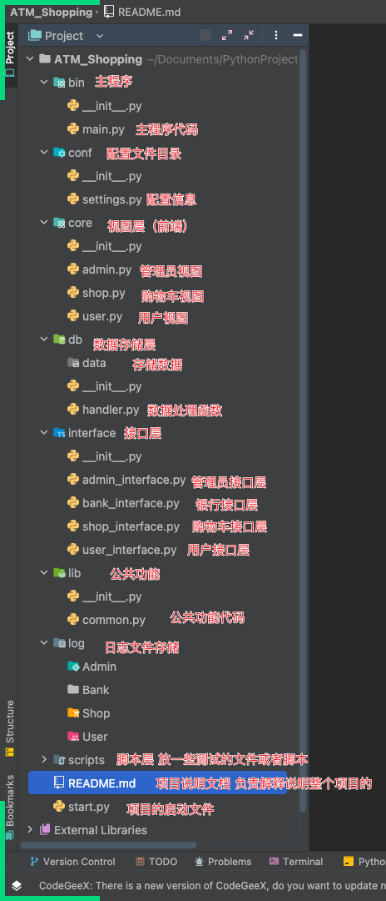

8.12

admin 的 login 同 user

只是要在admin里写一样的东西

admin_interface里也写一样的东西

非公共方法就要重新写

非公共的部分需要重新写

各种logger都写common里去

admin在logger的设置里没有弄 要补

装饰器 迁移到 common里 user要用 admin也要用 加一个参数 判定给user还是admin


初始化商品这一块

想一下如果改了京东页面 不是手机了会不会影响脚本？

讲道理所有页面的ul li元素都是一样的应该就没问题

但是也要类似的格式 名字取3位都能区分开来的商品


有一个生成id的函数 generate_product_id

问题 为何当重复时调用的是create_bank_id的函数 如果出的随机数应该也不是------的确应该是调用自己--已经修正了


admin

del_one_good

拿商品 没有商品报错误让初始化 选id 没有id报错误 有删掉pop 输出商品信息

check_one_good

拿商品 没有商品报错误让初始化 选id 没有id报错误 有展示商品信息

check_all_good

拿商品 没有商品文件报错误让初始化 有就全部格式化展示商品信息


shop 0814

select_product

验证登录 输入编号和数量 传给接口编号数量名字  

检验编号 商品不存在就错

检验数量 不是数字错 负数错 大于库存就错

都对-> 

商品库存-=数量

购物车有这个商品 加数量

购物车没有这个商品 加全部信息

存储数据

返回成功信息与日志


show_shop_car

验证登录

传名字给接口

取用户信息-用户编号-购物车

返回购物车

打印商品编号 信息 in 购物车

返回成功信息与日志


clear_shop_car

验证登录

传名字给接口

用户信息-用户编号-购物车={}

保存数据

返回成功信息与日志


del_product


用户购物车支付

验证登录

传入用户名给pay_product_interface接口

获取购物车

拿商品

没有 退出返回错误信息

有  遍历 输出商品信息 名字数量单价总价 计回错误信息

如果钱够且对 进行扣款 bankbalance -= float 总价

购物车 清空

流水 更新 收据

生成扣款信息 


8.14 自己整理代码思路 把已经写了的部分捋一遍逻辑

然后往后写

首先是目录结构规定：




接下来就顺着写代码的思路写功能

首先是准备工作：

conf-setting里

1求根目录

2求数据存储目录

3求日志总目录

4求日志分目录

日志配置

路径列表


bin-main里

main_dict= {key:(menu,dict)}

main_menu

def fun循环

def main


三个面板 admin shop user 对应的是 四个接口层

user面板：

```python
user_func_dict = {
    "1": register,
    "2": login,
    "3": active_bank_card,
    "4": withdraw,
    "5": transfer,
    "6": recharge,
    "7": check_flow,
    "8": check_log,
    "9": check_bank_info,
    "q": "quit"
}

user_func_menu = """
############### 用户菜单 ###############
                1. 注册
                2. 登录
                3. 激活银行卡
                4. 取款
                5. 转账
                6. 充值余额
                7. 查看流水
                8. 查看日志
                9. 查看银行信息〔自己的用户名 卡号 身份 余额 流水信息...)
                q. 退出
############### 用户菜单 ###############
"""
```


user


active_bank_card
