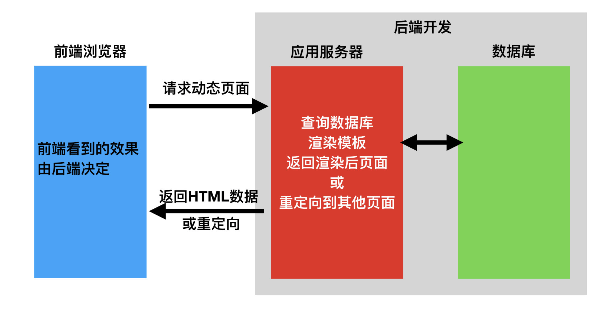

# 1 班会

```python
# 课件资料
	- https://www.cnblogs.com/liuqingzheng/p/17120548.html

# 后续课程
	-1 DRF 
    -2 vue2-vue3
    -3 项目
    	-git
        -redis
        -celery
    -4 微信小程序
    	-drf+微信小程序
        -智慧社区
    -5 flask框架
    	-开源项目
    -6 Redis高级
    -7 mysql主从
    	-django 读写分离
    -8 悲观乐观锁+事务+异步
    	-高性能
    -9 分布式锁，分布式id
    -10 消息队列rabbitmq
    	-rpc
        -微服务项目
    -11 面试题
    -12 如何写简历，如何面试，入职相关

# 规则 3次
# 1 讲课 手机放后面
# 2 讲课 vx退出
# 3 迟到早退 8:30~21:30
# 4 请假
# 5 作业
# 6 教室里 游戏
# 7 教室里 视频

# ------ 红线 ------
# ANYTHING OTHERS
# RELATIONS WITH CLASSMATES
# CONDITION

# TIME
# STANDARD: 8:30~12:30 2:30~5:30 6:30~9:30
# 4 + 3 + 3 = 10 h
# ------------------------------------
# 8:00~12:30 2:30~8:00
# 8:30~12:30 2:30~8:30
# 4.5 + 5.5 / 4 + 6
```


# 2 前后端开发模式

```python
# 在开发Web应用中，有主流的两种开发模式:
# 1.混合开发
	- 后端django / flask / Go语言gin框架 / java-jsp
	- 前端 模版语法(DTL)
    	- html
        - css
        - js
        - dtl: {}  django template language -> 类python语法
		- 后端换成flask 就要用另外一种dtl模版语法
        - 比如go对应类go语法
        - jsp对应类java语法
    - 模板语法用来渲染模板
    	- python: 混合项目 -> xx.html -> 模板
        - java: xx.jsp -> 模板
        - go: xx.tpl -> 模板
        - 模板语法 -> 在后端 -> 拿到模板 -> 运行模板语法 -> 把模板中有模板语法的位置 -> 替换
        - 被模板语法渲染完成的 -> 变成纯粹的html,css,js -> 字符串 -> 发给前端 -> 浏览器能识别
        
        - js 浏览器中执行
        - 模板语法 在后端服务器上执行
    - 前后端混合的执行流程
    	- 1.拿到index.html 模板
        - 2.使用变量 把 模板中的  替换掉 (有各种各样的模板语法)
        - 3.以字符串形式返回给前端
        - 4.浏览器拿到了这堆字符串 html css js
        	- html渲染
            - css样式
            - js执行
    - 最大特点 模板渲染在后端完成
    - 所以我们希望可以分担一下后端的压力

# 2.前后端分离开发
	-前端只写前端：html，css，js
    -后端只写后端：接口
    	-访问一个地址，返回一堆数据
        	-xml
            -json
            
	-前后端分离后
    	-前端只写纯粹的html，css，js
        	-大前端
            	-web前端：vue，react。。。
                -微信小程序
                -app
                -桌面应用
        -后端写接口：返回json格式数据
```




# 3 api接口

```python
# 为了在团队内部形成共识、防止个人习惯差异引起的混乱，我们需要找到一种大家都觉得很好的接口实现规范，而且这种规范能够让后端写的接口，用途一目了然，减少双方之间的合作成本。

# api 接口是什么
	-规定了前后台信息交互规则的url链接，也就是前后台信息交互的媒介
    	127.0.0.1:8080/login/?name=lqz&age=19
        127.0.0.1:8080/books/
        
# api接口有的东西
	-1 url：url链接
    -2 请求方式：get、post、delete、put。。。。
    -3 请求参数：json或xml格式的key-value类型数据  
    	地址栏中:login/?name=lqz&age=19
    	请求体中：不同编码格式：urlencoded，json，form-data。。。。
        	-urlencoded：name=lqz&age=19
            -json:{"name":"lqz","age":19}
            -form-data: 文件混合数据
    -4 响应结果：json或xml格式的数据
    
    
    
# http：请求协议
    -请求首行：协议，协议版本，请求地址，请求方式
    -请求头：key-value
    -请求体：不同编码格式
    
    
# 举例
https://api.map.baidu.com/place/v2/search?ak=6E823f587c95f0148c19993539b99295&region=%E4%B8%8A%E6%B5%B7&query=%E8%82%AF%E5%BE%B7%E5%9F%BA&output=json  -> get请求
```


# 4 接口测试工具

```python
# 1 软件--》主要用来测试接口的
	-为什么不用浏览器？
    	-因为浏览器只能发送get请求
# 2 这种软件有很多
	-主流的：postman--收费了
    	-跨平台：win，mac，linxu
     -APIfox：跟postman一样
    	-Apifox = Postman + Swagger + Mock + JMeter
        		  接口测试   接口文档   模拟假数据  压力测试工具
            
     -postwoman
    
    -使用requests模块+代码写程序
    
    
# 3 双击下载好的软件，就会安装完成并且打开
	-注册个账号
    -登录上去使用
    
    
# 4 使用
	1 发送请求
    	-请求地址
        -请求方式
        -请求参数
        -请求头
        -请求体
        ------
        -响应体
        -响应头
        -响应cookie
        
   2 请求体中不同编码格式
	
   3 请求参数：地址栏中参数


# 5 拓展
	-collection使用：把一堆接口放在一个文件夹下保存起来，后期可以直接用
    -可以导入导出 点击搞定
```


# 5 restful API规范

``` python
# 写前后端分离项目接口的一个 约定俗成的规范
# 10条规则，但是我们不一定每条都遵循，并且公司可能还有自己的规范

# 什么是restful规范
RESTful是一种定义Web API接口的设计风格，尤其适用于前后端分离的应用模式中。

# 规范要求：
   -1 数据的安全保障--url链接使用https
    	-http
        -https：更安全
    -2 接口中带api标识
    	 https://api.baidu.com
		https://www.baidu.com/api
    -3 接口中带版本标识
    	https://api.baidu.com/v1
        https://api.baidu.com/v2
        
    -4 数据即是资源，均使用名词（可用复数）
        https://api.baidu.com/v1/users
        https://api.baidu.com/v1/books
        https://api.baidu.com/v1/book
        
    -5 通过请求方式，决定资源操作方式（增删查改--》curd:create,update,retrieve,delete）
        https://api.baidu.com/books - get请求：获取所有书
        https://api.baidu.com/books - post请求：新增一本书书
        https://api.baidu.com/books/1 - get请求：获取主键为1的书
        https://api.baidu.com/books/1 - put请求：整体修改主键为1的书
        https://api.baidu.com/books/1 - delete请求：删除主键为1的书
        
   -6 请求地址中带过滤条件
		https://api.example.com/v1/zoos?name=大象
    
   -7 响应中带状态码
		- http响应状态码：1xx，2xx，3xx，4xx，5xx
    		-404和403区别
        	-301和302区别：会被问到
    	- 公司自定义的状态码
        	-100 成功
            -101 xx错误
            -102  xx错误
        - mysql：以后遇到错误，不要搜文字，搜错误码
        -{code:100}
        
   -8 响应中带错误信息
		-{status:101,message:"用户名密码错误"}
    	-{code:100,msg:"成功"}
   -9  返回结果，针对不同操作，服务器向用户返回的结果应该符合以下规范  
		GET /collection：返回资源对象的列表（数组）  
    		[{name:红楼梦,price:100},{name:红楼梦1price:90}]
        GET /collection/resource：返回单个资源对象
        	-{name:红楼梦,price:100}
        POST /collection：返回新生成的资源对象
        	-{name:红楼梦,price:100}
        PUT /collection/resource：返回完整的资源对象
        	-{name:红楼梦,price:100}
        DELETE /collection/resource：返回一个空文档
   -10  返回数据中带url链接
```


# 6 序列化和反序列化

```python
# 1 序列化指的是：数据转换格式

# 2 api接口开发，最核心最常见的一个过程就是序列化，所谓序列化就是把数据转换格式，序列化可以分两个阶段：

# 序列化： 把我们识别的数据[字典，列表，对象]转换成指定的格式[json格式字符串，pickle二进制]提供给别人。

例如：我们在django中获取到的数据默认是模型对象(queryset对象)，但是模型对象数据无法直接提供给前端或别的平台使用，所以我们需要把数据进行序列化，变成json格式字符串，提供给别人。

# 反序列化：把别人提供的数据转换/还原成我们需要的格式。

例如：前端js提供过来的json数据，对于python而言就是字符串，我们需要进行反序列化换成模型类对象，这样我们才能把数据保存到数据库中

# 所以注意这个阶段，序列化不再是python认识的格式转成json数据，序列化是从自身出发转成别人认识的数据，反序列化是把别人的数据转成我自己认识的数据。
```


# 7 drf安装和快速使用

```python
# 核心思想: 缩减编写api接口的代码

# Django REST framework是一个建立在Django基础之上的Web 应用开发框架，可以快速的开发REST API接口应用。在REST framework中，提供了序列化器Serialzier的定义，可以帮助我们简化序列化与反序列化的过程，不仅如此，还提供丰富的类视图、扩展类、视图集来简化视图的编写工作。REST framework还提供了认证、权限、限流、过滤、分页、接口文档等功能支持。REST framework提供了一个API 的Web可视化界面来方便查看测试接口。

# 官方文档：https://www.django-rest-framework.org/

# github: https://github.com/encode/django-rest-framework/tree/master
# 特点
  # 提供了定义序列化器Serializer的方法，可以快速根据 Django ORM 或者其它库自动序列化/反序列化；
  # 提供了丰富的类视图、Mixin扩展类，简化视图的编写；
  # 丰富的定制层级：函数视图、类视图、视图集合到自动生成 API，满足各种需要；
  # 多种身份认证和权限认证方式的支持；[jwt]
  # 内置了限流系统；
  # 直观的 API web 界面；
  # 可扩展性，插件丰富

#1  book 表 -> id，name，price字典
	增一条
    删一条
    修改一条
    查询一条
    查询所有
    
# 2 drf快速生成 -> 目前不会，只看即可

# 环境安装与配置
# django
# drf
# 步骤
	0 django:4.4.4   drf:3.15.2
	1 安装：djangorestframework
    	pip install djangorestframework --upgrade
    2 django版本要3.x以上才可以   4.x
    	-如果你django是2.x---》pip install djangorestframework
        -写在django--》装django最新：5.x--》把drf最新装上
        
    3 看即可
```


# 作业

```python
# 1.一个django项目
# 创建user表
# 登录接口 用户名 密码
# 数据库校验
# {"code":100, "msg":"登陆成功"}
# {"code":101, "msg":"用户名或密码错误"}

# 2.用之前的方式写5个功能
# book 表 -> id，name，price
	增一条
    删一条
    修改一条
    查询一条
    查询所有
# 增删改查 查所有
# 5个接口
```


