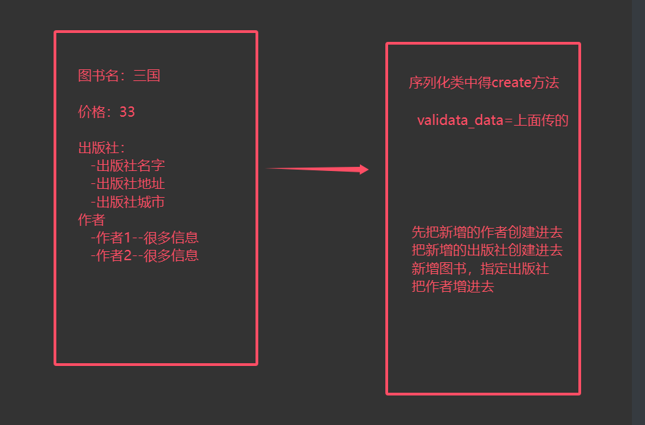
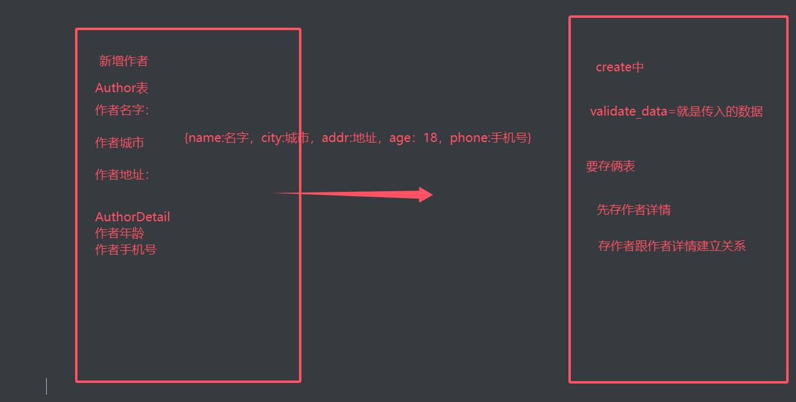

# 上节回顾

```python
# 0 Pycharm使用
	1 设置里选择 show members 这样可以看到一个文件里每一个方法/类-具体的方法和属性 方便看源码
    2 select open file 方便看源码
    3 前进后退 打开view-appearance-toolBar

# 1 请求 Request
	-1 跟之前一样用 新的request._request 可以得到老的request
        class Request:
            def __init__(self, request,...):
                self._request = request
    -2 request.data # 无论什么编码格式或请求方式，请求体内容都在这里，它是字典
    	-json：字典
        -urlencoded：QueryDict
    -3 request.query_params # 请求地址中的数据
        @property
        def query_params(self):
            return self._request.GET

# 2 响应 Response
	-1 data    # 响应体，字符串，字典，列表
    -2 status  # http相应状态码
    -3 headers # 响应头

# 3 序列化类作用
	-1 序列化
    -2 反序列化保存
    -3 反序列化校验

# 4 序列化
	-1 写一个类，继承 serializer.Serializer
    -2 在类中写字段，一个个字段对象
         age=serializers.IntegerField()
    -3 在视图类views.py,实例化得到对象
    	对象=Serializer(instance=qs对象/单个对象，many=True/False)
    	对象.data # 字典(many=False)或列表（many=True）

# 5 反序列化
	-1 写一个类，继承 serializer.Serializer
    -2 在类中写字段，一个个字段对象
         age=serializers.IntegerField()
    -3 在视图类views.py,实例化得到对象
    	对象=Serializer(data=request.data) # 新增 没有instance对象
        对象=Serializer(instance=要修改的对象, data=request.data) # 修改
	-4 校验数据
    	对象.is_valid
    -5 校验通过,调用save -> 触发序列化类中得到create或update
    	对象.save()
```


# 作业

```python
# 写个装饰器，装饰视图函数后，让request有data属性
import json
def wrapper(func):
    def inner(*args,**kwargs):
        request=args[0]
        try:
            # 只有是 json格式编码才能转成功
            request.data=json.loads(request.body)
        except Exception as e:
            # post请求 urlencoded，form-data 都有数据
            request.data=request.POST
        # 唯独缺了 put请求，请求体的编码格式是urlencoded，form-data会没有数据
        # if request.method=='PUT' and request.body:
        #     request.data='这种情况咱们没处理'
        res=func(*args,**kwargs)
        return res
    return inner

@wrapper
def index(request):
    print(request.data)
    return HttpResponse('ok')
```


# 今日内容

# 1 反序列化之校脸

## 1.1 使用mysql8.0

```python
# 0 mysql：  5.7    8      9
	-建议使用 8 了
    
# 1 django 的4版本以后，不支持mysql 5.7了，必须要8以上
	-必须装mysqlclient：pip3 install mysqlclient
    -或者使用pymysql，得写两句话

# 2 mysql 多版本共存
	-5.7 
    -8.4.0: win:mysql官网提供了两种安装方式
    	-安装包 -> 无脑下一步 -> 稍微有点脑 -> 要读懂英文
        -压缩包安装 -> 解压配置方式
		-https://dev.mysql.com/downloads/mysql/
        -端口做成 3308
        
        -创建一个用户，授予所有库所有表的权限：允许本地连，允许远程连
        
# 3 https://zhuanlan.zhihu.com/p/571585588
    
# 4 环境变量作用(补充知识)
	-win，linux，mac 都有，作用是某些软件在执行时，直接使用这些变量名，获取到变量的值
    -cmd中执行：echo %Path% -> 打印出环境变量Path的值、
    -环境变量有 用户环境变量和系统环境变量
    	-先找用户
        -再找系统
    -PATH这个环境变量有什么作用？
    	-里面放了很多 路径
        -以后再任意路径下执行某个命令 (xx.bat,xx.exe)
        	-先在当前路径下找，找不到
            -按照path配置从上往下的路径找，有没有这个可执行文件，如果有就会执行
```


## 1.2 反序列化校验

```python
# 1 使用mysql---》mysql8
	-mysql7 密码：1234
    -mysql8 root用户密码：空
    
# 3 以新增接口为例讲校验

# 4 有两层
	-字段自己的校验规则 -> 字段类的属性来控制
    	    age = serializers.IntegerField(min_value=1, max_value=109)
            name = serializers.CharField(max_length=8, min_length=3)
            school = serializers.CharField(max_length=30, min_length=3)
        -如果数据不符合要求 就会返回(后面的也类似):
            {
                "age": [
                    "Ensure this value is less than or equal to 109."
                ],
                "name": [
                    "Ensure this field has at least 3 characters."
                ]
            }
            
    -全局和局部钩子校验
    	-局部钩子函数 -> 单独校验某个字段 -> 写在序列化类中 必须叫 validate_字段名
                def validate_name(self, value):
                    # value:前端传入 经过上面字段自己校验后才会来到这里
                    # 自己写逻辑判断 - name不能以k开头
                    if value.startswith("k"):
                        # 抛出异常 -> views.py 里的is_valid过不了
                        raise ValidationError("Name can not start with k")
                    else:
                        # 返回value值
                        return value
        -全局钩子 -> 多个字段校验的
        	# 人名和学校的前两个字符不能一样
                def validate(self, attrs):
                    # attrs: 前端传入, 校验过后的数据
                    # 1 取出名字前两个字符
                    name = attrs.get("name")[:2]
                    # 2 取出学校前两个字符
                    school = attrs.get("school")[:2]

                    if name == school:
                        raise ValidationError("Name can not be same with school")
                    else:
                        return attrs
                    
# 5 自己补充-校验顺序
	-先字段校验 再局部钩子 再全局钩子
```

## 1.3 总代码

```python
############## models.py ##############
class Student(models.Model):
    age = models.IntegerField()
    name = models.CharField(max_length=32)
    school = models.CharField(max_length=32)
############## views.py ##############
from rest_framework.views import APIView
from rest_framework.response import Response
from app01.serializer import StudentSerializer
class StudentView(APIView):
    def post(self, request):
        serializer = StudentSerializer(data=request.data)
        # 加上校验之后 如果校验不过 就会进else里
        if serializer.is_valid():
            serializer.save()
            return Response(serializer.data)
        else:
            return Response(serializer.errors)
############## serializer.py ##############
from rest_framework import serializers
from rest_framework.exceptions import ValidationError
from .models import Student
class StudentSerializer(serializers.Serializer):
    age=serializers.IntegerField(min_value=1,max_value=110)
    name=serializers.CharField(max_length=8,min_length=3)
    school=serializers.CharField(max_length=8,min_length=3)

    def create(self, validated_data):
        student=Student.objects.create(**validated_data)
        return student

    def update(self, student, validated_data):
        for key in validated_data:
            setattr(student,key,validated_data.get(key))
        student.save()
        return student

    # 局部钩子函数---》单独校验某个字段
    def validate_name(self,value):
        # value:是前端传入，经过字段自己校验后，没问题，才来到这里
        # 自己写逻辑判断--不能姓 刘
        if value.startswith('刘'):
            # 抛异常
            raise ValidationError('你不配姓刘')
        else:
            # 返回value的值,继续往后走
            return value


    # 人名和学校的前两个字符不能一样
    def validate(self, attrs):
        # attrs:前端传入，校验过后的数据
        # 1 取出名字前两个字符
        name = attrs.get('name')[:2]
        # 2 取出学校的前两个字符
        school = attrs.get('school')[:2]
        if name==school:
            raise ValidationError('人名和学校的前两个字符不能一样')
        else:
            return attrs

############## urls.py#####################
from django.urls import path
from .views import StudentView
urlpatterns = [
    path('students/', StudentView.as_view()),
]
```


# 2 定制返回格式方式一：source

```python
# 序列化定制返回格式 之 一对一关系
# 1.source 使用
#### 1.source ####

# 三种使用方式
#### serializer.py
class StudentSerializer(serializers.Serializer):
    age = serializers.IntegerField()
    name = serializers.CharField()
    # school = serializers.CharField()
# 1 基本使用
    sch = serializers.CharField(source="new_school")
# 2 注意:使用source 不可以和前面的同名

# 3 跨表使用
'''
    book对象
    序列化：name,price ,出版社publish名字
    publish = serializers.CharField(source='publish.name')
'''

# 4 补充
## 表模型中##
class Student(models.Model):
    age=models.IntegerField()
    name=models.CharField(max_length=32)
    school=models.CharField(max_length=32)
    @property
    def new_school(self):
        return self.school + "学校"
# 序列化类中
sch=serializers.CharField(source='new_school') # 指定某个字段
```


# 3 序列化之定制返回格式

## 3.1 一对多关系定制返回格式

```python
# 写个查询图书接口 -> 返回出版社信息 -> 图书和出版社是一对多
```

### 3.1.1 表模型中写方法

```python
# 序列化定制返回格式 之 一对多关系
# 1.表模型写方法
#### 1.表模型 ####
# 在表模型中写方法，在序列化列中使用DictField接收
#### serializer ####
publish_detail = serializers.DictField()
#### models ####
# 写个方法 -> 变成数据属性
# 用基于对象的跨表查询
    @property
    def publish_detail(self):
        return {
            "name": self.publish.name,
            "addr": self.publish.addr,
            "city": self.publish.city,
        }
### 补充：序列化类中使用 DictField / ListField / CharField 哪一个接收 取决于方法返回的是什么
# 可以自己捏想要的数据类型
```

**代码**

```python
#### models.py ####
class Book(models.Model):
    name = models.CharField(max_length=32)
    price = models.IntegerField()
    publish = models.ForeignKey(to='Publish', on_delete=models.SET_NULL, null=True)
    authors = models.ManyToManyField(to='Author')

    # 写一个方法来实现
    # 用基于对象的跨表查询
    @property
    def publish_detail(self):
        return {
            "name": self.publish.name,
            "addr": self.publish.addr,
            "city": self.publish.city,
        }

    @property
    def abc(self):
        return self.name + "1级"
    
#### serialzier.py ####
class BookSerializer(serializers.Serializer):
    name = serializers.CharField()
    price = serializers.IntegerField()
    # 这样可以显示对应表的单个字段信息
    # publish = serializers.CharField(source="publish.name")
    # pubaddr = serializers.CharField(source="publish.addr")
    # 但是想把publish的信息都放在一个字典里面
    # 需要用到DictField
    publish_detail = serializers.DictField()
    abc = serializers.CharField()
```

### 3.1.2  序列化类中写方法

```python
# 序列化定制返回格式 之 一对多关系
# 2.序列化类写方法
#### 2.序列化类 ####
class BookSerializer(serializers.Serializer):
    # 定制表模型中没有的 属性/方法
    # 在序列化类里做
    publish_detail = serializers.SerializerMethodField()

    # 必须配合一个方法
    # get_字段名 -> 这个方法返回什么 这个字段就是什么
    def get_publish_detail(self, obj):
        # 这个obj就是序列化到的book对象
        # 想要返回一个字典 里面是publish的数据 可是现在没有Model里的Publish怎么办呢 关键就在于 obj
        return {
            "name": obj.publish.name,
            "addr": obj.publish.addr,
            "city": obj.publish.city
        }

    # 这里也一样可以捏想要的字段
    new_name = serializers.SerializerMethodField()

    def get_new_name(self, obj):
        return obj.name + "1类"
```

### 3.1.3 子序列化

```python
# 序列化定制返回格式 之 一对多关系
# 3.子序列化类写方法
#### 3.子序列化 ####
class PublishSerializer(serializers.Serializer):
    name = serializers.CharField()
    addr = serializers.CharField()
    # city = serializers.CharField()
class BookSerializer(serializers.Serializer):
    name = serializers.CharField()
    price = serializers.IntegerField()
    # 把这个类穿过来当成字段 这个序列化类的数据格式 就是字典啊
    publish = PublishSerializer()
```

## 3.2 多对多关系，定制返回格格式

```python
# 写个查询图书接口--》返回作者信息---》图书和作者是多对多

# 序列化定制返回格式 之 多对多关系
# 1.表模型写方法
#### 1.表模型 ####
#### models ####
class Book(models.Model):
    name = models.CharField(max_length=32)
    price = models.IntegerField()
    publish = models.ForeignKey(to='Publish', on_delete=models.SET_NULL, null=True)
    authors = models.ManyToManyField(to='Author')
    @property
    def author_list(self):
        l = []
        for author in self.authors.all():
            l.append({
                "name": author.name,
                "age": author.age,
                "addr": author.addr,
            })
        return l

#### serializer
class BookSerializer(serializers.Serializer):
    name = serializers.CharField()
    price = serializers.IntegerField()
    publish_detail = serializers.DictField()
    # 多对多 -> 在表模型中写
    author_list = serializers.ListField()
    # 类似上面DictField() 的写法 都是一致的 关键在于怎么解决多个
    # 我们想要在Model里面弄一个 author_list 出来
    # 仿照 publish_detail 的写法
    
# 序列化定制返回格式 之 多对多关系
# 2.序列化类写方法
#### 2.序列化类 ####
class BookSerializer(serializers.Serializer):
    name = serializers.CharField()
    price = serializers.IntegerField()
    publish_detail = serializers.DictField()
    author_list = serializers.SerializerMethodField()

    # 必须配合一个方法
    # get_字段名 -> 这个方法返回什么 这个字段就是什么
    def get_author_list(self, obj):
        l = []
        for author in obj.authors.all():
            l.append({
                "name": author.name,
                "age": author.age,
                "addr": author.addr,
            })
        return l
    
# 序列化定制返回格式 之 多对多关系
# 3.子序列化类写方法
#### 3.子序列化 ####
class AuthorSerializer(serializers.Serializer):
    name = serializers.CharField()
    age = serializers.IntegerField()
    addr = serializers.CharField()
    # 想一下 前面两种方法都走的for循环把多个值输出
    # 可是serializer里面要怎么做呢? 设置成many=True
class BookSerializer(serializers.Serializer):
    name = serializers.CharField()
    price = serializers.IntegerField()
    publish_detail = serializers.DictField()
    # 把这个类穿过来当成字段 这个序列化类的数据格式 弄成字典
    # 注意: 多对多 用子序列化类这种方法 字段名必须和model里面定义的一致 不然就要用source了
    # 最关键的就是many=True
    authors = AuthorSerializer(many=True)
```

## 3.3 四种定制格式，哪种用的多

```python
# 一般表模型中写用的多
# 本质用哪个都可以，实现功能即可
# 定制返回格式的原因: 比如说作者有多个 前端可能要去做下拉框的形式
```


# 4 多表关联反序列化

## 总代码

```python
### views.py ####
class BookView(APIView):
    def post(self, request):
        # 1 前端携带的数据应该是怎样的?
        # {"name": "素食者", price:99, publish: 1}
        # publish不应该是包含所有信息 应该只是选择了某一个 对应了一个id 而不是把所有信息都要录入
        serializer = BookSerializer(data=request.data)
        if serializer.is_valid():
            serializer.save()
            return Response({"code": 100, "msg": "成功"})
        else:
            return Response(serializer.errors)
```

```python
#### models.py ####
class Publish(models.Model):
    name = models.CharField(max_length=32)
    addr = models.CharField(max_length=32)
    city = models.CharField(max_length=32)
class Book(models.Model):
    name = models.CharField(max_length=32)
    price = models.IntegerField()
    publish = models.ForeignKey(to='Publish', on_delete=models.SET_NULL, null=True)
    authors=models.ManyToManyField(to='Author')
class Author(models.Model):
    name = models.CharField(max_length=32)
    age = models.IntegerField()
    addr = models.CharField(max_length=32)
```

```python
##### serializer.py ####

class BookSerializer(serializers.Serializer):
    name = serializers.CharField()
    price = serializers.IntegerField()
    # 反序列化
    publish_id = serializers.CharField()
    authors = serializers.ListField()

    # 假设要写publish 校验的局部钩子 -> publish 编号不能没有
    # def validate_publish(self, value):
    # 通过value去查询表里有没有 有继续 没有抛异常

    # 重写create方法
    def create(self, validated_data):
        # validated_data = {...}
        # 保存
        # 因为publish:1 的存在 不能再写成**validated_data 所以要改成publish_id
        authors = validated_data.pop("authors")
        book = Book.objects.create(**validated_data)  # 一对多关系反序列化
        # 保存作者
        book.authors.add(*authors)  # 多对多关系反序列化
        return book
```



## 问题一

```python
# 在增加图书的时候，也增加出版社和作者 -> 肯定不用
	-前端传的数据:
    -{"name":"素食者", "price":33, "publish":{"name":"上海出版社","addr":"上海"},"authors":[{}，{}]}
    -到了create中：validated_data 就是传入的
```

## 问题二：

```python
# 针对于 Author和AuthorDetail的情况
-前端传的数据：{"name":"张三","age":19,"author_detail":1}  -->基本不用
-前端传的数据：{"name":"三国演义","age":19,"addr":地址,"gender":1}  -->通常用它
-到了create中：validated_data 就是传入的{"name":"三国演义","age":19,"addr":地址,"gender":1} 
	- 把其他信息取出来
	{"name":"三国演义","age":19}  # 作者
    {"addr":地址,"gender":1}  #作者详情
```



## 问题三：

```python
# 如果前端多传了数据：多了个addr，序列化类中没有
	-{"name":"三国演义","price":19,"publish_id":1,"authors":[1,2],"addr":"上海"}
# 到了create中，validated_data中的数据：{"name":"三国演义","price":19,"publish_id":1,"authors":[1,2]}
# 多传了校验过就不会有了 所以不影响
```

## 4.3 多表关联反序列化修改-作业

```python
```


# 作业

```python
# 1 装mysql - 放最后 对应视频3 + 自己研究 费时间 可能搞不完

# 2 上课讲的代码，敲一遍
	-source定制 √
    -其他三种定时返回格式 √
    
# 3 多表反序列化修改
#### 拓展 ####
# 3 book的5个表
	-Author和AuthorDetail的5个接口  {name，age，addr，phone}
    -Book的5个接口--》作者，出版社
    	-图书名不能有sb
    	-继承Serializer
    -{
        name:
        price:
        puhlish_detail:{},
        author_list:[{name:xx,addr:}]
    }
```

