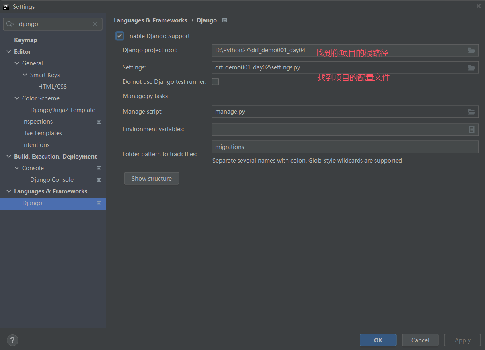

# 上节回顾

```python
# 1 安装mysql8 多版本共存

# 2 反序列化校验(保存,新增)
	-1 字段自己的检验 -> 最大长度 是否必填 默认值
    -2 局部钩子 -> 给某个字段定制校验规则
    -3 全局钩子 -> 多个字段同时定制校验规则
    -发现 经过这三层检验 数据才作为 validated_data 被使用 所以是-ed 呀
    -即 钩子返回的数据 影响后续新增修改之类的操作 所以一定要 return 正确

# 3 定制返回格式之source
	-1 基本使用,定制表模型中没有的字段 or 方法
    	new_name = serializer.CharField(source="name"/get_name)
	-2 问题:source字段不能和变量名一样
    	name=serializer.CharField(source=name)
    -3 可跨表
    	publish_name = serializer.CharField(source=publish.name)

# 4 多表关联情况下定制返回格式
	-1 表模型中写方法 -> 方法返回什么, 字段对应的值就是什么
    	-序列化类中的字段名 要和表模型中 方法名一致
        -不然要用source进行定制
        -如果表模型中返回的类型是 dict / list
        -序列化类就相应使用 DictField / ListField 来接收
    -2 序列化类中写方法
    	-序列化类中写法如下:
    		-字段=seiralizer.SerializerMethodField()
        	-配合 get_字段 的方法 -> 方法返回什么 字段的值就是什么
    -3 子序列化
        -只针对多表关联的场景
        -如果是多要加many=True
        
# 5 多表关联反序列化保存
	-前端给我(后端python)传入数据
        -新增图书: {name, price, publish_id, author_ids}
        
        class BookSerializer(serializers.Serializer):
            name = serializers.CharField(max_length=32)
            price = serializers.IntegerField()
            publish_id= serializers.IntegerField()
            author_ids=serializers.ListField()
            def create(self,validate_data):
                # {name,price,publish_id,author_ids} 下面两行伪代码
                name, price, publish_id 保存到图书表
                author_ids 保存到中间表中
                
    -对于一对多的 publish_id 和 多对多的 author_ids 如何处理?
    -序列化类中一个 IntegerField 和 ListField

    -极端
    	-新增图书：{detail:'西游记|19|1|2,3'} 这种形式的数据要怎么做
    	-detail是个字符串 那就用CharField去接收 再进行字符串的分割处理
        class BookSerializer(serializers.Serializer):
            detail = serializers.CharField()
            def create(self,validate_data):
                # {detail:'西游记|19|1|2,3'}
                name,price,publish_id 保存到图书表
                author_ids 保存到中间表中

# 6 问题
	-新增图书 
    	-数据格式：{name,price,publish:{},authors:[{},{}]}
        -不会 前端那边都是下拉选择 没有一口气让用户输入一本书的作者的详细信息的道理
    
    -如果序列化中没有的字段,前端传了
    -序列化类没定义所以不会接收到 -> 进 validate 就无了
    
    -针对 Author 和 AuthorDetail 的情况
    -返回图书:给前端的格式
        {
            name:'西游记'
            price:199
            publish_detail:{
                name:'北京出版社'
                addr:'北京'
            },
            author_list:[
                {name:'lqz',age:19,author_detail:{addr:'上海',phone:1888}}
                {name:'lqz',age:19,author_detail:{addr:'上海',phone:1888}}
                {name:'lqz',age:19,addr:'上海',phone:1888}
            ]
        }
    -返回前端作者详情:格式
    	不好的：{name:'lqz',age:19,author_detail:{addr:'上海',phone:1888}}
        比较好的：{name:'lqz',age:19,addr:'上海',phone:1888}
    -返回给前端不要套很多 把 author和 authordetail 一起弄出来 存的时候自己去分开
```


# 今日内容

# 0 补充

## 0.1 改项目名

```python
# 1 改文件夹名

# 2 改项目名
	-删.idea同用

# 3 django 还是不行(任何情况 django项目调试跑不通 都可以这样检查)
	-settings -> languages&frameworks -> django -> project root 和 settings 修改
    -修改项目根路径和配置文件

# 4 可以运行 但小app文件夹名还是原来的
	-不能直接改 很多文件里都使用了原名字的module
	-全局查找替换 就不会import错
    -replace in files -> 全部进行替换

# 5 还是不行的话 
	-edit configurations  -> django server删掉 重新加一个
```



## 0.2 模块与包及导入规则

```python
#### 模块,脚本和包 ####
# 1 模块 -> 就是一个 py文件 -> 在别的py文件中把它导入,这个 py文件 就叫模块
# 2 脚本 -> 一个py文件,右键运行,这个py文件就叫脚本
# 3 包 -> 文件夹下有 __init__.py
	-包中可以有很多 py文件 -> py文件 中又有很多方法,类

#### 相对和绝对导入 ####
# 重点:导入模块或包的规则 (有 . 就是相对,没有 . 就是绝对）
	-1 绝对导入
    	-*********
    	-根指的是 -> python环境变量,如果一个路径在环境变量中,直接以此路径为根导入即可
        -打印环境变量：sys.path
        -import time # python源码的目录在环境变量中
        -import django # 下载的第三方模块site-packages
        -当下运行的这个文件所在的文件夹 python 自己设置了把它加入了环境变量中
    -2 相对导入
    	-相对的是谁 ->相对的就是当前这个py文件

# 环境变量
['D:\\Program Files\\JetBrains\\PycharmProjects\\Countdown93\\testdict', # 当前运行文件所在的文件夹
 'D:\\Program Files\\JetBrains\\PycharmProjects\\Countdown93', # 项目目录
 	# 这两个都是 随着自己正在 coding 的东西改变的 
 'D:\\Program Files\\JetBrains\\PyCharm 2024.1.4\\plugins\\python\\helpers\\pycharm_display', 
 'D:\\Program Files\\Python310\\python310.zip', # os, time等
 'D:\\Program Files\\Python310\\DLLs', 
 'D:\\Program Files\\Python310\\lib', 
 'D:\\Program Files\\Python310', 
 'D:\\Program Files\\Python310\\lib\\site-packages',  # 装的第三方模块,直接导入即可 比如django
 'D:\\Program Files\\Python310\\lib\\site-packages\\win32', 
 'D:\\Program Files\\Python310\\lib\\site-packages\\win32\\lib', 
 'D:\\Program Files\\Python310\\lib\\site-packages\\Pythonwin', 
 'D:\\Program Files\\JetBrains\\PyCharm 2024.1.4\\plugins\\python\\helpers\\pycharm_matplotlib_backend']

# 以后如果我们写包,写第三方包
 	-可以直接  from 包名 import xx 即可 他们在 site-packages 中 即环境变量之一  	
 		# 因为如果给别人用,别人下载完会在 site-packages  在环境变量
 			-以后别人用 都是 from 包名 import xx  # 这样用根本没问题
 			-我们在包内部:也要 from 包名 import xx  # 这样没问题
 			-如果我们 import xx -> 这个py文件 直接右键运行 暂时没问题
 			-但是如果别人作为第三方包用 -> import xx 就会报错
 		# 如果自己用,我们会放在项目根路径, 项目根路径  在环境变量中

 # 自己写的包
 	-内部如果用绝对导入,包根路径是绝对的路径
 		-因为我们的包 被被人下载完后会放到site-packages, 在环境变量中
 		from 包名 import xx
	-内部的文件如果用相对,就简单,相对于当前py文件 这样在其他人的电脑上使用也不会出错了
 		from . improt xx

# 最后,如果py文件以脚本形式运行,不能使用相对导入,只能用绝对导入


# 解决了一直以来迷迷糊糊的问题!
# 详细记录一下 发一篇博客
```


# 1 反序列化多表写法

## 1.1 反序列化put修改

```python
# 1 put 怎么写
#### serializer ####
class BookSerializer(serializers.Serializer):
    name = serializers.CharField()
    price = serializers.IntegerField()
    # 反序列化: 要保证序列化类中的字段要跟前端传入的一一对应
    # {"publish_id":1, "author_list":[1,2]}
    publish_id = serializers.IntegerField()
    author_list = serializers.ListField()

    def update(self, instance, validated_data):
        author_list = validated_data.pop("author_list")
        for key in validated_data:
            setattr(instance, key, validated_data.get(key))

        # 中间表
        # set 作用等同于 先clear 再 add 打散的
        instance.authors.set(author_list)
        instance.save()
        return instance

#### models ####
class Book(models.Model):
    name = models.CharField(max_length=32)
    price = models.IntegerField()
    publish = models.ForeignKey(to='Publish', on_delete=models.SET_NULL, null=True)
    authors = models.ManyToManyField(to='Author')

    @property
    def author_list(self):
        l = []
        for author in self.authors.all():
            l.append({
                "name": author.name,
                "age": author.age,
                "addr": author.addr,
            })
        return l

#### views ####
class BookDetailView(APIView):
    def put(self, request, pk):
        book = Book.objects.filter(pk=pk).first()
        if not book:
            return Response({"error": "Book not found"})
        serializer = BookSerializer(book, data=request.data)
        if serializer.is_valid():
            serializer.save()
            return Response(serializer.data)
        else:
            return Response(serializer.errors)

####################################################################
# 序列化和反序列化
# 写的代码不长
# 只是要注意
# 对于 一对多 和多对多 publish author 这两个字段的处理 在序列化和反序列化的过程中
# 是不一样的
# 所以要搞清楚


# 以book数据为例,修改数据
	-book基础数据
    -修改book的出版社
    -修改book的作者
# 代码
**序列化和反序列化用同一个序列化类**
**read_only和write_only**
#### serializer.py ####
from rest_framework import serializers=

class BookSerializer(serializers.Serializer):
    name = serializers.CharField()
    price = serializers.IntegerField()
    # 只序列化 读
    publish_detail = serializers.DictField(read_only=True)
    author_all = serializers.ListField(read_only=True)
    # 只反序列化 写
    publish_id = serializers.IntegerField(write_only=True)
    author_list = serializers.ListField(write_only=True)
    # 这样在读的时候 就不需要pubish_id 和 author_list 的加入 使两边互不影响
    def update(self, instance, validated_data):
        author_list = validated_data.pop("author_list")
        for key in validated_data:
            setattr(instance, key, validated_data.get(key))
        # 中间表
        # set 作用等同于 先clear 再 add 打散的
        instance.authors.set(author_list)
        instance.save()
        return instance
#### views.py ####
from rest_framework.response import Response
from rest_framework.views import APIView
from .serializer import BookSerializer
class BookDetailView(APIView):
    def put(self, request, pk):
        book = Book.objects.filter(pk=pk).first()
        if not book:
            return Response({"error": "Book not found"})
        serializer = BookSerializer(book, data=request.data)
        if serializer.is_valid():
            serializer.save()
            return Response(serializer.data)
        else:
            return Response(serializer.errors)

    def get(self, request, pk):
        book = Book.objects.filter(pk=pk).first()
        serializer = BookSerializer(book)
        return Response(serializer.data)
```

## 1.2 5个接口

```python
# 有了上面的基础之后
# 可以把接口写完整
# 关于上面提到的问题 两个字段不同 
# 比如 publish 和 publish_id
# 比如 author_list 和 author_all
# 为了不要写太多个 serializer 和 view
# 可以就在 serializer 里面 写 2 + 4 个字段
# 这样就能互不影响

#### views ####
class BookView(APIView):
    def get(self, request):
        book_list = Book.objects.all()
        serializer = BookSerializer(book_list, many=True)
        return Response(serializer.data)
    def post(self, request):
        serializer = BookSerializer(data=request.data)
        if serializer.is_valid():
            serializer.save()
            return Response({"code": 100, "msg": "成功"})
        else:
            return Response(serializer.errors)
class BookDetailView(APIView):
    def get(self, request, pk):
        book = Book.objects.filter(pk=pk).first()
        serializer = BookSerializer(book)
        return Response(serializer.data)
    def put(self, request, pk):
        book = Book.objects.filter(pk=pk).first()
        if not book:
            return Response({"error": "Book not found"})
        serializer = BookSerializer(book, data=request.data)
        if serializer.is_valid():
            serializer.save()
            return Response(serializer.data)
        else:
            return Response(serializer.errors)
    def delete(self, request, pk):
        Book.objects.filter(pk=pk).first()
        return Response({""})
    
#### serializer ####
class BookSerializer(serializers.Serializer):
    name = serializers.CharField()
    price = serializers.IntegerField()
    # 只序列化 读
    publish_detail = serializers.DictField(read_only=True)
    author_all = serializers.ListField(read_only=True)
    # 只反序列化 写
    publish_id = serializers.IntegerField(write_only=True)
    author_list = serializers.ListField(write_only=True)
    # 这样在读的时候 就不需要pubish_id 和 author_list 的加入 使两边互不影响
    def update(self, instance, validated_data):
        author_list = validated_data.pop("author_list")
        for key in validated_data:
            setattr(instance, key, validated_data.get(key))
        instance.authors.set(author_list)
        instance.save()
        return instance
    def create(self, validated_data):
        author_list = validated_data.pop("author_list")
        book = Book.objects.create(**validated_data)
        book.authors.add(*author_list)
        return book
```


# 2 断言

```python
# 1 drf源码中,经常看到断言, 如:
assert hasattr(self, '_errors'), (
    'You must call `.is_valid()` before calling `.save()`.'
)

# 2 断言,就是断定某个东西,必须怎么样,如果不是,就报错

# 3 断言的使用
    # 判断 age 的值必须是 23,才能继续执行,否则抛异常
    age = 24
    # if not age == 23:
    #     raise Exception('年龄不为23,不能继续执行')
    # print('代码继续')


    assert age == 23, "年龄不为23,不能继续执行"
    print('代码继续')

# 4 使用断言的位置
	-断定 某些值一定存储
    -断定 某个值必须为 字符串类型  等等等
```


# 3 drf之请求响应

## 3.1 请求-支持的编码格式

```python
# 1 drf请求,可以支持 三种编码格式
	request.data  -> 取出请求体的内容
    
# 2 后期,有个上传文件接口 -> 只能接受 form-data类型,其他类型不允许,如何做?
	-控制某个接口,只能处理 某一种 编码格式,其他的都不行
    
# 3 使用方式1 （局部使用）
class UpLoadFile(APIView):
    # 配置一个解析类即可 -> 只支持 文件上传
    # 如果不写,就是三种都支持
    parser_classes = [MultiPartParser]

    def post(self, request):
        print(request.data)
        # 这个接口,只处理 form-data格式,其他格式都不处理
        # 要求前端传的数据 {name:'aaaa','myfile':'文件'}
        # 1 取出数据
        name = request.data.get('name')
        # 2 取出文件
        myfile = request.data.get('myfile')
        # 3 数据存到数据库,文件保存到本地
        print(name)
        print(myfile)
        assert myfile, '文件必须存在'
        with open(myfile.name, 'wb') as f:
            for line in myfile:
                f.write(line)
        # 4 返回给前端
        return Response({'code': 100, 'msg': '文件上传成功'})
    
# 4 使用方式2--配置文件中--所有视图类都会使用这个解析（全局使用）
	# 所有drf的配置,都写在这里面
    # setting.py
    REST_FRAMEWORK = {
        # 解析类
        'DEFAULT_PARSER_CLASSES': [
            'rest_framework.parsers.JSONParser',
            # 'rest_framework.parsers.FormParser',
            # 'rest_framework.parsers.MultiPartParser',
        ],
    }
	
# 5 全局使用了,局部再定制
class BookView(APIView):
    parser_classes = [JSONParser]
    
# 6 重点：解析类使用顺序
	-优先视图类中配置的parser_classes
    -其次使用项目配置文件中得:REST_FRAMEWORK -> DEFAULT_PARSER_CLASSES
    -最后会使用drf内置的 -> 三个都有
```

## 3.2 响应

```python
# 1 postman 返回json -> 浏览器返回好看的页面

# 2 控制,只返回json格式,浏览器也是返回json格式

# 3 局部使用
from rest_framework.renderers import BrowsableAPIRenderer,JSONRenderer
class BookView(APIView):
    renderer_classes = [JSONRenderer]

# 4 全局使用
REST_FRAMEWORK = {
      'DEFAULT_RENDERER_CLASSES': [
        # 'rest_framework.renderers.JSONRenderer',
        'rest_framework.renderers.BrowsableAPIRenderer',
    ],
}

# 5 局部禁用
class BookView(APIView):
    renderer_classes = [JSONRenderer]
```


# 4 ModelSerializer的使用

## 4.1 代码

```python
# 1 之前用Serializer
	-需要自己写字段
    
# 2 drf 提供更简便的 ModelSerializer 使用表模型的字段
	-使用它就可以不写字段了
    
	-ModelSerializer有固定的写法
    -减少了代码量
    
    -通过fields选择性拿字段
    -通过extra_kwargs限制序列化和反序列化 限制最大长度之类的条件
    
    -钩子和之前的写法仍然一致 和 class Meta 是同一级的
    -fields写完后仍然可以重写某一个字段 def get_name()去返回要的样子
    
    -create和update可以不用重写 ModelSerializer帮我们写好了 个别情况不对 需要自己重写
    -非常非常省力

#### ModelSerializer ####
class BookView(APIView):
    def get(self,request):
        book_list = Book.objects.all()
        serializer=BookSerializer(instance=book_list,many=True)
        return Response(serializer.data)
    def post(self,request):
        serializer=BookSerializer(data=request.data)
        if serializer.is_valid():
            serializer.save()
            return Response({'code':100,'msg':'新增成功'})
        else:
            return Response(serializer.errors)
        
#### serialzier.py ####
class BookSerializer(serializers.ModelSerializer):
    # 反序列化字段：'name', 'price', 'publish', 'authors' -> 前端传入的字段
    # 序列化字段：'name', 'price',  'publish_detail', 'author_all' -> 返回给前端的
    # 不需要重写 update 和 create 了
    class Meta:
        model = Book
        fields = ['name', 'price', 'publish', 'authors', 'publish_detail', 'author_all']
        extra_kwargs = {
            'publish': {'write_only': True},
            'authors': {'write_only': True},
            'publish_detail': {'read_only': True},
            'author_all': {'read_only': True},
        }
```

## 4.2 总结

```python
# 1 ModelSerializer 用得最多

# 2 ModelSerializer 本质上是继承了 Serializer 
	-并且对 update 和 create 进行重写等操作 帮开发者节省代码量
	-所以在 ModelSerializer 使用时 一般不需要重写
    
# 3 model=Book 指定表

# 4 fields 指需要序列化和反序列化的字段
	-列表中的字段必须是 表中得字段吗
    	-必须是表模型中得字段或方法
    -如果不是,必须要在序列化类中重写这个字段

# 5 通过 extra_kwargs 给字段传属性

# 6 局部钩子和全局钩子写法不变
```


# 5 两个视图基类(APIView,GenericAPIView)

## 5.1 基于APIView+序列化类+Response写5个接口

```python
# APIView + ModelSerializer + Response

# 如果写其他表的5个接口 view里面 只是修改对应 表 和 序列化类
# 由此延伸出 GenericAPIView

#### urls.py ####
from django.urls import path
from .views import BookView,BookDetailView
urlpatterns = [
    path('books/', BookView.as_view()),
    path('books/<int:pk>/', BookDetailView.as_view()),
]

#### views.py ####
class BookView(APIView):
    def post(self, request):
        serializer = BookSerializer(data=request.data)
        serializer.is_valid(raise_exception=True)
        serializer.save()
        return Response({'code': 100, 'msg': '成功', 'result': serializer.data})

    def get(self, request):
        books = Book.objects.all()
        serializer = BookSerializer(instance=books, many=True)
        return Response({'code': 100, 'msg': '成功', 'results': serializer.data})

class BookDetailView(APIView):
    def put(self, request, pk):
        book = Book.objects.filter(pk=pk).first()
        serializer = BookSerializer(instance=book, data=request.data)
        serializer.is_valid(raise_exception=True)
        serializer.save()
        return Response({'code': 100, 'msg': '修改成功', 'result': serializer.data})

    def get(self, request, pk):
        book = Book.objects.filter(pk=pk).first()
        serializer = BookSerializer(instance=book)
        return Response({'code': 100, 'msg': '成功', 'results': serializer.data})

    def delete(self, request, pk):
        Book.objects.filter(pk=pk).delete()

        return Response({'code': 100, 'msg': '删除成功'})

#### serializers.py ####
class BookSerializer(serializers.ModelSerializer):
    class Meta:
        model = Book
        fields = ['name', 'price', 'publish', 'authors', 'publish_detail', 'author_list']
        extra_kwargs = {
            'publish': {'write_only': True},
            'authors': {'write_only': True},
            'publish_detail': {'read_only': True},
            'author_list': {'read_only': True},
        }
```

## 5.2 基于GenericAPIView+序列化类+Response写5个接口

```python
# 因为 GenericAPIView
# 在最前面就取了 序列化类 和 表数据
# 后面是把这两个变量不断去使用到五个方法里

# 那对于不同信息表(书本、出版社)新写的时候
# 就不用挨个修改了
# 只需要写不同的View名字 和 两个变量的来源 三个信息 就够了
# 省力!


# 1 继承GenericAPIView后会有两个类属性和 3个方法
	-类属性：
        - queryset = Book.objects.all()     # 所有数据
        - serializer_class = BookSerializer # 序列化类
    -方法：对象调用 ---》于是可以  self.方法
    	self.get_serializer(data=request.data) # 跟之前用序列化类一样
         self.get_queryset()                    # 所有数据
         self.get_object()                      # 根据传入的pk值,拿到单条
        
# 2 假设以后再写 其他类的的5个接口 -> 代码只要改两个类属性即可
#### views.py ####
from rest_framework.generics import GenericAPIView
class BookView(GenericAPIView):
    # 两个类属性,几个方法
    # 1 要序列化的数据
    queryset = Book.objects.all()
    # 2 序列化类
    serializer_class = BookSerializer
    def post(self, request):
        # 3 self.get_serializer 拿到我们在类属性上配置的serializer_class 的值
        serializer = self.get_serializer(data=request.data)
        serializer.is_valid(raise_exception=True)
        serializer.save()
        return Response({'code': 100, 'msg': '成功', 'result': serializer.data})

    def get(self, request):
        # 4 self.get_queryset()  拿到我们在类属性上配置的queryset 的值
        books = self.get_queryset()
        serializer = self.get_serializer(instance=books, many=True)
        return Response({'code': 100, 'msg': '成功', 'results': serializer.data})

class BookDetailView(GenericAPIView):
    queryset = Book.objects.all()
    serializer_class = BookSerializer
    def put(self, request, pk):
        # 5 根据传入pk值,拿到一条记录
        # self.get_object()---》根据queryset 配置的所有数据和 pk ,获取一条记录
        book = self.get_object()
        serializer = self.get_serializer(instance=book, data=request.data)
        serializer.is_valid(raise_exception=True)
        serializer.save()
        return Response({'code': 100, 'msg': '修改成功', 'result': serializer.data})

    def get(self, request, pk):
        book = self.get_object()
        serializer = self.get_serializer(instance=book)
        return Response({'code': 100, 'msg': '成功', 'results': serializer.data})

    def delete(self, request, pk):
        self.get_object().delete()
        return Response({'code': 100, 'msg': '删除成功'})
```


## 5.3 补充

```python
# 源码
# queryset
# 时效性
# serializer
# 给序列化和反序列化一个定制serializer的重写方法 控制不同请求方式使用不同序列化类

# 1  对象使用类属性
	对象.属性名即可
    类.属性名即可
    
# 2  如果对象中有跟类属性同名的,会怎么样 优先用自己的
# 对象属性优先于类属性
class Person:
    school='清华大学'
    person2=Person()
    person2.school='北京大学'  # 只会改对象自己的,不会改类的
    print(person2.school)    # 一旦对象自己有了,优先用对象自己的    '北京大学'

person=Person()
print(person.school) # 对象没有,就用类的  清华大学
```


# 作业

```python
# 1 改项目名 √

# 2 包和模块,导入规则 √

# 3 请求和响应 -> 试一下 √

# 4 图书视图用ModelSerializer写5个接口 √
	-保证和要求一致
    -其他字段限制条件
	-使用ModelSerializer写
    -图书名字中不能有sb,价格最大100,最小0
	-新增： 
    {
        "name": "测试图书",
        "price": 77,
        "publish": 1,
        "authors": [1,2]
    }
    -查询一条：
    {
        "name": "三国演义1",
        "price": 77,
        "publish_detail": {
            "name": "上海出版社",
            "addr": "上海浦东",
            "city": "上海"
        },
        "author_all": [
            {
                "name": "李四",
                "age": 33,
                "addr": "南京市"
            }
        ]
    }
#### views ####
class BookView(APIView):
    def get(self, request):
        book_list = Book.objects.all()
        serializer = BookSerializer(book_list, many=True)
        return Response(serializer.data)
    def post(self, request):
        serializer = BookSerializer(data=request.data)
        if serializer.is_valid():
            serializer.save()
            return Response({"code": 100, "msg": "成功"})
        else:
            return Response(serializer.errors)
class BookDetailView(APIView):
    def get(self, request, pk):
        book = Book.objects.filter(pk=pk).first()
        serializer = BookSerializer(book)
        return Response(serializer.data)
    def put(self, request, pk):
        book = Book.objects.filter(pk=pk).first()
        if not book:
            return Response({"error": "Book not found"})
        serializer = BookSerializer(book, data=request.data)
        if serializer.is_valid():
            serializer.save()
            return Response(serializer.data)
        else:
            return Response(serializer.errors)
    def delete(self, request, pk):
        Book.objects.filter(pk=pk).delete()
        return Response({""})
    
#### serializer
class BookSerializer(serializers.ModelSerializer):
    # 指定和表的对应关系
    class Meta:
        model = Book
        # fields = "__all__"
        fields = ["name", "price", "publish", "authors", "publish_detail", "author_all"]
        # 有只反序列化和只序列化的字段应该怎么处理?
        extra_kwargs = {
            # "name": {"max_length": 10},
            "price": {"max_value": 100, "min_value": 0},
            "publish": {"write_only": True},
            "authors": {"write_only": True},
            "publish_detail": {"read_only": True},
            "author_all": {"read_only": True},
        }

    def validate_name(self, value):
        if "sb" in value.lower():  # 检查名字中是否包含"sb"（不区分大小写）
            raise serializers.ValidationError("名字不能包含'sb'")
        return value

# 5 写5个类封装 -> 封装5个类
#### views ####
# 封装5个类
# 创建数据
class CreateModelMixin():
    def create(self, request, *args, **kwargs):
        serializer = self.get_serializer(data=request.data)
        if serializer.is_valid():
            serializer.save()
            return Response({"code": 100, "msg": "新增成功"})
        else:
            return Response(serializer.errors)

# 查询所有
class ListModelMixin():
    def list(self, request):
        obj_list = self.get_queryset()
        serializer = self.get_serializer(obj_list, many=True)
        return Response(serializer.data)

# 查询单条
class GetDetailModelMixin():
    def getdetail(self, request, pk):
        obj = self.get_object(pk)
        serializer = self.get_serializer(obj)
        return Response(serializer.data)

# 修改一条
class RetrieveModelMixin():
    def retrieve(self, request, pk):
        obj = self.get_object(pk)
        serializer = self.get_serializer(obj, data=request.data)
        if serializer.is_valid():
            serializer.save()
            return Response(serializer.data)
        else:
            return Response(serializer.errors)

# 删除一条
class DestroyModelMixin():
    def destroy(self, request, pk):
        obj = self.get_object(pk)
        obj.delete()
        return Response({"msg": "删除成功"})

# 添加一个基类来整合功能
class GenericModelView(APIView):
    serializer_class = None
    queryset = None
    def get_serializer(self, *args, **kwargs):
        if not self.serializer_class:
            raise AttributeError("找不到")
        return self.serializer_class(*args, **kwargs)
    def get_queryset(self):
        return self.queryset.all()
    def get_object(self, pk):
        try:
            return self.queryset.get(pk=pk)
        except self.queryset.model.DoesNotExist:
            return Response({"error": 404, "msg": "找不到"})


# Book 视图类
class BookView(GenericModelView, ListModelMixin, CreateModelMixin):
    serializer_class = BookSerializer
    queryset = Book.objects.all()
    def get(self, request):
        return self.list(request)
    def post(self, request):
        return self.create(request)


# BookDetail 视图类
class BookDetailView(GenericModelView, RetrieveModelMixin, DestroyModelMixin, GetDetailModelMixin):
    serializer_class = BookSerializer
    queryset = Book.objects.all()
    def get(self, request, pk):
        return self.getdetail(request, pk)
    def put(self, request, pk):
        return self.retrieve(request, pk)
    def delete(self, request, pk):
        return self.destroy(request, pk)

# 扩展 封装9个视图子类


# 扩展 封装视图集 一个视图类,完成5个


```

