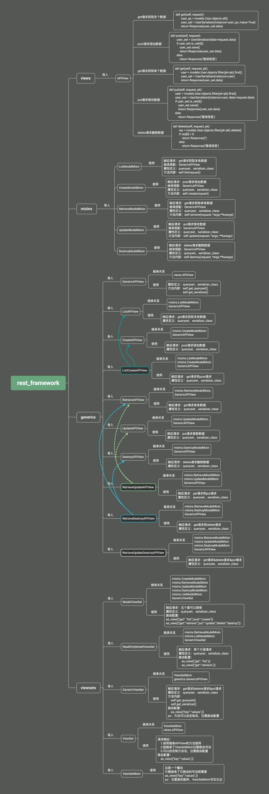

# 昨日回顾

```python
# 1 视图层视图基类之一 APIView
	-1 继承自 Django 的 View
    -2 以后 Request 就是新的 Request
    -3 在类中写跟请求方式同名的方法
    -4 基于序列化类和Response写接口
    
    
# 2 视图层视图基类之二 GenericAPIView
	-1 继承自 Django 的 APIView
    -2 在类中写还跟请求方式同名的方法
    -3 类属性
    	-queryset 数据源
        -serializer_class 序列化类
        	-通过重写 get_serializer_class 定制不同的[请求方式]或[action]使用不同的序列化类
        -lookup_field 默认不动,获取单条时,转换器转换出来的变量
    -4 方法
    	-get_queryset() # 获取数据源
        	-可以重写 返回过滤后的数据
        -get_serializer() # 得到序列化类对象
        -get_object() # 获取单条
    -5 基于序列化类和Response写接口

    
# 3 视图扩展类
	-1 5 个类
        -ListModelMixin
            -list
        -CreateModelMixin
            -create
        -DestroyModelMixin
            -destroy
        -UpdateModelMixin
            -update
        -RetrieveModelMixin
            -retrieve
    -2 必须配合 GenericAPIView + 跟请求方式同名的方法
    	-get
        -put
        -post
        ...
    -3 还需要在跟请求方式同名的方法中 写 return super.list()

# 4 9个视图子类
	-1 9个类
    	-ListAPIView = ListModelMixin + GenericAPIView
            -get
        -CreateAPIView
            -post
        -DestroyAPIView
            -delete
        -UpdateAPIView
            -put
        -RetrieveAPIView
            -get
            ...
	-2 写接口之一或多
    	-继承某个类[9个之一],写两个类属性接口

# 5 视图集之 ModelViewSet
	-1 继承它,写两个类属性,5个接口都有了
    	-路由写法变了
        	-映射方式
            -自动生成路由
        -可以重写类中某些方法

# 6 视图集之 ViewSetMixin -> 不是视图类 必须跟两个视图基类连用
	-1 继承它,路由写法变了
        	-映射方式
            -自动生成路由

# 7 视图集之 ReadOnlyModelViewSet
	-只有 get 和 get -> 查单条 查所有

# 8 视图集之 ViewSet 和 GenericViewSet
	-以后在视图类中就可以写任意的方法名

# 9 路由
	-1 自动生成路由
    	-只会生成
        	get - retrieve
            get - list
            post - create
            delete - destroy
            put - update
    -2 action装饰器
    	-methods: 多个请求方式
        -detail: 是否带 /id/
    -3 视图类的对象中
    	self.request
        self.action
```




#  今日内容

# 0 视图层源码分析

```python
# 1 APIView
	-1 路由urls.py上写 path('book/', BookView.as_view())
    -2 以后路由匹配成功 -> 就会执行 BookView.as_view()(request传入) -> 执行APIView的as_view方能股份
    -3 as_view方法 -> 本质在执行 self.dispatch(老request)
    	-dispatch内部实现了 请求方式跟视图类中方法映射
    -4 APIView重写了 dispatch
    def dispatch(self, request, *args, **kwargs):
        # 1 把老的request传入self.initialize_request，返回新的request
        request = self.initialize_request(request, *args, **kwargs)
        # 2 把新的request放入 self中，self是视图类的对象--于是》视图类中直接self.requset，拿到新的request
        self.request = request

        try: # 3 以后在里面出了异常，就不崩掉，会执行except
            # 4 执行了认证，频率和权限
            self.initial(request, *args, **kwargs)
            '''
            self.perform_authentication(request)
            self.check_permissions(request)
            self.check_throttles(request)
            '''
            # 5 #####开始####
            if request.method.lower() in self.http_method_names:
                ## 5.1 通过反射去视图类对象中，反射出跟请求方式同名的方法
                handler = getattr(self, request.method.lower(),
                                  self.http_method_not_allowed)
            else:
                # 如果请求方式不在列表中，就会返回方法不被允许
                handler = self.http_method_not_allowed
		   ## 5.2 执行get方法
            response = handler(request, *args, **kwargs)
		   # 5 #####结束####
        except Exception as exc:
            # 6 如果出了异常，执行handle_exception得到response，处理后，定制返回格式，前端能正常处理
            response = self.handle_exception(exc)

        self.response = self.finalize_response(request, response, *args, **kwargs)
        return self.response
    
######### 总结#######
	1 只要继承了APIView，request变成新的
    2 只要继承了APIView，视图类的对象中有 request -> self.requst
    3 只要继承了APIView,在执行视图类的方法之前，执行了认证，频率和权限
    4 只要继承了APIView,在认证，频率和权限或视图类的方法中出了异常，都会被异常捕获，统一处理self.handle_exception
    5 只要继承了APIView,以后都没有csrf认证了  csrf_exempt(view)
    	@csrf_exempt
        def index(requset):
            pass
        # 本质是 index=csrf_exempt(index)
```


# 1 认证

```python
# 1 三大认证依次执行 -> 执行视图类方法之前，会依次执行
	-认证类
    -权限类
    -频率类
    
# 2 APIView---->dispatch ->  self.initial(request, *args, **kwargs) -> 
    self.perform_authentication(request)  # 认证
    self.check_permissions(request)
    self.check_throttles(request)
```


```python
# 1 登录认证
# 2 作用：某个接口，必须登录后才能访问【认证过后才能访问】
# 3 前戏：
	写个登录接口 -> 用户表
	跟图书相关接口 -> 表
```

## 1.1 登录接口

```python
#### 登录接口###
'''
1 前端传入的数据：{username,password}
2 请求方式：post
3 后端视图类，继承谁？
    跟数据库打交道，但是不需要序列化或反序列化，不需要用序列化类校验
    继承APIView，还想自动生成路由 -> ViewSet
    
'''
from rest_framework.viewsets import ViewSet
from rest_framework.decorators import action
from .models import User,UserToken
import uuid
from rest_framework.response import Response
class UserView(ViewSet):
    @action(methods=['POST'],detail=False)
    def login(self,request):
        # 1 取出用户名密码
        username=request.data.get('username')
        password=request.data.get('password')
        # 2 校验
        user=User.objects.filter(username=username,password=password).first()
        # 3 返回给前端
        if user:
            # 生成一个随机字符串
            token_str=str(uuid.uuid4())  # asdf-asdfas-asdfas-asdfads
            # 保存到UserToken中 -> 如果之前没有数据，就是新增，如果之前有数据就修改
            # 根据当前用户，去UserToken表中查，如果查到，修改token，如果查不到，就新增
            '''
             Look up an object with the given kwargs, updating one with defaults
            if it exists, otherwise create a new one.
            '''
            UserToken.objects.update_or_create(user=user,defaults={'token':token_str})
            # 返回给前端登录成功
            return Response({'code': 100, 'msg': "登录成功",'token':token_str})
        else:
            #返回给前端用户名或密码错误
            return Response({'code':101,'msg':"用户名或密码错误"})
```


## 1.2 写几个book的接口（获取一条和新增一条）

```python
###  写几个book相关接口### 获取一条和新增一条
from .models import Book
from .serializer import BookSerializer
from rest_framework.generics import RetrieveAPIView,CreateAPIView
# 查询一条，根据id
class BookDetailView(RetrieveAPIView):
    queryset = Book.objects.all()
    serializer_class = BookSerializer

class BookView(CreateAPIView):
    queryset = Book.objects.all()
    serializer_class = BookSerializer
```


## 1.3 编写认证类

```python
from rest_framework.authentication import BaseAuthentication
from .models import UserToken
from rest_framework.exceptions import AuthenticationFailed
'''
    -1 写个类，继承BaseAuthentication
    -2 在类中重写 authenticate
        -在方法内，取出前端传入的token，校验用户是否登录
        -如果token正确，且是登录用户，返回两个之，继续往后走
        -如果token错误或数据库中没有数据，抛异常
    -3 使用：在视图类上配置或在配置文件中配置 -> 类似于之前学的请求和响应的配置
'''
class LoginAuthentication(BaseAuthentication):
    def authenticate(self, request):
        # 1 取出用户携带的token -> 统一要求放在请求头中
        token=request.META.get('HTTP_TOKEN')
        # 2 校验是否正确---UserToken表
        user_token=UserToken.objects.filter(token=token).first()
        if user_token: # 正常登录用户
            # return 当前登录用户,token  返回两个数据：后续在request中通过request.user 就会取出，返回的第一个参数：当前登录用户
            return user_token.user,token
        else:
            raise AuthenticationFailed('请您登录后操作')

```

**使用认证类**

```python
##### 1 方式一：在视图类中配置---局部使用
from .models import Book
from .serializer import BookSerializer
from rest_framework.generics import RetrieveAPIView,CreateAPIView
from .auth import LoginAuthentication
# 查询一条，根据id
class BookDetailView(RetrieveAPIView):
    queryset = Book.objects.all()
    serializer_class = BookSerializer

class BookView(CreateAPIView):
    authentication_classes = [LoginAuthentication] # 只要配置这个，以后这个类所有方法，都需要登录后才能执行
    queryset = Book.objects.all()
    serializer_class = BookSerializer
    
#### 2 方式二：全局配置
    REST_FRAMEWORK = {
        'DEFAULT_AUTHENTICATION_CLASSES': [
            'app01.auth.LoginAuthentication'
        ],
    }

###3 局部禁用
    authentication_classes = []
    
    
###### 查找顺序是：先从自己找，再去配置文件找，最后内置的#####
```


**注意**

```python
# 在settings中，导入一些不用的模块，可能会导致项目启动不了
# from app01.auth import LoginAuth
```


# 2 权限

```python
# 1 当前用户登录了，但是咱们系统分用户类型，不同用户权限不一样 
	-通过权限类来限制
    
    
# 2 用户登录，并且是超级用户才能 对图书进行新增
	-不是超级用户，不能新增
	
```

## 2.1 使用步骤

```python
# 1 写一个类，继承BasePermission
# 2 在类中，重写has_permission
# 3 在方法中完成，权限的校验
# 4 如果有权限，返回True
# 5 如果没有权限，返回False，通过  self.message  修改 错误提示
# 6 把权限类配置在视图类上 -> 视图类就会受权限类的控制
	-局部配置： permission_classes = [CommonPermission]
# 7 全局配置：配置文件
	'DEFAULT_PERMISSION_CLASSES': [
        'rest_framework.permissions.AllowAny',
    ],
# 8 局部禁用 -> 登录要局部禁用
	 permission_classes = []
```


```python
#### 权限类
from rest_framework.permissions import BasePermission
class SuperPermission(BasePermission):
    def has_permission(self, request, view):
        #1 校验用户权限 -> 拿到当前登录用户
        if request.user.user_type==3:
            return True
        else:
            self.message='您不是超级用户，不能操作，您是：【%s】用户'%request.user.get_user_type_display()
            return False
        
        
#### 局部使用
class BookView(CreateAPIView):
    permission_classes = [SuperPermission]
    
    
### 全局使用
REST_FRAMEWORK = {
    'DEFAULT_PERMISSION_CLASSES': [
        'app01.permission.SuperPermission',
    ],

}
### 局部禁用
class BookView(CreateAPIView):
    permission_classes = []
```

# 3 频率

```python
# 1 限制用户的访问频次
	- 限制条件是唯一的：ip地址，用户id，设备id号（移动端）
    
    
# 2 以ip地址，限制，同一个ip地址，一分钟只能请求三次

# 3 使用步骤：
    # 1 写一个类，继承SimpleRateThrottle
    # 2 在类中，重写get_cache_key
    # 3 方法返回什么，就以什么做频率限制
    # 4 把频率类配置在视图类上 -> 视图类就会受频率类的控制
        -局部配置： throttle_classes = [CommonThrottle]
    # 7 全局配置：配置文件
        DEFAULT_THROTTLE_CLASSES': ['咱们自己写的类'],
    # 8 局部禁用 -> 登录要局部禁用
         throttle_classes = []
```

```python
from rest_framework.throttling import SimpleRateThrottle
# 一分钟访问三次
class CommonThrottle(SimpleRateThrottle):
    rate = '3/m'  #  s   m   h   d
    def get_cache_key(self, request, view):
        # 返回ip，以ip做限制
        return request.META.get('REMOTE_ADDR')
        # 返回用户id-->必须登录
        # return request.user.id

        # 限制设备id号
        # return request.META.get('HTTP_设备id号')

        # 想按ip地址和接口限制
        # '192.168.1.11_list'
        # '192.168.1.11_create'

```

# 4 过滤-排序

```python
# 1 过滤和排序只针对于查询所有
```

## 4.1 排序

```python
# 1 使用方式，在继承GenericAPIView的视图类上配置
from rest_framework.filters import OrderingFilter
class BookView(GenericViewSet, ListModelMixin, RetrieveModelMixin, UpdateModelMixin):
    # http://127.0.0.1:8000/api/v1/books/?ordering=price
    # http://127.0.0.1:8000/api/v1/books/?ordering=-price  # 降序
    #http://127.0.0.1:8000/api/v1/books/?ordering=price,-id
    filter_backends = [OrderingFilter]  # 按价格排序
    ordering_fields = ['price','id']
```

## 4.2 过滤

```python
# 1 使用方式一：drf内置的,只能用search模糊匹配
class BookView(GenericViewSet, ListModelMixin, RetrieveModelMixin, UpdateModelMixin):
    # http://127.0.0.1:8000/api/v1/books/?ordering=price,-id&search=红  书名中带红的搜索出来
    filter_backends = [OrderingFilter,SearchFilter]
    ordering_fields = ['price','id']
    search_fields=['name']


# 2 使用方式二：第三方 django-filter
from django_filters.rest_framework.backends import DjangoFilterBackend
class BookView(GenericViewSet, ListModelMixin, RetrieveModelMixin, UpdateModelMixin):
    filter_backends = [OrderingFilter, DjangoFilterBackend]
    ordering_fields = ['price', 'id']
    filterset_fields = ['name','publish']
# http://127.0.0.1:8000/api/v1/app01/books/?name=红楼梦&publish=南京出版社


#3 使用方式一：自定义过滤类(有我们控制)


# 配置到视图类上
class BookView(GenericViewSet, ListModelMixin, RetrieveModelMixin, UpdateModelMixin):
    permission_classes = [CommonPermission]
    # http://127.0.0.1:8000/api/v1/books/?ordering=price,-id&price=20&name=红楼梦
    filter_backends = [OrderingFilter, CommonFilter]
    ordering_fields = ['price', 'id']
# 自定义过滤类
from rest_framework.filters import BaseFilterBackend
from django.db.models import Q
# 红楼梦的书 或者 价格为
class CommonFilter(BaseFilterBackend):
    def filter_queryset(self, request, queryset, view):
        name = request.query_params.get('name')
        price = request.query_params.get('price')
        if name and price:
            queryset = queryset.filter(Q(name__contains=name) | Q(price=price))
        elif name:
            queryset = queryset.filter(name__contains=name)
        elif price:
            queryset = queryset.filter(price=price)
        return queryset

```

**过滤和排序可以连起来使用****


# 5 分页

```python
# 1 分页只针对于查询所有
	-如果是app -> 下拉加载下一页
    -web端 -> 点击下一页
# 2 drf帮咱们提供了三种分页方式
# 3 使用步骤：
	1 定义一个类，继承三个分页类之一
    2 在分页类中，重写某些类属性
    3 在继承GenericAPIView的子类中，配置
    	pagination_class = CommonCursorPagination
```

```python
from rest_framework.pagination import LimitOffsetPagination, CursorPagination, PageNumberPagination


# 1 PageNumberPagination 基本分页，用的最多
class CommonPageNumberPagination(PageNumberPagination):
    '''
    http://api.example.org/accounts/?page=4
    http://api.example.org/accounts/?page=4&size=10
    '''
    page_size = 2  # 默认一页显示两条
    page_query_param = 'page'  # 查询条件
    page_size_query_param = 'size'  # 每页显示多少条的查询条件 size=10
    max_page_size = 5              # 虽然可以指定每页显示多少条，但是最多显示5条


class CommonLimitOffsetPagination(LimitOffsetPagination):
    """
       http://api.example.org/accounts/?limit=100
       http://api.example.org/accounts/?offset=400&limit=100
    """
    default_limit = 2 # 默认条数
    limit_query_param = 'limit' # limit的查询提交，显示多少条
    offset_query_param = 'offset' # 偏移量 -> 从第一条开始，偏移的位置
    max_limit = 5         # 最大显示条数


class CommonCursorPagination(CursorPagination):
    cursor_query_param = 'cursor'  # 查询条件
    page_size = 2                 # 每页显示 2 挑
    ordering = 'id'               # 按某个字段排序 -> 这个字段必须是表中得字段


```


# 作业

```python
        
##### 1 自定义过滤类通过 
# http://127.0.0.1:8000/api/v1/app01/books/?name=红&price_lt=100
# 名字中有红或价格小于100的，查出来       
# 通过Q查询


        
# ####2 今天讲的 认证，权限，频率分页，过滤排序分页 练习一下


##### 3 普通用户可以操作book的查所有和查单条，超级用户可以操作book的所有接口   -> view.action


----------------------------扩展作业-----
        
# 4继承APIView实现过滤排序


#5 继承BaseThrottle 写频率限制--比较难，先写其他的，写不出来没关系
	def allow_request(self, request, view):
        # 校验当前访问，超没超频率
        # 1 保存这个用户访问过的时间 {'192.168.1.11':[时间1，时间2，时间3]，'192.168.1.12':[时间1，时间2，时间3]}
        raise NotImplementedError('.allow_request() must be overridden')
```

