# 1 多版本解释器共存

## 1.1 打开系统环境变量

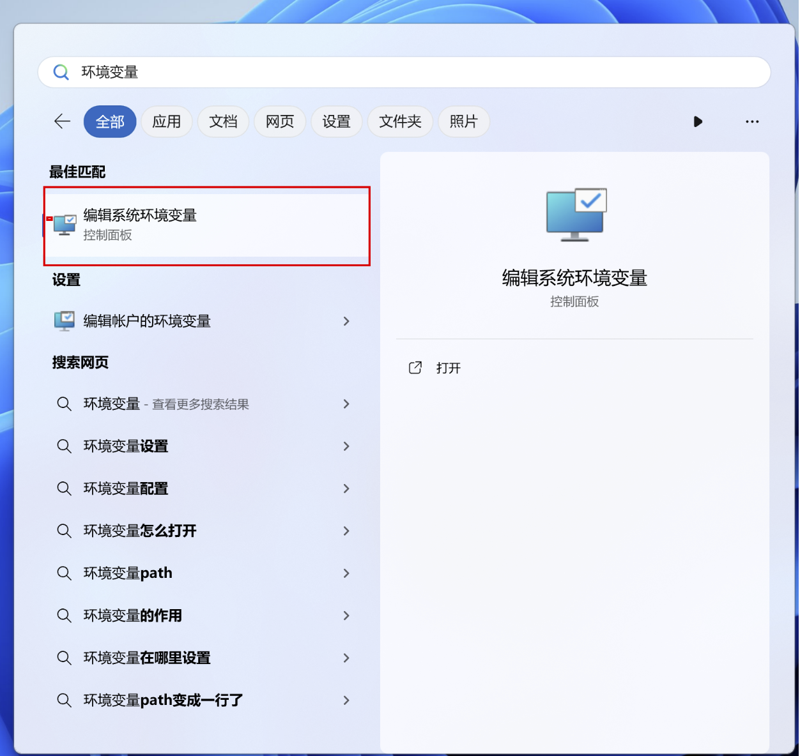

## 1.2 打开环境变量

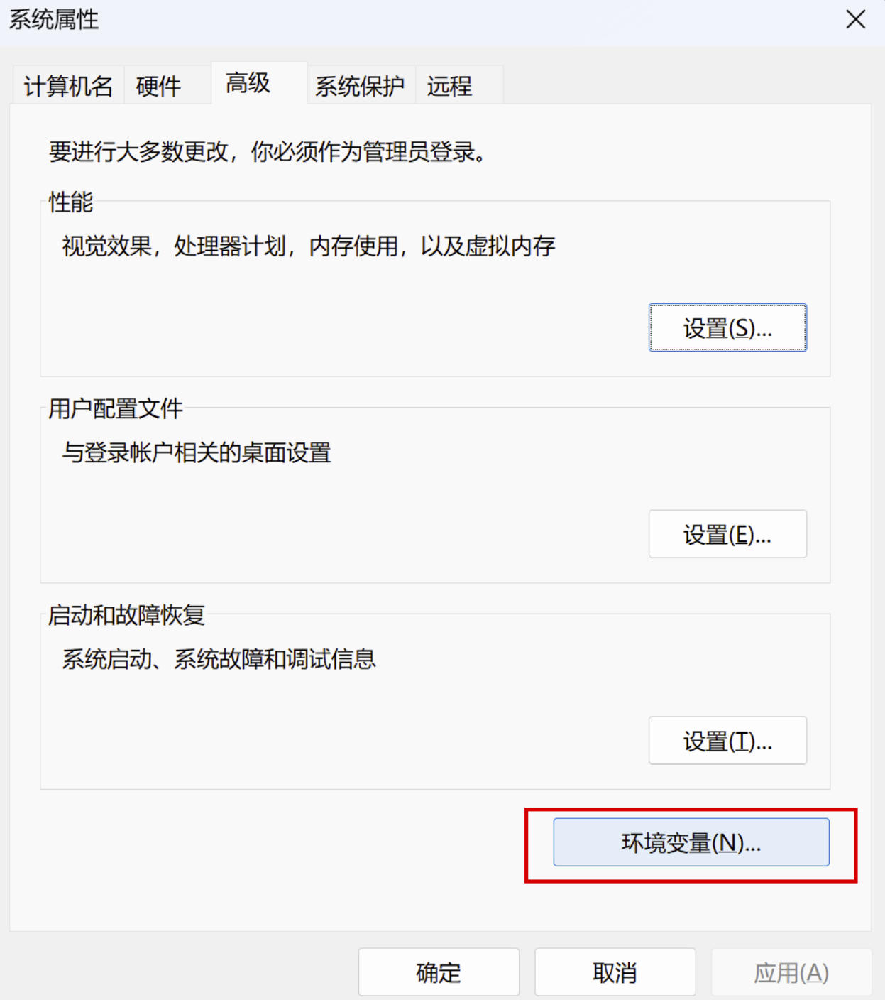

## 1.3 前言

- 一个系统中存在两个不同版本的Python解释器，如何分辨使用的是哪一个
- 现在想使用Python3.10解释器，但在终端执行cmd，输入python出来的是3.12

## 1.4 解决方案

- 复制当前 Python 安装目录下的 python.exe 程序 --->改个名字
- 把 python.exe 改成带版本号的名字
- 分别改为 python310.exe 和 python312.exe

## 1.5 默认Python解释器版本

- 在终端执行Python 出来的是 3.12 解释器 但想要出来的是 3.10
- 环境变量中 编辑 把 310 解释器放到 312 解释器前面


# 2 Python代码书写的三种方案

## 2.1 方案一：文本文件修改

- 先创建一个文本文件
- 然后在文本文件中书写Python代码
- 修改文件名和文件名后缀 .txt --> .py
- 打开终端 输入 Python + 文件路径 回车执行
- 就看到代码结果

## 2.2 方案二：直接在终端解释器中执行代码

- 打开终端 输入 python 回车 进入到终端环境
- 写Python代码

## 2.3 问题

- 文件写 Python代码 可以持久化存储代码 但是没有相关的提示 只能靠自己硬背硬记
- 终端解释器 执行Python代码 换行或者修改代码很不方便

## 2.4 第三方软件诞生

- 现在常用的 Pycharm 或者是 Vscode
- Pycharm是jetbrains 公司旗下的一款终端产品，专门为Python代码而诞生
- 里面集成了很多友好的操作


# 3 Pycharm软件安装

## 3.1 打开官网下载安装包

- 百度搜索Pycharm

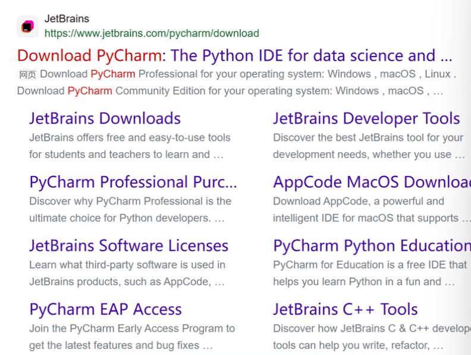

Day01已经搞定下载，得到的POINT

1. 不要下ARM64，与架构相关

2. 关于破解，因为是24年的版本，就在bilibili搜了24年的方法，可用到26年。

- 进入官网

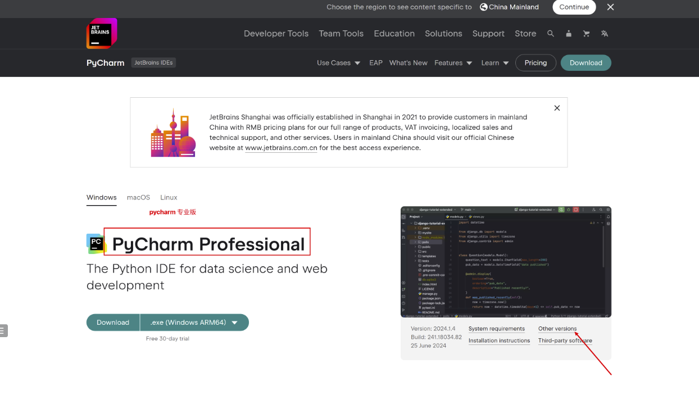

- 选择版本下载

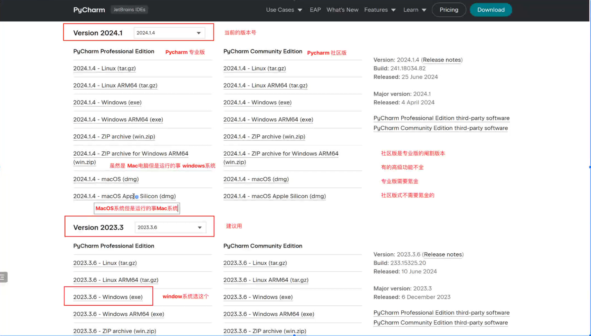

## 3.2 安装

- 启动安装器

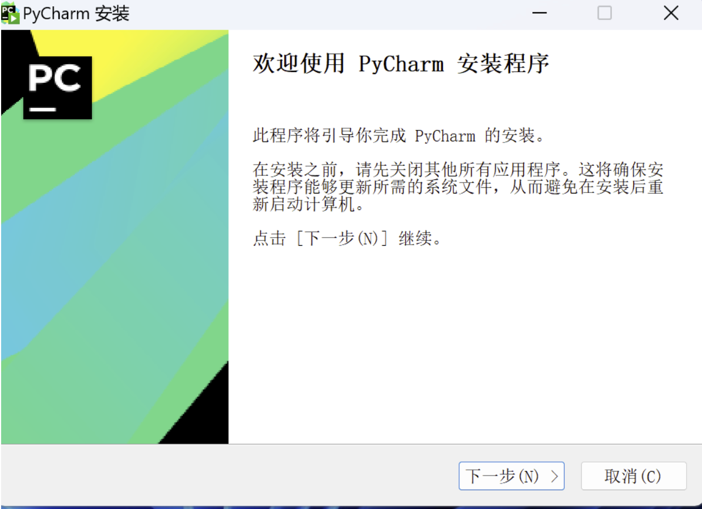

- 不建议安装在C盘
- 勾选全部

- 默认是jetbreains不要改
- 安装完成

## 3.3 破解

搞定了 不记录 26年应该也不用24版本的Pycharm噜


# 4 Python补充
## 4.1 PIP换源

1. 引入

   在使用Python时，我们经常需要用到pip安装第三方包。

   但是，在某些情况下，由于网络速度慢或者其他各种原因，pip install会非常慢，甚至可能无法完成。

   为了解决这个问题，我们提供以下几种方法：

2. 永久换源

   永久性地将 pip 源从国外的源切换到国内的源

   ```shell
   pip config set global.index-url https://pypi.tuna.tsinghua.edu.cn/simple/
   ```

   ```python
   清华大学：	    https://pypi.tuna.tsinghua.edu.cn/simple/
   阿 里 云：	   https://mirrors.aliyun.com/pypi/simple/
   豆    瓣：	    https://pypi.douban.com/simple/
   中 科 大：	   https://pypi.mirrors.ustc.edu.cn/simple/
   ```

   ```python
   # 查看当前镜像源
   pip config get global.index-url
   ```

3. 临时换源

   当前源可能无法加载到指定的模块 于是可以临时切换到其他的源

   ```python
   pip install 模块名 -i https://pypi.tuna.tsinghua.edu.cn/simple/ 
   ```

## 4.2 系统环境和虚拟环境介绍

1. 系统环境

   系统环境是指安装在计算机全局范围内的Python环境。

   当你在计算机上安装Python时，它会成为系统环境的一部分。

   在系统环境中安装的Pytho解释器和库对整个计算机可见，所有项目都可以访问它们。

2. 虚拟环境

   虚拟环境是一种在项目级别隔离Python依赖的方法。

   通过创建虚拟环境，你可以为每个项目设置独立的Python环境，从而解决全局安装可能导致的问题。

   虚拟环境可以包含自己的Python解释器和依赖库，与其他虚拟环境和系统环境隔离开。

3. 开发项目

   有一个项目使用的是 Python 310 版本的解释器 但是使用的Django版本是 3.12

   有一个项目使用的是 Python 310 版本的解释器 但是使用的Django版本是 5.0

   于是为了给每个项目产生于一个独立的隔离解释器环境就有了虚拟环境

## 4.3 创建虚拟环境的三种方式

1. venv

   1. 介绍

      Python自带的虚拟环境工具，适用于Python3.3及以上版本。

   2. 使用

      打开命令行终端

      导航到项目所在的目录

      运行以下命令创建虚拟环境

      ```shell
      python -m venv 虚拟环境名字
      ```

      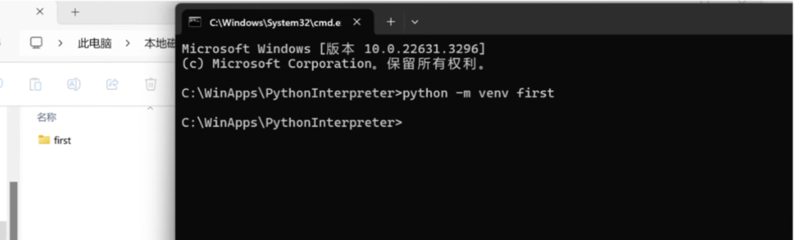

      进入到虚拟环境，在创建的虚拟环境的文件夹中 有一个Scripts文件夹 进入到当前文件夹执行 active

      退出虚拟环境 deactivate

2. virtualenv

   ```python
   pip install virtualenv
   ```

   增加模块，使虚拟环境在win上更好用

   virtualenvwrapper-win是一个增强模块，使得在Windows上使用虚拟环境更方便。

   使用以下命令安装virtualenvwrapper-win：

   ```python
   pip install virtualenvwrapper-win
   ```

   配置参数：打开系统环境变量添加一个变量名和变量值

   - WORKON_HOME

   找到Python3的安装目录，然后进入Scripts文件夹，双击运行virtualenvwrapper.bat文件

   例如E:\Python310\Scripts

   通过运行该脚本，可以同步配置Virtualenvi的使用环境和命令。

   创建虚拟环境

   ```shell
   mkvirtualenv 虚拟环境名称
   mkvirtualenv second
   ```

# 5 Pycharm补充

- 进入主页

  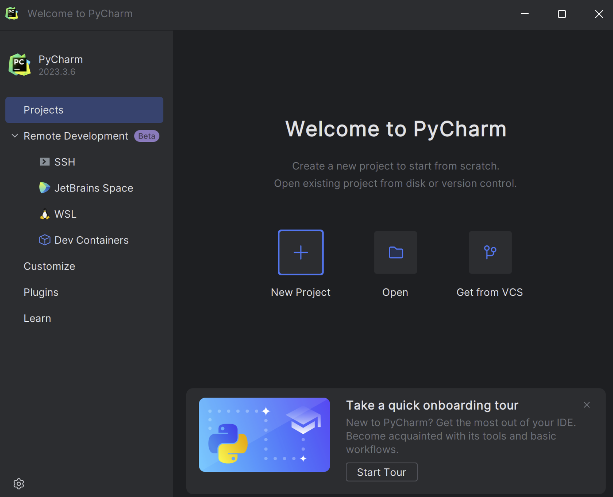

- 设置参数

  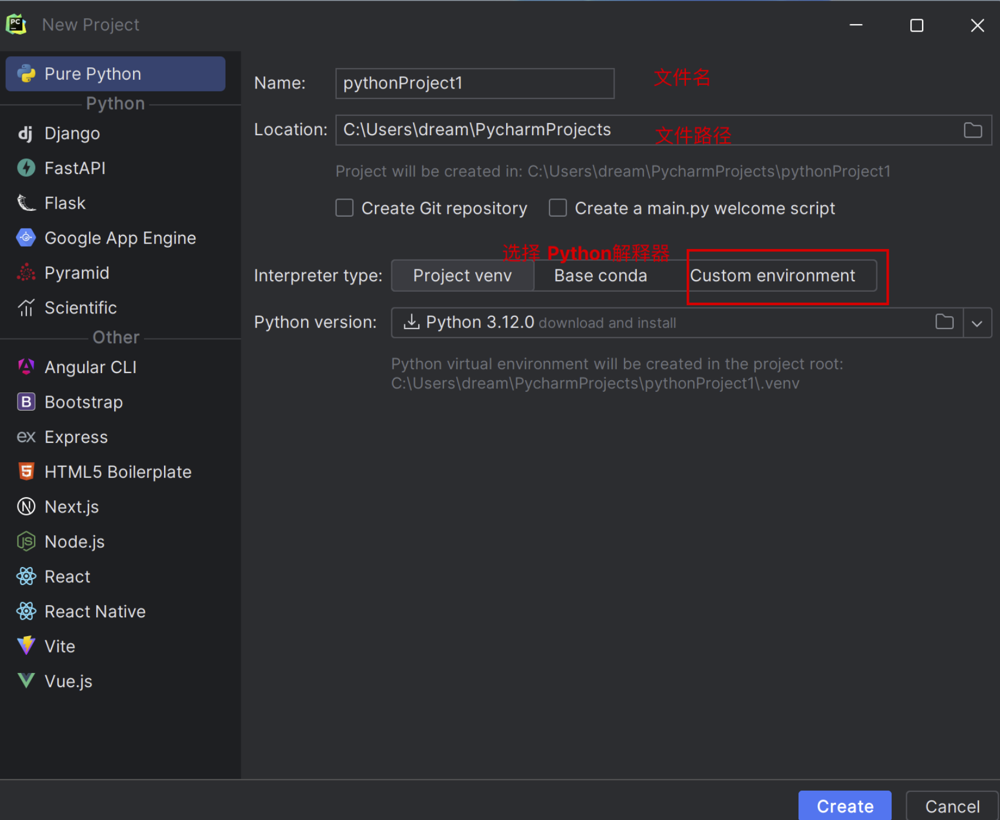

  Pure Python

  选择Custom environment

- 虚拟解释器

  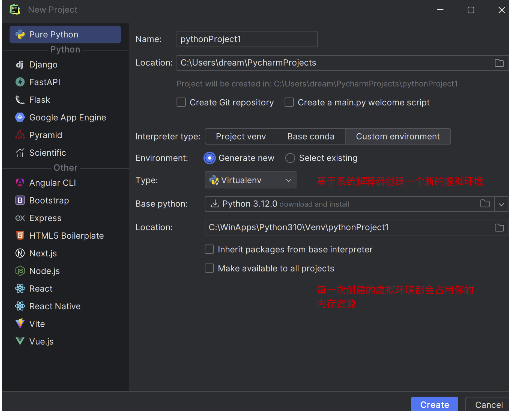

- 系统解释器

  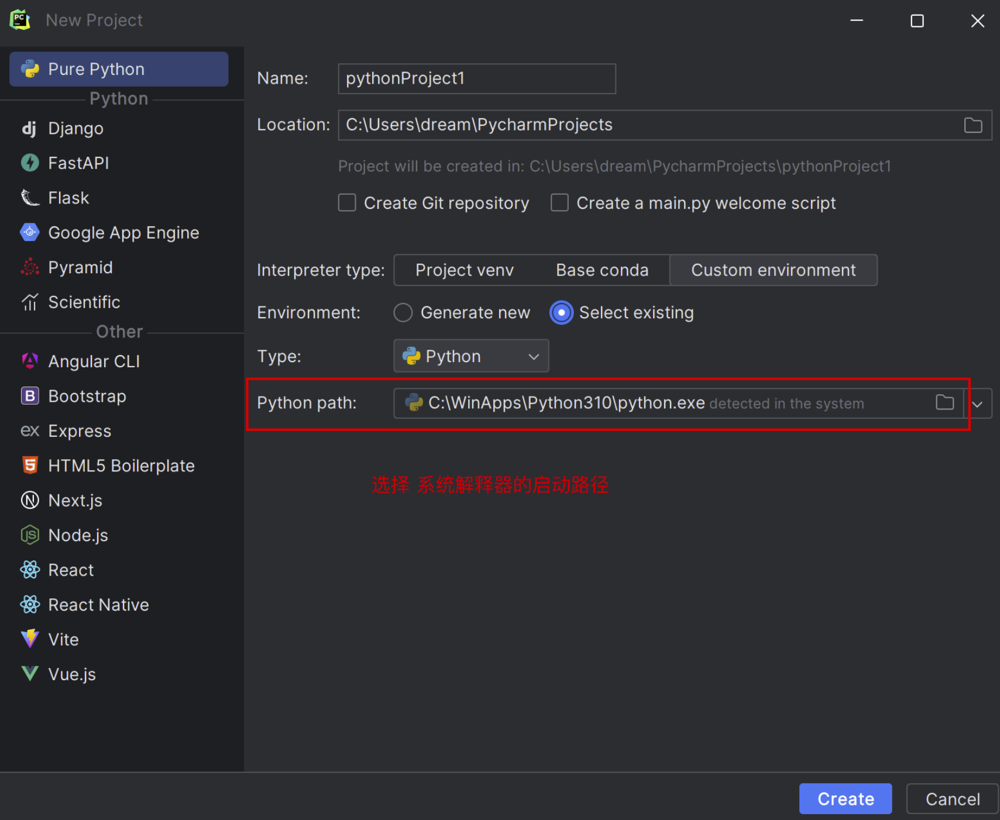

  Select existing 选择Python.exe

  点击Create PythonProject

- 创建成功

  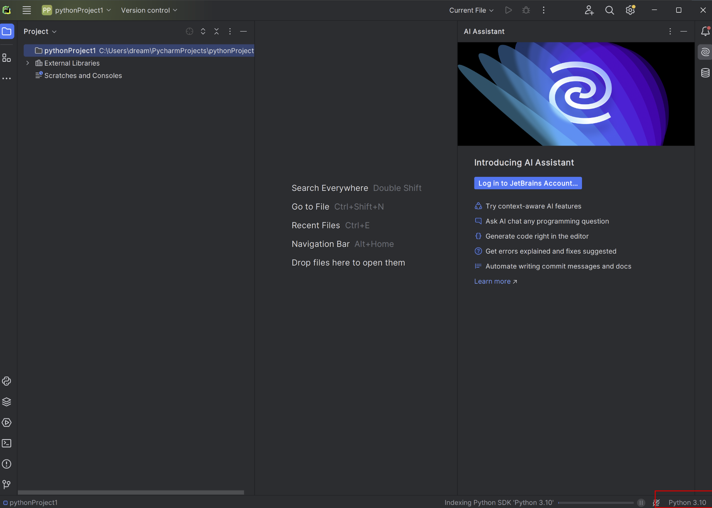

- 创建Python文件

  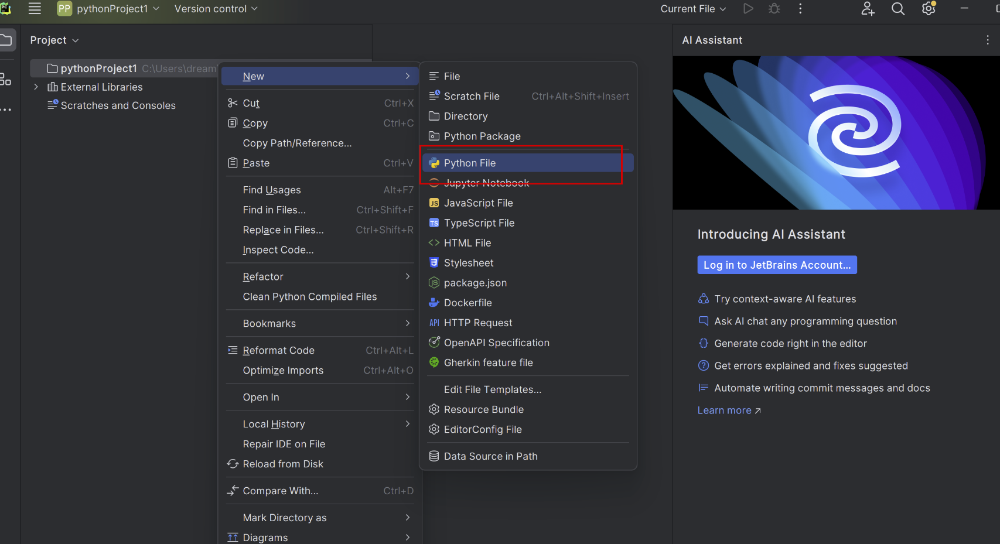

- 书写代码和执行代码

  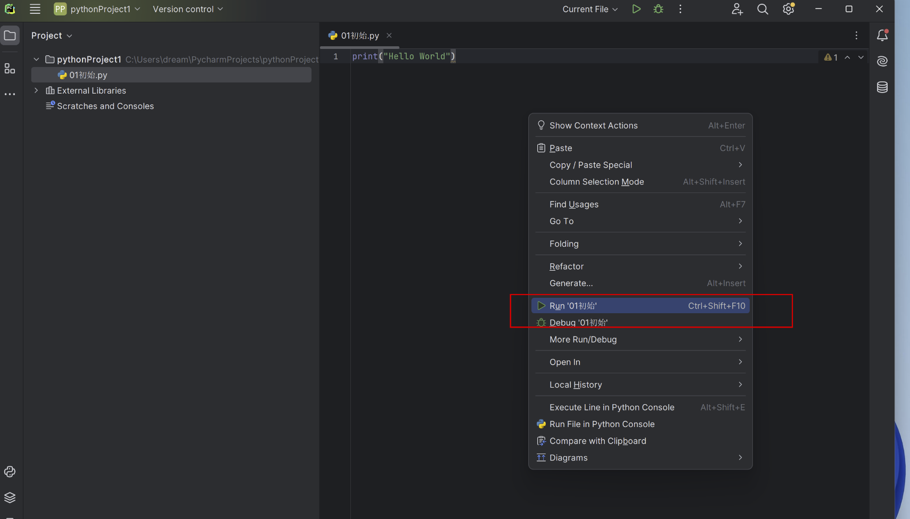

## 5.1 快捷键

- Ctrl + /：行注释/取消行注释
- Ctrl + Alt + L：代码格式化
- Tab / Shift + Tab：缩进、不缩进当前行
- Ctrl + X / Shift + Delete：剪切当前行或选定的代码块到剪贴板
- Ctrl + C / Ctrl + Insert：复制当前行或选定的代码块到剪贴板
- Ctrl + V / Shift + Insert：从剪贴板粘贴
- Ctrl + B / Ctrl + Click：跳转到声明
- Ctrl + 鼠标左键：悬浮/单击鼠标左键，显示简介/进入代码定义
- Ctrl + D：复制选定的区域或行

```python
● Alt + #[0-9]：打开相应的工具窗口
● Ctrl + Alt + Y：同步
● Ctrl + Shift + F12：最大化编辑开关
● Alt + Shift + F：添加到最喜欢
● Alt + Shift + I：根据配置检查当前文件 正在为您搜索：继续
● Ctrl + Alt + S：打开设置对话框
● Ctrl + Shift + A：查找动作
● Ctrl + Tab：在窗口间进行切换
● Alt + Insert：生成代码
● Ctrl + /：注释（// 或者 /.../ ）
● Ctrl + Shift + /：添加/删除快注释（/**...*/）
● Ctrl + W：递进式取消选择代码块
● Ctrl + Shift + W：递进式选择代码块
● Alt + Q：精确定位到光标所在的代码块，然后再次按返回先前的位置
● Ctrl + Shift + ]/[：选中当前代码块的闭合部分，比如一对大括号中的所有内容
● Ctrl + F4：关闭当前编辑页签
● Ctrl + Shift + U：转换选中的文本（大写、小写、切换大小写）
                    
【1】基本编辑快捷键
● Ctrl + Space：基本的代码完成（类、方法、属性）
● Ctrl + Alt + Space：快速导入任意类
● Ctrl + Shift + Enter：语句完成
● Ctrl + P：参数信息（在方法中调用参数）
● Ctrl + Q：快速查看文档
● F1：外部文档
● Shift + F1：外部文档，进入web文档主页
● Ctrl + Shift + Z 或者 Ctrl + Y：撤销上一步操作 / 重做
● Ctrl + 鼠标左键：悬浮/单击鼠标左键，显示简介/进入代码定义
● Ctrl + F1：显示错误描述或警告信息
● Alt + Insert：自动生成代码
● Ctrl + O：重新方法
● Ctrl + Alt + T：选中
● Ctrl + /：行注释/取消行注释
● Ctrl + Shift + /：块注释
● Ctrl + W：选中增加的代码块
● Ctrl + Shift + W：回到之前状态
● Alt + Enter：快速修正
● Ctrl + Alt + L：代码格式化
● Ctrl + Alt + O：优化导入
● Ctrl + Alt + I：自动缩进
● Tab / Shift + Tab：缩进、不缩进当前行
● Ctrl+X/Shift+Delete：剪切当前行或选定的代码块到剪贴板
● Ctrl+C/Ctrl+Insert：复制当前行或选定的代码块到剪贴板
● Ctrl+V/Shift+Insert：从剪贴板粘贴
● Ctrl + Shift + V：从最近的缓冲区粘贴
● Ctrl + D：复制选定的区域或行
● Ctrl + Y：删除选定的行
● Ctrl + Shift + J：添加智能线
● Ctrl + Enter：智能线切割
● Shift + Enter：另起一行
● Ctrl + Shift + U：在选定的区域或代码块间切换
● Ctrl + Delete：删除到字符结束
● Ctrl + Backspace：删除到字符开始
● Ctrl + Numpad+/-：展开/折叠代码块（当前位置的：函数，注释等）
● Ctrl + shift + Numpad+/-：展开/折叠所有代码块
● Ctrl + F4：关闭运行的选项卡
                    
【2】查找/替换快捷键
● F3：下一个
● Shift + F3：前一个
● Ctrl + R：替换
● Ctrl + Shift + F 或者连续2次敲击shift：全局查找{可以在整个项目中查找某个字符串什么的，如查找某个函数名字符串看之前是怎么使用这个函数的}
● Ctrl + Shift + R：全局替换
                    
【3】运行快捷键
● Alt + Shift + F10：运行模式配置
● Alt + Shift + F9：调试模式配置
● Shift + F10：运行
● Shift + F9：调试
● Ctrl + Shift + F10：运行编辑器配置
● Ctrl + Alt + R：运行manage.py任务
                    
【4】调试快捷键
● F8：跳过
● F7：进入
● Shift + F8：退出
● Alt + F9：运行游标
● Alt + F8：验证表达式
● Ctrl + Alt + F8：快速验证表达式
● F9：恢复程序
● Ctrl + F8：断点开关
● Ctrl + Shift + F8：查看断点
                    
【5】导航快捷键
● Ctrl + N：跳转到类
● Ctrl + Shift + N：跳转到符号
● Alt + Right/Left：跳转到下一个、前一个编辑的选项卡（代码文件）
● Alt + Up/Down：跳转到上一个、下一个方法
● F12：回到先前的工具窗口
● Esc：从工具窗口回到编辑窗口
● Shift + Esc：隐藏运行的、最近运行的窗口
● Ctrl + Shift + F4：关闭主动运行的选项卡
● Ctrl + G：查看当前行号、字符号
● Ctrl + E：当前文件弹出，打开最近使用的文件列表
● Ctrl+Alt+Left/Right：后退、前进
● Ctrl+Shift+Backspace：导航到最近编辑区域 {差不多就是返回上次编辑的位置}
● Alt + F1：查找当前文件或标识
● Ctrl + B / Ctrl + Click：跳转到声明
● Ctrl + Alt + B：跳转到实现
● Ctrl + Shift + I：查看快速定义
● Ctrl + Shift + B：跳转到类型声明
● Ctrl + U：跳转到父方法、父类
● Ctrl + ]/[：跳转到代码块结束、开始
● Ctrl + F12：弹出文件结构
● Ctrl + H：类型层次结构
● Ctrl + Shift + H：方法层次结构
● Ctrl + Alt + H：调用层次结构
● F2 / Shift + F2：下一条、前一条高亮的错误
● F4 / Ctrl + Enter：编辑资源、查看资源
● Alt + Home：显示导航条
● F11：书签开关
● Ctrl + Shift + F11：书签助记开关
● Ctrl + #[0-9]：跳转到标识的书签
● Shift + F11：显示书签
            
【6】搜索相关快捷键
● Alt + F7 / Ctrl + F7：文件中查询用法
● Ctrl + Shift + F7：文件中用法高亮显示
● Ctrl + Alt + F7：显示用法
            
【7】重构快捷键
● F5：复制
● F6：剪切
● Alt + Delete：安全删除
● Shift + F6：重命名
● Ctrl + F6：更改签名
● Ctrl + Alt + N：内联
● Ctrl + Alt + M：提取方法
● Ctrl + Alt + V：提取属性
● Ctrl + Alt + F：提取字段
● Ctrl + Alt + C：提取常量
● Ctrl + Alt + P：提取参数
```

## 5.2 汉化、插件、UI

File -- Settings -- plugins -- Chinese

Plugins -- Atom Material icons 插件 美化图标

File -- Setting -- new UI 切换UI风格 

# 6 注释

```python
# 【一】注释
# 【1】 什么是注释？
# 注释就是对代码的解释和说明，注释的内容不会被作为代码执行
# 在学习的过程中多加注释

# 【2】 如何进行注释
# 单行注释
# 语法： # + 注释内容

# 多行注释
# 三个双引号或者三个单引号 回车 但不要嵌套自己
'''
这是多行注释
'''

"""
这是多行注释
"""
```

# 7 常量和变量

# 7.1 什么是变量

```python
# ● 变量是用于存储数据值的标识符，可以通过变量名访问和操作这些数据。
#   ○ 在程序中，变量就像一个容器，用于存储和管理数据
# ● 变量就是可以变化的量，量指的是事物的状态
#   ○ 比如人的年龄、性别， 游戏角色的等级、金钱等等
```

## 7.2 为什么要有变量

```python
# ● 变量的存在使得程序能够更灵活地处理数据，而不是每次都硬编码数据值。
# ● 通过使用变量，程序可以在运行时根据需要存储和修改数据，从而实现动态的状态和行为。
# ● 为了让计算机能够像人一样去记忆事物的某种状态，并且状态是可以发生变化的
# ● 变量在程序中扮演着存储和传递信息的角色
#   ○ 程序执行的本质就是一系列状态的变化，变是程序执行的直接体现
#   ○ 所以我们需要有一种机制能够反映或者说是保存下来程序执行时状态，以及状态的变化

# res = 1       1
# res = 1 + 1   2
```

## 7.3 变量的定义与调用

```python
# 三部分组成
# 变量名 赋值符号 变量值
name = 'dream' # 将 dream 这个值赋值给ame
age = 18

# 内部原理：在内存中开辟一块内存空间 让这个空间存储 dream 这个值
# 然后用 name 去指向这个 空间地址

name = 'hope'
print(name)
```

## 7.4 变量的命名风格

```python
# (1)变量名可以是 字母（大小写）+ 数字 + 下划线_ 的任意组合
user_name1 = 'dream'
_username = 'dream'
user01_name = 'dream'
name_user = 'dream'

# (2)数字不能作为变量名的开头
# 01_name = 'dream'

# (3)关键字不能作为变量名的开头
# if def
```

## 7.5 变量名的命名风格

```python
# (1)驼峰体
# 大驼峰 每个单词首字母大写
UserName = 'dream'
# 小驼峰 第一个单词首字母小写 其他单词首字母大写
userName = 'dream'
# (2)纯小写+下划线
user_name = 'dream'
```

## 7.6 变量的三大特性

```python
username = 'dream'
age = 18
# 变量内存地址 : 每一次运行代码的时候都会重新开辟内存空间 存储变量值
print(id(username))
# 变量类型 : 知道某个变量类型，通过type
print(type(username))
print(type(age))
# 变量值 ： 直接打印变量名就能看到变量值
print(username)
```

## 7.7 常量

```python
# 【三】常量
# 【1】什么是常量
# 常量就是指程序运行过程中值不会发生改变的值
# 【2】定义常量
# 常量的定义与变量类似，只是常量值不能被改变
# 用全大写的字母来代表常量

# 在Python中的常量被定义以后是可以改变的，但是我们都遵循不变的规则
# 在其他语言java go 定义后是不允许修改的

PORT = 3306
print(PORT)
PORT = 9936
print(PORT)

# 这怎么就是常量了？
# --python中没有使用语法强制定义常量，也就是说，python中定义常量本质上就是变量。如果非要定义常量，变量名必须全大写

# 纯大写
# PEP8 Style Guide for Python 官方提供的命名规范
```

[Python注释补充之PE8规范 - Chimengmeng - 博客园 (cnblogs.com)](https://www.cnblogs.com/dream-ze/p/17401922.html)

# 8 基本数据类型

## 8.1 基本数据类型引入

```python
# 【1】学习变量的目的
# ● 学习变量有助于我们在程序中存储和操作数据，提高代码的灵活性和可维护性。
# ● 通过使用变量，我们可以方便地引用和修改数据，使得程序能够动态地响应不同的输入和条件。
# 【2】学习基本数据类型的目的
# ● 学习基本数据类型有助于我们理解不同类型的数据在计算机中的表示和操作方式。
# ● 不同的数据类型适用于不同的场景，了解它们的特性有助于我们编写更加高效和健壮的代码。
# 【3】基本数据类型介绍
# 数字类型
#  整数类型(int)
#  浮点类型(float)
# 字符串类型(str)
# 列表类型(list)
# 字典类型(dict)
# 布尔类型(bool)
# 元组类型(tuple)
# 集合类型(set)
```

# 8.2 数字类型

```python
# 整数或者浮点数(小数)
# 【1】整数类型
# 整数类型用于表示整数，是一种基本的数字类型，广泛用于表示计数、索引等整数值。
# 语法：变量名=整数值
age = 18 # integer
print(type(age)) # <class 'int'>
# 语法：做算数运算
print(1 + 1)
print(2 > 1)

# 【2】浮点数类型
# 浮点类型用于表示带有小数部分的数值，适用于需要更精确表示的情况。
# 语法：变量名 = 浮点数值（小数值）
salary = 100.23
print(type(salary)) # <class 'float'>
```

# 8.3 字符串类型

```python
# 字符串类型用于表示文本信息，是一种非常重要的数据类型，用于处理文字、字符等信息
name = 'sheenagh'
print(type(name))  # string
# 语法：
# 1.单引号包裹起来的字符
# 2.双引号包裹起来的字符
# 3.三个单引号包裹起来的字符
# 4.三个双引号包裹起来的字符
name_1 = 'dream'
print(name_1, type(name_1))
name_2 = "dream2"
print(name_2, type(name_2))
name_3 = '''dream3'''
print(name_3, type(name_3))
name_4 = """dream4"""
print(name_4, type(name_4))

# 引号嵌套
name_5 = "My name is 'dream', i hope your life is wonderful"
print(name_5, type(name_5))
# 单引号里包双引号，双引号里包单引号，不然单引号里用单引号，就会被切割开来，语法错误

name_6 = '''
1
2
3
4
'''
print(name_6, type(name_6))

# 补充：字符串的使用方法
# 数字进行乘法 ---> 数字相乘得到乘法的结果
print(2*2)
# 字符串*数字 ---> 当前字符串被重复出现指定次数
print("d"*5)

# 数字进行加法 ---> 得到加法的结果
print(1+1)
# 字符串进行加法 ---> 类型要一致，将两个字符串拼接到一起
print("d"+'1')

# 索引取值
# 正向索引取值，索引下标从0开始
# dream
# d r e a m
# 0 1 2 3 4
print('dream'[0])
print('dream'[1])
# 负向索引取值，索引下标从-1开始
# d r e a m
# -5 -4 -3 -2 -1
print('dream'[-1])

# 字符串的格式化输出语法
sentence_one = "My name is dream, my age is 18"
sentence_two = "My name is hope, my age is 28"
sentence_three = "My name is jack, my age is 38"
# 不断地修改同一块代码 为了方便于是就有了格式化输出语法
# (1)%站位
sentence_four = "My name is %s, my age is %s"
print(sentence_four % ('dream', 22))
print(sentence_four % ('hope', 18))
# %s 字符串
# %d 整数
# %f 浮点数
# %x 十六进制整数

# (2)format方法输出：用 {} 站位
sentence = "My name is {}, my age is {}"
print(sentence.format('dream', 18))
# format 按照 {} 位置传参数的时候如果位置替换就会导致替换错乱
print(sentence.format(18, 'dream'))

# 可以用关键字占据指定位置 {name} 站位，传递参数的时候要按照关键字传参数
sentence = "My name is {name}, my age is {age}"
# 在上面定义字符串的时候用 {变量名} 占位置在传递参数的时候按照关键字=值的方式传入参数
print(sentence.format(age="18", name='dream'))

# (3) 方案三：f"{name}"
name = "dream"
age = "18"
sentence = f"My name is {name}, my age is {age}"
print(sentence)
```

# 8.4 列表类型

```python
# 当我们想存储多个人的名字的时候
user_name = "dream  | hope "
# 不好取
# 用来存取多个相同属性的值，并且方便存取
# 如果我们需要用一个变量记录多个学生的姓名，用数字类型是无法实现，字符串类
user_names = ['dream', 'hope', 'opp']

# 取出dream
# 索引取值
# 正向索引从0开始
print(user_names[0])
# 正向索引从-1从最后开始
print(user_names[-3])

data_info = ['dream', 'hope', 'opp', [
    18, 19, 20, [
        'music', 'run', 'swim'
    ]
]]

# 打印 my name is name, my age is age, my hobby is hobby
print(f"my name is {data_info[0]}, my age is {data_info[3][0]}, my hobby is {data_info[3][3][0]}")
print(f"my name is {data_info[1]}, my age is {data_info[3][1]}, my hobby is {data_info[3][3][1]}")
print(f"my name is {data_info[2]}, my age is {data_info[3][2]}, my hobby is {data_info[3][3][2]}")
```

# 8.5 字典类型

```python
# 列表中可以存储多个属性类型相同的值
# 存储多个人的名字，年龄

# 当年龄和名字混到一起的时候，就分不清谁是年龄谁是名字
name = 'dream'
age = 18

# ● 如果我们需要用一个变量记录多个值，但多个值是不同属性的
#   比如人的姓名、年龄、身高，用列表可以存，但列表是用索引对应值的，
# ● 这就用到字典类型，字典类型是用key:value形式来存储数据
#   其中key可以对value有描述性的功能，能明确的描述详细信息

# 语法：{"key":"value"}

person_info ={
    "name": "dream",
    "age": 18,
    "gender": "male"
}

# 存储数据是为了取数据去用
# 方式一：字典["key"]
print(person_info["name"])
print(person_info["age"])

# 方式二：字典.get("key")
print(person_info.get("gender"))

# 方法一 如果字典中没有指定的键就会报错
# print(person_info["hobby"])
# 方式二 如果字典中没有指定的键不会报错
print(person_info.get("hobby"))

# 列表和字典 组合嵌套
info = {
    'name': 'Dream',
    'addr':{
        '国家':'中国',
        'info': [666, 999, {'hobby':['read', 'study', 'swim']}]
    }
}

# 格式化输出: my name is x,my x is x
# hobby: my hobby is read,study and swim
```


## 作业

```python
# 列表和字典 ---> 组合嵌套
info = {
    'name': 'Dream',
    'addr': {
        '国家': '中国',
        'info': [666, 999, {'编号': 466722, 'hobby': ['read', 'study', 'music']}]
    }
}
# 格式化输出：my name is name , my age is age , my 国家 is 国家 , my 编号 is 编号
# hobby : my hobby is read , study and music

# print(f"试一试字典用key名{info['name']}和试一试字典用位置{info[0]}")
# 所以 字典 这种有 key的 就要用key去指定；像列表那种 有数字顺序的 用数字去指定。两者可以互相嵌套，但取值时必须遵从规则。

#自己做的结果：
print(f"My name is {info['name']}, my 国家 is {info['addr']['国家']} , my 编号 is {info['addr']['info'][2]['编号']}")
print(f"My hobby is {info['addr']['info'][2]['hobby'][0]}, {info['addr']['info'][2]['hobby'][1]} and {info['addr']['info'][2]['hobby'][2]}.")
```


TASK：

1. 顺一遍课√、笔记√、代码√

2. venv/virtualenv/virtualenvwrapper-win 不懂 研究下√

   主要是不理解为什么会有这样&为什么要这样做：

   --因为项目采用不同版本的python，所依赖的库的版本也不一样，为了避免版本冲突，为每一个项目每个python版本创建一个虚拟环境，环境中所使用的依赖库也是独立存在，不会被其他版本或其他项目的库影响。

   --这三个就是虚拟化模块 可以提供虚拟环境 只是有一些差异 但使用原理步骤大同小异

3. 快捷键挨个试试 挑一些记住 后面有碰到但不会用的查询一下√

4. 课后题√