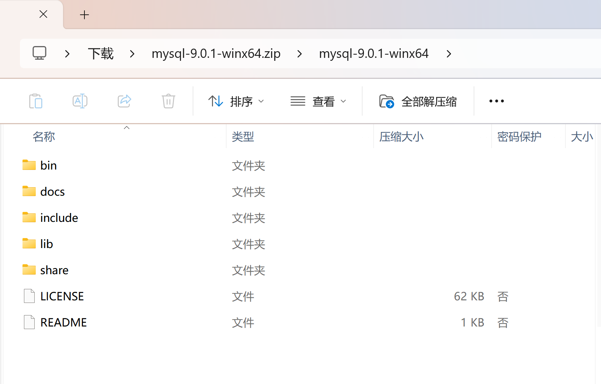
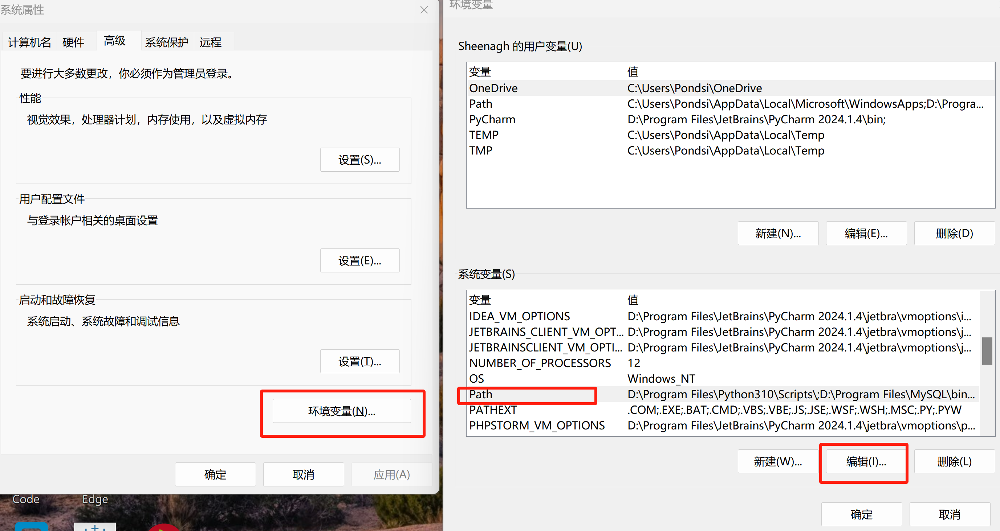
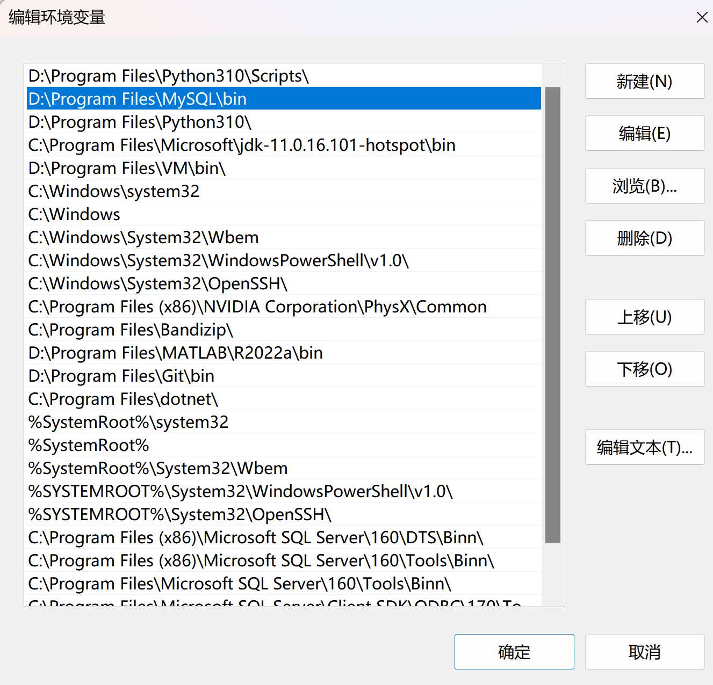
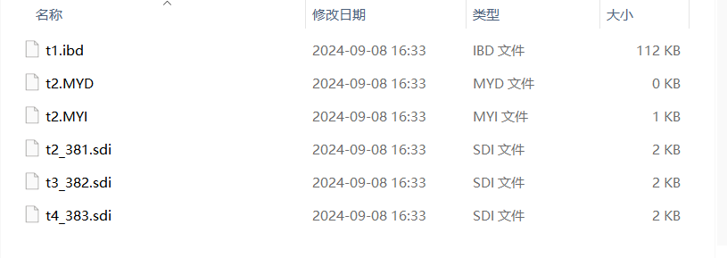

# 1 数据库初识

```python
# 【一】存储数据的演变过程
# 1.最开始：基于内存来存 - 列表 + 字典
# 2.文件：基于文件存储数据 - txt 文本文档
# 基于json文件存储数据 - 以字典形式将数据存储到json文件中
# 3.分层开发：基于数据库理论将项目划分成多个部分 - 用文件夹来代表数据库 用json
# 4.网络编程(TCP协议)：基于客户端和服务端进行数据的传递 - 文件上传下载器
# 5.并发编程 + 网络编程：实现了多人可以操作同一个服务端的操作

# 由最开始的单机 - 变成最后的互联网

# 【二】数据库的本质
# 数据库其实就是一个基于网络通信的应用程序
# 作用就是在服务端能够存储数据。客户端可以查看

# 【三】数据库介绍
# 1.关系型数据库
# MySQL、Oracle、SQL Server、DB2、SQLite、PostgreSQL
# 彼此之间有关联关系(在同一个数据库下)
# 存储数据的表现形式是以表结构来存储数据
# 每个字段(表头)会限制每个字段下的存储数据的格式
# 关系型数据库支持复杂的操作 增删改查

# 2.非关系型数据库
# Redis、MongoDB、HBase Memcached
# 存储数据格式通常以 **键值对** 来存储数据
# 非关系型数据通常都是基于内存工作的，读取数据很快，一旦数据库关闭重启数据库就会丢失
# 非关系型数据库不支持复杂的操作 增删改查

# 3.哪个数据库更好一旦
# 相互结合
# 当有需要持久性存储数据的时候就将数据存储关系型数据库中
# 将频繁需要查看的数据存储到非关系型数据中(就做查看的数据缓存)

# 4.数据库的应用场景
# 公司需求：抢票工具
# 需要知道有哪些票可以买
# 票的数据存储在哪
# (1)放到文件中
# 每一个人用就去文件中读 - 用户量太高 读取速度会变慢
# (2)自己写一个TCP客户端
# 将数据存储在服务端上面 - 每一个人用客户端去查数据
# 自己公司有一套查询语句 另一个公司有另一套查询语句 不共通
# (3)大家约定好用同一个写好的数据库
# 并且约定大家都使用同一套语句去操作数据库

# 总 - 分 - 总
```


# 2 SQL语句初识

```
# 【一】SQL语句的由来
# 1.socket通信
# 所有的网络通信都是基于socket
# socket介于应用层和传输层之间的抽象层
# 服务端：负责接收消息处理消息
# 客户端：负责发送消息提交请求

# 2.SQL语句的由来
# 于是大家都基于 socket 通信 去写自己公司的数据库
# 操作服务端的语句都是自己公司写的 - 别人想要操作你的数据库就必须学习你们公司规定的语句

# 后来大家就约定俗成 我们使用一套通用语句来操作数据库
# SQL语句就出生了
# SQL语句是操作关系型数据库的通用语句

# 3.NoSQL语句
# NoSQL语句操作非关系型数据库的通用语句

# 【二】库/表/记录/表头/表单
# 1.库 database
# 指在数据库管理系统重存储和组织数据的容器
# 文件夹
# 2.表 table
# 表是数据库中的一个基本组成单位 用于存储和展示数据
# excel表
# 3.记录 record
# 记录也被成为行，是表中的一个数据项
# 在表中的一行数据
# 4.标题 header
# 表中的第一行数据 通常用于描述每个字段的含义和名称
# excel表中的第一行表头
# 5.表单 form
# 表单就是用来收集和展示数据的界面 通常会将数据组织成 字典形式

# 【小结】
# ● 库：
#   ○ 相当于我们的文件夹
# ● 表：
#   ○ 相当于我们的文件
# ● 记录：
#   ○ 相当于我们一行行的数据
# ● 表头：
#   ○ 表格的第一行字段
# ● 表单：
#   ○ 表头对应的每一条数据
```


# 3 MySQL下载流程

1. 下载合适版本的MySQL Community

LTS是长期支持版，ZIP Archive是手动配置无需图形化安装的版本。

网址：[MySQL :: Download MySQL Community Server](https://dev.mysql.com/downloads/mysql/)


2. 将zip文件手动解压到目标目录下，注意不要出现中文空格等特殊符号



进入环境变量进行配置



把bin路径添加到系统环境变量的Path中



4. 创建data文件夹并配置my.ini文件

   ```sql
   [mysqld]
   # 设置3306端口
   port=3306
   # 设置mysql的安装目录
   basedir="D:\\Program Files\MySQL"
   # 设置mysql数据库的数据的存放目录
   datadir="D:\\Program Files\MySQL\data"
   # 允许最大连接数
   max_connections=200
   # 允许连接失败的次数。
   max_connect_errors=10
   # 服务端使用的字符集默认为utf8mb4
   character-set-server=utf8mb4
   # 创建新表时将使用的默认存储引擎
   default-storage-engine=INNODB
   # 默认使用“mysql_native_password”插件认证, mysql_native_password
   # default_authentication_plugin=mysql_native_password
   # 版本问题 这一句进行注释
   
   [mysql]
   # 设置mysql网络通信的默认字符集
   default-character-set=utf8mb4
   
   [client]
   # 设置mysql客户端连接服务端时默认使用的端口
   port=3306
   # 设置mysql客户端的默认字符集
   default-character-set=utf8mb4

5. 打开cmd并进行初始化

   ```sql
   mysqld --initialize --console
   ```

   
   
   记下这串秘钥

6. 进行注册服务（用管理员身份打开终端）

   ```sql
   mysqld --install
   
   # 如果需要卸载
   mysqld --remove
   ```

7. 启动MySQL服务

   ```python
   net start MySQL
   ```

8. 修改密码

   ```sql
   mysql -u root -p
   # 输入刚才的秘钥
   
   ALTER USER 'root'@'localhost' IDENTIFIED BY '新密码';
   
   FLUSH PRIVILEGES;
   # 刷新权限
   
   EXIT;
   # 退出
   ```

9. 在终端中配置

   ```sql
   mysql -h 127.0.0.1 -P 3306 -uroot -p
   # 连接到运行在本地（127.0.0.1）的 MySQL 服务器，并使用 3306 端口，登录的用户名是 root，系统会提示输入密码

10. 跳过授权表重置密码

    ```sqlite
    net stop MySQL
    # 关闭MySQL服务
    
    mysqld --skip-grant-tables
    # 跳过授权表
    
    mysql -uroot -p
    # 输入密码的位置直接 enter
    
    # 这个方法我不行
    ```

11. 无需密码

    修改mysql.ini文件

    ```sql
    [mysql]
    # 不需要每次输入验证码即可登陆
    user="root"
    password=你的密码
    default-character-set=utf8mb4
    ```

    

密码的两个步骤电脑有点问题或者理解有点问题

# 4 SQL语句基础

## 4.1 引入

- 前面的学习中我们提到，mysql是关系型数据库，
- 所以我们要操作mysql就需要使用SQL（结构化查询语言）。

## 4.2 SQL规范

- 在数据库管理系统中，**SQL语句关键字不区分大小写(但建议用大写)** ，参数区分大小写。
- 建议命令大写，数据库名、数据表名、字段名统一小写，**如数据库名、数据表名、字段名与关键字同名，使用反引号 圈起来**，避免冲突。
- SQL语句可单行或多行书写，**默认以英文分号（;）结尾**，**关键词不能跨多行或简写**。
- 字符串跟日期类型的值都要以 单引号括起来，单词之间需要使用半角的空格隔开。
- 用空格和缩进来提高SQL语句的可读性。

## 4.3 注释语法

```sql
# SQL:

-- 单行注释

# 方式一 : -- 
# 方式二 : # 

/*
多行注释
多行注释
*/
```

```python
# 对比：
# Python中的注释注释

'''
Python中的多行注释
'''
```

## 4.4 SQL类型

### （1）数据定义语言（Data Definition Language，DDL）

- 用于创建或删除数据库以及数据表的语句，DDL包含以下几种指令：
- CREATE: 创建数据库和表等对象
- DROP: 删除数据库和表等对象
- ALTER: 修改数据库和表等对象的结构

### （2）数据操纵语言（Data Manipulation Language，DML）

- 用于对数据表中的数据进行增删查改的。
- SELECT: 查询表中的数据
- INSERT: 向表中插入新数据
- UPDATE: 变更表中的数据
- DELETE: 删除表中的数据

### （3）数据控制语言（Data Control Language，DCL）

- 用于对控制数据库的操作权限的，包括用户权限以及数据操作权限。
- COMMIT: 确认对数据库中的数据进行的变更
- ROLLBACK: 取消对数据库中的数据进行的变更
- GRANT: 赋予用户操作权限
- REMOVE: 取消用户的操作权限

## 4.5 常用命令

| 命令   | 描述                                                     |
| ------ | -------------------------------------------------------- |
| help   | 查看系统帮助想你想                                       |
| status | 查看数据库管理系统的状态信息                             |
| exit   | 退出数据库终端连接                                       |
| quit   | 退出数据库终端连接                                       |
| \c     | 当打错命令了，想换行重新写时可以在错误命令后面跟着\c回车 |

```sql
mysql> status
--------------
mysql  Ver 14.14 Distrib 5.7.31, for macos10.14 (x86_64) using  EditLine wrapper

Connection id:		90
Current database:	
Current user:		root@
SSL:			Not in use
Current pager:		stdout
Using outfile:		''
Using delimiter:	;
Server version:		5.7.31 MySQL Community Server (GPL)
Protocol version:	10
Connection:		Localhost via UNIX socket
Server characterset:	utf8mb4
Db     characterset:	utf8mb4
Client characterset:	utf8mb4
Conn.  characterset:	utf8mb4
UNIX socket:		/tmp/mysql.sock
Uptime:			19 days 21 hours 22 min 22 sec

Threads: 1  Questions: 181  Slow queries: 0  Opens: 99  Flush tables: 1  Open tables: 94  Queries per second avg: 0.000
--------------
```


# 5 SQL语句操作

## 5.1 操作数据库

对数据库的增删改查

### （1）创建数据库

基本语法

- CREATE: 创建数据库和表等对象

```sql
create database 数据库名字; 

-- 如果当前数据库不存在则创建数据库 否则忽略
create database if not exists 数据库名字 ;

-- 创建数据库，如果数据库不存在则创建并且制定当前数据库的默认编码格式是 xxxx
-- utf8mb4 
-- laten1 : 不支持中文 
create database if not exists 数据库名字 charset 编码集名称;

# 总结
# create database name;
# create database if not exists name;
# create database if not exists name charset utf8mb4;
```

```sql
create database if not exists day01;
```

```sql
mysql> create database if not exists day01;
Query OK, 1 row affected (0.00 sec)
```

### （2）查看自己有哪些数据库

```sql
-- 查看当前所有创建的数据库
show databases;

-- 模糊查询，查询数据库中带有指定字符的数据库
show databases like "%01%";

-- 查看当前数据库的创建SQL
show create database 数据库名字;
```

```sql
show create database day01;
```

```sql
mysql> show create database day01;
+----------+---------------------------------------------------------------------------------------------------------------------------------+
| Database | Create Database                                                                                                                 |
+----------+---------------------------------------------------------------------------------------------------------------------------------+
| day01    | CREATE DATABASE `day01` /*!40100 DEFAULT CHARACTER SET utf8mb4 COLLATE utf8mb4_0900_ai_ci */ /*!80016 DEFAULT ENCRYPTION='N' */ |
+----------+---------------------------------------------------------------------------------------------------------------------------------+
1 row in set (0.00 sec)
```

```sql
create database if not exists day02 charset "gbk";
show create database day02;
```

```sql
mysql> show create database day02;
+----------+--------------------------------------------------------------------------------------------------+
| Database | Create Database                                                                                  |
+----------+--------------------------------------------------------------------------------------------------+
| day02    | CREATE DATABASE `day02` /*!40100 DEFAULT CHARACTER SET gbk */ /*!80016 DEFAULT ENCRYPTION='N' */ |
+----------+--------------------------------------------------------------------------------------------------+
1 row in set (0.00 sec)
```

### （3）修改数据库

```sql
-- 修改当前数据库的默认编码集
alter database 数据库名字 charset "utf8mb4";
-- 除了修改默认编码集 还可以修改排列规则 数据库注释 加密选项等
```

```sql
alter database day02 charset "utf8mb4";
mysql> show create database day02;
```

```sql
mysql> alter database day02 charset "utf8mb4";
Query OK, 1 row affected (0.00 sec)

mysql> show create database day02;
+----------+---------------------------------------------------------------------------------------------------------------------------------+
| Database | Create Database                                                                                                                 |
+----------+---------------------------------------------------------------------------------------------------------------------------------+
| day02    | CREATE DATABASE `day02` /*!40100 DEFAULT CHARACTER SET utf8mb4 COLLATE utf8mb4_0900_ai_ci */ /*!80016 DEFAULT ENCRYPTION='N' */ |
+----------+---------------------------------------------------------------------------------------------------------------------------------+
1 row in set (0.00 sec)
```

### （4）删除数据库

```sql
-- 删除指定名字的数据库 如果数据库存在
drop database if exists 数据库名字;
```

```sql
mysql> drop database if exists day02;
Query OK, 0 rows affected (0.01 sec)
```

## 5.2 操作数据表

- 操作当前在数据库中的表

### （1）切换数据库

```sql
-- 切换到指定的数据库
use 数据库名字;

-- 查看当前所在数据库的名字
select database();
```

```sql
create database if not exists day01;
use day01;
select database();
```

```sql
mysql> create database if not exists day01;
Query OK, 1 row affected (0.00 sec)

mysql> use day01;
Database changed
mysql> select database();
+------------+
| database() |
+------------+
| day01      |
+------------+
1 row in set (0.00 sec)
```

### （2）创建数据表

```sql
-- 创建表的语法
create table  [if not exists]  表名 (
    字段名1    数据类型[ ( 存储空间 )    字段约束 ],
    字段名2    数据类型[ ( 存储空间 )    字段约束 ],
    字段名3    数据类型[ ( 存储空间 )    字段约束 ],
    .....
    字段名n   数据类型[ ( 存储空间 )    字段约束 ],
    primary key(一个 或 多个 字段名)    -- 注意，最后一段定义语句，不能有英文逗号的出现，否则报错。
) [engine = 存储引擎 character set 字符集];
```

````sql
varchar() ---> 字符串类型 1 - 255 
int() ---> 数字类型 4 默认是 8 
````

```sql
create table if not exists user (
	name varchar(10),
    age int(4)
);
```

```sql
mysql> create table if not exists user (
    -> name varchar(10),
    ->   age int(4)
    -> );
Query OK, 0 rows affected (0.02 sec)
```

### （3）查看当前库下的表

````sql
-- 查看当前库下的所有表
show tables;

-- 查看当前创建表的SQL语句
show create table 表名;
-- 格式化输出当前的建表语句
show create table 表名 \G;

-- 查看当前表结构
describe 表名;
desc 表名;
````

```sql
mysql> show tables;
+-----------------+
| Tables_in_day01 |
+-----------------+
| user            |
+-----------------+
1 row in set (0.00 sec)
```

```sql
show create table user;
```

```sql
mysql> show create table user;
+-------+------------------------------------------------------------------------------------------------------------------------------------------------------+
| Table | Create Table
   |
+-------+------------------------------------------------------------------------------------------------------------------------------------------------------+
| user  | CREATE TABLE `user` (
  `name` varchar(10) DEFAULT NULL,
  `age` int DEFAULT NULL
) ENGINE=InnoDB DEFAULT CHARSET=utf8mb4 COLLATE=utf8mb4_0900_ai_ci |
+-------+------------------------------------------------------------------------------------------------------------------------------------------------------+
1 row in set (0.01 sec)

mysql> show create table user\G
*************************** 1. row ***************************
       Table: user
Create Table: CREATE TABLE `user` (
  `name` varchar(10) DEFAULT NULL,
  `age` int DEFAULT NULL
) ENGINE=InnoDB DEFAULT CHARSET=utf8mb4 COLLATE=utf8mb4_0900_ai_ci
1 row in set (0.00 sec)
```

```sql
describe user;
```

```sql
mysql> describe user;
+-------+-------------+------+-----+---------+-------+
| Field | Type        | Null | Key | Default | Extra |
+-------+-------------+------+-----+---------+-------+
| name  | varchar(10) | YES  |     | NULL    |       |
| age   | int         | YES  |     | NULL    |       |
+-------+-------------+------+-----+---------+-------+
2 rows in set (0.00 sec)
```

### （4）修改表

```sql
-- 修改当前表的字段类型
-- 只能修改类型 不能修改名字
alter table 表名 modify 字段名 字段类型(宽度);
-- 可以修改类型和名字
alter table 表名 change 字段名 字段类型(宽度);

-- 修改表名 --- 给表重命名
alter table 原表名 rename 新表名;

-- 添加字段
-- 默认在结尾添加字段
alter table 表名 add 字段名 字段类型;
-- 指定位置追加字段
alter table 表名 add 字段名 字段类型 after 原字段名;
-- 在所有字段开头追加字段
alter table 表名 add 字段名 字段类型 first;
```

```sql
alter table user modify name varchar(255);
alter table user rename new_user;
alter table new_user add gender int(4);
alter table new_user add addr varchar(255) after name;
alter table new_user add id int(4) first;
```

```sql
mysql> alter table user modify name varchar(255);
Query OK, 0 rows affected (0.03 sec)
Records: 0  Duplicates: 0  Warnings: 0

mysql> desc user;
+-------+--------------+------+-----+---------+-------+
| Field | Type         | Null | Key | Default | Extra |
+-------+--------------+------+-----+---------+-------+
| name  | varchar(255) | YES  |     | NULL    |       |
| age   | int(4)       | YES  |     | NULL    |       |
+-------+--------------+------+-----+---------+-------+
2 rows in set (0.00 sec)
```

```sql
mysql> alter table user rename new_user;
Query OK, 0 rows affected (0.00 sec)

mysql> show tables;
+-----------------+
| Tables_in_day01 |
+-----------------+
| new_user        |
+-----------------+
1 row in set (0.00 sec)
```

```sql
mysql> alter table new_user add gender int(4);
Query OK, 0 rows affected (0.02 sec)
Records: 0  Duplicates: 0  Warnings: 0

mysql> desc new_user;
+--------+--------------+------+-----+---------+-------+
| Field  | Type         | Null | Key | Default | Extra |
+--------+--------------+------+-----+---------+-------+
| name   | varchar(255) | YES  |     | NULL    |       |
| age    | int(4)       | YES  |     | NULL    |       |
| gender | int(4)       | YES  |     | NULL    |       |
+--------+--------------+------+-----+---------+-------+
3 rows in set (0.00 sec)
```

```sql
mysql> alter table new_user add addr varchar(255) after name;
Query OK, 0 rows affected (0.02 sec)
Records: 0  Duplicates: 0  Warnings: 0

mysql> desc new_user;
+--------+--------------+------+-----+---------+-------+
| Field  | Type         | Null | Key | Default | Extra |
+--------+--------------+------+-----+---------+-------+
| name   | varchar(255) | YES  |     | NULL    |       |
| addr   | varchar(255) | YES  |     | NULL    |       |
| age    | int(4)       | YES  |     | NULL    |       |
| gender | int(4)       | YES  |     | NULL    |       |
+--------+--------------+------+-----+---------+-------+
4 rows in set (0.01 sec)
```

```sql
mysql> alter table new_user add id int(4) first;
Query OK, 0 rows affected (0.01 sec)
Records: 0  Duplicates: 0  Warnings: 0

mysql> desc new_user;
+--------+--------------+------+-----+---------+-------+
| Field  | Type         | Null | Key | Default | Extra |
+--------+--------------+------+-----+---------+-------+
| id     | int          | YES  |     | NULL    |       |
| name   | varchar(255) | YES  |     | NULL    |       |
| addr   | varchar(255) | YES  |     | NULL    |       |
| age    | int          | YES  |     | NULL    |       |
| gender | int          | YES  |     | NULL    |       |
+--------+--------------+------+-----+---------+-------+
5 rows in set (0.00 sec)
```

### （5）删除字段

```sql
-- 删除指定表中的指定字段
alter table 表名 drop 字段名;

-- 删除指定的表，一旦表删除就找不回来了！
drop table 表名;

-- 以绝对路径的形式操作不同的库
create table db2.t1(id int);

-- 重置表信息,清空当前表中的所有数据
TRUNCATE table 表名;
```

```sql
alter table new_user drop addr;
drop table new_user;

create table day01.t1(id int);
```

```sql
mysql> alter table new_user drop addr;
Query OK, 0 rows affected (0.02 sec)
Records: 0  Duplicates: 0  Warnings: 0

mysql> desc new_user;
+--------+--------------+------+-----+---------+-------+
| Field  | Type         | Null | Key | Default | Extra |
+--------+--------------+------+-----+---------+-------+
| id     | int          | YES  |     | NULL    |       |
| name   | varchar(255) | YES  |     | NULL    |       |
| age    | int          | YES  |     | NULL    |       |
| gender | int          | YES  |     | NULL    |       |
+--------+--------------+------+-----+---------+-------+
4 rows in set (0.00 sec)
```

```sql
mysql> drop table new_user;
Query OK, 0 rows affected (0.03 sec)

mysql> show tables;
Empty set (0.00 sec)
```

- 使用 **DROP DATABASE** 命令时要非常谨慎，
- 在执行该命令后，MySQL 不会给出任何提示确认信息。
- DROP DATABASE 删除数据库后，数据库中存储的所有数据表和数据也将一同被删除，而且不能恢复。
- 因此最好在删除数据库之前先将数据库进行备份。

```sql
mysql> create table day01.t1(id int);
Query OK, 0 rows affected (0.01 sec)

mysql> show tables;
+-----------------+
| Tables_in_day01 |
+-----------------+
| t1              |
+-----------------+
1 row in set (0.00 sec)

mysql> desc t1;
+-------+------+------+-----+---------+-------+
| Field | Type | Null | Key | Default | Extra |
+-------+------+------+-----+---------+-------+
| id    | int  | YES  |     | NULL    |       |
+-------+------+------+-----+---------+-------+
1 row in set (0.00 sec)
```

## 5.3 操作数据

### （1）插入数据

```sql
-- 单条插入数据
INSERT [INTO] <表名> [ <列名1>] VALUES (值1);

-- 多条插入数据
INSERT INTO 表名(字段名1,字段名2,....) VALUES(字段值1,字段值2, ...),(字段值1,字段值2, ...);
```

```sql
create table t2(
	name varchar(25),
    age int(4)
);

-- 插入一条数据 名字是 Dream 年龄是 18
INSERT INTO t2 (name,age) VALUES ("dream",18);

select * from t2;

-- 插入两条数据 名字是 dream_one 18 + dream_two 28 
INSERT INTO t2 (name,age) VALUES ("dream_one",18),("dream_two",28);
```

```sql
mysql> create table t2(
    -> name varchar(25),
    ->   age int(4)
    -> );
Query OK, 0 rows affected (0.01 sec)

mysql> desc t2;
+-------+-------------+------+-----+---------+-------+
| Field | Type        | Null | Key | Default | Extra |
+-------+-------------+------+-----+---------+-------+
| name  | varchar(25) | YES  |     | NULL    |       |
| age   | int         | YES  |     | NULL    |       |
+-------+-------------+------+-----+---------+-------+
2 rows in set (0.00 sec)


mysql> insert into t2(name, age) values ("sheenagh", 23);
Query OK, 1 row affected (0.01 sec)

mysql> select * from t2;
+----------+------+
| name     | age  |
+----------+------+
| sheenagh |   23 |
+----------+------+
1 row in set (0.00 sec)
```

```sql
mysql> insert into t2 (name, age) values ("alen", 18),("hua", 30);
Query OK, 2 rows affected (0.01 sec)
Records: 2  Duplicates: 0  Warnings: 0

mysql> select * from t2;
+----------+------+
| name     | age  |
+----------+------+
| sheenagh |   23 |
| alen     |   18 |
| hua      |   30 |
+----------+------+
3 rows in set (0.00 sec)
```

### （2）查看数据

```sql
-- 查看当前表下的所有数据
select * from 表名;

-- 按照字段查看数据
select fiel_name1,fiel_name2 from 表名;
```

```sql
-- 查看当前表下的所有名字
select name from t2;

```

```sql
mysql> select name from t2;
+----------+
| name     |
+----------+
| sheenagh |
| alen     |
| hua      |
+----------+
3 rows in set (0.00 sec)
```

### （3）修改表中的数据

```sql
update 表名 set 原字段名=新字段值 where 筛选条件;
```

```sql
-- 修改表 t2 中的姓名为 hua 这个人的年龄为 20 
mysql> update t2 set age=20 where name = "hua";
```

```sql
mysql> update t2 set age=20 where name = "hua";
Query OK, 1 row affected (0.01 sec)
Rows matched: 1  Changed: 1  Warnings: 0

mysql> select name, age from t2;
+----------+------+
| name     | age  |
+----------+------+
| sheenagh |   23 |
| alen     |   18 |
| hua      |   20 |
+----------+------+
3 rows in set (0.00 sec)
```

### （4）删除数据

```sql
-- 删除指定条件的数据  会删除所有符合条件的数据
delete from 表名 where 条件;
```

```sql
-- 删除年龄为 18 岁的 这个人
delete from t2 where age=18;
```

```sql
mysql> delete from t2 where age=18;
Query OK, 1 row affected (0.01 sec)

mysql> select name, age from t2;
+----------+------+
| name     | age  |
+----------+------+
| sheenagh |   23 |
| hua      |   20 |
+----------+------+
2 rows in set (0.00 sec)
```

```sql
mysql> insert into t2(name,age) values("xiaohua",20);
Query OK, 1 row affected (0.01 sec)

mysql> select name, age from t2;
+----------+------+
| name     | age  |
+----------+------+
| sheenagh |   23 |
| hua      |   20 |
| xiaohua  |   20 |
+----------+------+
3 rows in set (0.00 sec)

mysql> delete from t2 where age=20;
Query OK, 2 rows affected (0.01 sec)

mysql> select name, age from t2;
+----------+------+
| name     | age  |
+----------+------+
| sheenagh |   23 |
+----------+------+
1 row in set (0.00 sec)
```


# 6 存储引擎

## 6.1 什么是存储引擎

- 日常生活中文件格式有很多，并且针对不同的文件格式会有对应不同的存储方式和处理机制
- 针对不同的数据应该有对应的不同的处理机制

- 存储引擎就是不同的处理机制

## 6.2 MySQL中主要的存储引擎

- InnoDB、myisam、memeory、blackhole

### （1）InnoDB

- 是**MySQL5.5版本之后的默认存储引擎**
- 支持事务/行锁/外键

### （2）myisam

- 是**MySQL5.5版本之前的默认存储引擎**
- 速度比innodb快，但是数据安全较弱

### （3）memory

- 内存引擎
- 数据全部存放在内存中
- 存储速度快，但是断电数据丢失

### （4）blackhole

- 黑洞引擎
- 无论存什么都会立刻消失

### （5）查看引擎

```sql
show engines;
```

```sql
mysql> show engines;
+--------------------+---------+----------------------------------------------------------------+--------------+------+------------+
| Engine             | Support | Comment                                                        | Transactions | XA   | Savepoints |
+--------------------+---------+----------------------------------------------------------------+--------------+------+------------+
| MEMORY             | YES     | Hash based, stored in memory, useful for temporary tables      | NO           | NO   | NO         |
| MRG_MYISAM         | YES     | Collection of identical MyISAM tables                          | NO           | NO   | NO         |
| CSV                | YES     | CSV storage engine                                             | NO           | NO   | NO         |
| FEDERATED          | NO      | Federated MySQL storage engine                                 | NULL         | NULL | NULL       |
| PERFORMANCE_SCHEMA | YES     | Performance Schema                                             | NO           | NO   | NO         |
| MyISAM             | YES     | MyISAM storage engine                                          | NO           | NO   | NO         |
| InnoDB             | DEFAULT | Supports transactions, row-level locking, and foreign keys     | YES          | YES  | YES        |
| ndbinfo            | NO      | MySQL Cluster system information storage engine                | NULL         | NULL | NULL       |
| BLACKHOLE          | YES     | /dev/null storage engine (anything you write to it disappears) | NO           | NO   | NO         |
| ARCHIVE            | YES     | Archive storage engine                                         | NO           | NO   | NO         |
| ndbcluster         | NO      | Clustered, fault-tolerant tables                               | NULL         | NULL | NULL       |
+--------------------+---------+----------------------------------------------------------------+--------------+------+------------+
11 rows in set (0.00 sec)
```

## 6.3 测试不同引擎之间的异同

```sql
-- 创建不同的表，让不同的表有不同的引擎
create table t1(id int) engine=innodb;
create table t2(id int) engine=myisam;
create table t3(id int) engine=blackhole;
create table t4(id int) engine=memory;
```



```sql
# t1 ---> innodb 支持事务/行锁/外键
t1.frm ---> 当前这张表的表结构 id int
t1.ibd ---> 存的也是表结构但是是和原表相关的表结构

# t2 ---> myisam 数据安全较弱，查询速度很快
t2.frm ---> 表结构
t2.MYD ---> 表结构
t2.MYI ---> 表的索引 index 类似于你使用的字典的目录

# t3 ---> blackhole 存什么都会立刻消失
t3.frm ---> 表结构

# t4 ---> memory 全部存放在内存中
t4.frm ---> 表结构
```

- 向不同的引擎的表中存数据 ，观察数据

```sql
insert into t1 values(1);
insert into t2 values(1);
insert into t3 values(1);
insert into t4 values(1);
```

- 查看当前表的数据

```sql
select * from t1; -- innodb
-- 查看发现数据村存在

select * from t2; -- myisam
-- 数据也会存在

select * from t3; -- blackhole
-- 存进入的数据会消失

select * from t4; -- memory
-- 当时存进去的时候是存在的
-- 只要MySQL服务重启 数据就会消失
```

```sql
mysql> insert into t1 values(1);
Query OK, 1 row affected (0.01 sec)

mysql> insert into t2 values(1);
Query OK, 1 row affected (0.00 sec)

mysql> insert into t3 values(1);
Query OK, 1 row affected (0.00 sec)

mysql> insert into t4 values(1);
Query OK, 1 row affected (0.00 sec)

mysql> select * from t1;
+------+
| id   |
+------+
|    1 |
+------+
1 row in set (0.00 sec)

mysql> select * from t2;
+------+
| id   |
+------+
|    1 |
+------+
1 row in set (0.00 sec)

mysql> select * from t3;
Empty set (0.00 sec)

mysql> select * from t4;
+------+
| id   |
+------+
|    1 |
+------+
1 row in set (0.00 sec)

mysql>
```

# 7 MySQL的基本数据类型

## 7.1 创建表的完整语法

```sql
create table 表名(
    字段名1 类型(宽度) 约束条件,
    字段名2 类型(宽度) 约束条件,
    字段名3 类型(宽度) 约束条件
);
```

- 同一张表中字段名不能重复
- 宽度和约束条件是可选的（可写可不写）
- 约束条件可以写多个

## 7.2 创建表

```sql
-- 【1】创建表的时候字段名和字段类型是必须的
mysql> create table t5(id);
-- ERROR 1064 (42000): You have an error in your SQL syntax; check the manual that corresponds to your MySQL server version for the right syntax to use near ')' at line 1

create table t5(id int);
# Query OK, 0 rows affected (0.64 sec)

-- int 类型 的默认长度是 11
mysql> desc t5;
+-------+------+------+-----+---------+-------+
| Field | Type | Null | Key | Default | Extra |
+-------+------+------+-----+---------+-------+
| id    | int  | YES  |     | NULL    |       |
+-------+------+------+-----+---------+-------+
1 row in set (0.00 sec)

-- 【2】最后一个字段不允许加 , 
# 其他额外的字段每个字段之间 加 , 区分
create table t6(
	id int,
    name char,
);
-- ERROR 1064 (42000): You have an error in your SQL syntax; check the manual that corresponds to your MySQL server version for the right syntax to use near ')' at line 4

create table t6(
	id int,
    name char
);
# Query OK, 0 rows affected (0.77 sec)
```

## 7.3 宽度

- 指对存储数据的长度的限制，默认是1

```sql
create table t7(name char);

insert t7 values('d');
-- Query OK, 1 row affected (0.00 sec)

insert t7 values('dr');
-- ERROR 1406 (22001): Data too long for column 'name' at row 1
```

```sql
mysql> desc t7;
+-------+---------+------+-----+---------+-------+
| Field | Type    | Null | Key | Default | Extra |
+-------+---------+------+-----+---------+-------+
| name  | char(1) | YES  |     | NULL    |       |
+-------+---------+------+-----+---------+-------+
1 row in set (0.00 sec)
```

```sql
create table t8(age int);
-- Query OK, 0 rows affected (0.02 sec)

insert t8 values('dr');
-- ERROR 1366 (HY000): Incorrect integer value: 'dr' for column 'age' at row 1

insert t8 values(2147483647);
-- Query OK, 1 row affected (0.01 sec)

insert t8 values(2147483648);
-- ERROR 1264 (22003): Out of range value for column 'age' at row 1
```

| 整数类型  | 字节 | 无符号数的取值范围     | 有符号数的取值范围                       |
| --------- | ---- | ---------------------- | ---------------------------------------- |
| TINYINT   | 1    | 0~255                  | -128~127                                 |
| SMALLINT  | 2    | 0~65535                | -32768~32767                             |
| MEDIUMINT | 3    | 0~16777215             | -8388608~8388607                         |
| INT       | 4    | 0~4294967295           | -2147483648~2147483647                   |
| BIGINT    | 8    | 0~18446744073709551615 | -9223372036854774808~9223372036854774807 |

```sql
mysql> desc t8;
+-------+------+------+-----+---------+-------+
| Field | Type | Null | Key | Default | Extra |
+-------+------+------+-----+---------+-------+
| age   | int  | YES  |     | NULL    |       |
+-------+------+------+-----+---------+-------+
1 row in set (0.00 sec)
```


