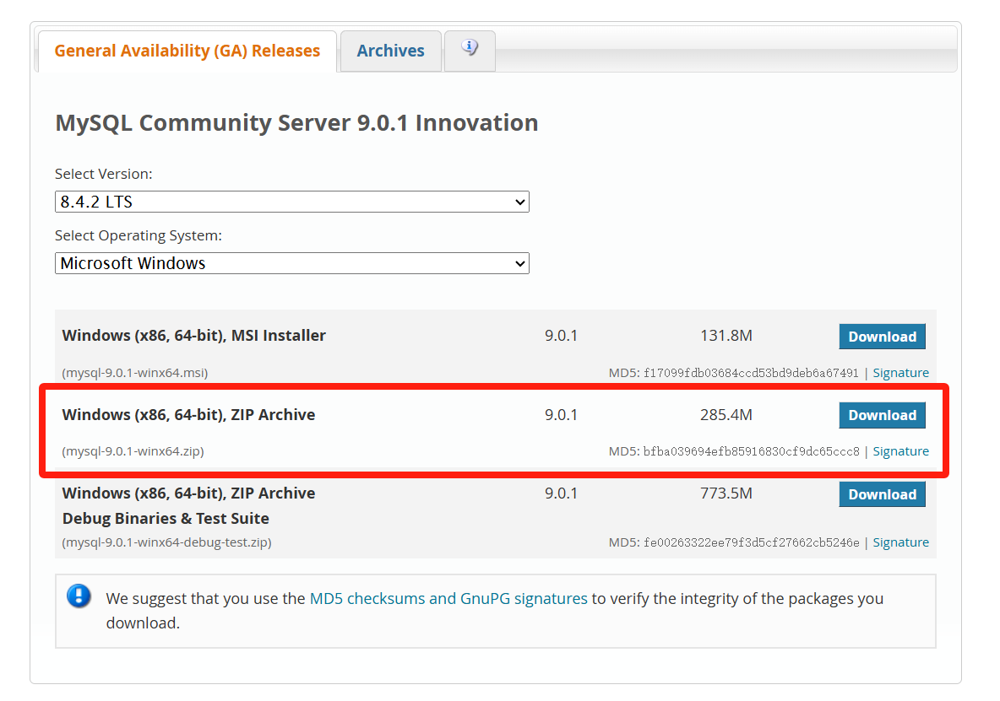

# 03 MySQL下载流程

1. 下载合适版本的MySQL Community

LTS是长期支持版，ZIP Archive是手动配置无需图形化安装的版本。

网址：[MySQL :: Download MySQL Community Server](https://dev.mysql.com/downloads/mysql/)



2. 将zip文件手动解压到目标目录下，注意不要出现中文空格等特殊符号


进入环境变量进行配置


把bin路径添加到系统环境变量的Path中


4. 创建data文件夹并配置my.ini文件

   ```sql
   [mysqld]
   # 设置3306端口
   port=3306
   # 设置mysql的安装目录
   basedir="D:\\Program Files\MySQL"
   # 设置mysql数据库的数据的存放目录
   datadir="D:\\Program Files\MySQL\data"
   # 允许最大连接数
   max_connections=200
   # 允许连接失败的次数。
   max_connect_errors=10
   # 服务端使用的字符集默认为utf8mb4
   character-set-server=utf8mb4
   # 创建新表时将使用的默认存储引擎
   default-storage-engine=INNODB
   # 默认使用“mysql_native_password”插件认证, mysql_native_password
   # default_authentication_plugin=mysql_native_password
   # 版本问题 这一句进行注释
   
   [mysql]
   # 设置mysql网络通信的默认字符集
   default-character-set=utf8mb4
   
   [client]
   # 设置mysql客户端连接服务端时默认使用的端口
   port=3306
   # 设置mysql客户端的默认字符集
   default-character-set=utf8mb4
   ```

5. 打开cmd并进行初始化

   ```sql
   mysqld --initialize --console
   ```

   

   记下这串秘钥

6. 进行注册服务（用管理员身份打开终端）

   ```sql
   mysqld --install
   
   # 如果需要卸载
   mysqld --remove
   ```

7. 启动MySQL服务

   ```python
   net start MySQL
   ```

8. 修改密码

   ```sql
   mysql -u root -p
   # 输入刚才的秘钥
   
   ALTER USER 'root'@'localhost' IDENTIFIED BY '新密码';
   
   FLUSH PRIVILEGES;
   # 刷新权限
   
   EXIT;
   # 退出
   ```

9. 在终端中配置

   ```sql
   mysql -h 127.0.0.1 -P 3306 -uroot -p
   # 连接到运行在本地（127.0.0.1）的 MySQL 服务器，并使用 3306 端口，登录的用户名是 root，系统会提示输入密码
   ```

10. 跳过授权表重置密码

    ```sqlite
    net stop MySQL
    # 关闭MySQL服务
    
    mysqld --skip-grant-tables
    # 跳过授权表
    
    mysql -uroot -p
    # 输入密码的位置直接 enter
    
    # 这个方法我不行
    ```

11. 无需密码

    修改mysql.ini文件

    ```sql
    [mysql]
    # 不需要每次输入验证码即可登陆
    user="root"
    password=你的密码
    default-character-set=utf8mb4
    ```

    

密码的两个步骤电脑有点问题或者理解有点问题