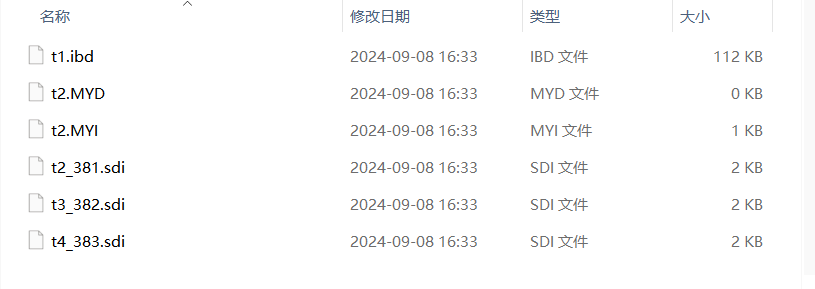

# 6 存储引擎

## 1 什么是存储引擎

- 日常生活中文件格式有很多，并且针对不同的文件格式会有对应不同的存储方式和处理机制
- 针对不同的数据应该有对应的不同的处理机制

- 存储引擎就是不同的处理机制

## 2 MySQL中主要的存储引擎

- InnoDB、myisam、memeory、blackhole

### 2.1 InnoDB

- 是**MySQL5.5版本之后的默认存储引擎**
- 支持事务/行锁/外键

### 2.2 myisam

- 是**MySQL5.5版本之前的默认存储引擎**
- 速度比InnoDB快，但是数据安全较弱
- 带了索引支持所以比memory可能还快

### 2.3 memory

- 内存引擎
- 数据全部存放在内存中
- 存储速度快，但是断电数据丢失

### 2.4 blackhole

- 黑洞引擎
- 无论存什么都会立刻消失

### 2.5 查看引擎

```sql
show engines;
```

```sql
mysql> show engines;
+--------------------+---------+----------------------------------------------------------------+--------------+------+------------+
| Engine             | Support | Comment                                                        | Transactions | XA   | Savepoints |
+--------------------+---------+----------------------------------------------------------------+--------------+------+------------+
| MEMORY             | YES     | Hash based, stored in memory, useful for temporary tables      | NO           | NO   | NO         |
| MRG_MYISAM         | YES     | Collection of identical MyISAM tables                          | NO           | NO   | NO         |
| CSV                | YES     | CSV storage engine                                             | NO           | NO   | NO         |
| FEDERATED          | NO      | Federated MySQL storage engine                                 | NULL         | NULL | NULL       |
| PERFORMANCE_SCHEMA | YES     | Performance Schema                                             | NO           | NO   | NO         |
| MyISAM             | YES     | MyISAM storage engine                                          | NO           | NO   | NO         |
| InnoDB             | DEFAULT | Supports transactions, row-level locking, and foreign keys     | YES          | YES  | YES        |
| ndbinfo            | NO      | MySQL Cluster system information storage engine                | NULL         | NULL | NULL       |
| BLACKHOLE          | YES     | /dev/null storage engine (anything you write to it disappears) | NO           | NO   | NO         |
| ARCHIVE            | YES     | Archive storage engine                                         | NO           | NO   | NO         |
| ndbcluster         | NO      | Clustered, fault-tolerant tables                               | NULL         | NULL | NULL       |
+--------------------+---------+----------------------------------------------------------------+--------------+------+------------+
11 rows in set (0.00 sec)
```

## 3 测试不同引擎之间的异同

```sql
-- 创建不同的表，让不同的表有不同的引擎
create table t1(id int) engine=innodb;
create table t2(id int) engine=myisam;
create table t3(id int) engine=blackhole;
create table t4(id int) engine=memory;
```



```sql
# t1 ---> innodb 支持事务/行锁/外键
t1.frm ---> 当前这张表的表结构 id int
t1.ibd ---> 存的也是表结构但是是和原表相关的表结构

# t2 ---> myisam 数据安全较弱，查询速度很快
t2.frm ---> 表结构
t2.MYD ---> 表结构
t2.MYI ---> 表的索引 index 类似于你使用的字典的目录

# t3 ---> blackhole 存什么都会立刻消失
t3.frm ---> 表结构

# t4 ---> memory 全部存放在内存中
t4.frm ---> 表结构
```

- 向不同的引擎的表中存数据 ，观察数据

```sql
insert into t1 values(1);
insert into t2 values(1);
insert into t3 values(1);
insert into t4 values(1);
```

- 查看当前表的数据

```sql
select * from t1; -- innodb
-- 查看发现数据村存在

select * from t2; -- myisam
-- 数据也会存在

select * from t3; -- blackhole
-- 存进入的数据会消失

select * from t4; -- memory
-- 当时存进去的时候是存在的
-- 只要MySQL服务重启 数据就会消失
```

```sql
mysql> insert into t1 values(1);
Query OK, 1 row affected (0.01 sec)

mysql> insert into t2 values(1);
Query OK, 1 row affected (0.00 sec)

mysql> insert into t3 values(1);
Query OK, 1 row affected (0.00 sec)

mysql> insert into t4 values(1);
Query OK, 1 row affected (0.00 sec)

mysql> select * from t1;
+------+
| id   |
+------+
|    1 |
+------+
1 row in set (0.00 sec)

mysql> select * from t2;
+------+
| id   |
+------+
|    1 |
+------+
1 row in set (0.00 sec)

mysql> select * from t3;
Empty set (0.00 sec)

mysql> select * from t4;
+------+
| id   |
+------+
|    1 |
+------+
1 row in set (0.00 sec)
```
