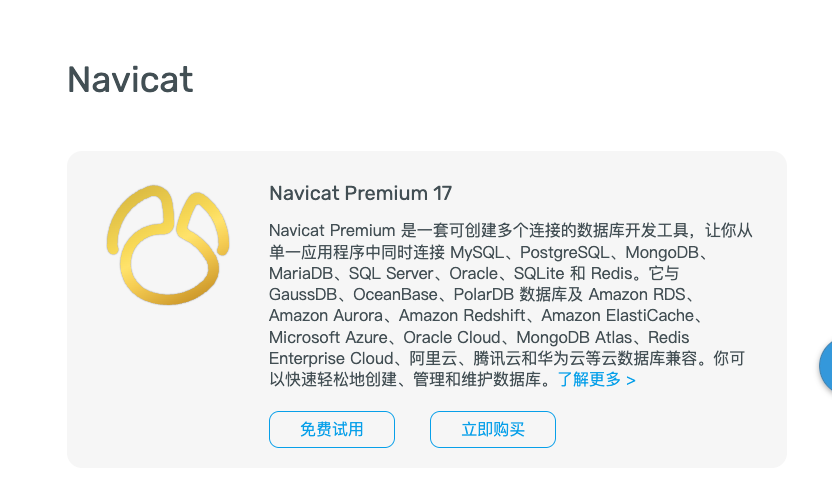
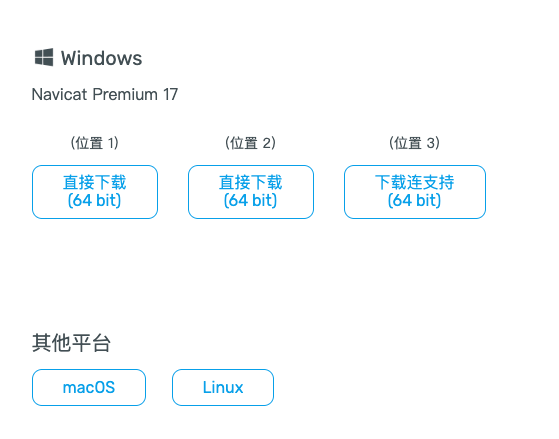
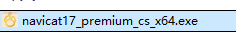
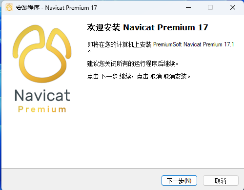
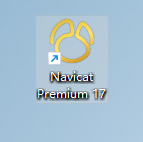
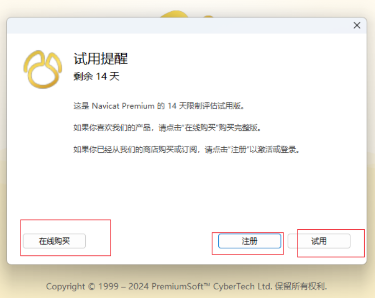

# 11 Navicat

## 1 可视化软件Navicat

```sql
-- 【一】Navicat介绍
-- ● Navicat可以充当很多数据库软件的客户端 提供了图形化界面能够让我们更加快速的操作数据库
-- 1.介绍
-- ● Navicat 是一款功能强大且广泛使用的数据库管理工具，可用于连接和管理多种数据库系统，如 MySQL、MariaDB、Oracle、PostgreSQL 等。
-- ● 本文将详细介绍 Navicat 的特点、功能以及如何使用它来提高数据库管理效率。
-- 2.Navicat 的特点
-- ● Navicat 具有许多令人印象深刻的特点，使其成为许多开发人员和数据库管理员的首选工具。
-- （1）强大的数据库连接
-- ● Navicat 支持与各种数据库系统进行连接，包括 MySQL、MariaDB、Oracle、PostgreSQL、SQLite 等。
-- ● 无论你是使用单一数据库系统还是多个数据库系统，Navicat 都能满足你的需求。
-- （2）直观的用户界面
-- ● Navicat 的用户界面设计简洁直观，易于理解和操作。
-- ● 无论你是初学者还是有经验的数据库管理员，Navicat 都能提供良好的使用体验，帮助你快速掌握各种功能。
-- （3）多种功能模块
-- ● Navicat 提供了许多功能模块，涵盖了数据库管理的方方面面。
-- ● 其中一些功能包括数据导入和导出、查询构建器、报表生成、备份和恢复等。
-- ● 这些功能模块使得数据库管理更加高效和便捷。
-- （4）数据同步和转换
-- ● Navicat 允许你在不同的数据库系统之间进行数据同步和转换。
-- ● 你可以轻松地将数据从一个数据库系统导入到另一个数据库系统，或者在不同数据库之间同步数据，方便数据共享和迁移。
-- （5）数据库设计和建模
-- ● Navicat 提供了强大的数据库设计和建模功能，帮助你规划和设计数据库结构。
-- ● 你可以使用直观的图形界面绘制实体关系图，定义表之间的关系，并生成相应的 SQL 脚本以创建数据库对象。
```

```sql
-- 3.Navicat 的功能详解
-- （1）数据导入和导出
-- ● Navicat 具有灵活的数据导入和导出功能，支持多种数据格式。你可以从 CSV、Excel、Access 等文件中导入数据到数据库，也可以将数据库中的数据导出为这些格式的文件。
-- （2）查询构建器
-- ● Navicat 的查询构建器功能可帮助你轻松构建复杂的 SQL 查询语句。你可以选择要查询的表、字段和条件，并通过图形界面生成查询语句，无需手动编写复杂的 SQL 代码。
-- （3）报表生成
-- ● Navicat 提供了报表生成功能，可用于创建和定制数据库报表。你可以选择要包含在报表中的数据、样式和排列方式，并导出为 PDF、Excel 等格式的文件。
-- （4）备份和恢复
-- ● Navicat 具有灵活的备份和恢复功能，可帮助你保护数据库的安全性。你可以定期对数据库进行备份，并在需要时轻松恢复数据，防止意外数据丢失。
-- （5）数据库同步
-- ● Navicat 允许你在不同的数据库之间进行数据同步。你可以将数据从一个数据库复制到另一个数据库，确保两个数据库之间的数据一致性。
-- （6）数据库连接管理
-- ● Navicat 提供了便捷的数据库连接管理功能，可以保存和管理多个数据库连接配置。你可以根据需要添加、编辑或删除数据库连接，并轻松切换不同的数据库连接。
-- （7）数据库设计和建模
-- ● Navicat 的数据库设计和建模功能可帮助你规划和设计数据库结构。你可以通过绘制实体关系图、定义表之间的关系等方式来创建数据库模型，从而更好地组织和管理数据。
```


## 2 下载和安装

### 【1】windows系统

- 官网

- https://navicat.com.cn/products



- 下载



- 安装包



### 【2】安装



- 一路下一步傻瓜式安装

- 启动



- 进入到主页面会提示14天免费使用

