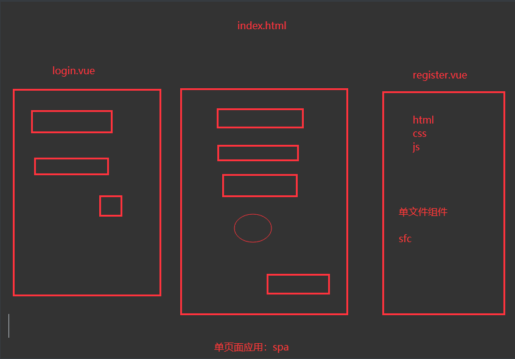
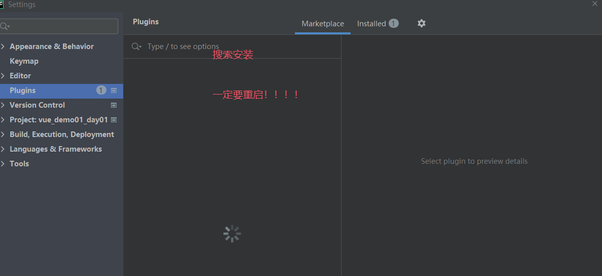

# 今日内容

# 1 前端发展介绍

```python
# 1 HTML(5)、CSS(3)、JavaScript(ES5、ES6、ES13):编写一个个的页面 -> 给后端(PHP、Python、Go、Java) -> 后端嵌入模板语法 -> 后端渲染完数据 -> 返回数据给前端 -> 在浏览器中查看

# 2 Ajax的出现 -> 向后台发送异步请求,Render+Ajax混合

# 3 单用Ajax（加载数据,DOM渲染页面）:前后端分离的雏形
	index.html
    login.html

# 4 Angular框架的出现（1个JS框架）:出现了“前端工程化”的概念（前端也是1个工程、1个项目）

# 5 React、Vue框架:当下最火的2个前端框架（Vue:国人喜欢用,React:外国人喜欢用）

# 6 移动开发（Android+IOS） + Web（Web+微信小程序+支付宝小程序） + 桌面开发（Windows桌面）:前端 -> 大前端

# 7 一套代码在各个平台运行（大前端）:谷歌Flutter平台（Dart语言:和Java很像）可以运行在IOS、Android、PC端,web

# 8 在Vue框架的基础性上 uni-app:一套编码 编到10个平台

# 9 在不久的将来 ,前端框架可能会一统天下
```

# 2 vue介绍

```python
# 1 js 框架

# 2 官网:https://cn.vuejs.org/

# 3 渐进式 JavaScript 框架 易学易用,性能出色,适用场景丰富的 Web 前端框架
	-可以项目的一部分使用 也可以全项目使用- -> 可以被逐步集成
    -单页应用 (SPA):signal page application
    	-整个vue项目,只有一个 html页面
        
    -单文件组件(Single-File Components,缩写为 SFC)
    	-我们可以使用一种类似 HTML 格式的文件来书写 Vue 组件,它被称为单文件组件 Login.vue 文件
    	-Vue 的单文件组件会将一个组件的逻辑 (JavaScript),模板 (HTML) 和样式 (CSS) 封装在同一个文件里
        
# 4 版本选择（vue2--vue3）
	-vue2:少量vue2
    -vue3:公司内 vue3多
    
# 5 什么是vue- -> 用于构建用户界面的js框架
Vue (发音为 /vjuː/,类似 view) 是一款用于构建用户界面的 JavaScript 框架。它基于标准 HTML、CSS 和 JavaScript 构建,并提供了一套声明式的、组件化的编程模型,帮助你高效地开发用户界面。无论是简单还是复杂的界面,Vue 都可以胜任

# 6 单文件组件
	-一种类似 HTML 格式的文件来书写 Vue 组件,它被称为单文件组件  xx.vue
    -Single-File Components:SFC
    -Vue 的单文件组件会将一个组件的逻辑 (JavaScript),模板 (HTML) 和样式 (CSS) 封装在同一个文件里
    
# 7 API风格
	-组合式:vue3使用它,也兼容配置项API
    -配置项API:vue2使用它,vue3也能用,不推荐
    
# 8 M-V-VM 架构
	-MTV架构风格:Django,本质也是MVC
    	-Model:数据层 -> orm -> 表模型
        -T:template 就是V ,模板,用户界面
        -V:视图层   django的V+路由= c层
        
    -MVC架构风格:后端开发的架构风格
    	-Model:数据层 -> orm -> 表模型
        -V:view视图层,模板,用户界面
        -C:controller控制层:控制逻辑,判断,循环
        
    -MVVM:vue的架构模式
    	M:model数据层   js变量
        v:View视图层     用户看到的页面
        	js的dom操作- -> 实现 M和V的交互- -> 原生js操作dom很麻烦
            jquery -> 方便js操作dom -> 很多年前,jquery非常火
            
        vm:view-model层  介于 view和 Model之间 vue编写的一层- -> 实现 只要数据发生变化,页面就跟着变,只要页面发生变化,js数据页变
        响应式,以后不用操作dom了,只需要动js的变量即可
    
    -MVP:移动端开发
    
# vue总结
    1 渐进式
    2 构建用户界面的js框架
    3 单文件组件SFC:Single-File Components（xx.vue）,类html的模板,内部写html,css,js
    4 单页面应用:SPA  ,一个vue项目只有一个html页面
    5 API 风格:组合式,选项式
    6 架构是:MVVM
```



## 2.1 vue初体验（vue2,vue3）

```python
#1  vue开发,选择编辑器
	-vscode:免费,微软出的
    	-前端开发
        -python开发
        -go开发
        ...
    -webstorm:jetbrains公司专门用来开发前端的
    -不正经前端开发:goland,pycharm,IDEA开发vue
    	pycharm装插件,变成webstorm
    
# 2 jetbrains全家桶
	-IDEA -> 为java开发者定制的
    -继续开发出了全家桶:pycharm,goland,clion,phpstorm,webstorm
    -pycanrm -> 装vue插件 -> 跟webstorm一样了
    
    -建议下载webstorm -> 破解 -> 破解方案跟pycharm一样
    -之前使用pycharm,使用习惯固定了 -> 换成jetbrains全家桶,都可以很方便使用
    
    -补:安卓开发 -> AndroidStudio- -> 用起来和pycharm一样
    	-谷歌公司买了jetbrains版权- -> 加ADT -> AndroidStudio免费提供给安卓开发者使用的IDE
        
# 3 vue初体验
	-一部分用vue -> src方式:cdn引入,本地引入
    -vue项目 install 安装方式
		-nodejs环境
```

```html
<!DOCTYPE html>
<html lang="en">
<head>
    <meta charset="UTF-8">
    <title>Title</title>
<!--    <script src="https://cdn.jsdelivr.net/npm/vue@2/dist/vue.js"></script>-->
    <script src="./vue2/vue.js"></script>

</head>
<body>

<div class="app">
    <h2>名字是:{{name}}</h2>
    <h2>年龄是:{{age}}</h2>

</div>

</body>

<script>
    var vm=new Vue({
        el:'.app',
        data:{
            name:'sheenagh',
            age:23
        }
    }
    )

</script>
</html>
```


```html
<!DOCTYPE html>
<html lang="en">
<head>
    <meta charset="UTF-8">
    <title>Title</title>
<!--    <script src="https://unpkg.com/vue@3/dist/vue.global.js"></script>-->
    <script src="./vue3/vue.js"></script>
</head>
<body>
<div id="app">
    <h2>名字是:{{name}}</h2>
    <h2>年龄是:{{age}}</h2>

</div>


</body>

<script>
    /*
     ################ 组合式API建议################
    */
    const { createApp, ref } = Vue
    createApp({
    setup() {
      const name = ref('lqz')
      const age = ref(99)
      return {
        name, age
      }
    }
    }).mount('#app')

    /*
    ################配置项api################
      const { createApp } = Vue
      createApp({
        data() {
          return {
            name: 'lqz--',
              age:199
          }
        }
      }).mount('#app')
     */
</script>
</html>
```


# 3 插值语法

```python
# 1 补充:三目运算符语法
var a=条件?'':''
# 2 插值语法中 可以放 变量   简单运算   三目运算符   函数()
# 3 标签字符串,无法渲染成标签
```

```html
<!DOCTYPE html>
<html lang="en">
<head>
    <meta charset="UTF-8">
    <title>Title</title>
    <script src="./vue2/vue.js"></script>
</head>
<body>
<div id="app">
    <p>渲染字符串:{{name}}</p>
    <p>渲染数字:{{age}}</p>
    <p>渲染数组:{{list1}} -> {{list1[1]}}</p>
    <p>渲染对象:{{obj1}} -> {{obj1.name}}--->{{obj1['age']}}</p>
    <p>渲染标签字符串:{{link1}}</p>
    <p>简单js语法:{{9+9}}</p>
    <p>简单js语法:{{age+9}}</p>
    <p>简单js语法:{{name+'_NB'}}</p>
    <p>三目运算符:{{age>=18?"成年":"未成年"}}</p>
</div>
</body>

<script>
    // 插值语法,可以渲染字符串,列表,对象,简单js语法和三目运算符- -> 也可以放    函数() 函数返回结果
    var vm=new Vue({
        el:'#app',
        data:{ // 一定要定义在data的内部 -> 所有变量,都可以使用插值语法 {{}},显示在页面上  M V  VM
            name:'sheenagh',
            age:23,
            list1:['张三','李四','王五'], // js叫数组,不叫列表
            obj1:{name:'sheenagh',age:24},  //不叫字典,js叫对象
            link1:'<a href="http://www.baidu.com">点我有好看的</a>'
        }
    })
    // 1 补充三目运算符 -> python三元表达式
    // var a = 条件?A:B
    var age=101
    var res=age>100?"超100岁了":"年级还小,继续努力"
    console.log(res)
</script>
</html>
```

## 1.1 Pyharm安装vue插件

```python
# settings--->plugins--->如下图
```



## 1.2 补充

```python
# 以后vue的插值语法,指令等 都要写在 这个div中
<div id="app">

</div>
```


# 4 指令之文本指令

```python
# 1 vue 指令:放在标签上,以v-开头的,都是vue的指令,每个指令有特殊的用途
	-任何html标签,都可以放vue的指令
# 2 文本指令
v-html	让HTML渲染成页面,把变量的内容,渲染在当前标签中,如果是html,会渲染成标签

v-text	标签内容显示js变量对应的值 类似于插值 -> 只不过插值是{{}}

v-show	放1个布尔值:为真 标签就显示；为假 标签就不显示
	-通过:style 控制,标签还在
v-if	放1个布尔值:为真 标签就显示；为假 标签就不显示
	-直接删除和现实标签
```

```html
<!DOCTYPE html>
<html lang="en">
<head>
    <meta charset="UTF-8">
    <title>Title</title>
    <script src="./js2/vue.js"></script>
</head>
<body>
<div id="app">
    <h1>v-html使用</h1>
    <h2 v-html="name"></h2>
    <h2 v-html="link1"></h2>
    <h1>v-text使用</h1>
    <h2 v-text="name"></h2>
    <h2 v-text="link1"></h2>
    <h1>v-show使用</h1>
    

    <h1>v-if使用</h1>
    <h3 v-if="is_show_h3">看到我了</h3>
</div>
</body>

<script>
    var vm = new Vue({
        el: '#app',
        data: {
            name:'lqzsdfsfgasf',
            str:'<a href="http://www.baidu.com">点我有好看的</a>',
            is_show:true,
            is_show_h3:true
        },
    })
</script>
</html>
```


# 5 事件指令

```python
# 1 事件指令
	-js中有很多事件:点击,双击,滑动,滚动。。。。
    -这么多事件中,只有点击事件用的最多
    
# 2 点击事件
指令     	  释义
v-on:	   触发事件（不推荐）   v-on:click='函数名'  - -> 定义在methods中
@	       触发事件（推荐）     @click='函数名'  - -> 定义在methods中
@[event]	触发event事件（可以是其他任意事件）
```


```html
<!DOCTYPE html>
<html lang="en">
<head>
    <meta charset="UTF-8">
    <title>Title</title>
    <script src="./js2/vue.js"></script>
</head>
<body>
<div id="app">

    <h1>事件指令</h1>
    
    <br>
<!--    <button v-on:click="handleClick">点击-显示或隐藏</button>-->
    <button @click="handleClick">点击-显示或隐藏</button>
    <h1>事件指令-click-函数传参数</h1>

<!--    <button @click="handleDemo1(10,age)">handleDemo1</button>-->
<!--    <button @click="handleDemo1(10,age,19)">handleDemo1-多的参数会忽略</button>-->
<!--    <button @click="handleDemo1(age)">handleDemo1-少的参数会-是undefined</button>-->
<!--    <button @click="handleDemo1">如果不传-函数有变量接收-第一个参数是event事件对象</button>-->
    <button @click="handleDemo1($event,10)">传event事件对象,又要传变量</button>

</div>
</body>

<script>
    var vm = new Vue({
        el: '#app',
        data: {
            age:10,
            is_show: true,
        },
        methods:{
            handleClick:function (){
                // 把data中is_show 取反
                this.is_show=!this.is_show
            },
            // handleDemo1:function (a,b){
            //     console.log(a)
            //     console.log(b)
            //     console.log(a+b)
            // },
            handleDemo1:function (event,a){
                console.log(event)
                console.log(a)
            },
        }
    })
</script>
</html>
```


# 6 属性指令

```python
# 1 属性指令 
	-标签都有属性  name  id   src  link  href...
    -属性绑定一个变量 -> 变量变,属性也变
    
# 2 如何使用
v-bind:标签=变量值    	直接写js的变量或语法（不推荐）
:标签=变量值	        直接写js的变量或语法（推荐）
```


# 作业

```python
# 1 使用vue2把我写的案例都写一遍

# 2 页面中有个图片 -> 有个按钮 -> 点击按钮就换图片
	-随机换

# 3 页面中有个图片 -> 有个按钮 -> 点击按钮 -> 图片每隔1s换 -> 再点击一下按钮,就停止
	setInterval:开启,关闭
    
  -------- HBuilder------
# 4 uniapp- -> 写个功能 -> 2作业 -> 编译后 -> 安装到手机上
```

