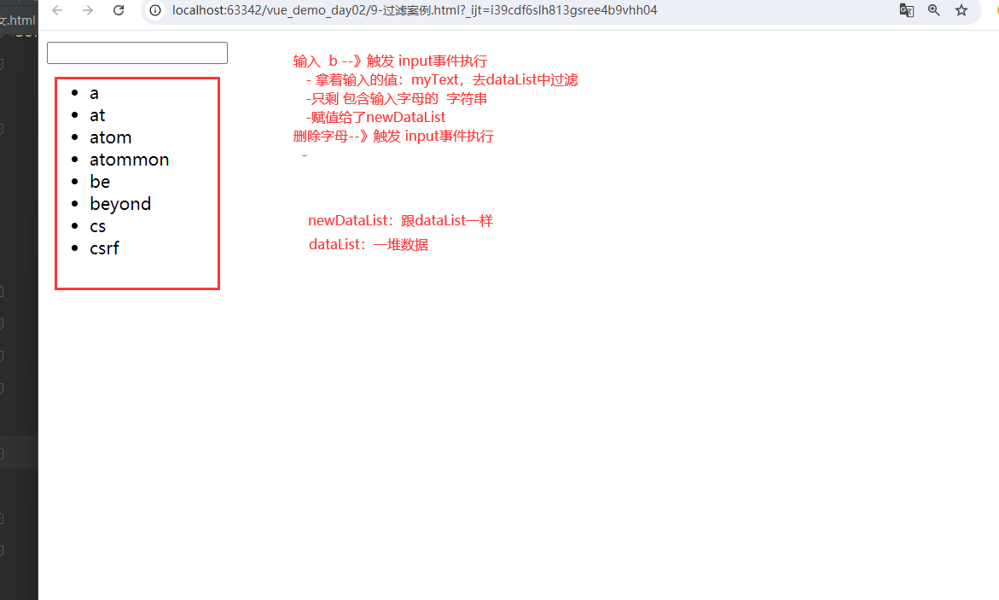

# 昨日回顾

```python
# 1 前端发展历史
	-1 render 前后端分离 -> 模板渲染在后端
    -2 ajax，异步的json或xml请求，异步跟后端交互获取数据
    	-json
        -protobuf
        -...
    -3 前后端分开
    	-前端只写html，css，js
        -后端配合接口
    -4 工程化：项目，html，css,js/TypeScript -> 编译成纯粹的html，css，js
    -5 Vue，react
    -6 大前端：web前端，app前端，小程序，桌面端
    	-flutter -> 平台 -> Dart
        -uniapp：vue语法写，多端
# 2 vue
	-渐进式 ，js框架，构建用户界面
    -SPA：单页面应用
    -SCF：单文件组件
    -MVVM架构
    -2.x    3.x
    -配置项API     组合式API
    
# 2 快速体验
	定义变量 -> {{}} -> 被vue管理的标签中
    
# 3 插值语法
	{{}}：变量，简单表达式，三目运算符。。。。
    
#4 指令系统  v-xx   文本指令
	v-html
    v-text
    v-show
    v-if
# 5 事件指令
	v-on:事件名='函数'  # 事件名一般是点击事件
    @事件名='函数'
    methods:{}
    
    js函数传参数：可以多可以少
    event事件
    
# 6 属性指令
	v-bind:属性名='变量'
    :属性名='变量'
```


# 今日内容

# 1 小作业-es6的对象写法

## 1.0 关于uniapp

```python
# 编写多端app

# 使用的编辑器：HBuiler

# 编写完 -> 运行在浏览器中
# 运行在手机上
	-开发：
    	1 手机端开启开发者模式
        	-设置 -> 关于手机 -> 连续点7次 -> 
            
        2 下载adb，下完解压 -> 添加到环境变量
        	https://developer.android.google.cn/tools/releases/platform-tools?hl=uk
        	adb -version
            
       3 使用数据线连接手机和电脑
    	
       4 远程打包
```


## 1.1 选美女

```html
<!DOCTYPE html>
<html lang="en">
<head>
    <meta charset="UTF-8">
    <title>Title</title>
    <script src="./js2/vue.js"></script>
</head>
<body>
<div class="app">

    
    <br>
    <button @click="handleClick">开始/停止</button>

</div>
</body>
<script>
    new Vue({
        el: '.app',
        data: {
            img: './img/1.jpg',
            img_urls: ['./img/1.jpg', './img/2.jpg', './img/3.jpg'],
            t: null
        },
        methods: {
            handleClick: function () {
                if (this.t) {
                    // 如果有值，说明定时器开启了  ,清空定时器
                    clearInterval(this.t)
                    this.t = null
                } else {
                    // 如果没有值，定时器没开启
                    // 定时器--每个1s干xx
                    var _this = this
                    this.t = setInterval(function () {
                        //修改img的值
                        // 根据索引取值_this.img_urls[数字]
                        //  Math.random() * arr.length     Math.random() 生成 0---1之间数字 *数组长度 -> 0--数组长度之间的数字 -> Math.floor 向下取整
                        _this.img = _this.img_urls[Math.floor(Math.random() * _this.img_urls.length)]
                    }, 1000)
                }


            }
        }
    })

</script>
</html>
```


## 1.2 补充 es6的对象写法

```js
// es6 :ECMAScript 6 
	-最新是：ES15

//  js=ECMAScript+bom+dom

<script>

    //1 对象定义--最原始
    // var person = {
    //     'name': 'lqz',
    //     'age': 19
    // }
    //2 对象定义--省略key的 ''
    // var person2 = {
    //     name: 'lqz',
    //     age: 19
    // }
    //3 对象定义--省略key的 '',定义一个变量叫name
    // var name='zhangsan'
    // var age =99
    // var wife={name:"刘亦菲",hobby:'跳舞'}
    // var person3 = {
    //     name,
    //     age,
    //     wife
    // }
    // name='lisi'  // 可变和不可变 -> 值和引用
    // wife.hobby='抽烟'
    // console.log(person3)
    // console.log(name)
    // // 修改变量，对象中得值，是否会发生变化 -> 取决于对象是什么类型：值类型   引用类型


    // 4 对象中放函数
    // var name = 'zhangsan'
    // var age = 99
    //
    // var showName = function () {
    //     console.log(this.name)
    // }
    //
    //
    // var person4 = {
    //     name,
    //     age,
    //     showName
    // }
    //
    // person4.showName()

    // 4 最终写法
    var name = 'zhangsan'
    var age = 99


    var person4 = {
        name,
        age,
        showName() {
            console.log(this.name+'_NB')
        }
    }

    person4.showName()


</script>
```


# 2 class和style

```python
# 1 class 和style  都是属性 -> 使用属性指令  ：
# 2 比较特殊，单独再讲

```

```html
<!DOCTYPE html>
<html lang="en">
<head>
    <meta charset="UTF-8">
    <title>Title</title>
    <script src="./vue2/vue.js"></script>
    <style>
        .red {
            background-color: red;
        }

        .green {
            background-color: green;
        }

        .font {
            font-size: 60px;
        }

        .height {
            height: 400px;
        }
        .width{
            width:400px
        }
    </style>
</head>
<body>

<div class="app">
    <h1>前戏</h1>
<!--     <div :style="style_str"></div>-->
    <h1>class的用法</h1>
<!--    <div :class="class_str">-->
<!--    <div :class="class_list">-->
    <div :class="class_obj">
        我是个div
    </div>
    <button @click="handleChange">点击变化背景色</button>


    <h1>style的用法</h1>
<!--    <div :style="style_str">-->
<!--    <div :style="style_list">-->
    <div :style="style_obj">
        我是div
    </div>
    <button @click="handleChange2">点击变化背景色</button>

</div>

</body>

<script>
    var vm=new Vue({
        el: '.app',
        data: {
            // style_str:'height: 100px;width: 150px;background-color: green',
            // class属性可以等于：字符串，数组，对象 -> 数组多一些
            // class_str:'height width green',
            // class_list:['height' ,'width', 'green'],
            class_obj: {height: true, width: true, red: true, green: false, font: false},

            //style 属性可以等于：字符串，数组，对象 -> 对象
            style_str: 'height: 100px;width: 150px;background-color: green',
            style_list: [{'height': '200px'}, {'width': '200px'}, {'background-color': 'green'}],
            style_obj: {'height': '200px', 'width': '200px', backgroundColor: 'red'}
        },


        methods: {
            handleChange() {
                // class属性可以等于：字符串，数组，对象
                // this.class_str='height width red font'

                // this.class_list.pop()
                // this.class_list.push('red')

                this.class_obj.red = false
                this.class_obj.green = true
            },
            handleChange2() {
                // this.style_str='height: 100px;width: 150px;background-color: yellow'
                // this.style_list[2]['background-color'] = 'red'
                // this.style_obj['height']='400px'
                // this.style_obj.height='100px'
                this.style_obj.backgroundColor='black'
            }
            }
        }
    )


</script>
</html>
```


# 3 条件渲染

```python
# 1 if  else if   else 逻辑
# 2 指令v-if   v-else  v-else-if

# 3 小案例：输入用户成绩，显示：优秀，良好，及格，不及格

```

```html
<!DOCTYPE html>
<html lang="en">
<head>
    <meta charset="UTF-8">
    <title>Title</title>
    <script src="./js2/vue.js"></script>

</head>
<body>
<div class="app">
    <h2>您的成绩是：{{score}}</h2>
    <h3 v-if="score>=90&&score<=100">优秀</h3>
    <h3 v-else-if="score>=80&&score<90">良好</h3>
    <h3 v-else-if="score>=60&&score<80">及格</h3>
    <h3 v-else>不及格</h3>

</div>
</body>
<script>
    var vm = new Vue({
        el: '.app',
        data: {
            score: 99
        },
    })

</script>
</html>


```

```html
<!DOCTYPE html>
<html lang="en">
<head>
    <meta charset="UTF-8">
    <title>Title</title>
    <script src="./vue2/vue.js"></script>
</head>
<body>

<div class="app">

<p>请输入您的成绩： <input type="text" v-model="score"></p>

    <h3 v-if="score>=90&&score<=100"  style="color: green">优秀</h3>
    <h3 v-else-if="score>=80&&score<90">良好</h3>
    <h3 v-else-if="score>=60&&score<80">及格</h3>
    <h3 v-else style="color: red">不及格</h3>


</div>

</body>

<script>
    var vm=new Vue({
        el: '.app',
        data:{
            score:0
        },


        }
    )


</script>
</html>
```


# 4 列表渲染

```python
# 1 循环
# 2 v-for 指令
# 3 购物车小案例+bootstrap样式：
	goods_list:[{},{},{}]
```

```html
<!DOCTYPE html>
<html lang="en">
<head>
    <meta charset="UTF-8">
    <title>购物车</title>
    <script src="./js2/vue.js"></script>
    <link href="https://cdn.jsdelivr.net/npm/bootstrap@5.3.0-alpha1/dist/css/bootstrap.min.css" rel="stylesheet">
    <script src="https://cdn.jsdelivr.net/npm/bootstrap@5.3.0-alpha1/dist/js/bootstrap.bundle.min.js"></script>

</head>
<body>
<div class="app">

    <div class="container-fluid">
        <div class="row">
            <div class="col-md-6 offset-md-3">
                <h1 class="text-center">购物车</h1>
                <hr>
                <div>
                    <table class="table">
                        <thead>
                        <tr>
                            <th scope="col">商品id</th>
                            <th scope="col">商品名</th>
                            <th scope="col">商品价格</th>
                            <th scope="col">商品数量</th>
                        </tr>
                        </thead>

                        <tbody>
                        <tr v-for="item in shopping_car" :class="item.id%2>0?'table-danger':'table-success'">
                            <th scope="row">{{item.id}}</th>
                            <td>{{item.name}}</td>
                            <td>{{item.price}}</td>
                            <td>{{item.count}}</td>
                        </tr>
                        </tbody>
                    </table>

                </div>

            </div>
        </div>
    </div>


</div>
</body>
<script>
    var vm = new Vue({
        el: '.app',
        data: {
            shopping_car: [
                {id: 1001, name: '特斯拉', price: '29999元', count: 1},
                {id: 1002, name: '苹果笔记本', price: '59999元', count: 3},
                {id: 1003, name: '脸盆', price: '9元', count: 8},
                {id: 1004, name: '钢笔', price: '19元', count: 10},
            ]

        },
    })

</script>
</html>


```

```html
<!DOCTYPE html>
<html lang="en">
<head>
    <meta charset="UTF-8">
    <title>Title</title>
    <link href="https://cdn.jsdelivr.net/npm/bootstrap@5.3.0-alpha1/dist/css/bootstrap.min.css" rel="stylesheet"
          integrity="sha384-GLhlTQ8iRABdZLl6O3oVMWSktQOp6b7In1Zl3/Jr59b6EGGoI1aFkw7cmDA6j6gD" crossorigin="anonymous">
    <script src="https://cdn.jsdelivr.net/npm/bootstrap@5.3.0-alpha1/dist/js/bootstrap.bundle.min.js"
            integrity="sha384-/mhDoLbDldZc3qpsJHpLogda//BVZbgYuw6kof4u2FrCedxOtgRZDTHgHUhOCVim"
            crossorigin="anonymous"></script>
    <script src="./vue2/vue.js"></script>
</head>
<body>
<div class="app">
    <div class="container-fluid">
        <div class="row">
            <div class="col-md-6 offset-md-3">
                <h1 class="text-center">购物车</h1>
                <div class="text-center">
                    <button class="btn btn-danger" @click="handleLoad">加载购物车</button>
                </div>
                <hr>
                <div v-if="goods_list.length==0">
                    购物车是空的~~
                </div>


                <table class="table table-striped" v-else>
                    <thead>
                    <tr>
                        <th scope="col">商品id</th>
                        <th scope="col">商品名</th>
                        <th scope="col">商品价格</th>
                        <th scope="col">商品数量</th>
                    </tr>
                    </thead>
                    <tbody>
                    <tr v-for="item in goods_list">
                        <th scope="row">{{item.id}}</th>
                        <td>{{item.name}}</td>
                        <td>{{item.price}}</td>
                        <td>{{item.count}}</td>
                    </tr>


                    </tbody>

                </table>


            </div>
        </div>
    </div>
</div>


</div>
</body>

<script>
    var vm = new Vue({
            el: '.app',
            data: {
                goods_list: []
            },
            methods: {
                handleLoad() {
                    this.goods_list = [
                        {id: 1001, name: '特斯拉', price: '29999元', count: 1},
                        {id: 1002, name: '苹果笔记本', price: '59999元', count: 3},
                        {id: 1003, name: '脸盆', price: '9元', count: 8},
                        {id: 1004, name: '钢笔', price: '19元', count: 10},
                    ]
                }

            }


        }
    )


</script>
</html>

```

## 4.2 v-for 可以循环的变量类型

```python
# 1 可以循环 ：数字，字符串，数组，对象
# 2 循环时，拿到索引值
```

```html
<!DOCTYPE html>
<html lang="en">
<head>
    <meta charset="UTF-8">
    <title>v-for循环</title>
    <script src="./js2/vue.js"></script>
    <link href="https://cdn.jsdelivr.net/npm/bootstrap@5.3.0-alpha1/dist/css/bootstrap.min.css" rel="stylesheet">
    <script src="https://cdn.jsdelivr.net/npm/bootstrap@5.3.0-alpha1/dist/js/bootstrap.bundle.min.js"></script>

</head>
<body>
<div class="app">

    <div class="container-fluid">
        <div class="row">
            <div class="col-md-6 offset-md-3">
                <h1 class="text-center">v-for循环数字</h1>
                <div class="d-flex justify-content-center">

                    <ul>
                        <li v-for="(item,index) in count">循环到得位置是：{{item}}，索引是：{{index}}</li>
                    </ul>
                </div>


                <hr>
                <h1 class="text-center">v-for循环字符串</h1>
                <div class="d-flex justify-content-center">

                    <ul>
                        <li v-for="(item,index) in str">循环到得位置是：{{item}}，索引是：{{index}}</li>
                    </ul>
                </div>

                <hr>
                <h1 class="text-center">v-for循环列表</h1>
                <div class="d-flex justify-content-center">
                    <div>
                        <p v-for="(item,index) in girls">第{{index}}号女孩，名是：{{item}}</p>
                    </div>


                </div>

                <hr>
                <h1 class="text-center">v-for循环对象</h1>
                <div class="d-flex justify-content-center">
                    <div>
                        <!--                        <p v-for="(value,key) in obj">key值为：{{key}},value值为：{{value}}</p>-->
                        <p v-for="value in obj">value值为：{{value}}</p>
                    </div>


                </div>

                <hr>

            </div>
        </div>
    </div>


</div>
</body>
<script>
    var vm = new Vue({
        el: '.app',
        data: {
            count: 10,
            str: 'Hello world!',
            girls: ['刘亦菲', '迪丽热巴', '亚瑟'],
            obj: {name: 'lqz', age: 19, height: 183, weight: 140, hobby: '烫头'}
        },
    })

</script>
</html>


```


##  4.3 key值的解释

```python
# vue中使用的是虚拟DOM，会和原生的DOM进行比较，然后进行数据的更新，提高数据的刷新速度（虚拟DOM用了diff算法）

# 在v-for循环数组、对象时，建议在控件/组件/标签写1个key属性，属性值唯一
页面更新之后，会加速DOM的替换（渲染）
:key="变量"
```

## 4.4 数组,对象的检测与更新

```python
# 1 数组或对象的值改了，但是页面没有变化
	-使用Vue.set(对象，对象key，对象value)
    -使用Vue.set(数组，数组的下标，数组value)
    
# 2 对数组来讲：
    # 可以检测到变动的数组操作：
        push：最后位置添加
        pop：最后位置删除
        shift：第一个位置删除
        unshift：第一个位置添加
        splice：切片
        sort：排序
        reverse：反转
    # 检测不到变动的数组操作：
        filter()：过滤
        concat()：追加另一个数组
        slice()：
        map()：
        
        
# 3 对于对象
	对象.属性=值  #如果属性之前不存在，也不会有响应式
```


# 5 事件处理

```python
# 0 input标签的数据双向绑定

# 1 input 标签的事件
事件	         释义
input	当输入框进行输入的时候 触发的事件
change	当元素的值发生改变时 触发的事件
blur	当输入框失去焦点的时候 触发的事件
focus   获得焦点，触发事件
```

```html
<!DOCTYPE html>
<html lang="en">
<head>
    <meta charset="UTF-8">
    <title>input事件</title>
    <script src="./vue2/vue.js"></script>

</head>
<body>
<div class="app">
    <h1>input的所有事件</h1>
    <p>点击：<input type="text" v-model="s1" @click="handle1"></p>
    <p>变化：<input type="text" v-model="s2" @change="handle2"></p>
    <p>输入：<input type="text" v-model="s3" @input="handle3"></p>
    <p>失去焦点:<input type="text" v-model="s4" @blur="handle4"></p>
    <p>获取焦点：<input type="text" v-model="s5" @focus="handle5"></p>


</div>
</body>
<script>
    var vm = new Vue({
        el: '.app',
        data: {
            s1: '',
            s2: '',
            s3: '',
            s4: '',
            s5: '',
        },
        methods: {
            handle1() {
                console.log('被点了')
            },
            handle2() {
                console.log(this.s2)
            },
            handle3() {
                console.log(this.s3)
            },
            handle4() {
                console.log(this.s4)
            },
            handle5() {
                console.log(this.s5)
            },

        }
    })

</script>
</html>


```

## 5.2 过滤案例

```html
<!DOCTYPE html>
<html lang="en">
<head>
    <meta charset="UTF-8">
    <title>input事件</title>
    <script src="./vue2/vue.js"></script>

</head>
<body>
<div class="app">
    <h1>过滤案例</h1>
    <input type="text" v-model="search" @input="handleInput">
    <hr>
    <ul>
        <li v-for="item in newDataList">{{item}}</li>
    </ul>


</div>
</body>
<script>
    var vm = new Vue({
        el: '.app',
        data: {
            search:'',
            dataList: ['a', 'at', 'atom', 'atommon', 'be', 'beyond', 'cs', 'csrf'],
            newDataList:['a', 'at', 'atom', 'atommon', 'be', 'beyond', 'cs', 'csrf']
        },
        methods:{
            // handleInput(){
            //     var _this=this
            //     this.newDataList=this.dataList.filter(function (item){
            //         if (item.indexOf(_this.search)>=0){
            //             return true
            //         }else {
            //             return false
            //         }
            //
            //     })
            // },

             handleInput(){
                var _this=this
                this.newDataList=this.dataList.filter(function (item){
                    return item.indexOf(_this.search)>=0
                })
            },
        }
    })


    // 1 补充：数组的过滤
    var a=['a', 'at', 'atom', 'atommon', 'be', 'beyond', 'cs', 'csrf']
    var res=a.filter(function (item){
        if (item.length >=3){
            return true
        }else {
            return false
        }
    })
    console.log(res)

    // 2 判断字符串包含关系--->子字符串在另一个字符串的位置，只要小于0，就是不包含
    var s1='hello world'
    var s2='world'
    var r=s1.indexOf(s2)
    console.log(r)
</script>
</html>


```



# 6 数据双向绑定

```python
# 1 v-model 只针对于 input标签
	-双向数据绑定：变量变，页面变;页面变，变量变
    -如果使用属性指令绑定 value，只有单向绑定
```

```html
<!DOCTYPE html>
<html lang="en">
<head>
    <meta charset="UTF-8">
    <title>v-for循环</title>
    <script src="./js2/vue.js"></script>

</head>
<body>
<div class="app">

    <p>用户名: <input type="text" v-model="username"></p>
    <p>密码: <input type="password" v-model="password"></p>
    <p><input type="submit" value="登录" @click="handleSubmit"></p>


</div>
</body>
<script>
    var vm = new Vue({
        el: '.app',
        data: {
            username: '',
            password: ''
        },
        methods: {
            handleSubmit() {
                console.log(this.username)
                console.log(this.password)
            }
        }
    })

</script>
</html>
```


# 作业

```python
# 把我上课写代码自己写一遍
```