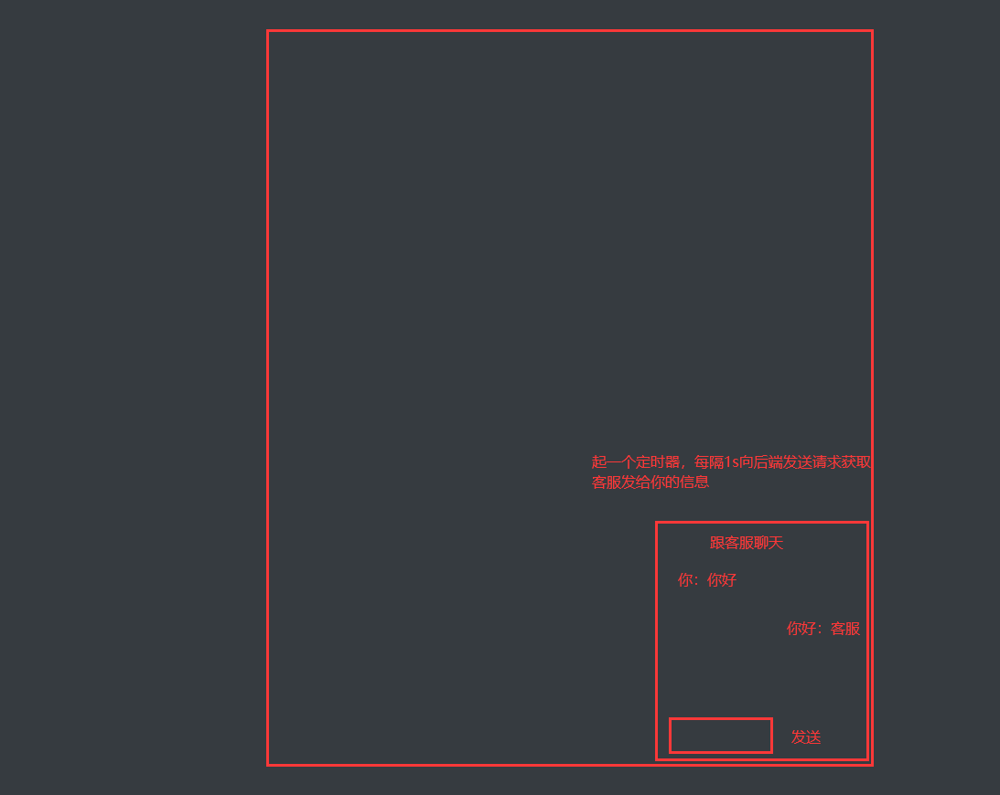
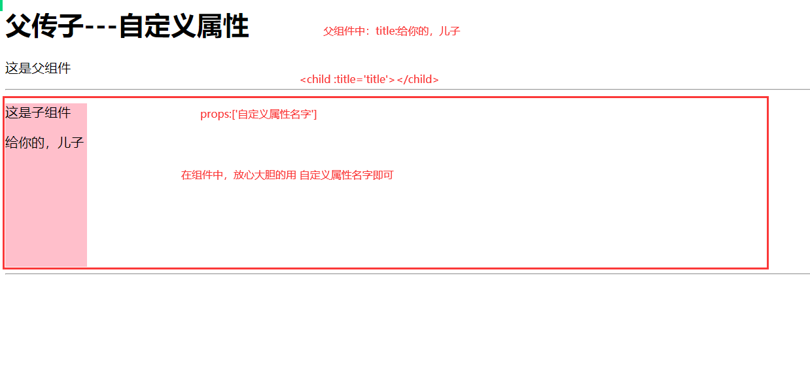
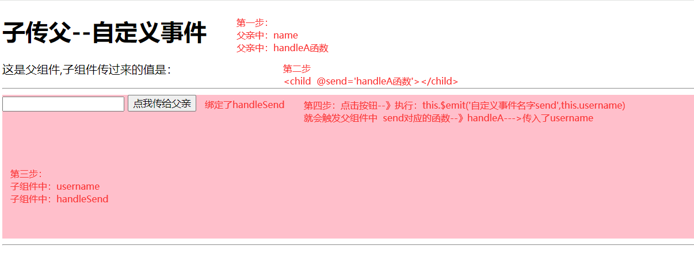

# 考试

```python
# 用户名密码错误的情况，统一返回格式


# 总结
	1 认证类：
    	from rest_framework_simplejwt.authentication import JWTTokenUserAuthentication
        from rest_framework_simplejwt.authentication import JWTAuthentication
        JWTTokenUserAuthentication：假user对象，当前user中只会有 payload中得字段
        JWTAuthentication：真user对象，去数据查出来的，字段更全
        
        后期我们用哪个？
        	-如果后期我们不使用user中得其他字段，用JWTTokenUserAuthentication，效率高，不查数据库
            -如果我们后期我们使用user中得其他字段，使用它，效率低，每个需要登录后才能访问的接口，都会查一次数据库
            
            
```

# 昨日回顾

```python
# 1 箭头函数
	-1 箭头函数内部没有自己的this---》使用外层的this---》以后见到的基本都是箭头函数
    -2 var f=a=>a+1
    
# 2 js 的循环
	for i
    for in
    for of
    数组.forEach
    jq的each循环

# 3 事件修饰符
	-stop
    -self
    -prevent
    -once

# 4 按键修饰符
	-按键事件
    	-@keyup='函数名'
    -按键修饰符
    	-只能按某个键，弹起时，才触发
     	--@keyup.数字='函数名'    # keyCode对应码
        
        
# 5 表单控制
	1 checkbox 单选---》布尔类型
    2 checkbox 多选---》数组---》value的值
    3 radio  单选---》字符串--》value的值
    
    
# 6 购物车案例
	
    
# 7 v-model进阶
	-lazy
    -number
    -trim
    
    
# 8 ajax
	-原生：XMLHttpRequest
 	-jq的ajax  $.ajax({})
    -fetch：js原生，不需要引入第三方
    -axios：第三方，基于XMLHttpRequest封装的
    
    -跨域问题：目前先忽略
```


# 今日内容

# 1 ajax


## 1.1 补充：nodejs

```python
# 1 javascript:ECMA+bom+dom--->浏览器中执行的
# 2 ECMA 不同版本  

# 3 TypeScript：微软
	-js：弱类型动态语言
    -强类型语言：类型---》编译成js在浏览器中允许
    -ts是js的超集：ts完全兼容js的语法
    -闭包函数是装饰器的超集
    
    
    
# 4 后端：go，python，c，java，php
	-谷歌浏览器的v8引擎：js解释器
    -使用c重写了--》能够运行在操作系统上--》文件处理，数据操作，网络
    	-在这个环境中写js语法了
    -nodejs：后端语言，运行在解释器之上
    	-node     python # 今日交互式命令行
        -npm      pip  # 安装依赖
    
    -vue+nodejs 全栈
    -vue+python 全栈
    -vue+java   全栈
    -react+go   全栈
    
    
```


## 1.2 案例

```python
# 1  axios+vue====>后端接口返回一堆电影数据---》vue显示
```

```html
<!DOCTYPE html>
<html lang="en">
<head>
    <meta charset="UTF-8">
    <title>电影案例</title>
      <script src="https://unpkg.com/axios@1.7.3/dist/axios.min.js"></script>
    <script src="./vue2/vue.js"></script>

</head>
<body>
<div class="app">
    <h1>电影案例</h1>
    <button @click="handleLoad">加载电影数据</button>
    <ul>
        <li v-for="item in film_list">
            <h2>{{item.name}}</h2>
            
            <p>
                {{item.synopsis}}
            </p>

        </li>
    </ul>


</div>
</body>
<script>
    var vm = new Vue({
        el: '.app',
        data:{
            film_list:[]
        },
        methods:{
            handleLoad(){
                axios.get('http://127.0.0.1:5000/films').then(res=>{
                    console.log(res)
                    this.film_list=res.data.results
                })

            }
        }
    })

</script>
</html>


```

```python
from flask import Flask,jsonify
import json
app=Flask(__name__)
@app.route('/info')
def info():
    res=jsonify({'username':'张三','age':99,'gender':'男'})
    res.headers['Access-Control-Allow-Origin']='*'  # 解决跨域问题
    return res


@app.route('/films')
def films():
    with open('./fims.json','rt',encoding='utf-8') as f:
        films_str=json.load(f)
    res = jsonify(films_str)
    res.headers['Access-Control-Allow-Origin'] = '*'  # 解决跨域问题
    return res

if __name__ == '__main__':
    app.run()
```


# 2 计算属性-监听属性

## 2.1 计算属性

```python
# 1 本质是一个函数，但是当属性用

# 2 计算属性和普通函数的区别
	-1 如果使用计算属性，只要 计算属性中使用的变量，发生变化时，计算属性才重新运算
    -2 如果使用函数，只要页面发生变化，函数就会重新运算
    -3 计算属性当属性用，可以被for循环，可以被v-if判断
```

### 2.1.1  基本使用

```html
<!DOCTYPE html>
<html lang="en">
<head>
    <meta charset="UTF-8">
    <title>计算属性</title>
    <script src="./vue2/vue.js"></script>

</head>
<body>
<div class="app">
    <h1>用户输入英文名-首字母转大写</h1>
    <h2>年龄：{{age}}</h2>
<!--    <input type="text" v-model="name"> -&ndash;&gt;{{name}}-->
<!--    <input type="text" v-model="name"> -&ndash;&gt;{{name.substring(0,1).toUpperCase()+name.substring(1)}}-->
<!--    <input type="text" v-model="name"> -&ndash;&gt;{{toUpper()}}-->
    <input type="text" v-model="name"> --->{{newName}}


</div>
</body>
<script>
    var vm = new Vue({
        el: '.app',
        data:{
            name:'',
            age:100
        },
        methods:{
            toUpper(){
                console.log('函数执行了')
                return  this.name.substring(0,1).toUpperCase()+this.name.substring(1)
            }
        },
        computed:{
            newName(){
                console.log('计算属性执行了')
                return  this.name.substring(0,1).toUpperCase()+this.name.substring(1)
            }
        }
    })

</script>
</html>


```


### 2.1.2 实用计算属性重写过滤案例

```html
<!DOCTYPE html>
<html lang="en">
<head>
    <meta charset="UTF-8">
    <title>过滤案例</title>
    <script src="./vue2/vue.js"></script>

</head>
<body>
<div class="app">
    <h1>过滤案例</h1>
    <input type="text" v-model="search">
    <hr>
    <ul>
        <li v-for="item in newDataList">{{item}}</li>
    </ul>


</div>
</body>
<script>
    var vm = new Vue({
        el: '.app',
        data: {
            search: '',
            dataList: ['a', 'at', 'atom', 'atommon', 'be', 'beyond', 'cs', 'csrf'],
        },
        computed:{
            newDataList(){
                return this.dataList.filter(item =>item.indexOf(this.search) >= 0)
            }
        }
    })

</script>
</html>


```


## 2.2 监听属性

```python
# 1 监听一个属性的变化，只要属性发生了变化，就执行 xx代码
```

```html
<!DOCTYPE html>
<html lang="en">
<head>
    <meta charset="UTF-8">
    <title>监听属性</title>
    <script src="./vue2/vue.js"></script>

</head>
<body>
<div class="app">
    <button @click="goods_type='国产'">国产</button>
    <button @click="goods_type='日韩'">日韩</button>
    <button @click="goods_type='欧美'">欧美</button>
    <hr>
    {{goods_type}}


</div>
</body>
<script>
    var vm = new Vue({
        el: '.app',
        data: {
            goods_type:'国产'
        },
        watch:{
            goods_type(){
                console.log('goods_type变了,变成'+this.goods_type)
                // 只要类型发送变化--》向后端接口发请求，重新过滤按这个类型查询到得数据
            }
        }


    })

</script>
</html>


```

# 3 生命周期

```python
# 1 vue组件：从创建开始--》到被销毁经历了一个过程
	-过程中会有一些函数--》到某个过程时，就会触发这个函数的执行
    -8 个生命周期钩子函数
    
    
# 2 8个 （创建，挂在，更新，销毁）
    beforeCreate	    创建 Vue实例/组件之 前调用
    created	            创建Vue实例成功后调用（可以在此处发送异步请求后端数据）
    beforeMount	        渲染DOM之前调用（可以在此处发送异步请求后端数据）
    mounted	            渲染DOM之后调用
    beforeUpdate	    重新渲染之前调用（数据更新等操作时，控制DOM重新渲染）
    updated	            重新渲染完成之后调用
    beforeDestroy	   销毁之前调用
    destroyed	      销毁之后调用
    
    
    
# 3 重点
	-created会经常用：组件创建完成，就向后端发送ajax请求获取数据
    -beforeDestroy 可能会用
    
    
# 4 案例

```


```html
<!DOCTYPE html>
<html lang="en">
<head>
    <meta charset="UTF-8">
    <title>生命周期</title>
    <script src="./vue2/vue.js"></script>

</head>
<body>
<div class="app">
    <h1>组件的生命周期</h1>
    <hr>
    <Child v-if="show"></Child>
    <hr>


<div>

</div>
</div>
</body>
<script>


    //  创建一个组件
    Vue.component('Child',{
        template:`
          <div>
            <h1>我是一个组件</h1>
            <h3>{{name}}</h3>
          <button @click="hanleChange">点我换名字</button>
          </div>`,
        data(){
            return {
                name:'张三',
                t:null
            }
        },
        methods:{
            hanleChange(){
                this.name='彭于晏'
            }
        },
        beforeCreate() {
            console.log('beforeCreate')
        },
        created() {
            console.log('created---发送ajax请求')
            // 开启定时器==》每隔3s，打印hello world
            this.t=setInterval(()=>{
                console.log('hello world')
            },3000)
        },
        beforeMount() {
            console.log('beforeMount')

        },
        mounted() {
            console.log('mounted')

        },
        beforeUpdate(){
            console.log('beforeUpdate')
        },
        updated(){
            console.log('updated')
        },
        beforeDestroy() {
            console.log('beforeDestroy')
            clearInterval(this.t)
            this.t=null


        },
        destroyed() {
            console.log('destroyed')


        }

    })


    var vm = new Vue({
        el: '.app',
        data:{
            show:false
        },


    })

</script>
</html>


```





# 作业

```python
# 1 上课讲的代码，都敲一遍
	-后端用django写

#2 实现：跟你同桌实时聊天
	-后端
    -前端：运行在 0.0.0.0
```

```html
<!DOCTYPE html>
<html lang="en">
<head>
    <meta charset="UTF-8">
    <title>生命周期</title>
    <script src="./vue2/vue.js"></script>

</head>
<body>
<div class="app">
    <h1>聊天</h1>
    <button @click="handleShow">开始聊天/关闭</button>
    <hr>
    <online v-if="show"></online>
    <hr>


<div>

</div>
</div>
</body>
<script>


    //  创建一个组件
    Vue.component('online',{
        template:`
          <div>
            <h1>聊天框</h1>
            姓名：<input type="name" v-model="name">
            内容：<input type="text" v-model="text"> <button @click="haneldSend">发送</button>
          <hr>
          <ul>
            <li v-for="item in chat_list">
            {{item.user}} 说：{{item.content}}
            </li>
          </ul>

          </div>`,
        data(){
            return {
                name:'张三',
                t:null,
                chat_list:[{'user':'张三','content':'大傻逼'},{'user':'李四','content':'反弹'},]
            }
        },
        methods:{
            haneldSend(){
                // ajax请求，携带 text--》到后端--》get-->127.0.0.1:8080/api/v1/chat/?text=你好&user=张三
                // 存到后端数据库： 人    内容
            }
        },
        beforeCreate() {
            console.log('beforeCreate')
        },
        created() {
            // 先拿所有聊天
            console.log('created---发送ajax请求')
            // 开启定时器==》每隔3s，打印hello world
            this.t=setInterval(()=>{
                console.log('hello world')
                // 每隔3s，向后端拿所有聊天记录
                // v-for循环渲染在页面上即可
            },3000)
        },
        beforeMount() {
            console.log('beforeMount')

        },
        mounted() {
            console.log('mounted')

        },
        beforeUpdate(){
            console.log('beforeUpdate')
        },
        updated(){
            console.log('updated')
        },
        beforeDestroy() {
            console.log('beforeDestroy')
            clearInterval(this.t)
            this.t=null


        },
        destroyed() {
            console.log('destroyed')


        }

    })


    var vm = new Vue({
        el: '.app',
        data:{
            show:false
        },
        methods:{
            handleShow(){
                this.show=!this.show
            }
        }


    })

</script>
</html>


```


# 4 组件

```python
# 1 组件：有自己的html，css，js
	
# 2 后面我们写组件，就是写一个 xx.vue
	在指定的位置写html，css，js
    
    
# 3 局部组件和全局组件

```

```html
<!DOCTYPE html>
<html lang="en">
<head>
    <meta charset="UTF-8">
    <title>组件</title>
    <script src="./js2/vue.js"></script>

</head>
<body>
<div class="app">
    <h1>组件</h1>
    <child></child>
    <hr>
    <child2></child2>

</div>


</body>
<script>
    //1 全局组件---》可以在其他组件中直接使用
    // 组件有自己的 生命周期，数据，事件，计算属性，监听属性。。。
    // 组件的data必须是个方法，返回对象
    Vue.component('child', {
        template: `
          <div>
          <div style="height: 200px;width: 100px;background-color: pink">
          </div>
          </div>`,
        data() {
            return {}
        },

    })


    // 2 局部组件--->只能用在它父亲中,定义在组件的components 配置项上

    var vm = new Vue({
        el: '.app',
        data: {},
        methods: {},
        components: {
            'child2': {
                template: `
                  <div>
                  <button>后退</button>
                  <span style="font-size: 30px">标题</span>
                  <button>前进</button>
                  </div>`,
                data() {
                    return {}
                },
                methods: {}
            }
        }

    })


</script>
</html>


```


# 5 组件通信之父传子

```python
# 1 组件和组件之间数据隔离，但是有时候，我们想组件和组件之间通信

# 2 父传子

```



```html
<!DOCTYPE html>
<html lang="en">
<head>
    <meta charset="UTF-8">
    <title>父传子---自定义属性</title>
    <script src="./js2/vue.js"></script>

</head>
<body>
<div class="app">
    <h1>父传子---自定义属性</h1>
    <p>这是父组件</p>
    <hr>
    <child :mytitle="title" aa="lqz" :bb="true"></child>
    <hr>


</div>


</body>
<script>

    Vue.component('child', {
        template: `
          <div>
          <div style="height: 200px;width: 100px;background-color: pink">
            <p>这是子组件</p>
            <p>{{mytitle}}</p>
          </div>
          </div>`,
        data() {
            return {}
        },
        props:['mytitle','aa'],

    })


    var vm = new Vue({
        el: '.app',
        data: {
            title:'给你的，儿子'
        },

    })


</script>
</html>


```


# 6 组件通信之子传父



```html
<!DOCTYPE html>
<html lang="en">
<head>
    <meta charset="UTF-8">
    <title>子传父--自定义事件</title>
    <script src="./js2/vue.js"></script>

</head>
<body>
<div class="app">
    <h1>子传父--自定义事件</h1>
    <p>这是父组件,子组件传过来的值是：{{name}}</p>
    <hr>
    <child  @send_data="handleA"></child>
    <hr>


</div>


</body>
<script>

    Vue.component('child', {
        template: `
          <div>
          <div style="height: 200px;background-color: pink">
            <input type="text" v-model="username"> <button @click="handleSend">点我传给父亲</button>
            <br>
            {{username}}
          </div>
          </div>`,
        data() {
            return {
                username:''
            }
        },
        methods:{
            handleSend(){
                //传给父亲
                // this.$emit('自定义事件名字','参数')
                this.$emit('send_data',this.username)
            }
        }

    })


    var vm = new Vue({
        el: '.app',
        data: {
            name:''
        },
        methods: {
            handleA(name){
                this.name=name
            }
        }

    })


</script>
</html>


```


# 7 ref属性

```python
# 1 ref 属性也可以做组件间通信
# 2 ref是vue提供的属性--》可以放在任意标签或组件上
	-如果放在标签上
    	-通过  this.$refs.标签上的名字   拿到的值是 标签 对象
        -我们可以通过标签对象，修改 标签的属性。。。src属性，value属性
    -如果放在组件上
    	-通过  this.$refs.标签上的名字   拿到的值是 组件 对象
        -我们可以通过 组件对象，直接修改对象中得数据，直接调用对象中得方法
```

```html
<!DOCTYPE html>
<html lang="en">
<head>
    <meta charset="UTF-8">
    <title>ref属性</title>
    <script src="./js2/vue.js"></script>

</head>
<body>
<div class="app">
    <h1>ref属性</h1>
    
    <br>
    <input type="text" ref="myinput">

    <button @click="handleClick">点我看控制台</button>

    <hr>

    <child ref="mychild"></child>


</div>


</body>
<script>
    Vue.component('child', {
        template: `
          <div>
          <div style="height: 200px;width: 100px;background-color: pink">
            <p>这是子组件</p>
            <p>{{name}}</p>
          </div>
          </div>`,
        data(){
            return {
                name:"lqz"
            }
        },
        methods:{
            handleA(a){
                console.log(a)
                this.name=a
            }
        }

    })


    var vm = new Vue({
        el: '.app',
        data: {
            name:''
        },
        methods:{
            handleClick(){
                console.log(this.$refs)

                // 改图片地址
                // console.log(this.$refs.myimg)
                // this.$refs.myimg.src='./img/2.jpg'

                //改input内容
                // console.log( this.$refs.myinput)
                //  this.$refs.myinput.value='xxxx'

                //拿到组件对象
                //1 在父亲中，改了子的值
                // this.$refs.mychild.name='xxxxxx'
                //2 把子中得值，赋值给父亲
                // this.name=this.$refs.mychild.name
                // console.log(this.name)
                //3 调用子的方法，传入父的参数
                this.$refs.mychild.handleA('66666')

            }
        }


    })


</script>
</html>


```


