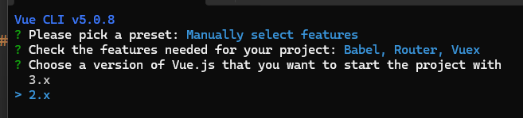

# 上节回顾

```python
# 1 ajax小电影案例
	1 后端: flask -> 返回json格式数据
    2 前端: axios -> get请求 -> 把数据给js的film_list
    	-页面使用v-for循环
        
        
# 2 计算属性
	-函数 ->加括号用 -> 只要页面变化 -> 函数都会重新运算
    -计算属性 -> computed中 -> 函数一定要return -> 这个函数名就可以当属性用
    	-v-if 判断
        -v-for循环
        -只有计算属性中使用的变量发生变化,才会重新运算

# 3 监听属性
	-定义很多属性 -> 当某个属性发生变化时 -> 触发某个事执行(函数)
    -watch: 属性(){}
    
    
# 4 生命周期
	-vue 组件 -> 从创建开始,到被销毁,经历的过程
    -beforeCreate
    -created: 组件中定义的变量,方法 -> 已经初始化完成了
    	-向后端发送请求
    -beforeMount
    -mounted
    -beforeUpdate
    -updated
    -beforeDestroy
    	-清理工作
    -destroyed
```


# 今日内容

# 1 组件

```python
# 1 组件是什么？
	单文件组件- -> 类html ->  xx.vue--->vue项目中
    组件是: 有自己的html,css,js,事件,生命周期。。。。 对象
    全局组件,局部组件
    
# 2 定义一个全局组件:
```

## 1.1 全局组件

```html
<!DOCTYPE html>
<html lang="en">
<head>
    <meta charset="UTF-8">
    <title>组件</title>
    <script src="./vue2/vue.js"></script>

</head>
<body>
<div class="app">
    <h1>组件</h1>
    <child></child>
    

</div>
</body>
<script>

    // 定义了一个全局组件 -> 就可以用在 根组件中
    Vue.component('child',{
        template:`<div>
                    <h1>{{name}}</h1>
                    <button @click="handleClick">点我-弹美女</button>
                  </div>`,
        data(){
            return {
            name:'sheenagh'
        }},
        methods:{
            handleClick(){
                alert("美女")
            }
        }
    })

    // 根组件
    var vm = new Vue({
        el: '.app',

    })

</script>
</html>
```

## 1.2 局部组件

```html
<!DOCTYPE html>
<html lang="en">
<head>
    <meta charset="UTF-8">
    <title>组件</title>
    <script src="./vue2/vue.js"></script>

</head>
<body>
<div class="app">
    <h1>组件</h1>
    <child></child>
</div>
</body>
<script>
    var child1 = {
        template: `
          <div>
          
          </div>`,
        data() {
            return {
                img_src: './img/1.png'
            }
        },
        methods: {
            handleChange() {
                this.img_src = './img/2.png'
            }
        }

    }
    Vue.component('child', {
        template: `
          <div>
          <h1>{{ name }}</h1>
          <button @click="handleClick">点我-弹美女</button>
          <hr>
          <child1></child1>
          </div>`,
        data() {
            return {
                name: 'sheenagh'
            }
        },
        methods: {
            handleClick() {
                alert("美女")
            }
        },
        components: {
            child1
        }
    })
    // 老写法
    // Vue.component('child',{
    //      template:`<div>
    //                  <h1>{{name}}</h1>
    //                  <button @click="handleClick">点我-弹美女</button>
    //                  <hr>
    //                  <child1></child1>
    //                </div>`,
    //      data(){
    //          return {
    //          name:'sheenagh'
    //      }},
    //      methods:{
    //          handleClick(){
    //              alert("美女")
    //          }
    //      },
    //     components: {
    //          child1:{
    //              template: `<div>
    //                      
    //                      </div>`,
    //              data(){
    //                  return {
    //                      img_src:'./img/1.png'
    //                  }
    //              },
    //              methods:{
    //                  handleChange(){
    //                      this.img_src='./img/2.png'
    //
    //                  }
    //              }
    //
    //          }
    //     }
    //  })
    // 根组件
    var vm = new Vue({
        el: '.app',
    })
</script>
</html>
```

## 1.3 动态组件使用

```html
<!DOCTYPE html>
<html lang="en">
<head>
    <meta charset="UTF-8">
    <title>组件</title>
    <script src="./vue2/vue.js"></script>
</head>
<body>
<div class="app">
    <h1>不使用动态组件</h1>
    <!--    <button @click="choose_type='child1'">生鲜</button>-->
    <!--    <button @click="choose_type='child2'">水产</button>-->
    <!--    <button @click="choose_type='child3'">肉类</button>-->
    <!--    <hr>-->
    <!--    <child1 v-if="choose_type =='child1'"></child1>-->
    <!--    <child2 v-else-if="choose_type =='child2'"></child2>-->
    <!--    <child3 v-else></child3>-->
    <h1>使用动态组件</h1>
    <button @click="choose_type='child1'">生鲜</button>
    <button @click="choose_type='child2'">水产</button>
    <button @click="choose_type='child3'">肉类</button>
    <hr>
    <component :is="choose_type"></component>
</div>
</body>
<script>
    Vue.component('child1', {
        template: `<div>
                <h3>生鲜</h3>
                
            </div>`
    })

    Vue.component('child2', {
        template: `<div>
                <h3>水产</h3>
            </div>`
    })

    Vue.component('child3', {
        template: `<div>
                <h3>肉类</h3>
            </div>`
    })


    // 根组件
    var vm = new Vue({
        el: '.app',
        data: {
            choose_type: 'child1'
        }
    })
</script>
</html>
```


## 1.2 keep-alive

```html
<!DOCTYPE html>
<html lang="en">
<head>
    <meta charset="UTF-8">
    <title>组件</title>
    <script src="./vue2/vue.js"></script>
</head>
<body>
<div class="app">
    <h1>keep-alive使用</h1>
    <button @click="choose_type='child1'">生鲜</button>
    <button @click="choose_type='child2'">水产</button>
    <button @click="choose_type='child3'">肉类</button>
    <hr>
    <keep-alive>
        <component :is="choose_type"></component>
    </keep-alive>
</div>
</body>
<script>
    Vue.component('child1', {
        template: `<div>
                <h3>生鲜</h3>
                
            </div>`
    })

    Vue.component('child2', {
        template: `<div>
                <h3>水产</h3>
            </div>`
    })

    Vue.component('child3', {
        template: `<div>
                <h3>肉类</h3>
                <input type="text" v-model="search"> <button @click="handleSearch">搜索</button>
            </div>`,
        data(){
            return {
                search:''
            }
        },
        methods:{
            handleSearch(){
                alert('您搜索的内容是: '+this.search)
            }
        }
    })


    // 根组件
    var vm = new Vue({
        el: '.app',
        data: {
            choose_type: 'child1'
        }

    })

</script>
</html>


```

# 2 插槽

## 2.1 基本插槽

```python
# 1 有个组件 
	<child/>
    <child>可以放内容</child>
    
# 2 插槽的作用
	写在组件标签中的  数据
    都会被赋值并替换掉组件中得<slot></slot> 
```

```html
<!DOCTYPE html>
<html lang="en">
<head>
    <meta charset="UTF-8">
    <title>插槽</title>
    <script src="./vue2/vue.js"></script>

</head>
<body>
<div class="app">
    <h1>插槽</h1>
    <child1>
        <div>
            <p>介绍: 这是一个大帅比</p>
        </div>
    </child1>


    <hr>
    <child1>
        
    </child1>


</div>
</body>
<script>
    Vue.component('child1', {
        template: `<div>
                <h3>生鲜</h3>
                
                <br>
                <slot></slot>
            </div>`
    })

    // 根组件
    var vm = new Vue({
        el: '.app',

    })

</script>
</html>


```


## 2.2 具名插槽

```html
<!DOCTYPE html>
<html lang="en">
<head>
    <meta charset="UTF-8">
    <title>插槽</title>
    <script src="./vue2/vue.js"></script>

</head>
<body>
<div class="app">
    <h1>插槽</h1>
    <child1>
        <div slot="a">
            <button>点我</button>
        </div>
        <div slot="b">
            <h3>我是h3标题</h3>
        </div>
    </child1>
</div>
</body>
<script>
    Vue.component('child1', {
        template: `<div>
                <h3>生鲜</h3>
                <slot name="a"></slot>
                
                <br>
                <slot name="b"></slot>
            </div>`
    })
    // 根组件
    var vm = new Vue({
        el: '.app',
    })
</script>
</html>
```


# 3 vue项目创建

```python
# 1 关于版本
	-vue2: 只能用vue-cli创建
    -vue3: 既可以用vue-cli又可以用vite
    
# 2 vue-cli: vue 脚手架,用来创建vue空项目的工具(软件)
	-安装: 必须依赖于nodejs的环境 -> 类比django-admin
   
# 3 搭建node环境 -> 搭建python环境
	-nodejs: 22.11.0版本
    -下载安装包: 分平台
   	-一路下一步安装即可
    -有两个命令
        node: 就是python
        npm: 就是pip
        
# 4 npm源的替换（包管理工具）
	-npm 下载第三方包时,去国外下,速度很慢
    -替换一下国内镜像站: 阿里云源
    	-npm config set registry http://registry.npmmirror.com
        -这个就是阿里云的
        -npm config get registry
        
    -使用阿里云提供的cnpm替代npm: 提示和显示更友好
    	-npm install -g cnpm --registry=https://registry.npmmirror.com
        -以后用cnpm替代npm即可
        
# 5 nodejs的包管理工具 : 管理第三方包的工具
	npm: 默认 -> 速度慢 -> 配置了镜像站 -> 串行
    yarn: 第三方,单独装,速度快 -> 并发下载
    cnpm: 阿里提供的,使用阿里镜像站 -> 速度快
    
# 6 安装 vue-cli--就能创建vue项目
	cnpm install -g @vue/cli  # pip install django -> djang-admin.exe -> 创建项目
    安装完成,会释放出一个vue命令
    
# 7 vue-cli创建项目
	cmd在某目录下 
    vue create 项目名
    按下图配置,创建
    空格是选中配置
    
# 8 使用编辑器打开 -> pycharm

# 9 项目运行的两种方式
	-方式一: terminal中
    	npm run serve
    -方式二: pycharm 点绿色箭头运行
    	配置一个 npm 命令
    	
```





# 4 vue项目目录结构

```python
# s30_vue2_demo01 项目名
	-node_modules: 黄色是被git管理了表示忽略文件 -> 当前项目的所有依赖 -> 如果没有项目运行不了
    			  相当于python项目中有个文件夹 .venv
        		   特别多小文件 -> 把项目发送给别人,这个文件夹删除
                    cnpm install  #项目根路径下执行,就会重新创建出来,根据package.json安装
                
    -public # 文件夹
    	-favicon.ico  # 网页小图标,可以替换
        -index.html   # vue: spa 单页面应用 -> 只有一个html页面 -> 不要动它
        
    -src             #文件夹 ,vue的核心代码,后期我们都在这里面写代码
        -assets      # 文件夹,放公共静态资源,js,css,图片
        	-logo.png  # 静态图片,在页面中会使用
	   -components   #文件夹 组件,以后小组件放在这个文件夹内【页面组件和小组件】
    		-HelloWorld.vue # 默认提供的小组件
       		-后期我们写的小组件放这里
       -router      #文件夹,第三方包,vue-routr的东西,后面会详细学   路由
			-index.js # vue-router的代码
       -store       #文件夹,第三方包,vuex的东西,后面会详细学   状态管理器
    		-index.js # vuex的代码

        
   	  -views      # #文件夹 组件,以后页面组件放在这个文件夹内【页面组件和小组件】
        	-AboutView.vue  # 关于页面
        	-HomeView.vue   # 首页
        
      -App.vue   # 根组件
      -main.js   # vue项目的核心js文件,项目运行从他开始
        
   -.gitignore        # git管理软件的忽略文件 -> 后面会学git
   -babel.config.js   # babel的配置文件,不用动,vue支持最新es语法 -> 把新版本语法--转成es5语法
   -jsconfig.json     # 不用管
   -package.json      # 配置信息,项目依赖,后面会用axios,装完后,在里面就有
   -package-lock.json # package锁定文件,锁定版本
   -README.md         # 项目描述文件
   -vue.config.js     # vue项目配置文件 -> settings.py

        
        
# 补充: 
	svg图片: 可以无限放大缩小
    ico,png,jpg: 图片文件,放大后看不清
    
    
# pycharm中删除的文件找回
	-项目上点右键 -> show history--——》revert回来即可
```

# 5 vue开发规范

## 5.1 vue项目执行流程

```python
# 1 我们运行: npm run serve   -> 编译并运行项目
	-xx.vue--->浏览器识别不了 -> 浏览器只能识别 html,css,js
    -把vue项目 -> 编译 -> 编译成功纯粹的  html,css,js -> 运行起来 -> 浏览器中访问
    -后期vue项目上线,需要编译后上线
    	npm run build
    -开发阶段,点绿色箭头运行即可
    
# 2 重点
	index.html--->div->id叫app
    App.vue ---> 组件 -> 在固定的位置写固定的代码即可
    	-<template>   html内容
        -<style>       css内容
        -<script>       js内容
    main.js -> js代码
    	# 找到 index.html-->app这个div -> 把App.vue组件中写的东西,放到index.html中
    	new Vue({
              render: h => h(App.vue)
           }).$mount('#app')
```

## 5.1 vue开发

```python
# 1 访问根路径,显示 HomeView.vue这个组件
	-通过vue-router控制的: router-->index.js
        const routes = [  #  django 的urls.py
              {
                path: '/',
                name: 'home',
                component: HomeView
              },
             {
                path: '/about',
                name: 'about',
                component: AboutView
              },
           ]
        
# 2 目前可以访问 -> 显示原理是vue-router控制的
	http://192.168.1.252:8081/   -> 显示 HomeView 组件
    http://192.168.1.252:8081/about -> 显示 AboutView 组件
    
# 3 App.vue -->根组件
	-如果没有vue-router,访问 根路径会显示 App.vue中写的东西
    -只保留: 
    <template>
      <div id="app">
        <router-view/>
      </div>
    </template>
    
    
# 4 总结: 以后我们想新建页面
	1 在view文件夹下创建  LoginView.vue--- >页面组件
    2 在router -> index.js  注册路由
    3 浏览器中访问路径,就会显示 刚刚创建的组件
    
# 5 页面组件编写规范: 三部分
	-<template>   html内容
    -<style>       css内容
    -<script>       js内容
    	export default {
		}
        
# 6 引入组件使用
	1 导入
    2 注册成局部组件
    3 在template 写即可
    这里讲了HelloWorld.vue组件怎么用
```


# 6 es6语法

## 6.1 let,const

```python
# let 定义变量
# const定义常量
------块级作用域------
# var 以后尽量少用,函数作用域

# 在ES6之前,我们都是用var来声明变量,而且JS只有函数作用域和全局作用域,没有块级作用域,所以{}限定不了var声明变量的访问范围。

# ES6 新增了let命令,用来声明局部变量。它的用法类似于var,但是所声明的变量,只在let命令所在的代码块内有效,而且有暂时性死区的约束

# "暂时性死区"（Temporal Dead Zone,简称 TDZ）是指在 ES6 中使用 let 或 const 声明变量时,变量存在但无法访问的区域。这种行为是为了在 JavaScript 中引入块级作用域而设计的。
# 暂时性死区就相当于声明前的部分 在这个死区内用了就会报错

# 在 JavaScript 中,使用 var 声明的变量在其声明语句之前就可以被访问,这种行为称为"变量提升"。而在使用 let 或 const 声明变量时,变量虽然存在于作用域中,但是在声明语句之前访问这些变量会导致引发 ReferenceError 异常。

# 暂时性死区的产生原因是,let 和 const 声明的变量在进入作用域时就已经被创建,并且被绑定到了该作用域中,但是在变量的声明语句之前,访问这些变量会进入暂时性死区,因为此时变量尚未初始化

# python的LEGB  python变量作用域范围
# LEGB和TDZ都是面试会考的点
```

## 6.2 箭头函数

```python
# 1 简化代码
# 2 箭头函数内部,没有自己的this -> 使用上一级的
	let f=()=>{
        console.log(this); // 这个this是继承外部作用域的this
    }

# 3 ##### this指向问题 #####
# 3.1 在全局上下文中,this 指向全局对象【放值取值】,在浏览器环境中通常是 window 对象,在 Node.js 中是 global 对象
    console.log(this) # window 对象 / global 对象
    
# 3.2 函数调用: 
    # 2.1 如果函数作为普通函数调用,this 指向全局对象（在严格模式下为 undefined）
    function regularFunction() {
  		console.log(this);  
        // 在浏览器中是 `window`，在 Node.js 中是 `global`，在严格模式下是 `undefined`
	}
	regularFunction();
    # 2.2 如果函数作为对象的方法调用,this 指向调用该方法的对象。
    const person = {
      name: 'Alice',
      greet: function() {
      	console.log(this.name);  
        // `this` 指向 person 对象，输出: Alice
      }
    };
    person.greet();
    

# 3.3 构造函数: 
	在构造函数中,this 指向新创建的实例对象
    function Person(name) {
      this.name = name;  // `this` 指向新创建的实例
    }

    const p = new Person('Alice');
    console.log(p.name);  // 输出: Alice
    
##### 总结: 
	在对象内,this代指当前对象
    如果是函数,this代指全局对象global,window,undefine
    箭头函数没有自己的this,使用上一层

# 4 箭头函数: 
箭头函数的 this 指向定义时所在的作用域的 this 值,而不是调用时的 this 值。换句话说,箭头函数的 this 是词法作用域,而不是动态作用域

# 5 DOM 事件处理函数: 
在 DOM 事件处理函数中,this 指向触发事件的 DOM 元素

# 6 ES6 类方法: 
在 ES6 类方法中,this 指向调用该方法的对象实例
```

## 6.3 模版字符串

```python
let a=`我的名字是:${name}`
```

## 6.4 解构赋值

```python
# 1 解构赋值允许从数组或对象中提取数据,并将其赋值给变量。
    let user = {name: 'sheenagh', age: 19, hobby: '烫头',girls:['刘亦菲','迪丽热巴']}
    let {name,age=999,girls,height=190} = user
    如果解构的值在对象中没有,就undefind,同时可以赋初值
# 2 解构赋值可以方便地交换变量的值,同时还支持默认值
```

```js
 // 1 解对象
    let user = {name: 'sheenagh', age: 19, hobby: '烫头'}
    // let name=user.name
    // let age=user.age
    let {name,age,hobby,a=10} = user
    console.log(name,age,hobby,a)
	// sheenagh 19 烫头 10

    // 2 解数组
    let l=[11,22,33]
    let[a,b]=l
    console.log(a,b)
	// 11 22

    // 3 解构函数返回值
    function getuserInfo() {
        return {name: 'sheenagh', age: 19, hobby: ['烫头', '喝酒']}
    }

    let {name1='1', hobby} = getuserInfo()
    console.log(name1, hobby)
	// 1 ['烫头', '喝酒']

```

## 6.5 默认参数

```python
# ES6 允许在函数参数中设置默认值,当调用函数时未提供参数时,将使用默认值

# 案例
function demo01(name,age=23) {
    console.log(name,age)
}
demo01('sheenagh')
// sheenagh 23
```

## 6.6 展开运算

```python
# 1 展开运算符 ... 可以将可迭代对象（如数组、字符串、对象）展开为多个参数或元素。

# 2 也可以用于函数参数

# 案例1 展开对象
let a={age:23,hobby:'抽烟'}
let user={name:'sheenagh',age:20,...a}
console.log(user)
// {name: 'sheenagh', age: 23, hobby: '抽烟'}
// 23会被覆盖 后面覆盖前面

# 案例2 展开数组
let l=[1,2,3]
let l1=[44,55,66,...l]
console.log(l1)
// [44, 55, 66, 1, 2, 3]

# 案例3 展开函数
function demo01(a,...b){
    console.log(a)
    console.log(b)
}
demo01(1,2,34,4)
// 1
// 2,34,4

let l=[44,5,66,7]
demo01(...l)
// 44
// 5,66,7
```

## 6.7 模块化

### 6.7.1 默认导出和导入

```js
// 1 导出
let name='sheenagh'
function add(a,b){
    return a+b
}
// 必须导出,外部才能使用
// 1 默认导出 -> 只能导出一次
export default {
    name,
    add
}
// 2 导入
<script type="module">
    // 默认导出的导入
    import utils from './sheenagh/utils.js'
    console.log(utils.name)
    let res=utils.add(3,4)
    console.log(res)
</script>
```

### 6.7.2 命名导出和导入

```js
// 1 命名导出
export let name='sheenagh'
export function add(a,b){
    return a+b
}
export const age=100

// 2 导入
// 2.1 命名导出的导入
import {add,age} from './sheenagh/utils.js'
console.log(add(8,9))
console.log(age)
// 2.2 命名导出的导入
<script type="module">
    import * as xx from './sheenagh/utils.js'
    console.log(xx.add(8,9))
    console.log(xx.age)
</script>

// 2.3 命名导出的导入
<script type="module">
    // 命名导出的导入
    import {add as myadd}  from './sheenagh/utils.js'
    console.log(myadd(8,9))
</script>
```

### 6.7.3 如果在文件夹下有个index.js,只要导到文件夹一层即可

```python
## 1 导出
export default {
    name:'sheenagh',
    showAge:function (){
        console.log('age',this.name)
    },
    showName:()=>{
        console.log(this.name) # 箭头函数this 有问题
    },
    showHobby(){
        console.log('hobby',this.name)
    }
}

## 2 导入
<script type="module">
    // 命名导出的导入
    import sheenagh from './sheenagh'
    console.log('----',sheenagh.name)
    sheenagh.showAge()
    sheenagh.showHobby()

</script>
```

### 6.7.4 vue项目中组件的使用

```python
#### ##  1 创建组件Child ## ## ## ## ## ## ## 
<template>
  <div>
    <div class="top">
      <button>后退</button>
      <span @click="handleShow">{{ title }}</span>
      <button>前进</button>
    </div>

  </div>

</template>


<script>
export default {
  name: 'Child',
  data() {
    return {
      title: '首页'
    }
  },
  methods: {
    handleShow() {
      alert('1111')
    }
  }
}
</script>


<style scoped>
.top {
  display: flex;
  justify-content: space-between;
}
</style>


#### ##  2在其他组件中使用## ### ## ##### ## 
<template>
  <div id="app">
    <h1>我是根组件</h1>
    <button>点我弹alert</button>
    <hr>
    <Child></Child>
  </div>
</template>
<script>
# @ 代指 -> src文件夹
import Child from "@/components/Child.vue";
export default {
  name: 'HelloWorld', # 组件名字
  components:{
    Child  # 注册局部组件
  }
}
</script>

<style>
button{
  background-color: aqua;
}
</style>
```


# 作业

```python
0 今天讲的代码都敲一遍

1 之前点击切换美女案例 -> 写在vue项目中 -> 创建页面组件
2 显示电影案例 -> 写在vue项目中 -> 创建页面组件
3 聊天案例 -> 写在vue项目中 -> 创建页面组件

<template>
  <div class="about">
    <h1>This is an about page</h1>
  </div>
</template>

<script>
import axios from 'axios'
export default {
  data(){
    return {
      name:''
    }
  },
  created() {
    axios.get().then(res=>{
      this.name=res.data.name
    })
  }
}
```


