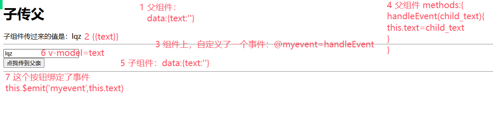

# 上节回顾

```python
# 1  组件 -> 单页面组件 -> xx.vue
	-全局组件
    	Vue.component('名字',{template,data,methods,created...})
    -局部组件
    	放在组件的 components 配置项中，key是名字，value是对象
        对象={template,data,methods,created...}
        只能用在当前组件中
    -动态组件
    	-<component is='名字'></component>
    -keep-alive
    	-用来缓存

# 2 vue项目中的组件形式 -> 局部组件
	1 新建 xx.vue
        template -> 写html -> 代替了 -> template -> 模板字符串
        script -> 写js -> export default {} -> 对象
        style -> 写css -> 正常写 -> 在template中的标签就会生效
    2 使用:
    	1 在某个组件中导入
        2 在components 配置项中配置
        
# 3 插槽
	-组件可以是单标签，也可以是双标签
        <HelloWorld/>
        <HelloWorld>加内容</HelloWorld>
    -渲染到标签中写的slot标签
    -具名插槽
    
# 4 vue工程化
	-nodejs -> 后端语言 -> 解释型语言 -> 解释器
    -官网:v22.11.0 -> 一路下一步安装
    -两个可执行文件:node npm
    
    -npm 速度慢
    	-1 设置阿里镜像站
        -2 使用cnpm替代
        
    -使用npm安装 vue脚手架
    
    -使用vue脚手架创建vue项目
    	vue create 项目  # 好的要选的东西
        
    -使用pycharm打开了
    	-1 terminal中执行 npm run serve
        -2 配置一个绿色箭头执行
        
# 5 vue目录结构
	-src 文件夹，其他文件夹一般不动
    	-App.vue  # 根组件
        -main.js  # 启动文件
        -小组件
        -页面组件        
        
# 6 vue的启动或执行流程
	main.js -> new Vue实例 -> 把App.vue中的template和vue实例 -> 注入到index.html
    后期我们写页面 -> 写一个个页面组件 -> router ->index.js中注册
    浏览器中访问对应地址，就会显示对应的页面组件
    App.vue 必须有且只有一个  <router-view/>
    这个<router-view/>没有是会出问题的
    
# 7 开发流程
	-只需要写组件（小组件，页面组件）
    -小组件是给其他组件使用的
    	编写，导入，注册，使用
    -页面组件，是用来显示页面的，需要配合vue-router
    	-router-->index.js中注册
        -浏览器中访问对应地址
        
# 8 es6语法
	-1 let const
    -2 箭头函数 -> this指向
        hobby={
            demo01(){
                console.log(this)
            }
        }
        person={
            name:sheenagh
            showName(){
                console.log(this) # person对象
                let f=function(){
                    console.log(this) # window对象
                    bobby.demo01()
                }
                f()
            }
        }
        
   -3 模版字符串
		`${}`
   -4 解构赋值
        var {name,age,height=100}={name:sheenagh,age:19,hobby:篮球}
        var [a,b]=[33,44,55]
        var {}=函数()
   -5 默认参数 -> 跟python一样
   -6 展开运算	
        ...
        对象中 :{name:sheenagh,age:10,...person}
        数组中:[1,2,...l]
        函数形参:function demo(a,...b){}
        函数实参:demo(...l)
   -7 模块化
    	# 默认导出
            -xx.js
                -写变量
                -写对象
                -写函数
                -导出:默认导出  对象 
            -在使用的地方:默认导入
                import 别名 from '../'
                    别名.xx
        # 命名导出
        	# 导出
                export let name ='sheenagh'
                export let f=()=>{}
            # 导入
            	import {name as myname} from '../'
                import * as xx from '../'
       # 模块化在vue中得使用
    	-每个组件本质都是一个对象 -> 导入
        -别的组件中使用，导入对象注册
```


# 今日内容

# 1 父子传值

```python
# 1 组件之间数据是隔离的
# 2 如果子组件想使用父组件的变量，需要传递
# 3 如果父组件想使用子组件的变量，需要传递
```

## 1.1 父传子

```python
# 自定义属性
	父组件中  <Child 自定义属性名='值'></Child>
    子组件中  props:['自定义属性名']
    	-子组件中  就会有 '自定义属性名' 这个变量
        -这个变量是父传过来的
```

**ParentView.vue**

```vue
<template>
<div class="parent">
  <h1>父组件之父传子</h1>
  <hr>
  <Child :name="sheenagh" :demo="5"></Child>
  <hr>
</div>
</template>

<script>
import Child from "@/components/Child.vue";
export default {
  name: "ParentView",
  data() {
    return {
      demo: "2"
    }
  },
  components:{
    Child
  }
}
</script>

<style scoped>
</style>
```

**Child.vue**

```vue
<template>
<div class="child">
  <p>名字(从父组件那边传过来的):{{name}}</p>
  <p>{{demo}}</p>
</div>
</template>

<script>
export default {
  name: "Child",
  data() {
    return {
    }
  },
  props:["name", "demo"]
}
</script>

<style scoped>
</style>
```

## 1.2 子传父

```python
# 通过自定义 事件
	子组件中this.$emit('自定义事件名') -> 就会触发父组件中自定义事件对应的函数
    父组件中: 
    	<Child @自定义事件='函数'></Child>
    在子组件中:
    	this.$emit('自定义事件') -> 就会触发父组件中函数的执行 -> 如果把值传过去
        就实现了   子  ->  父
```

**Parent2View**

```vue
<template>
<div class="parent">
  <h1>父组件之子传父</h1>
  子组件穿过来的值是:{{text}}
  <hr>
  <Child2 @myevent="handleEvent"></Child2>
  <hr>
</div>
</template>

<script>
import Child2 from "@/components/Child2.vue";
export default {
  name: "ParentView",
  data() {
    return {
      text: ""
    }
  },
  components:{
    Child2
  },
  methods:{
    handleEvent(child_text){
      this.text=child_text
    }
  }
}
</script>

<style scoped>
</style>
```

**Child2.vue**

```vue
<template>
<div class="child">
  <p><input type="text" v-model="text"></p>
  <br>
  <button @click="handleClick">点我传给父组件</button>
</div>
</template>

<script>
export default {
  name: "Child",
  data(){
    return {
      text:""
    }
  },
  methods:{
    handleClick(){
      // 触发父组件中 -> 自定义事件的执行
      // 固定的this.$emit('自定义事件名',传参数1,传参数2)
      this.$emit('myevent',this.text)
    }
  }
}
</script>

<style scoped>
</style>
```




## 1.3 ref属性

```python
# ref 是vue提供的一个属性
```

**ParentRefView.vue**

```vue
<template>
<div class="parent">
  <h1>父组件之Ref属性</h1>
  <h2>ref属性放在普通标签上,通过this.$refs.名字拿到的是标签的dom对象</h2>
  <div>
    <p>我的图片:</p>
  </div>
  
  <hr>
  <h2>ref属性放在组件上,通过this.$refs.名字拿到的是组件对象</h2>
  <ChildRef ref="mychildref"></ChildRef>
  <hr>
  <button @click="handleClick">点我看控制台</button>
</div>
</template>

<script>
import ChildRef from "@/components/ChildRef";
export default {
  name: "ParentView",
  data() {
    return {}
  },
  components: {
    ChildRef
  },
  methods: {
    handleClick() {
      console.log(this.$refs)
      // ref属性放在普通标签上,通过this.$refs.名字拿到的是标签的dom对象
      // 通过dom对象，修改img标签 的src属性
      this.$refs.myimg.src='https://images.pexels.com/photos/59512/pexels-photo-59512.jpeg?auto=compress&cs=tinysrgb&w=1260&h=750&dpr=2'
      // 通过dom对象，修改img标签 的height属性
      this.$refs.myimg.style.height = '300px'
      this.$refs.myimg.style.width = '500px'

      // ref属性放在组件上,通过this.$refs.名字拿到的是组件对象
      // 通过组件对象，直接修改组件对象的值
      this.$refs.mychildref.name='xumiu'
      // 通过组件对象，直接调用组件中的方法
      this.$refs.mychildref.changeName('我是用方法改变的名字')
    }
  }
}
</script>

<style scoped>
</style>
```

**ChildRef.vue**

```vue
<template>
<div class="child">
  <p>我的名字:{{name}}</p>
</div>
</template>

<script>
export default {
  name: "Child",
  data() {
    return {
      name: "abc"
    }
  },
  methods:{
    changeName(name){
      this.name=name
    }
  }
}
</script>

<style scoped>
</style>
```

## 1.4 parent

```python
# 在子组件中，通过  this.$parent 就能拿到父组件对象
	-改变量
    -调方法
    从而实现父子之间的通信
```


# 2 登录跳转案例

## 2.1 后端（django）

### 2.1.1 解决跨域（第三方）

```python
# 统一按如下方式解决跨域
	-1 安装
    	pip3 install django-cors-headers
    -2 app中注册
        INSTALLED_APPS = [
            'corsheaders',
        ]
    -3 中间件中注册
        MIDDLEWARE = [
            'corsheaders.middleware.CorsMiddleware',
        ]
    -4 配置文件中配置
    # 允许跨域源
    CORS_ORIGIN_ALLOW_ALL = True
    # 允许的请求头
    CORS_ALLOW_HEADERS = (
        "accept",
        "accept-encoding",
        "authorization",
        "content-type",
        "dnt",
        "origin",
        "user-agent",
        "x-csrftoken",
        "x-requested-with",

        # 额外允许的请求头
        'token',
    )
```

### 2.1.2 后端逻辑分析

```python
# 1 前端传入 用户名+密码 -> 后端接收到 -> 认证auth的user表，通过后签发token

# 2 不需要写登录了，只需要使用simple-jwt -> 定制返回格式即可

# 3 写个返回电影数据
```

### 2.1.3 登录

```python
### 1 路由 ### app01/urls
from rest_framework_simplejwt.views import token_obtain_pair
urlpatterns = [
    path('login/', token_obtain_pair),
]

### 2 定制返回格式 ### serializer
from rest_framework_simplejwt.serializers import TokenObtainPairSerializer
class MyTokenObtainPairSerializer(TokenObtainPairSerializer):
    def validate(self, attrs):
        old_data = super().validate(attrs)
        data = {'code': 100,
                'msg': '登录成功成功',
                'token': old_data.get('access'),
                }
        return data

### 3 统一异常处理 ### exceptions
from rest_framework.views import exception_handler
from rest_framework.response import Response
def common_exception_handler(exc, context):
    res=exception_handler(exc, context)
    if res:
        response=Response({'code':999,'msg':res.data.get('detail')})
    else:
        response = Response({'code': 888, 'msg':'登录失败'})
    return response

### 4 配置文件 ### settings
SIMPLE_JWT = {
  "TOKEN_OBTAIN_SERIALIZER": "app01.serializer.MyTokenObtainPairSerializer",
}

REST_FRAMEWORK = {
    'EXCEPTION_HANDLER': 'app01.exceptions.common_exception_handler',
}

```

### 2.1.3 电影

```python
### 1 路由 ###
from rest_framework.routers import SimpleRouter
from app01.views import FilmView
router=SimpleRouter()
router.register('films',FilmView,'films')
from rest_framework_simplejwt.views import token_obtain_pair
urlpatterns = [
    path('admin/', admin.site.urls),
    path('login/', token_obtain_pair),
]
urlpatterns+=router.urls
### 2 视图类 ###
from rest_framework.decorators import action
class FilmView(ViewSet):
    @action(methods=['GET'], detail=False)
    def films(self, request):
        with open('../film.json', 'r', encoding='utf-8') as f:
            res_dict = json.load(f)
        return Response(res_dict)
```


## 2.2 前端(vue)

### 2.2.1 路由

```js
const routes = [
    {
        path: '/login',
        name: 'login',
        component: LoginView
    },
    {
        path: '/films',
        name: 'films',
        component: FilmView
    },
]
```

### 2.2.2 登录页面

```vue
<template>
<div>
  <p>用户名:<input type="text" v-model="username"></p>
  <p>密码:<input type="password" v-model="password"></p>
  <p><button @click="handleLogin">登录</button></p>
</div>
</template>

<script>
import axios from "axios";

export default {
  name: "LoginView",
  data(){
    return {
      username:'',
      password:''
    }
  },
  methods:{
    handleLogin(){
      // 发送ajax请求到后端 -> post请求
      axios.post('http://127.0.0.1:8000/login/',{
        username:this.username,
        password:this.password
      }).then(res=>{
        if(res.data.code==100){
          //跳转到电影页面
          this.$router.push('/films')
          // 保存token到浏览器中
        }else {
          alert(res.data.msg)
        }
      }).catch(err=>{
        alert(err)
      })
    }
  }
}
</script>

<style scoped>

</style>
```


### 2.2.3 电影页面

```vue
<template>
  <div>
    <h1>最新电影</h1>
    <div v-for="item in film_list" :key="item">
      <h3>{{ item.name }}</h3>
      <p>{{ item.synopsis }}</p>
      
      <hr>
    </div>
  </div>
</template>

<script>
import axios from "axios";
export default {
  name: "FilmView",
  data() {
    return {
      film_list: []
    }
  },
  created() {
    axios.get('http://127.0.0.1:8000/films/films/',{
      headers:{
        Authorization:''
      }
    }).then(res => {
      this.film_list = res.data.results
    })
  }
}
</script>

<style scoped>

</style>
```


# 3 scoped

```python
# 加在 style 标签上，表示当前style中得所有样式只对当前组件有效
<style scoped>
h1{
  color: aqua;
}
</style>
```


# 4 elementui

```python
# 1 开源的样式库，方便在vue中使用
	-elementui:饿了么团队开源的  web端
    	https://element.eleme.cn/#/zh-CN
    -vant:有赞团队，移动端,微信小程序
    	https://vant-ui.github.io/vant/v2/#/zh-CN/grid
    -ant design:阿里团队
    	https://1x.antdv.com/docs/vue/introduce-cn/
    -iView
    	https://v2.iviewui.com/components/grid
    -nutui:京东团队
    	https://nutui.jd.com/2x/#/dialog 移动端
        
#  注意: vue2 -> elementui -> https://element.eleme.io/#/zh-CN
#  注意:vue3 -> elementui-plus -> https://element-plus-docs.bklab.cn/zh-CN/

# 2 项目中集成
	1 安装:cnpm install element-ui -S
    2 集成到项目:main.js 中加入
    import ElementUI from 'element-ui';
    import 'element-ui/lib/theme-chalk/index.css';
    Vue.use(ElementUI); // 使用插件
    3 去官网，找样式，复制，粘贴
```

# 6 props

```python 
# 父传子 -> 在子中通过props接收传入的值

# 之前学的在子中:
	props:['name','demo']
    
# 扩展1 
	props:{name:String,demo:bool}
    
# 扩展2
 props: {
    name: {
      required: true,
      type:Boolean
    },
    demo: {
      default: '没传'
    }
  }
```

# 作业

```python
# 1 登录跳转电影案例 -> 使用elementui美化
	登录页面
    电影页面
    
# 2 我讲的练习一下

# 3  聊天web
	-登陆，注册
    -登陆 -> 显示所有用户--表格
    	好友表---拿出表中所有好友
    -每条用户有一个按钮 -> 申请
    -对方同意 -> 是好友
    
    -进入好友列表
    
    -点用名字 -> 页面 -> 聊天
    	定时器
    -群聊

```


