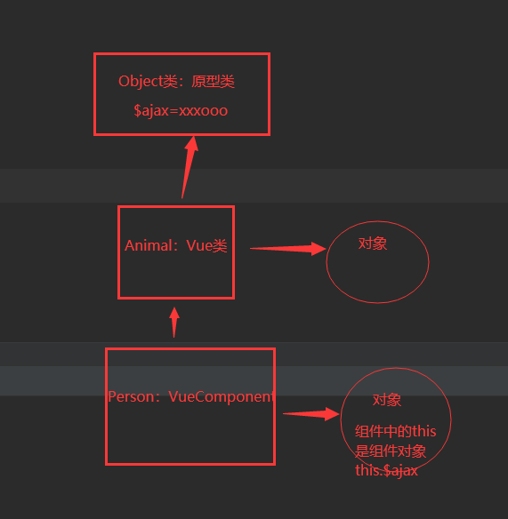
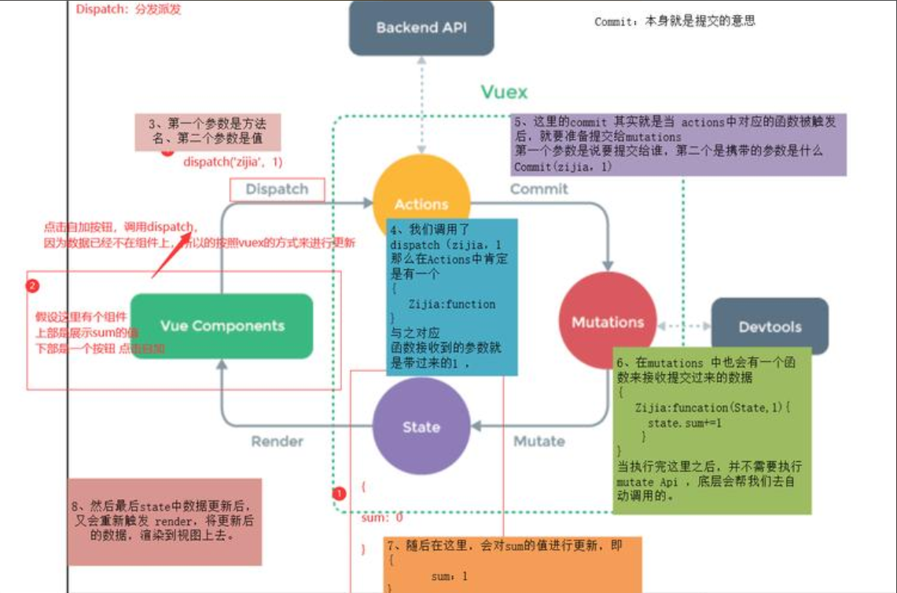
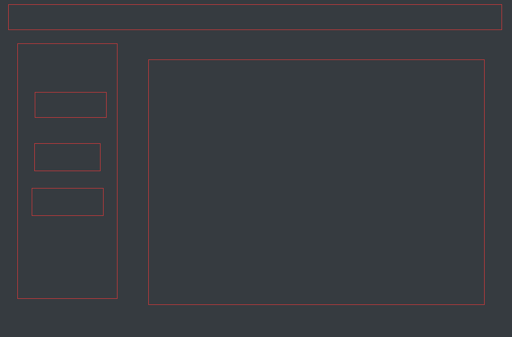

# 上节回顾

```python
# 1 组件间通信之父传子
	-自定义属性
    -父组件中
    	<Child :name='变量'></Child>
    -子组件中
    	props接收，相当于在data中定义了，直接使用即可
        
# 2 组件间通信之子传父
	-自定义事件
    -this.$emit('自定义事件名字',参数)
    -触发父组件中自定义事件对应的方法的执行
    
# 3 ref属性
	-放在普通标签
    -放在组件上 -> 组件对象
    
# 4 父组件对象 
	-this.$parent
    
# 5 登录显示电影案例
	-1 跨域问题解决 -> 按步骤
    -2 登录接口
    	-基于auth的user表，自动签发
        -修改返回格式
    -3 显示电影接口
    	-打开文件，使用相对路径，相对于启动文件
    -4 前端登录，页面
    	-this.$router.push('/films')
    -5 电影页面，组件写法
    
# 6 scoped 

# 7 elementui使用
	-vue2   vue3--:plus
	-1 下载
    -2 引入:main.js
    -3 复制粘贴
    
# 8 props 更多  
```


# 今日内容

# 1 ref

## 1.1 ref使用

```python
# 1 放在普通标签上
# 2 放在组件上
```

## 1.2 父传子

## 1.3 子传父

**HomeView.vue**

```vue
<template>
  <div class="home">
    <h1>我是首页</h1>
    <input type="text" v-model="name" ref="myinput">-->{{name}}
    <hr>
      <Hello ref="hello" :msg="msg" @send="handleReceive"></Hello>
    <hr>
    <button @click="hanleClick" >点我看控制台</button>
  </div>
</template>

<script>
import Hello from "@/components/Hello";
export default {
  name: 'HomeView',
  data(){
    return {
      name:'',
      msg:'lqz is handsome'
    }
  },
  methods:{
    hanleClick(){
      console.log(this.$refs)
      console.log(this.$refs.hello.img)
      this.$refs.hello.handleClick()
    },
    handleReceive(username){
      console.log('父亲执行了')
      this.name=username
    }
  },
  components:{
    Hello
  }
}
</script>
```

**Hello.vue**

```vue
<template>
  <div>
    
    <h3>{{msg}}</h3>
    <input type="text" v-model="username">-->{{username}}
    <button @click="handleClick">点我传给父亲</button>
  </div>
</template>

<script>
export default {
  name: "Hello",
  data() {
    return {
      img: require('../assets/logo.png'),  // 如果引入 视频，音频，图片，js，css资源如果不能用，使用require包裹一下
      username:''
    }
  },
  methods:{
    handleClick(){
      // alert(this.msg)
      this.$emit('send',this.username)
    }
  },
  props:['msg']
}
</script>

<style scoped>

</style>
```

## 1.4 补充-子组件中拿到父组件对象

```python
# this.$parent
```

## 1.5 总结:父子通信的方式

```python
# 1 自定义属性--父传子
# 2 自定义事件---子传父
# 3 通过ref属性:this.$refs -> 相互传
# 4 子组件中通过 this.$parent -> 相互传
```


# 2 props

```python
# 1 父传子时，自定义属性，在子组件中声明，才能使用当前属性
	  # 1 方式一:
        props:['msg'],
      # 2 方式 二 
        props: {myname: String},
      # 3 方式三  
        props: {
            myname: {
              type: String, //类型
              required: true, //必要性
              default: '老王' //默认值
            }
          },
```

不同知识点需要建多个不同的项目怎么办？ -> 先使用学习 学完复制粘贴src 不需要的进行改名src-知识点


# 3 混入mixin

```python
# 1 抽取公共的代码，
	-多个组件中都会有的代码，抽出来
    -哪个组件用，使用mixin引入即可
    
# 2 使用方式
	-编写混入对象	src/mixin/index.js
        export default {
        data() {
            return {
                name: 'sheenagh'
            }
        },
        methods: {
                handleChange() {
                    this.name = 'changename'
                }
            }
        }
	-方式一:某个组件中使用 vue里面引入mixin 如果有重合的属性 优先使用自己的属性值
        import m1 from '@/mixin'
        export default {
          data() {
            return {
              name:'xxxx'
            }
          },
          methods: {
          },
          mixins:[m1]
        }
    -方式二:所有组件中使用 在main.js 注意有多个文件的话要分开写 分开加入
        import m1 from '@/mixin'
        import m2 from '@/mixin2'
        Vue.mixin(m1)
        Vue.mixin(m2)
    
```


# 4 插件

```python
# 1 功能:用于增强Vue

# 2 本质:包含install方法的一个对象，install的第一个参数是Vue，第二个以后的参数是插件使用者传递的数据

# 3 使用了vue-router插件，vuex插件，elementui
	this.$router
    this.$store
    this.$alert
    this.$message
    
# 4 使用别人写好的第三方插件
	Vue.use(ElementUI);
```



```python
# 1 写plugins/index.js
import axios from "axios";
import hunru from "@/mixin";
export default {
    install(Vue,name) {
        console.log('----------',name)

        // 1 定义全局变量,放到原型中
        // prototype 原型链,一般定义在原型中的变量，都用 $ 开头，防止污染 -> 对象中可以定义同名属性，冲突
        Vue.prototype.$axios = axios
        // Vue.prototype.$BASE_URL='http://127.0.0.1:8000/'

        // 2  定义指令  自定义指令
        //定义全局指令:跟v-model一样，获取焦点
        Vue.directive("fbind", {
            //指令与元素成功绑定时（一上来）
            bind(element, binding) {
                element.value = binding.value;
            },
            //指令所在元素被插入页面时
            inserted(element, binding) {
                element.focus();
            },
            //指令所在的模板被重新解析时
            update(element, binding) {
                element.value = binding.value;
            },
        });
        
        // 3 使用混入
        Vue.mixin(hunru)
        
        // 4 定义全局组件 -> elementui
    }
}

# 2 在main.js中使用，可以传参数
# 使用自定义插件
import my from '@/plugins'
Vue.use(my,'name') // 内部本质会执行install


# 需要掌握的:
	-有些第三方插件，用了以后，增强了vue功能
    -this.$router
    -全局组件 :el-button
    -this.$message--->
    -this.$http.get
```


# 5 插槽

**AboutView.vue**

```vue
<template>
  <div class="home">
    <h1>我是about</h1>
    <HelloWorld>
      <div slot="a">
        
      </div>
       <div slot="b">
        <h3>bbbb</h3>
      </div>
    </HelloWorld>
  </div>
</template>

<script>
import HelloWorld from "@/components/HelloWorld";
export default {

  name: 'AboutView',
  data() {
    return {
    }
  },
  methods: {
  },
  components:{
    HelloWorld
  }
}
</script>

```

**HelloWorld.vue**

```vue
<template>
<div>
  <slot name="b"></slot>
  <h2>我是Hello world 组件</h2>
  <slot name="a"></slot>
</div>
</template>

<script>
export default {
  name: "HelloWorld"
}
</script>

<style scoped>

</style>
```


# 6 vuex

```python
#1 第三方插件:状态管理器 -> 管理状态 -> 管理变量的 -> 统一的位置管理变量 -> 实现组件间通信
	-vue2:vuex
    -vue3:vuex，pinia:用的多
    
# 2 使用vuex 
	-创建项目时候，已经装了
    	-项目依赖有了
        -项目中有个 store文件夹 -> index.js
        -main.js 中，引入且使用了
        
    -在创建项目时，没装
    	-安装: cnpm install vuex@3.6.2
        	  -忽略 cnpm install element-ui@2.15.13 -S
        -在项目中新建 store -> index.js
        	-在index.js中写入代码
                import Vue from 'vue'
                import Vuex from 'vuex'
                Vue.use(Vuex)
                export default new Vuex.Store({
                  state: {
                  },
                  mutations: {
                  },
                  actions: {
                  }
                })
        在main.js中使用
        	import store from './store'
            new Vue({
                store,
                render: h => h(App)
            }).$mount('#app')    
            
# 3 具体使用 见下面代码

# 4 作用和好处
	-1 降低代码耦合度
    -2 实现组件间通信
```



```python
### 重点:具体使用 ###
# 1 store/index.js中写代码
    import Vue from 'vue'
    import Vuex from 'vuex'
    // 后续在所有组件中 this.$store 即下面的对象
    Vue.use(Vuex)
    export default new Vuex.Store({
      state: {
        count:100
      },
      mutations: {
        add(state,number){
          state.count+=number
        }
      },
      actions: {
        addCount(ctx,number){
          // 通知 mutations 更新变量,触发add的执行 -> 服务员告诉厨师炒菜
          if(ctx.state.count>=105){
            alert('不能再加了')
          }else {
             ctx.commit('add',number)
          }
        }
      },
    })
# 2 组件中使用
	-template中使用  :<h3>vuex中得count变量:{{$store.state.count}}</h3>
    -js中使用:
        export default {
          methods: {
            handleAdd(){
              // 1 触发 dispatch -> actions -> mutations 异步任务
              this.$store.dispatch("add", 4)
              // 2 间接触发 mutations 同步任务
              this.$store.commit("add",3)
              // 3 直接操作 state 非正式场景 谨慎使用
              this.$store.state.num += 2
            }
          }
        }
        
# 3 为什么经过 actions和mutations 
    -可以跟后端交互，可以做数据验证

# 4 getters:
    	可以通过getters获取数据 -> 对state中的数据，再做处理
    
# 5 modules:
    	分到不同模块中，不同模块有自己的state，actions
```

# 7 本地存储

```python
# 1 能存储数据的位置，登录成功 -> token存储 4种不同
	vuex:页面重新加载 -> 数据会恢复	cookie:登录信息放这里，有过期时间，一旦过期，就没了
    sessionStorage:当前浏览器生效 -> 关闭浏览器，数据就没了
    localStorage:永久生效，除非代码删除或清空浏览器缓存
    	-未登录，加购物车
        
# 2 cookie 需要下载 vue-cookies
	cnpm install vue-cookies -S
```

````vue
<template>
  <div class="home">
    <h1>我是首页</h1>
    <h2>localStorage</h2>
    <button @click="handleSaveLocalStorage">存储到localStorage</button>
    <button @click="handleGetLocalStorage">从localStorage取出</button>
    <button @click="handleDeleteLocalStorage">删除localStorage</button>

    <h2>sessionStorage使用</h2>
    <button @click="handleSavesessionStorage">存储到sessionStorage</button>
    <button @click="handleGetsessionStorage">从sessionStorage取出</button>
    <button @click="handleDeletesessionStorage">删除sessionStorage</button>
    <h2>cookie使用</h2>
    <button @click="handleSaveCookie">存储到cookie</button>
    <button @click="handleGetCookie">从cookie取出</button>
    <button @click="handleDeleteCookie">删除cookie</button>

  </div>
</template>

<script>
export default {

  name: 'HomeView',
  methods: {
    handleSaveLocalStorage() {
      localStorage.setItem("name", 'lqz')
      let user = {
        name: 'xxx',
        age: 19
      }
      localStorage.setItem("user", JSON.stringify(user)) // 不要放对象

    },
    handleGetLocalStorage() {
      let name = localStorage.getItem("name")
      let user = localStorage.getItem('user')
      console.log(name)
      console.log(user)
      console.log(typeof user)

    },
    handleDeleteLocalStorage() {
      // localStorage.removeItem('name')
      localStorage.clear()

    },


    handleSavesessionStorage() {
      sessionStorage.setItem("name", '彭于晏')
    },
    handleGetsessionStorage() {
      let name = sessionStorage.getItem('name')
      console.log(name)
    },
    handleDeletesessionStorage() {
      sessionStorage.removeItem('name')
      // sessionStorage.clear()
    },


    handleSaveCookie() {
      this.$cookies.set('name', 'zzzz', '100s')
    },
    handleGetCookie() {
      let name = this.$cookies.get('name')
      console.log(name)
    },
    handleDeleteCookie() {
      // this.$cookies.remove('name')
      this.$cookies.clear()

    },
  }
}
</script>

````

# 8 vue-router

```python
# 0 只要写vue项目，必用
	-页面跳转要使用它
    
# 1 如果我们创建项目时，已经安装了
	-router -> index.js
    -main.js 引入了
    -后期在组件中:
    	-js中:
            this.$router # 跳转路径
            this.$route   # 目前没学
        -template中:
        	<router-view/>  # 当访问某个路径时，会把页面组件替换到这
            <router-link></router-link>
            
# 2 创建项目没有安装，自行引入
	-cnpm install vue-router@3.5.1
	-创建文件夹router---index.js
    -index.js写代码
    import Vue from 'vue'
    import VueRouter from 'vue-router'
    import HomeView from "@/views/HomeView";
    Vue.use(VueRouter)
    const routes = [
        {
            path: '/',
            name: 'home',
            component: HomeView
        },

    ]
    const router = new VueRouter({
        mode: 'history',
        base: process.env.BASE_URL,
        routes
    })
    export default router
    -main.js中使用
        import router from './router'
        new Vue({
            router,
            render: h => h(App)
        }).$mount('#app')
        
   -后续所有组件中
	    -js中:
            this.$router # 跳转路径
            this.$route   # 目前没学
        -template中:
        	<router-view/>  # 当访问某个路径时，会把页面组件替换到这
            <router-link></router-link>
```

## 8.1 路由跳转(携带数据:？ 和路径)

```python
# 1 之前学过，在App.vue中放 
  <div id="app">
    <router-view/>
  </div>

# 2 在router---index.js中 -> 注册路径-->routes
    const routes = [
            {
                path: '/',
                name: 'home',
                component: HomeView
            },

        ]
# 3 以后访问某个路径，就会显示页面组件

# 4 重点:页面跳转两种方式
	## 4.1 js跳转
      // 1 js 写路径
      // this.$router.push('/about')
      // 2 js 写对象
      // this.$router.push({name:"about"})
      // this.$router.push({path:"/about"})

      // 3 js 写路径 携带参数跳转
      // this.$router.push('/about?name=sheenagh&age=23')
      // *** 这个参数去 AboutView 里 created 拿
      // 4 js 写对象 携带参数跳转
      // this.$router.push({name:"about", query:{name:"sheenagh", age:23}})
      // this.$router.push({path:"/about?name=sheenagh&age=23"})
        
   ## 4.2 template中跳转:router-link组件
        <router-link to="/about">
          <button>点我跳转到about页面 - 标签</button>
        </router-link>
        <router-link :to="{name:'about'}">
          <button>点我跳转到about页面 - 标签</button>
        </router-link>
        <router-link :to="{path:'/about'}">
          <button>点我跳转到about页面 - 标签</button>
        </router-link>

        <router-link to="/about?name=sheenagh&age=23">
          <button>点我跳转到about页面 - 标签 - 携带参数</button>
        </router-link>
        <router-link :to="{name:'about',query:{name:'sheenagh', age:23}}">
          <button>点我跳转到about页面 - 标签 - 携带参数</button>
        </router-link>
        <router-link :to="{path:'/about?name=sheenagh&age=23'}">
          <button>点我跳转到about页面 - 标签 - 携带参数</button>
        </router-link>


# 5 重点 上个页面跳转时，携带数据(查询参数) -> 下一个页面中取出来
	-在下一个页面中写:AboutView.vue
    -写在created中
        this.book_id=this.$route.query['book_id']
        #this.book_id=this.$route.query.book_id
        #console.log(this.$router) // VueRouter 的对象
        #console.log(this.$route)  // 当前路由对象
        # 有其他想要的也可以打印 看在这两个对象里面的哪里 去取就行了
        
        
# 6 重点 上个页面跳转时，携带数据(查询参数) -> 下一个页面中取出来
	6.1 路由写法变了
        {
            path: '/about/:pk/',
            name: 'about',
            component: AboutView
        }
   6.2 传递数据
		-js:
          // 5 跳转携带参数 -> 路径中的参数 如/about/1
          // this.$router.push('/about/99/?name=sheenagh&age=23')
          // *** 还是去created拿
      this.$router.push({name: "about", params: {pk: 99}, query: {name: "sheenagh", age: 23}})
    	-router-link:
            <router-link :to="{name:'about',params: {pk: 99}, query:{name:'sheenagh', age:23}}">
              <button>点我跳转到about页面 - 标签 - 携带参数 - pk</button>
            </router-link>
            
  6.3 另一个页面获取数据
	this.$route.params.pk
```

## 8.2 补充

```python
# 1 全局组件 :router-link  -> 路由跳转

# 2 全局组件  <router-view/>
	-显示页面组件的
    -放在App.vue中，当访问某个路径，就显示某个组件
    -不要动
```

## 8.2 相关api

```python
1 指的是:this.$router -> 方法

2 常用的
this.$router.push(path): 相当于点击路由链接(可以返回到当前路由界面)
this.$router.replace(path): 用新路由替换当前路由(不可以返回到当前路由界面)
this.$router.back(): 请求(返回)上一个记录路由
this.$router.go(-1): 请求(返回)上一个记录路由
this.$router.go(1): 请求下一个记录路由
```

## 8.3 多级路由



**router/index.js**

```js
import Vue from 'vue'
import VueRouter from 'vue-router'
import HomeView from '../views/HomeView.vue'
import AboutView from "@/views/AboutView.vue";
Vue.use(VueRouter)

const routes = [
    {
        path: '/',
        name: 'home',
        component: HomeView
    },
    {
        path: '/about/:pk/',
        name: 'about',
        component: AboutView
    },
    {
        path: '/backend',
        name: 'backend',
        component: () => import( '../views/Backend.vue'),
        children: [ //通过children配置子级路由
            {
                path: '', //此处一定不要写:/news
                name: 'index',
                component:() => import('@/views/backend/IndexView'),
            },
            {
                path: 'order',
                name: 'order',
                component:() => import('@/views/backend/OrderView'),
            },
            {
                path: 'goods',
                name: 'goods',
                component:() => import('@/views/backend/GoodsView'),
            }
        ]
    }
]

const router = new VueRouter({
    mode: 'history',  // 路由工作模式
    base: process.env.BASE_URL,
    routes
})

export default router
```

**BackendView.vue**

```vue
<template>
  <div class="backend">
    <div class="top">123</div>
    <el-container>
      <el-aside width="200px" class="left">
        <div class="txt">
          <p><router-link to="/backend"><el-button type="success" plain>首页</el-button></router-link></p>
          <p><router-link to="/backend/order"><el-button type="success" plain>订单</el-button></router-link></p>
          <p><router-link to="/backend/goods"><el-button type="success" plain>商品</el-button></router-link></p>
        </div>
      </el-aside>
      <el-main class="right">
        <div>
          <router-view></router-view>
        </div>
      </el-main>
    </el-container>
  </div>
</template>

<script>
export default {
  name: "Backend"
}
</script>


<style scoped>
.top {
  background-color: #ffcfdf;
  height: 100px;
  width: 100%
}

.left {
  background-color: #fefdca;
  height: 500px;
}

.right {
  background-color: #e0f9b5;
}

.txt>p {
  margin-top: 50px;
  margin-left: 50px;
}
</style>
```

**backend/GoodsView.vue**

```vue
<template>
<div class="goods">商品</div>
</template>

<script>
export default {
  name: "IndexView",
}
</script>

<style scoped>
</style>
```

**backend/IndexView.vue**

```vue
<template>
<div class="index">首页</div>
</template>

<script>
export default {
  name: "IndexView",
}
</script>

<style scoped>
</style>
```

**backend/OrderView.vue**

```vue
<template>
<div class="order">订单</div>
</template>

<script>
export default {
  name: "IndexView",
}
</script>

<style scoped>
</style>
```

## 8.4 路由守卫

```python
# 1 路由守卫是什么
	是否登录，登录后才能访问，没登录重定向到login
# 2 全局守卫、独享守卫、组件内守卫
```

```js
import Vue from 'vue'
import VueRouter from 'vue-router'
import HomeView from '../views/HomeView.vue'

Vue.use(VueRouter)

const routes = [
    {
        path: '/',
        name: 'home',
        component: HomeView
    },
    {
        path: '/about/:pk/',
        name: 'about',
        component: () => import('@/views/AboutView')
    },
        {
        path: '/login',
        name: 'login',
        component: () => import('@/views/LoginView')
    },
    {
        path: '/backend',
        name: 'backend',
        component: () => import('@/views/BackendView'),
        children: [ //通过children配置子级路由
            {
                path: '', //此处一定不要写:/news
                name: 'index',
                component:() => import('@/views/backend/IndexView'),
            },
            {
                path: 'order',
                name: 'order',
                component:() => import('@/views/backend/OrderView'),
            },
            {
                path: 'goods',
                component:() => import('@/views/backend/GoodsView'),
            }
        ]
    }
]

const router = new VueRouter({
    mode: 'history',  // 路由工作模式
    base: process.env.BASE_URL,
    routes
})


// 全局路由守卫
router.beforeEach((to, from, next) => {
    // to :路由对象，跳到哪个路由对象上
    // from:路由对象，从哪个路由对象来
    // 要求，后台管理，必须登录才能进
    console.log(to)
    if(['index','order','goods'].indexOf(to.name)!== -1){
        //要登录才能访问 -> localStorage的token有值才行
        let token=localStorage.getItem('token')
        console.log(token)
        if(token){
            next() // 运行跳转
        }else {
            alert('您没登录')
            next({name:'login'}) // 跳转到登录页面
        }

    }else {
        next()
    }
})
export default router
```

## 8.5 路由两种工作模式

```python
# 1 对于一个url来说,什么是hash值?      #及其后面的内容就是hash值 

# 2 hash值不会包含在 HTTP 请求中，即:hash值不会带给服务器。

# 3 hash模式:
    地址中永远带着#号,不美观。
    若以后将地址通过第三方手机app分享,若app校验严格,则地址会被标记为不合法。
    兼容性较好
# 4 history模式:
    地址干净,美观。
    兼容性和hash模式相比略差。
    应用部署上线时需要后端人员支持，解决刷新页面服务端404的问题
```


# 作业

```python
# 1 今天讲的练习一下

# 路由守卫案例，对后端
	- cookie
    
def my_view(request):
    # 从 cookie 中获取 token
    token = request.COOKIES.get('token'
```


问题

**1.mixins 为何重复的data以当前文件为准**

在 Vue.js 中，当混入（`mixins`）和当前组件有相同的 `data` 属性或方法时，**优先以当前组件的定义为准**。这是因为 Vue 遵循“就近原则”：组件自身的定义权重高于混入或继承的内容。

**2.导入时 $符号的使用 研究下这个**

```js
// Vue 实例中常见的 $ 属性
// 在 Vue 中
// $ 符号常用于实例的一些内置属性和方法
// 表示 Vue 实例级别的内容
// 通常这些内容是在 Vue 实例被创建时自动添加到实例中的

// $data 数据对象

// $el 根DOM元素

// $refs 通过ref指令注册的dom元素/子组件

// $store 访问Vuex store对象

// $route $router 路由信息 路由跳转
```

**3.四种存储对应的使用场景深思**

| 存储方式           | 生命周期                         | 数据大小限制     | 使用场景                          |
| ------------------ | -------------------------------- | ---------------- | --------------------------------- |
| **Vuex**           | 当前页面会话，刷新页面会丢失     | 内存中，大小受限 | 用于全局状态管理，跨组件共享数据  |
| **Cookie**         | 可以设置过期时间，默认会话有效   | 4KB              | 存储用户认证信息（token）等小数据 |
| **sessionStorage** | 当前浏览器会话，关闭标签页会丢失 | 5MB左右          | 临时存储数据，不需要跨页面持久化  |
| **localStorage**   | 永久有效，除非手动清除           | 5MB左右          | 持久存储用户设置、购物车等数据    |

**4. django项目启动的迷思 关于某文件的写的一个方法是[打开另一个文件] 相对路径 自己调用是对的，但项目启动里使用不对 以什么为准 是django启动文件吗**

当你运行 `python manage.py runserver` 启动 Django 项目时，工作目录默认是包含 `manage.py` 的项目根目录。

```python
project_root/
├── manage.py
├── app/
│   ├── views.py
│   ├── utils.py
```

如果在 `views.py` 中使用相对路径打开 `utils.py`（如 `open('./utils.py')`），在直接运行 `views.py` 时可能有效，但通过 `manage.py` 启动时就会出错。

在这个例子中正确的写法是`open('./app/utils.py')`

为了确保正确 也可以构建绝对路径

```python
# settings.py 中的 BASE_DIR
import os
BASE_DIR = os.path.dirname(os.path.dirname(os.path.abspath(__file__)))

# 在其他文件中引用 BASE_DIR 来构建绝对路径
from django.conf import settings

def open_file():
    file_path = os.path.join(settings.BASE_DIR, 'app/utils.py')  # 构建绝对路径
    with open(file_path, 'r') as f:
        data = f.read()
    return data
```

