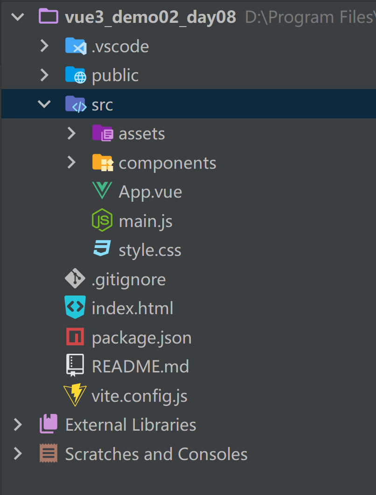

# 上节回顾

```python
# 1 ref属性
# 2 this.parent

# 3 组件间通信
	1 父传子 -> 自定义属性
    2 子传父 -> 自定义事件 -> this.$emit
    3 ref
    4 parent
    5 vuex   this.$store.state
    6 本地存储:localStorage，sessionStroage，cookie
    
    
# 4 props
	-自定义属性时，在子组件中获取父组件传值时，做一些限制
    
# 5 混入
	mixin -> 写一个混入对象 -> 全局使用main.js -> 局部使用 -> mixins配置项
    
# 6 插件
	增强vue的功能
    我们学的第三方插件
        elementui:
            全局组件  el-button
            this.$message -> 弹出消息提示
        vuex:
        	this.$store.state
        vue-router
        	this.$router
            this.$route
    自定义插件
    	-对象 -> install(vue){}
        
        
# 7 插槽
	具名插槽
    
 # 8 vuex:状态管理器
	-1 安装 注意版本
    -2 新建store文件夹 -> index.js -> 写入代码
    	-state
        -mutations
        -actions
    -3 main.js 导入 -> new Vue时传入
    -4 以后在任意组件中
    	this.$store.dispatch('方法名',变量)
        this.$store.commit('方法名',变量)
        this.$store.state('方法名',变量)
        
 # 9 本地存储
	-localStorage
    -sessionStroage
    -cookie:第三方
    
# 10 vue-router
	1 使用
    	-安装
        -新建router文件夹 -> index.js
        	-路径和组件对应关系
            -new VueRouter对象 -> 传入对应关系和路由模式
        -main.js 引入，new Vue时传入
        -两个全局组件:router-view  router-link
    2 跳转
    	-js跳转
        	this.$router.push(字符串带数据)
            this.$router.push(路由对象) # name，query，params
        -html跳转
        	router-link--to属性--同js跳转
        -获取携带的数据:created中
        	this.$route.query
            this.$route.params  # 路径的配合  :
         
   3 相关api
		push
    	back
        go
        replace
   4 路由嵌套（多级路由）

   5 路由守卫-全局路由守卫
    	-router.beforeEach((to, from, next) => {
            控制
        })
  6 路由工作模式
	-hash:  带 # 不美观，后端友好
    -history:美观，后期项目上线会出现404问题
```


# 今日内容

# 1 vue3介绍

```python
# 1 vue2 的所有东西，vue3都兼容
# 2 vue3 不建议使用vue2的写法 -> 配置项API
# 3 vue3 :选项式（配置项） API 和组合式 API
	-选项式:配置项:就是vue2的写法 
    	export default{
            data(){
                return {
                    name:'sheenagh'
                }
            },
            methods:{
                handleClick(){
                    alert(this.name)
                }
            }
        }
    -组合式: 
        const name = ref('lqz')
        function handleClick(){ 
            alert(name.value)
        }
```

## 1.1 快速体验组合式

```html
<!DOCTYPE html>
<html lang="en">
<head>
    <meta charset="UTF-8">
    <title>Title</title>
    <script src="https://unpkg.com/vue@3/dist/vue.global.js"></script>
    <style></style>
</head>
<body>
<div id="app">

    <p>{{count}}</p>
    <br>
    <button @click="handleAdd">点我加1</button>


</div>
</body>
<script>

    let app=Vue.createApp({
        setup() {
            let count=Vue.ref(0)
            let handleAdd=()=>{
                count.value++
            }
            return {
                count,
                handleAdd
            }
        },

    })
    app.mount("#app")

</script>
</html>
```

## 1.2 快速体验配置项

```html
<!DOCTYPE html>
<html lang="en">
<head>
    <meta charset="UTF-8">
    <title>Title</title>
    <script src="https://unpkg.com/vue@3/dist/vue.global.js"></script>
    <style></style>
</head>
<body>
<div id="app">

    <p>{{count}}</p>
    <br>
    <button @click="handleAdd">点我加1</button>


</div>
</body>
<script>

    let app=Vue.createApp({
        data(){
            return {
                count:100
            }
        },
        methods:{
            handleAdd(){
                this.count++
            }
        }
    })
    app.mount("#app")

</script>
</html>
```

## 1.3 拥抱ts

```python
# 1 之前写vue2用js
# 2 vue3-->ts-->微软推出的 -> 最终要被编译成js才能运行在浏览器中
	-使用ts写，可以避免很大错误
    -ts是js的超集 -> ts完全兼容js
    
    
# 3 我们学的是
	vue2+js+vue-router+vuex+elementui
	vue3+js+vue-router+pinia+elementui-plus
    
    vue3+ts+vue-router+pinia+elementui-plus
    
# 4 变化
    新的生命周期钩子
    data 选项应始终被声明为一个函数
    移除keyCode支持作为 v-on 的修饰符
```


# 2 vue3快速创建项目

## 2.1 使用vue-cli创建(不建议用)

```python
# 跟之前几乎一样
# 还是 vue create projectname
# 只是要选vue3
# 项目结构和之前vue2的基本一致 只是一些文件的写法语法有所改变
```

## 2.2 使用vite创建（推荐）

```python
# 1 什么是vite? —— 新一代前端构建工具。
优势如下:
开发环境中，无需打包操作，可快速的冷启动。
轻量快速的热重载（HMR）。
真正的按需编译，不再等待整个应用编译完成。

# 2 兼容性注意
Vite 需要 Node.js 版本 18+，20+。然而，有些模板需要依赖更高的 Node 版本才能正常运行，当你的包管理器发出警告时，请注意升级你的 Node 版本
官网:https://cn.vitejs.dev/

# 3 创建工程
# 配置npm镜像站:npm config set registry https://registry.npmmirror.com
# 查看镜像站:npm config get registry

# 不指定名字创建:npm create vite@latest
# 指定名字创建 
    # 创建项目方式一
    	npm create vite@latest
	# 创建项目方式二:指定名字
    	npm create vite@latest vue3_demo002
    # 创建项目方式三
    	cnpm create vite@latest vue3_demo002
    # 创建项目方式四
    	cnpm create vite vue3_demo002
    # 创建项目方式五
    	cnpm create vite@latest vue3_demo02_day08 --template vue
# 3 使用编辑器打开vue3项目
# 4 安装依赖
	npm install 
# 5 运行项目
	npm run dev
```

## 2.2 补充

```python
#1 运行vue项目时，执行的命名
    # npm run serve
    # npm run dev
# 2 对应的是package.json中
    "scripts": {
        "dev": "vite",
        "build": "vite build",
        "preview": "vite preview"
      },
    dev和serve一样可以加到快捷键那边
```

## 2.3 目录结构（vite）




# 3 常用api

## 3.0  setup函数

```python
# 0 之前不用setup时候的写法
<template>
  <div class="home">
    <h1>首页</h1>
    <h2>数字是 {{num}}</h2>
    <button @click="handleAdd">数字+1</button>
  </div>
</template>

<script>
export default {
  name: 'HomeView',
  data(){
    return {
      num:0
    }
  },
  methods:{
    handleAdd(){
      this.num++
    }
  }

}
</script>

# 1 setup引入
setup为Vue3.0中一个新的配置项，值为一个函数

setup是所有Composition API（组合API）编写的位置

组件中所用到的:数据、方法等等，均要配置在setup中

setup函数的返回值:返回一个对象，对象中的属性、方法, 在模板中均可以直接使用

注意:

尽量不要与Vue2.x配置混用

Vue2.x配置（data、methos、computed...）中可以访问到setup中的属性、方法。
但在setup中不能访问到Vue2.x配置（data、methods、computed...）。
如果有重名, setup优先。
```

## 3.1 定义变量统一用const

```python
# 1 const是常量 -> 不允许变的
# 2 咱们用 ref包裹后，是个对象，虽然对象是常量，对象不能变，对象.value可以变化
# 3 之所以定义成const原因是，后期不能修改对象 【对象.value可以改】
# 4 如果用let声明 ，后期修改对象不会报错，导致程序出问题

import {ref} from "vue"
# 前面先引入

const num=ref(0)
# num="xxx"  如果不是const，这里可以改，但后续会报错
function handleAdd(){
    num.value+=1
    # 对象的value值可以变化
    console.log(num)
}
```

## 3.2 以后代码都写在setup函数中-->组合式

```python
# 组合式和配置项能不能混用？
	-可以混用
    -并且在配置项api的方法中，可以拿到setup函数中定义的变量
    -以后只用一种
    	-配置项
        -组合式（推荐的）
```

## 3.3 setup函数

```python
# 1 如果使用配置项API -> 写起来跟vue2一样
# 2 如果写组合式API -> 所有代码都要写在setup函数中
	-后期除了setup函数，其他都不带了
    
# 3 setup函数必须返回变量或函数 -> 在template中才能使用
# 4 默认不带响应式，需要使用ref或reactive包裹
```

```python
# 上面同等作用的新写法
<script>
import {ref} from "vue"
export default {
  name: 'AboutView',
  setup(){
    const num=ref(0)
    function handleAdd(){
      num.value++
      console.log(num)
    }
    return {
      num, handleAdd
    }
  }
}
</script>


# 1 vue3 中提供的，用户编写组合式api代码位置的函数，以后组合式api的代码，都写在这里面
<template>
  <div class="about">
    <h1>about</h1>
    <h2>数字是 {{num}}</h2>
    <button @click="handleAdd">数字+1</button>
    <br>
    <button @click="handleAdd2">数字+2</button>
    <br>
    <h2>名字是 {{name}}</h2>
    <button @click="handleChangeName">改变名字</button>

  </div>
</template>

<script>
import {ref} from "vue"
export default {
  name: 'AboutView',
  setup(){
    // 1 数字
    const num=ref(0)
    function handleAdd(){
      num.value++
      console.log(num)
    }
    function handleAdd2(){
      num.value += 2
    }

    // 2 字符串
    const name = ref("toronto")
    const handleChangeName=()=>{
      name.value = "hdu"
    }
    return {
      num, handleAdd, handleAdd2, name, handleChangeName
    }
  }
}
</script>
```

## 3.4 ref

```python
# 1 ref 包裹值类型[数字，字符串，布尔]，做成响应式
# 2 reactive包裹引用类型[对象，数组]，做成响应式
# 3 使用reactive包裹的对象，直接通过 .  [] 取值赋值就是响应式的
	ref包裹的对象，需要使用 对象.value 修改值
# 4 使用ref包裹的，在template中，不需要使用  变量.value
```

```python
# 1 用于包裹 值 【数字，字符串，布尔】类型变量，使其具有响应式的类
	const count = ref(0)
    count.value
```

## 3.5 reactive

```python
# 1 用于包裹 引用 【数组，对象】类型变量，使其具有响应式的类
	const user_info = reactive({name: 'lqz', age: 19})
    # 使用时，不需要 对象.value-->因为它是个代理对象
    user_info.age++
```

```vue
<template>
  <div class="about">
    <h1>about</h1>
    <h2>数字是 {{num}}</h2>
    <button @click="handleAdd">数字+1</button>

    <br>
    <h2>名字是 {{name}}</h2>
    <button @click="handleChangeName">改变名字</button>

    <br>
    <h2>对象使用 </h2>
    <p>姓名:{{user.name}}</p>
    <p>年龄:{{user.age}}</p>
    <button @click="handleAge">年龄+1</button>

    <br>
    <h2>数组使用</h2>
    <p v-for="item in haha">数组值: {{item}}</p>
    <button @click="handleChangehaha">改变数组</button>
      
  </div>
</template>

<script>
import {ref, reactive} from "vue"
// 需要改变的值就可以用ref 和 reactive 响应式数据 不需要的话就可以直接写死
export default {
  name: 'AboutView',
  setup(){
    // 1 数字
    const num=ref(0)
    function handleAdd(){
      num.value++
      console.log(num)
    }

    // 2 字符串
    const name = ref("toronto")
    // function x(){} 和 const x=()=>{} 都可以 看自己想用哪种
    const handleChangeName=()=>{
      name.value = "hdu"
    }

    // 3 修改对象
    const user=reactive({name:"sheenagh", age:23})
    const handleAge=()=>{
      user.age++
    }

    // 4 修改数组
    const haha=reactive(["123", "456"])
    const handleChangehaha=()=>{
      haha[0]="789"
    }

    // 5 注意ref 和 reactive 使用时候的区别
    // ref 可以包裹对象类型 但是需要通过value拿到真正的值

    return {
      num, handleAdd, name, handleChangeName, user, handleAge, haha, handleChangehaha
    }
  }
}
</script>
```

## 3.6 计算属性

```vue
<template>
  <p>姓<input type="text" v-model="person.firstname"></p>
  <p>名<input type="text" v-model="person.lastname"></p>

  <p>您的名字是: {{ person.firstname + person.lastname }}</p>
  <p>您的名字是(普通函数): {{ getfullname() }}</p>
  <p>您的名字是(计算属性): {{ fullname }}</p>
  <p>您的名字是(计算属性改值): <input type="text" v-model="fullname"></p>


</template>

<script>
import {ref, reactive, computed} from "vue";

export default {
  name: 'ComputedView',
  setup() {
    // 计算属性
    // 1 定义person对象 做成响应式
    const person = reactive({
      firstname: "yang",
      lastname: "xintian",
    })

    // 2 fullname 普通函数形式 前端使用时用fullname()
    function getfullname() {
      return person.firstname + person.lastname
    }

    // 只要页面发生变化 函数都会重新计算 即使发生变化的部分与这个函数无关

    // 3 计算函数 用到computed
    // const fullname = computed(() => {
    //   return person.firstname + person.lastname
    // })

    // 4 计算属性改值
    const fullname = computed({
      get() {
        return person.firstname+person.lastname
      },
      set(value){
        person.firstname=value.slice(0,1)
        person.lastname=value.slice(1)
        // 就把这个当成一个字姓氏 slice切片
      }
    })

    // 想要一个 fullname=firstname+lastname 当姓和名发生改变也会跟着变
    return {
      person, getfullname, fullname
    }
  }
}
</script>
```

## 3.7 监听属性

### 3.7.1 监听值类型，监听对象类型，监听多个变量

```python
<template>
  <h1>监听属性</h1>
  <button @click="home_type='首页'">首页</button>
  <button @click="home_type='商品'">商品</button>
  <button @click="home_type='订单'">订单</button>

  <hr>
  <div class="main">
    {{home_type}}
  </div>

  <hr>
  <h1>监听对象变化</h1>
  {{person.name}}
  {{person.age}}
  <button @click="person.age++">点我变大一岁</button>

  <hr>
  <h1>监听多个对象</h1>
  {{sum}}
  {{msg}}
  <button @click="sum++">点我sum+1</button>
  <button @click="msg++">点我msg+1</button>

</template>

<script>
import {ref, reactive, computed, watch} from "vue"
export default {
  name: 'WatchView',
  setup(){
    // 监听属性
    // 1 定义变量
    const home_type=ref("首页")

    // 2 只要变量发生变化 就执行一个函数 -> ref 包裹的值类型
    watch(home_type,()=>{
      console.log(home_type.value)
    })

    // 3 监听对象类型
    const person=reactive({name:"sheenagh", age:23})
    watch(()=>person.age, (newValue, oldValue)=>{
      console.log(newValue)
      console.log(oldValue)
    })
    // 只要年龄发生变化 就触发自己想要做的事情

    // 4 监听多个值
    const sum=ref(0)
    const msg=ref(0)
    watch([sum, msg], (newValue, oldValue)=>{
      console.log("sum或者msg变化了",sum.value,msg.value)
    })
    return {
      home_type,person, sum, msg
    }
  }
}
</script>

<style setup>
.main {
  height: 500px;
  background-color: pink;
  width: 100%;
}
</style>
```

### 3.7.2 watchEffect函数

```python
# watchEffect 使用:不用指定监听谁，只要watchEffect内部用了某个变量，某个变量发送变化，就会触发
# 如果两个同时都变化，只会执行一次
watchEffect(() => {
    const x1 = sum.value
    const x2 = person.name
    console.log('watchEffect配置的回调执行了')
})
```

```vue
<template>
  <h1>监听属性</h1>
  <button @click="home_type='首页'">首页</button>
  <button @click="home_type='商品'">商品</button>
  <button @click="home_type='订单'">订单</button>

  <hr>
  <div class="main">
    {{ home_type }}
  </div>

  <hr>
  <h1>监听对象变化</h1>
  {{ person.name }}
  {{ person.age }}
  <button @click="person.age++">点我变大一岁</button>

  <hr>
  <h1>监听多个对象</h1>
  {{ sum }}
  {{ msg }}
  <button @click="sum++">点我sum+1</button>
  <button @click="msg++">点我msg+1</button>

  <hr>
  <h1>watchEffect使用</h1>
  <button @click="changeWatchEffect">watchEffect使用</button>


</template>

<script>
import {ref, reactive, computed, watch, watchEffect} from "vue"

export default {
  name: 'WatchView',
  setup() {
    // 监听属性
    // 1 定义变量
    const home_type = ref("首页")

    // 2 只要变量发生变化 就执行一个函数 -> ref 包裹的值类型
    watch(home_type, () => {
      console.log(home_type.value)
    })

    // 3 监听对象类型
    const person = reactive({name: "sheenagh", age: 23})
    watch(() => person.age, (newValue, oldValue) => {
      console.log(newValue)
      console.log(oldValue)
    })
    // 只要年龄发生变化 就触发自己想要做的事情

    // 4 监听多个值
    const sum = ref(0)
    const msg = ref(0)
    watch([sum, msg], (newValue, oldValue) => {
      console.log("sum或者msg变化了", sum.value, msg.value)
    })

    // 5 watchEffect 使用:
    // 5.1 不用指定监听谁，只要watchEffect内部用了某个变量，某个变量发送变化，就会触发
    // 5.1 如果两个同时都变化，只会执行一次
    watchEffect(() => {
      const x1 = sum.value
      const x2 = person.name
      console.log('watchEffect配置的回调执行了')
    })

    function changeWatchEffect() {
      // sum.value+=10
      person.name = 'ssss'
    }

    return {
      home_type, person, sum, msg, changeWatchEffect
    }


  }
}
</script>


<style setup>
.main {
  height: 500px;
  background-color: pink;
  width: 100%;
}
</style>
```


# 4 生命周期

```python
# vue2中8个生命周期钩子
beforeCreate
created
beforeMount
mounted
beforeUpdate
updated
beforeDestroy
destroyed

# vue3中8个生命周期钩子 -> 配置项API
beforeCreate
created
beforeMount
mounted
beforeUpdate
updated
beforeUnmount
unmounted

# vue3 组合式api的生命周期钩子
beforeCreate ---->setup()
created --------->setup()
beforeMount ----->onBeforeMount
mounted --------->onMounted
beforeUpdate ---->onBeforeUpdate
updated --------->onUpdated
beforeUnmount --->onBeforeUnmount
unmounted ------->onUnmounted
```

## 4.1 vue3的配置项api生命周期钩子

```js
<template>
  <h1>配置项api的生命周期</h1>
  <p>{{name}}</p>
  <button @click="name='hdu'">变名字</button>

</template>

<script>
import {ref, reactive} from "vue"

export default {
  data(){
    return {
      name:'sheenagh',
    }
  },
  beforeCreate() {
    console.log("beforeCreate")
  },
  created() {
    console.log("created")
  },
  beforeMount() {
    console.log("beforeMount")
  },
  mounted() {
    console.log("mounted")
  },
  beforeUpdate() {
    console.log("beforeUpdate")
  },
  updated() {
    console.log("updated")
  },
  beforeUnmount() {
    console.log("beforeUnmount")
  },
  unmounted() {
    console.log("unmounted")
  }
}
</script>

```


## 4.2 vue3的组合式生命周期钩子

```vue
<template>

  <p>名字是:{{ name }}</p>
  <button @click="name='hdu'">点我换名字</button>
</template>

<script>
import {ref, onBeforeMount, onMounted, onBeforeUpdate, onUpdated, onBeforeUnmount, onUnmounted} from 'vue'

export default {
  setup() {
    // 组合式 生命周期
    // 1 原来的beforeCreated -> 定义的变量还没初始化
    console.log('原来的beforeCreated')
    // 2 原来的created -> 定义的变量初始化了
    const name = ref('sheenagh')
    console.log('原来的created')

    // 3 beforeMount,
    onBeforeMount(() => {
      console.log('onBeforeMount')
    })
    // 4 onMounted,
    onMounted(() => {
      console.log('onMounted')
    })
    // 5 onBeforeUpdate,
    onBeforeUpdate(() => {
      console.log('onBeforeUpdate')
    })
    //6  onUpdated,
    onUpdated(() => {
      console.log('onUpdated')
    })
    // 7 onBeforeUnmount,
    onBeforeUnmount(() => {
      console.log('onBeforeUnmount')
    })
    // 8 onUnmounted
    onUnmounted(() => {
      console.log('onUnmounted')
    })

    return {
      name
    }
  },
}
</script>
```

## 4.3 vue3跟后端交互

```vue
<template>
  <h1>跟后端交互</h1>
  <p>名字是:{{name}}</p>
  <p>性别是:{{gender}}</p>
</template>

<script>
import {ref} from 'vue'
import axios from 'axios'
export default {
 setup(){
   // 1 定义变量
   const name=ref('')
   const gender=ref('未知')
   // 2 发送ajax,从后端获取数据
   axios.get('http://127.0.0.1:5000/info').then(res=>{
     name.value=res.data.name
     gender.value=res.data.gender
   })
   return {
     name,
     gender
   }
 }
}
</script>

// 比vue2简洁一点
```


# 5 setup的特殊写法

```python
# 1 vue3中之前写组合式的组件写法
export default {
  name: 'HomeView',
  setup() {
  }
}

# 用vite创建的那个项目
####重点####
# 1 组件，只需要导入，就会自动注册，必须带后缀名 vue
# 2 setup写法
	<script setup> 写原来setup函数中的代码即可</script>
# 3 生命周期钩子--beforeCreate，created，on。。。。
# 4 监听属性，计算属性
# 5 组件间通信 父传子
	# 父组件中:跟之前一样
      <HelloWorld :msg="msg"></HelloWorld>
    # 子组件中:
    defineProps({
      msg: String,
    })
# 6 组件通信，子传父
	-父组件中:
    	# html
          <HelloWorld @send="handleReceive"></HelloWorld>
          <p>父组件中得name:{{name}}</p>
	    # js
        <script setup>
            const name = ref('')
            function handleReceive(a){
              name.value=a
            }
          </script>
    -子组件中:
    	# js
            let $emit = defineEmits(['send']) # 等同于之前的  this.$emit
            const name =ref('')
            const handleSend=()=>{
              $emit('send',name.value)
            }
		# html
         <input type="text" v-model="name">-->{{name}}
          <br>
          <button @click="handleSend">点我传给父亲</button>
            
# 7 插槽
# 7 ref属性
# 8 mixin 没了-->直接导入导出用
# 9 插件一样
# 10 toRefs-->把对象中所有变量都做成响应式
# 11 toRef -->只把对象中某一个做成响应式
# 12 ref属性

```

## 5.1 setup 写法

```vue
<script setup>
// 这里写的代码 就是setup里的代码 并且不需要return了
import HelloWorld from "./components/HelloWorld.vue";
import {ref} from "vue"
const name = ref("sheenagh")
const handleChangeName=()=>{
  name.value="xumiu"
}
</script>

<template>
  <h1>{{name}}</h1>
  <button @click="handleChangeName">点击变名字</button>
</template>
```

## 5.2 使用组件-自定义属性传值

```vue
<script setup>
// 这里写的代码 就是setup里的代码 并且不需要return了
// 之前导入别人要在component里注册 现在只需要导入 自动注册了
import HelloWorld from "./components/HelloWorld.vue";
let msg="hihihi"
</script>

<template>
  <HelloWorld :msg="msg"></HelloWorld>
</template>
```

```vue
<script setup>
//defineProps(['msg'])
defineProps({
  msg: String,
})
</script>

<template>
  <h2>父组件传入的: {{ msg }}</h2>
</template>
```

## 5.3 自定义事件

```vue
<script setup lang="js">
import {ref} from 'vue'
import HelloWorld from './components/HelloWorld.vue'

const text = ref('')
const handleEvent = (name) => {
  text.value = name

}
</script>

<template>

  <h1>首页-子传父 -> 自定义事件</h1>
  <p>子传给我的:{{ text }}</p>
  <HelloWorld @myevent="handleEvent"></HelloWorld>

</template>
```

```vue
<script setup>

let $emit = defineEmits(['myevent']) //等同于之前的  this.$emit

import {ref} from 'vue'

const name = ref('')

function handleSend() {
  // this.$emit('myevent') 没有this了
  $emit('myevent', name.value)
}
</script>

<template>
  <p>请输入您的名字:<input type="text" v-model="name">
    <button @click="handleSend">点我传给父亲</button>
  </p>

</template>
```

## 5.4 setup写法之ref

```python
# 1 父组件中使用
	-tmeplate:
         <HelloWorld msg="lqz" ref="myhello"></HelloWorld>
  		<input type="text" v-model="username" ref="myinput">-->>{{ username }}
     -js中:
    	# 普通标签上
        const  myinput=ref()
        # 放在组件上
        const myhello = ref()
        const handleClick = () => {
           console.log(myhello.value) # 拿到的是组件对象
           console.log(myhello.value.hobby)
           myhello.value.add(4,5)
           console.log(myinput.value) # 拿到的是dom对象
        }
        
# 2 在子组件中，必须定义 hobby和add，并且导出
	js:
        const hobby=ref('篮球')
        const add=(a,b)=>{
          return a+b
        }
        # 声明能被使用
        defineExpose({hobby,add})	
```


```vue
<script setup lang="js">
import HelloWorld from './components/HelloWorld.vue'
import {ref} from 'vue'

const username = ref('')
//普通标签上
const myinput = ref()
//放在组件上
const myhello = ref()

function handleClick() {
  // this.$refs.myinput
  console.log(myinput.value) // dom对象
  console.log(myhello.value) // 组件对象
  // 拿到的是组件对象
  console.log(myhello.value.hobby)
  myhello.value.hobby='ss'
  myhello.value.add()
}
</script>

<template>
  <HelloWorld ref="myhello"></HelloWorld>
  <hr>
  <input type="text" v-model="username" ref="myinput">-->>{{ username }}
  <button @click="handleClick">点我看控制台</button>
</template>
```


```vue
<script setup>
import {ref} from "vue";
const hobby=ref('篮球')
function add(){
  console.log('adfasdf')
}

//声明能被使用,在父组件中
defineExpose({hobby,add})
</script>

<template>
<h1>我是HelloWorld组件</h1>
  {{hobby}}
</template>
```


## 5.5 setup写法之插槽

**HelloWorld.vue---子组件**

```vue
<script setup>
</script>

<template>
  <slot name="a"></slot>
  <h1>我是HelloWorld组件</h1>
  <slot name="b"></slot>
</template>
```

**App.vue--父组件**

```vue
<script setup lang="js">
import HelloWorld from './components/HelloWorld.vue'
import {ref} from 'vue'
</script>

<template>
  <h1>插槽</h1>
  <HelloWorld>
    <template v-slot:a>
<!--    <template #a>-->
        
    </template>

    <template v-slot:b>
<!--    <template #b>-->
      <input type="text">
    </template>

  </HelloWorld>
</template>


```


# 作业

```python
# 1 把讲的写一下
# 2 之前在vue2上生命周期钩子函数案例
	-vue3 组合式写法

# 3 拓展
	-使用vite创建项目 -> 把vue-router集成到vue3中
# 4 vuex集成

# 5 使用pinia做状态管理器
	store
```
