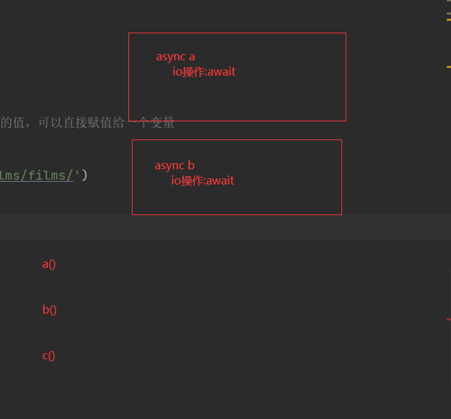

# 上节回顾

```python
# 1 vue3 介绍
	-组合式api 和 配置项api（选项式）
    	-setup函数中 -> 
        -跟vue2一样,需要写一个个配置项:data,methods。。。
     -升级
        -新的生命周期钩子
        -data 选项应始终被声明为一个函数
        -移除keyCode支持作为 v-on 的修饰符
        -拥抱ts
        
# 2 创建vue3项目
	-1 vue-cli创建 -> 弃用了
    	-可以选择安装其他插件:vue-router,vuex。。。
    -2 使用vite创建 -> 推荐的
    	-不能选择安装其他插件 -> 自己安装
        
# 3 setup函数
	-以后所有组合式api的代码都写在这个函数中
    -定义变量,写函数
    -如果要在模板中（template中使用）,必须return
    -定义的变量默认没有响应式
    	-可以渲染在页面上
        -但是不会联动
    - 组合式和配置项尽量不连用-尤其是setup写法 -> 根本没法连用  
        
# 4 ref,reactive
	-ref 包裹 值类型:数字,字符串,布尔
    	-取真正的值:对象.value
        -在template中不需要
    -reactive 包裹 引用类型:数组,对象
    	-直接使用即可:对象.属性  对象[0]
        -在template中不需要
    -ref可以包裹引用类型,但是要拿值,也是 对象.value
    
# 5 计算属性-组合式写法
	-const fullName=computed(()=>{返回一个值})
    
    -const fullName=computed({
        get(){返回一个值},
        set(value){自己写规则}
    })
    
    
# 6 监听属性
	-watch(值变量,(newValue,oldValue)=>{})
    -watch(()=>对象.属性,(newValue,oldValue)=>{})
    -watch([变量1,变量2],(newValue,oldValue)=>{})
    -watchEffect -> 只要内部使用某几个变量 -> 几个变量发生变化 -> 就会触发
    
# 7 生命周期
	-vue2 8 个
        beforeCreate
        created
        beforeMount
        mounted
        beforeUpdate
        updated
        beforeDestroy
        destroyed
   -vue3 配置项api(不怎么用)
        beforeCreate
        created
        beforeMount
        mounted
        beforeUpdate
        updated
        beforeUnmount
		unmounted
        
   -vue3 组合式写法
        beforeCreate ---->setup()  定义变量之前
        created --------->setup()  定义变量之后
        beforeMount ----->onBeforeMount
        mounted --------->onMounted
        beforeUpdate ---->onBeforeUpdate
        updated --------->onUpdated
        beforeUnmount --->onBeforeUnmount
        unmounted ------->onUnmounted
        
# 8 setup写法
	1 setup写法
        <script setup>
        相当于写在setup函数中,并且不需要return
        <script>
    2 使用组件
    	-只需要导入即可,不需要注册,直接使用即可
    3 父传子-自定义属性
    	-父组件上写法: <HelloWorld :msg='变量'> </HelloWorld>
        -子组件上:defineProps(['msg'])
    4 子传父-自定义事件
      -父组件上写法:<HelloWorld @myevent="handleEvent">
	  -子组件中触发:  # this.$emit('myevent',参数)
    		let $emit = defineEmits(['myevent']) 
             $emit('myevent',参数)
            
    5 ref属性
    	-普通标签上拿到dom对象
        	const  myinput=ref()
        -放在组件上,拿到组件对象
        	const myhello = ref()
            myhello. 调用组件对象上的属性或方法
            # 子组件中声明可以被使用
            defineExpose({hobby,add})
            
    6 插槽
    	-子组件中写具名插槽
            <template>
              <slot name="a"></slot>
              <h1>我是HelloWorld组件</h1>
              <slot name="b"></slot>
            </template>
        -父组件中使用
          <HelloWorld>
            <template v-slot:a>
                
            </template>
            <template v-slot:b>
              <input type="text">
            </template>
          </HelloWorld>
```

# 今日内容

# 1 toRefs

```python
# 1 vue3 提供的 toRefs -> 在解构的时候-把对象中的普通变量都做成响应式

# 2 toRefs的使用--把对象中的普通变量都做成响应式 
    <script setup>
    import {reactive, ref, toRefs, toRef} from "vue"

    // ##### toRefs 把对象中每个值解构做成响应式 #####
    // 1 定义对象
    const person=reactive({name:"sheenagh", age:23})
    
    // 2 解构这个变量 -> 虽然被reactive包裹 依然可以解构赋值
    // let {name, age}=person
    // console.log(name, typeof name)
    // console.log(age, typeof age)
    // function handleAdd(){
    //   age++
    //   console.log(age)
    // }
    // 3 通过handleAdd 发现解构出来的age虽然可以自增 但不显示 没有响应式

    // 4 笨笨办法
    // let name = ref(person.name)
    // let age = ref(person.age)
    // console.log(name, typeof name)
    // console.log(age, typeof age)
    // function handleAdd(){
    //   age.value += 1
    //   console.log(age)
    // }

    // 5 再高级一点 toRefs
    // let {name, age} = toRefs(person)
    // console.log(name, typeof name) // ref类型
    // console.log(age, typeof age)
    // function handleAdd(){
    //   age.value += 1
    //   console.log(age)
    // }
    </script>

    <template>
    <div>首页</div>
    <!--  <p>姓名: {{name}}</p>-->
      <p>年龄: {{age}}</p>
      <button @click="handleAdd">点我年龄+1</button>
    </template>

    <style scoped>
    </style>
    
# 3 toRef的使用  只对对象中的某个值做成响应式
    // ##### toRef 把对象中某个值做成响应式 #####
    // 6 toRef
    const age = toRef(person, "age")
    function handleAdd(){
      age.value += 1
      console.log(age)
    }
```

```vue
<script setup>
import {reactive, ref, toRefs, toRef} from "vue"

// ##### toRefs 把对象中每个值解构做成响应式 #####
// 1 定义对象
const person=reactive({name:"sheenagh", age:23})
// 2 解构这个变量 -> 虽然被reactive包裹 依然可以解构赋值
// let {name, age}=person
// console.log(name, typeof name)
// console.log(age, typeof age)
// function handleAdd(){
//   age++
//   console.log(age)
// }
// 3 通过handleAdd 发现解构出来的age虽然可以自增 但不显示 没有响应式

// 4 笨笨办法
// let name = ref(person.name)
// let age = ref(person.age)
// console.log(name, typeof name)
// console.log(age, typeof age)
// function handleAdd(){
//   age.value += 1
//   console.log(age)
// }

// 5 再高级一点 toRefs
// let {name, age} = toRefs(person)
// console.log(name, typeof name) // ref类型
// console.log(age, typeof age)
// function handleAdd(){
//   age.value += 1
//   console.log(age)
// }

// ##### toRef 把对象中某个值做成响应式 #####
// 6 toRef
const age = toRef(person, "age")
function handleAdd(){
  age.value += 1
  console.log(age)
}

</script>

<template>
<div>首页</div>
<!--  <p>姓名: {{name}}</p>-->
  <p>年龄: {{age}}</p>
  <button @click="handleAdd">点我年龄+1</button>
</template>

<style scoped>
</style>
```


# 2 axios使用

## 2.1 基本使用

```python
# 1 安装
	npm install axios -S
    
# 2 基本使用
<script setup>
import {reactive, ref} from "vue"
import axios from "axios"

// ref 对象.value
// reactive 对象.属性

// 方式一 film_list定义成ref类型 需要使用value修改值
// const film_list = ref([])
// 向后端发送请求 cnpm install -S axios
// axios.get("http://127.0.0.1:5000/films").then(res => {
//   console.log(res.data)
//   film_list.value = res.data.results
// })

// 方式二 使用reactive,内部包裹了results
const film_list = reactive({"results": []})
axios.get("http://127.0.0.1:5000/films").then(res => {
  console.log(res.data)
  // 2.1 直接改film_list.results 值
  film_list.results = res.data.results
  console.log(film_list)
  
  // 2.2 直接把res.data.results 复制到film_list.result
  // Object.assign(film_list.results, res.data.results)

  // 2.3 解构赋值
  // let {results,code,msg} = res.data  // res={data:{code:0,msg:成功,results:[]}}
  // let {results} = res.data  // res={data:{code:0,msg:成功,results:[]}}
  // Object.assign(film_list.results, results)

  // 2.4 解构赋值
  // let {data: {results}} = res
  // console.log(results)
  // Object.assign(film_list.results, results)
  // console.log(film_list.results)

  // 2.5 解构赋值
  // let {data} = res  // {code:0,msg:成功,result:[]}
  // Object.assign(film_list, data)
})

# 3 async 和 await 写法      跟python语法 95%一样
const film_list = reactive({'results': []})
# 定义了一个协程函数 -> 函数内如果有io操作,就写await,原来then中的值,可以直接赋值给一个变量
async function load() {
  let res = await axios.get('http://127.0.0.1:8000/films/films/')
  Object.assign(film_list.results, res.data.results)
}
load()
```

```vue
<script setup lang="js">
import {reactive, ref} from "vue";
import axios from 'axios'
/*
## 记住: 响应式两种方式:
1 对象.value = 改的值  ref包裹
2 对象.属性=改的值      reactive包裹
*/

// 1 方式一:把film_list 定义成ref类型,但是需要使用value修改值
// const film_list=ref([])
// // 向后端发送请求 cnpm install -S axios
// axios.get('http://127.0.0.1:5000/films').then(res=>{
//   console.log(res.data)
//   film_list.value=res.data.results
// })

// 2 方式二:使用reactive,内部包裹了个results
// const film_list = reactive({'results': []})
// axios.get('http://127.0.0.1:5000/films').then(res => {
//   // 2.1 直接改film_list.results 值
//   // film_list.results=res.data.results
    
//   // 2.2 直接把res.data.result 复制到filmList.result
//   // Object.assign(film_list.results, res.data.results)
//
//   // 2.3 解构赋值
//   // // let {results,code,msg} = res.data  // res={data:{code:0,msg:成功,results:[]}}
//   // let {results} = res.data  // res={data:{code:0,msg:成功,results:[]}}
//   // // let results = res.data.results  // 等同于上
//   // Object.assign(film_list.results, results)

//   // 2.4 解构赋值
//   // let {data: {results}} = res
//   // Object.assign(film_list.results, results)

//   // 2.5 解构赋值
//   let {data} = res  // {code:0,msg:成功,result:[]}
//   Object.assign(film_list, data)

// })


// 3 方式三: 使用async和await语法
const film_list = reactive({'results': []})
async function load() {   //协程函数
  // let res = await axios.get('http://127.0.0.1:5000/films')  // {data:{code:100,msg:成功,results:[]}}
  let {data:{results}} = await axios.get('http://127.0.0.1:5000/films')  // {data:{code:100,msg:成功,results:[]}}
  Object.assign(film_list.results,results)
}
load()

</script>

<template>
  <h1>电影案例</h1>
  <ul>
    <li v-for="item in film_list.results">
      <h2>{{ item.name }}</h2>
      
      <p>
        {{ item.synopsis }}
      </p>

    </li>
  </ul>
</template>
```




## 2.2 可选配置项

```js
// 0 使用方式
axios({
    url: "http://127.0.0.1:5000/films",
    method: "get",
    ...
})

{
  // 1 `url` 是用于请求的服务器 URL
  url: '/user',

  // 2 `method` 是创建请求时使用的方法
  method: 'get', // 默认值

  // 3 `baseURL` 可在 `url` 前添加一个基础路径
  baseURL: 'https://127.0.0.1/api/v1',

  // 4 `transformRequest` 修改发送到服务器的数据
  transformRequest: [function (data, headers) {
    return data;
  }],

  // 5 `transformResponse` 修改从服务器接收的数据
  transformResponse: [function (data) {
    return data;
  }],

  // 6 自定义请求头
  headers: {'X-Requested-With': 'XMLHttpRequest'},

  // 7 `params` 与请求一起发送的 URL 参数
  params: {
    ID: 12345
  },

  // 8 `paramsSerializer` 自定义序列化 `params`
  paramsSerializer: function (params) {
    return Qs.stringify(params, {arrayFormat: 'brackets'})
  },

  // 9 `data` 是作为请求体被发送的数据
  // 仅适用 'PUT', 'POST', 'DELETE 和 'PATCH' 请求方法
  // 在没有设置 `transformRequest` 时,则必须是以下类型之一:
  // - string, plain object, ArrayBuffer, ArrayBufferView, URLSearchParams
  // - 浏览器专属: FormData, File, Blob
  // - Node 专属: Stream, Buffer
  data: {
    firstName: 'Fred'
  },
  
   // 10 发送请求体的可选语法，直接作为字符串发送
  data: 'Country=Brasil&City=Belo Horizonte',

  // 11 超时设置
  timeout: 1000, // 默认值为 0 (永不超时)

  // 12 是否跨域携带凭证
  withCredentials: false, // 默认值

  // 13 自定义处理请求的适配器
  adapter: function (config) {
    /* ... */
  },

  // 14 HTTP Basic Auth 认证
  auth: {
    username: 'lqz',
    password: '123'
  },

  // 15 指定响应的数据类型
  responseType: 'json', // 默认值

  // 16 响应解码格式 (Node.js 专属)
  responseEncoding: 'utf8', // 默认值

  // 17 设置 xsrf token 的 cookie 名称
  xsrfCookieName: 'XSRF-TOKEN', // 默认值

  // 18 设置 xsrf token 的请求头名称
  xsrfHeaderName: 'X-XSRF-TOKEN', // 默认值

  // 19 上传进度事件
  onUploadProgress: function (progressEvent) {
    // ...
  },

  // 20 下载进度事件
  onDownloadProgress: function (progressEvent) {
    // ...
  },

  // 21 设置 Node.js 中响应内容的最大字节数
  maxContentLength: 2000,

  // 22 设置 Node.js 中请求体的最大字节数
  maxBodyLength: 2000,

  // 23 自定义状态码处理
  validateStatus: function (status) {
    return status >= 200 && status < 300; // 默认值
  },

  // 24 设置 Node.js 中的最大重定向数
  maxRedirects: 5, // 默认值

  // 25 设置 UNIX 套接字路径
  socketPath: null, // 默认值

  // 26 自定义 HTTP/HTTPS 请求 Agent
  httpAgent: new http.Agent({ keepAlive: true }),
  httpsAgent: new https.Agent({ keepAlive: true }),

  // 27 代理服务器配置
  proxy: {
    protocol: 'https',
    host: '127.0.0.1',
    port: 9000,
    auth: {
      username: 'lqz',
      password: '123'
           }
     },

  // 28 请求取消配置
  cancelToken: new CancelToken(function (cancel) {
    // ...
  }),

  // 29 是否自动解压响应体 (Node.js 专属)
  decompress: true // 默认值
}

// 经常使用的选项
    url
    method
    headers
    params
    data
    timeout
```

## 2.3 请求和响应拦截器 -> axios封装

```js
// 1 导入axios
import axios from 'axios'

// 2   创建ajax实例
const ajax = axios.create({
    // baseURL:'https://api.lqz.com',
    baseURL:'http://127.0.0.1:8000/api/v1',
    timeout:10000
})

// 3   添加请求拦截
ajax.interceptors.request.use(
    // 设置请求头配置信息
    config=>{
        //处理指定的请求头
        console.log("before request")
        let token=localStorage.getItem('token')

        // 因为请求头中加了别的东西 -> 这个请求变成了 非简单请求 -> 会发两次第一次是options请求,第二次是真正的请求
        if(token){
            config.headers.Authorization =token
        }else {
            config.headers.Authorization ='no-token'
        }
        return config
    },
    // 设置请求错误处理函数
    error=>{
        console.log("request error")
        return Promise.reject(error)
    }
)
// 添加响应拦截器
ajax.interceptors.response.use(
    // 设置响应正确时的处理函数
    response=>{
        console.log("after success response")
        console.log(response)
        if(response.data.code==100){
           return response.data
        }else {
            alert(response.data.msg)
            return Promise.reject(response.data.msg)
        }

    },
    // 设置响应异常时的处理函数
    error=>{
        console.log("after fail response")
        console.log(error)
        return Promise.reject(error)
    }
)
// 默认导出
export default ajax
```


# 3 promise语法

## 3.1 普通函数

```html
<!DOCTYPE html>
<html lang="en">
<head>
    <meta charset="UTF-8">
    <title>Title</title>
</head>
<body>

<script>
    console.log("Promise语法")
    // ##### 1 普通函数: 正常调用的函数,函数执行完毕后才会继续执行下一行代码 #####
    console.log('#### 正常函数 #### 开始 ####')
    let fun1 = () => {
        console.log("fun1 执行了")
    }
    // 调用函数
    fun1()
    // 函数执行完毕,继续执行后续代码
    console.log("其他代码继续执行")
    console.log('#### 正常函数 #### 结束 ####')
</script>
</body>
</html>
```

## 3.2 回调函数

```js
// 2 ##### 回调函数: 一些特殊的函数,表示未来才会执行的一些功能,后续代码不会等待该函数执行完毕就开始执行了 #####
console.log('#### 回调函数 #### 开始 ####')
// 设置一个2秒后会执行一次的定时任务,基于事件自动调用,console.log先执行
setTimeout(() => {
    console.log("延迟演示执行了,回调函数")
}, 2000)
console.log("其他代码执行")

console.log('#### 回调函数 #### 结束 ####')
```

## 3.3 promise

```python
# 1 promise 前端中的异步编程技术,多线程+线程结果回调！

# 2 Promise 是异步编程的一种解决方案,比传统的解决方案——回调函数和事件——更合理和更强大。它由社区最早提出和实现,ES6将其写进了语言标准,统一了用法,原生提供了Promise对象。

# 3 所谓Promise,简单说就是一个容器,里面保存着某个未来才会结束的事件（通常是一个异步操作）的结果。从语法上说,Promise 是一个对象,从它可以获取异步操作的消息。Promise 提供统一的 API,各种异步操作都可以用同样的方法进行处理。

# 4 Promise对象有以下两个特点。

# 4.1 Promise对象代表一个异步操作,有三种状态:`Pending`（进行中）、`Resolved`（已完成,又称 Fulfilled）和`Rejected`（已失败）。只有异步操作的结果,可以决定当前是哪一种状态,任何其他操作都无法改变这个状态。这也是`Promise`这个名字的由来,它的英语意思就是“承诺”,表示其他手段无法改变。

# 4.2一旦状态改变,就不会再变,任何时候都可以得到这个结果。Promise对象的状态改变,只有两种可能:从`Pending`变为`Resolved`和从`Pending`变为`Rejected`。只要这两种情况发生,状态就凝固了,不会再变了,会一直保持这个结果。

# 生活中案例
#你跟你女朋友说,5年后等我赚够500w就结婚 -> 定义函数
    # -1 进行中（努力赚钱,其他代码继续执行）
    # -2 成功（赚够500w -> 结婚）
    # -3 失败（没赚够 -> 分手）
```

## 3.4 promise基本使用

```js
// ES6规定,Promise对象是一个构造函数,用来生成Promise实例

 <script>
        
       /*  
        1.实例化promise对象,并且执行(类似Java创建线程对象,并且start)
        参数: resolve,reject随意命名,但是一般这么叫!
        参数: resolve,reject分别处理成功和失败的两个函数! 成功resolve(结果)  失败reject(结果)
        参数: 在function中调用这里两个方法,那么promise会处于两个不同的状态
        状态: promise有三个状态
                pending   正在运行
                resolved  内部调用了resolve方法
                rejected  内部调用了reject方法
        参数: 在第二步回调函数中就可以获取对应的结果 
        */
        let promise =new Promise(function(resolve,reject){
            console.log("promise 开始执行")
            //resolve("promise 执行成功")
            reject("promise 执行失败")
        })
        console.log('11111')
        //2.获取回调函数结果  then在这里会等待promise中的运行结果,但是不会阻塞代码继续运行
        promise.then(
            function(value){console.log(`promise中执行了resolve:${value}`)},
            function(error){console.log(`promise中执行了reject:${error}`)}
        )
        // 3 其他代码执行   
        console.log('222222')
</script>

// 执行顺序
1 console.log("promise 开始执行")
2 console.log('11111')
3 console.log('222222')
4 promise执行成功或失败打印的代码
```

## 3.5 catch 情况

```js
<script>
 // 4 catch 情况,出异常情况
    let promise = new Promise(function (resolve, reject) {
        console.log("promise 开始执行--开始赚钱,准备取女朋友")
        //1 执行成功--走then
        // resolve("promise 执行成功--赚够了500w")
        //2 执行失败--走catch
        // reject("promise 执行失败,没赚够500w")
        //3 故意响应一个异常对象--走catch
        throw new Error("人噶了")
    })
    console.log('11111')
    promise.then(
        value=> {
            console.log(`promise中执行了resolve:${value}-赚够了,结婚`)
        },
        // error => {
        //      console.log(`promise中执行了reject:${error}-没赚够,分手`)
        //  }
    ).catch(
        error=> {
            console.log('---',error)
        }
    )
    console.log('222222')
</script>
```

## 3.6 async使用

```js
<script>
    /* 
        async 用于标识函数的
            1. async标识函数后,async函数的返回值会变成一个promise对象
            2. 如果函数内部返回的数据是一个非promise对象,async函数的结果会返回一个成功状态 promise对象
            3. 如果函数内部返回的是一个promise对象,则async函数返回的状态与结果由该对象决定
            4. 如果函数内部抛出的是一个异常,则async函数返回的是一个失败的promise对象

        */
    	async function fun1(){
            //return 10   // 成功状态,走then
            //throw new Error("异常状态,走catch")
            //let promise = Promise.resolve("成功状态,走then")
            let promise = Promise.reject("失败状态,走catch")
            return promise
        }

        let promise =fun1()

        promise.then(
            function(value){
                console.log("success:"+value)
            }
        ).catch(
            function(value){
                console.log("fail:"+value)
            }
        )
</script>
```

## 3.7 async+await使用

```js
<script>
    /* 
            1. await右侧的表达式一般为一个promise对象,但是也可以是一个其他值
            2. 如果表达式是promise对象,await返回的是promise成功的值
            3. await会等右边的promise对象执行结束,然后再获取结果,后续代码也会等待await的执行
            4. 如果表达式是其他值,则直接返回该值
            5. await必须在async函数中,但是async函数中可以没有await
            6. 如果await右边的promise失败了,就会抛出异常,可以通过 try ... catch捕获处理
        */
    
		async function fun1(){
            return 10
        
        }

        async function fun2(){
            try{
                let res = await fun1()
                //let res = await Promise.reject("something wrong")
            }catch(e){
                console.log("catch got:"+e)   
            }
            
            console.log("await got:"+res)
        }

        fun2()
</script>

```

## 3.8 axios+async+await的使用

````js
async function loadFilms() {
  try {
    const film_list = reactive({'results': []})
    let {data:{results}} = await ajax({
      url: '/app01/films/',
      method: 'get'
    })
    Object.assign(film_list.results, results)
  } catch (e) {
    alert(e)
  }

}
loadFilms()

// 避免回调地狱
// 传统写法
axios.get('1').then(res=>{
    // 判断,成功了,再向某个接口发请求
    axios.get('2').then(res1=>{
        // 再向某个接口发请求
        axios.get('3').then(res2=>{
            
        })
    })
})

// await 写法
async function load(){
    let res1=await axios.get('1')
    let res2=await axios.get('2')
    let res3=await axios.get('3')
}
````


# 4 vue-router

## 4.1 vue-router使用

```python
# 1 需要使用 vue-router 4版本及以上
	cnpm install -S vue-router@4
```

## 4.2 路由跳转

```python
# 1  this.$route   this.$router
import {useRouter, useRoute} from 'vue-router'
let router=useRouter()
let route=useRoute()

# 2 其他都一样
# main.js
import router from './router'

app.use(router)
```

## 4.3 前置路由守卫

```python
router.beforeEach((to, from, next) => {
    //to 是目标地包装对象  .path属性可以获取地址
    //from 是来源地包装对象 .path属性可以获取地址
    //next是方法,不调用默认拦截！ next() 放行,直接到达目标组件
    //next('/地址')可以转发到其他地址,到达目标组件前会再次经过前置路由守卫
    console.log(to.path, from.path, next)

    //需要判断,注意避免无限重定向
    if (to.name == 'home' || to.name == 'login') {
        next()
    } else {
        let token = localStorage.getItem('token')
        if (token) {
            next()
        } else {
            next('/login')
        }
    }
})
// 可以造一个token来验证
```


# 5 pinia

```python
# 状态管理器
cnpm install pinia -S
```

## 5.1 基本使用

```python
# 1 新建:store -> index.js
import {defineStore} from 'pinia'

export const definedStore = defineStore(
    {
        id: 'storePinia', //必须唯一
        state: () => { // state中用于定义数据
            return {
                username: '张三',
                age: 3,
                hobbies: ['唱歌', '跳舞']
            }
        },
        getters: {// 用于定义一些通过数据计算而得到结果的一些方法 一般在此处不做对数据的修改操作
            // getters中的方法可以当做属性值方式使用
            getHobbiesCount() {
                return this.hobbies.length
            },
            getAge() {
                return this.age+1
            }
        },
        actions: { // 用于定义一些对数据修改的方法
            doubleAge() {
                this.age = this.age * 2
            }
        }
    }
)

#### 2 main.js
import {createApp} from 'vue'
import './style.css'
import App from './App.vue'
import router from "./router";

// 导pinia
import {createPinia} from 'pinia'
// 创建pinia对象
let pinia = createPinia()
createApp(App).use(router).use(pinia).mount('#app')


### 3 组件中使用
<template>
  <h1>首页</h1>

  {{ store.username }} -> {{ store.age }}
  <br>
  <button @click="store.doubleAge">点我-年龄翻倍</button>
  <hr>
  {{ goods.name }}
</template>

<script setup>
import {definedStore} from '../store/store';  //代指this.$store # 只代指 store.js 的对象
import {definedGoods} from '../store/goods';  //代指this.$store  # 只代指 good.js 的对象
let store = definedStore()
let goods = definedGoods()


// const handleAdd = () => {
//   store.doubleAge()
// }
</script>

<style scoped>

</style>
```


# 6 elementui-plus

```python
# 安装
cnpm install element-plus -S

# 使用main.js
import {createApp} from 'vue'
import './style.css'
import App from './App.vue'
import router from "./router";


// 导pinia
import {createPinia} from 'pinia'
// 创建pinia对象
let pinia = createPinia()


import ElementPlus from 'element-plus'
import 'element-plus/dist/index.css'

createApp(App).use(router).use(pinia).use(ElementPlus).mount('#app')


# 复制粘贴即可
https://element-plus.org/zh-CN/component/popover.html
```


# 作业

```python
# 1 讲的东西写一遍

# 2 统一vue整理一下

```


