# 1 Django框架版本介绍

- Django 是一个高级的Python Web框架，由荷兰人Armin Ronacher创建。
- 随着版本的迭代和功能的不断优化，Django在处理异步请求方面也有了显著的进步。

## 1.1 Django1.x

- 默认不支持异步
- Django 1.x主要集中在传统的Web开发上，其设计思想倾向于同步HTTP请求处理。
- 默认情况下，并未内置对异步编程的支持，开发者若要在Django 1.x中实现异步处理，通常需要借助第三方库如django-celery或django-tornado等来结合其他异步框架（如Celery、Tornado等）来实现后台任务的异步执行。
## 1.2 Django2.x

- 默认不支持异步
- 在Django 2.x版本中，虽然核心框架并未直接提供对异步HTTP请求的支持，但已经开始引入一些异步相关的新特性和API，比如asgi (Asynchronous Server Gateway Interface) 标准的初步支持。
- 开发者可以通过安装第三方ASGI服务器（如daphne或uvicorn），配合channels库使用，来实现Websockets和消息队列等场景下的部分异步功能。

## 1.3 Django3.x

- 自带异步功能
- Django 3.x标志着其正式对异步编程的支持，它引入了channels框架作为标准库的一部分，实现了全栈的WebSocket支持以及与asyncio的集成，使得开发者可以直接在视图层、消费者层以及中间件层面编写异步代码，提供了ASGI和HTTP/2协议的底层支持。
- 此外，django-redis、django-socketio等第三方库也进一步丰富了异步应用的构建能力。

## 1.4 Django4.x

- 在Django 4.x版本之后，异步功能得到了持续加强和完善。
- 例如，在4.0中，channels框架进行了重大重构，使其更加轻量级和模块化，同时引入了websockets库作为默认WebSocket支持，大大简化了开发者配置和使用的复杂度。
- 此外，对于长期支持计划（LTS）版本，Django会确保异步相关的API和工具在后续更新中得到稳定且兼容的维护和支持，以满足现代Web应用对高性能、低延迟的需求。

```
# 学习 3.2.12 版本
```


# 2 Django框架安装

## 2.1 前提

- 要知道你自己的系统解释器版本和系统解释器版本的位置

```python
# D:\Program Files\Python310

# C:\Users\Pondsi>python -V
# Python 3.10.11
```

## 2.2 安装

```
pip install django # 默认按照最新版本安装

# 我们要学习 3.2.12 
pip install django==3.2.12

pip install django==
# 会打印当前Django的所有版本 一直到 最新版
```

## 2.3 注意事项

```
● 计算机名称不要出现中文
● python解释器版本不同可能会出现启动报错
● 项目中所有的文件名称不要出现中文
● 多个项目文件尽量不要嵌套,做到一项一夹
```


- 启动如果报错，根据提示找到修改widgets.py文件第152行源码，删除最后的逗号即可


# 3 Django框架基础使用

## 3.1 检查当前Django版本

```shell
# 3.2.12 会知道版本
PS D:\Program Files\JetBrains\PycharmProjects\Day54> pip install django==3.2.12
Collecting django==3.2.12
  Downloading Django-3.2.12-py3-none-any.whl (7.9 MB)
     ━━━━━━━━━━━━━━━━━━━━━━━━━━━━━━━━━━━━━━━━ 7.9/7.9 MB 5.1 MB/s eta 0:00:00
Collecting sqlparse>=0.2.2
  Downloading sqlparse-0.5.1-py3-none-any.whl (44 kB)
     ━━━━━━━━━━━━━━━━━━━━━━━━━━━━━━━━━━━━━━━━ 44.2/44.2 kB 2.3 MB/s eta 0:00:00
Collecting asgiref<4,>=3.3.2
  Downloading asgiref-3.8.1-py3-none-any.whl (23 kB)
Collecting pytz
  Downloading pytz-2024.2-py2.py3-none-any.whl (508 kB)
     ━━━━━━━━━━━━━━━━━━━━━━━━━━━━━━━━━━━━━━━━ 508.0/508.0 kB 10.8 MB/s eta 0:00:00
Requirement already satisfied: typing-extensions>=4 in d:\program files\python310\lib\site-packages (from asgiref<4,>=3.3.2->django==3.2.12) (4.12.2)
Installing collected packages: pytz, sqlparse, asgiref, django
Successfully installed asgiref-3.8.1 django-3.2.12 pytz-2024.2 sqlparse-0.5.1
```

## 3.2 安装之后会出现一个文件夹

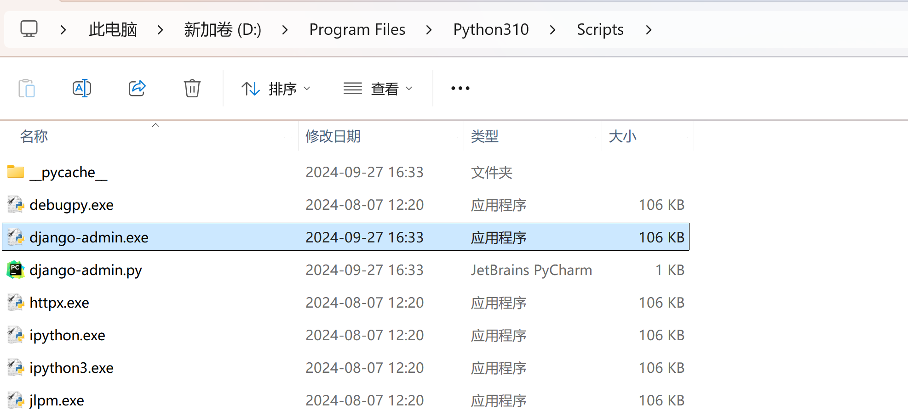

## 3.3 查看Django命令

```shell
django-admin
```

```shell
django-admin

Type 'django-admin help <subcommand>' for help on a specific subcommand.

Available subcommands:

[django]
    check
    compilemessages
    createcachetable
    dbshell
    diffsettings
    dumpdata
    flush
    inspectdb
    loaddata
    makemessages
    makemigrations
    migrate
    runserver
    sendtestemail
    shell
    showmigrations
    sqlflush
    sqlmigrate
    sqlsequencereset
    squashmigrations
    startapp
    startproject
    test
    testserver
Note that only Django core commands are listed as settings are not properly configured (error: Requested setting INSTALLED_APPS, but settings
 are not configured. You must either define the environment variable DJANGO_SETTINGS_MODULE or call settings.configure() before accessing settings.).
```

# 4 创建项目

## 4.1 命令

````shell
django-admin startproject 项目名

django-admin startproject demo01
````

- 执行上述命令就会在当前路径下出现一个文件夹叫 demo01

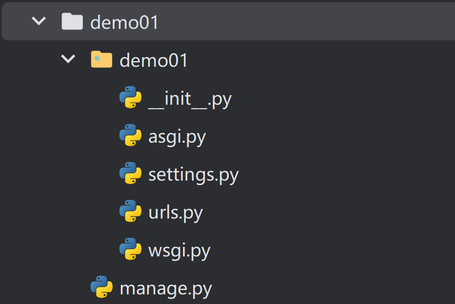

## 4.2 PyCharm创建项目

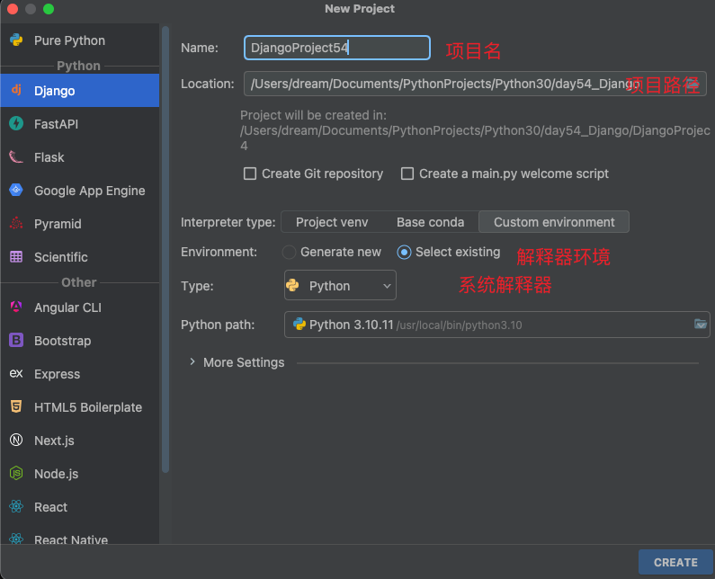

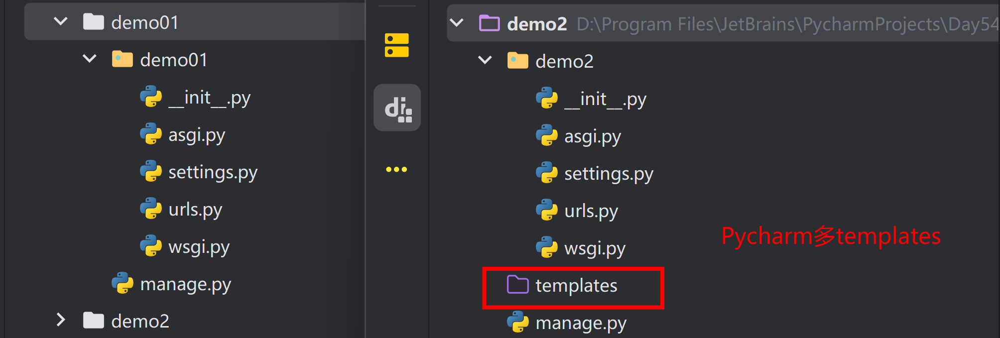

# 5 启动项目

## 5.1 Django命令行启动

```shell
cd demo01
```

```
demo01          manage.py
```

- 启动项目

```shell
python manage.py runserver [IP:PORT]

# 不写 [IP:PORT] 默认就是 127.0.0.1:8000
```

````
[notice] To update, run: python.exe -m pip install --upgrade pip
PS D:\Program Files\JetBrains\PycharmProjects\Day54\demo01> python manage.py runserver      
Watching for file changes with StatReloader
Performing system checks...

System check identified no issues (0 silenced).

You have 18 unapplied migration(s). Your project may not work properly until you apply the migrations for app(s): admin, auth, contenttypes, sessions.
Run 'python manage.py migrate' to apply them.
September 27, 2024 - 16:50:07
Django version 3.2.12, using settings 'demo01.settings'
Starting development server at http://127.0.0.1:8000/
Quit the server with CTRL-BREAK. # 通过CTRL-BREAK 结束项目退出
````

## 5.2 PyCharm启动

- 打开项目 是两层

```
demo01 # 外边一层项目名
├── db.sqlite3
├── demo01 # 里边一层和项目名同名的文件夹
│   ├── __init__.py
│   ├── __pycache__
│   │   ├── __init__.cpython-310.pyc
│   │   ├── settings.cpython-310.pyc
│   │   ├── urls.cpython-310.pyc
│   │   └── wsgi.cpython-310.pyc
│   ├── asgi.py
│   ├── settings.py
│   ├── urls.py
│   └── wsgi.py
└── manage.py
```

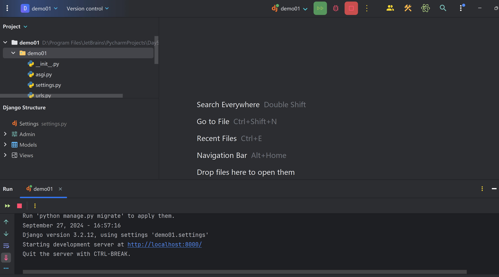

- 修改端口

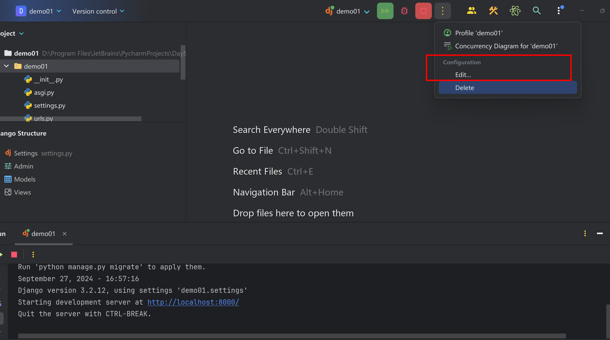

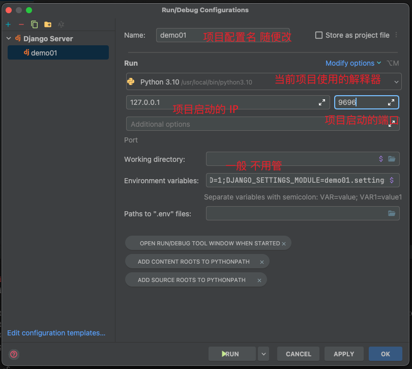

- 再启动项目的时候可能会遇到一个问题

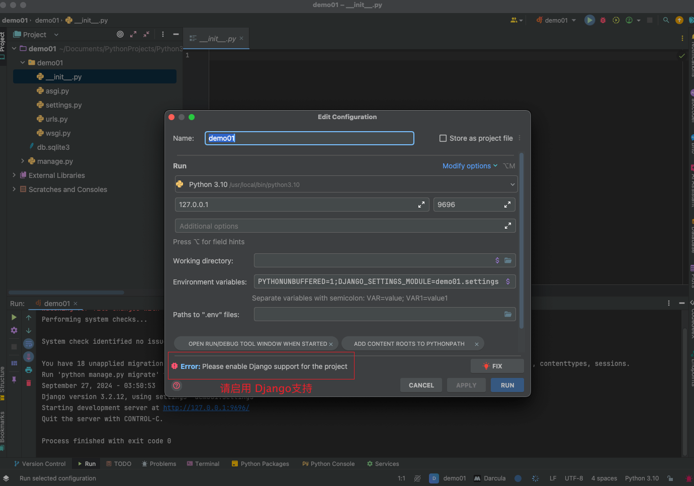

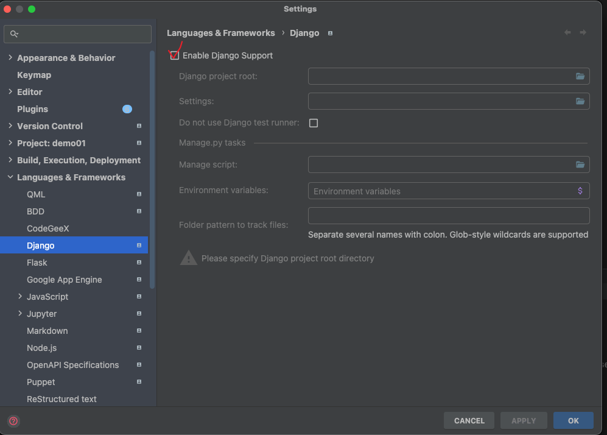

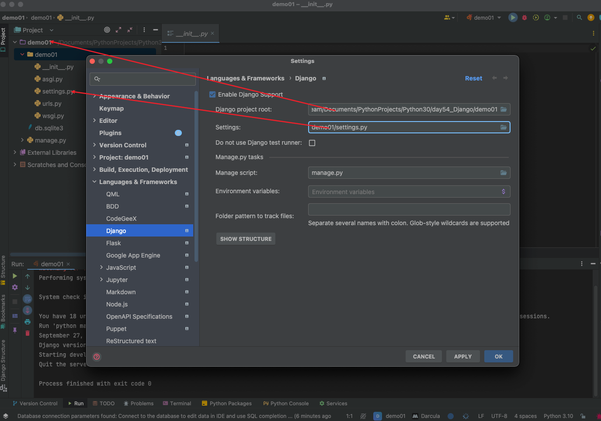

- 配置文件不想改 想使用默认的 添加新配置启动

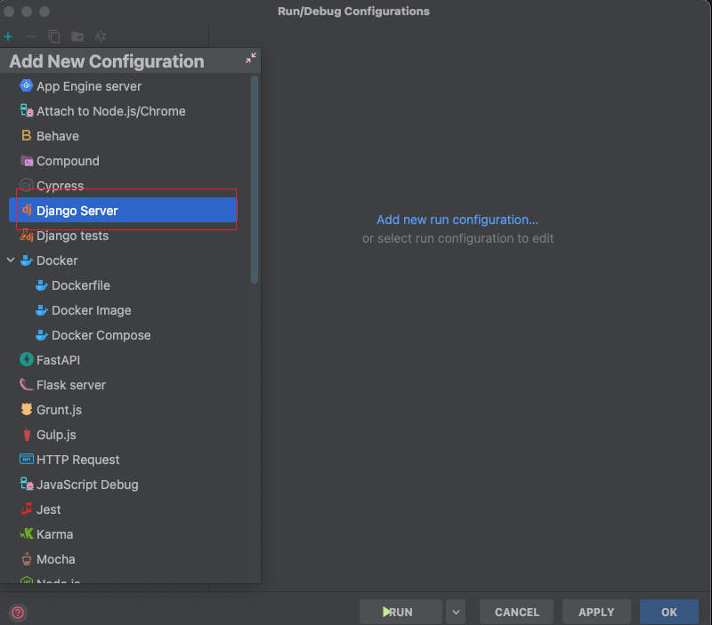


# 6 创建APP

## 6.1 APP概念介绍

```python
# 在Django框架中，应用程序（Application）是组织和管理项目代码的基本单元。
# 它不仅包含了与特定业务逻辑相关的模型、视图、模板以及URL配置，还可能包括 forms、signals、中间件、管理后台等组件，实现了项目的模块化设计。

# 1.介绍
# Django框架就像是一个高度模块化的操作系统，为开发者提供了基础设施和服务，如数据库连接、认证授权、请求处理等。

# 2.比喻
# (1)大学与学院
# Django框架相当于是一所大学，应用相当于是大学里面的各个学院 
#   大学相当于是个空壳子 
#     负责提供环境
#   学院才是一个个真正具备特定功能的集合
# (2)操作系统与服务
# 每个应用就像是操作系统中的一个进程或服务，负责处理特定领域的任务和数据操作。
# 用户应用（user）关注用户的注册、登录、权限管理等功能；
# 订单应用（order）主要处理商品购买、订单状态跟踪、支付确认等相关事务；
# 商品应用（goods）专注于商品信息管理、分类展示、搜索推荐等功能；
# 后台管理应用（backend）则通常包含对系统设置、数据统计、权限控制等方面的集中管理和维护。

# 3.示例
# 使用django写一个淘宝，淘宝里面有很多功能模块
# 我们应该先创建一个空的django项目然后根据功能的不同创建不同的应用
# django项目
# 应用名	业务
# user	用户相关业务：管理用户账户信息（账号、密码、角色、权限）、用户行为记录、消息通知等
# order	订单相关业务：负责订单生成、订单详情展示、订单状态变更、支付接口调用、物流追踪及订单评价等
# goods	产品相关业务：包括商品分类管理、商品详情展示、库存管理、商品评论、浏览记录等
# promotion	促销相关业务：针对促销活动的规划、优惠券发放、满减规则设置、折扣计算等；
# category	商品类别业务：用于商品类别树的构建、导航菜单设置、新品上架、热门推荐等；
# logistics	物流相关业务：对接物流公司API以获取物流信息、快递单号追踪等功能；
# statistics	数据分析相关业务：收集并分析平台各项运营数据，如访问量、转化率、客单价等，为决策提供支持；

```

## 6.2 创建APP

- 前提是当前文件夹路径下有 ` manage.py`

```shell
python manage.py startapp APP名字
```

```shell
python manage.py startapp user
```

- 效果就是在当前项目路径下出现了一个 `user`文件夹

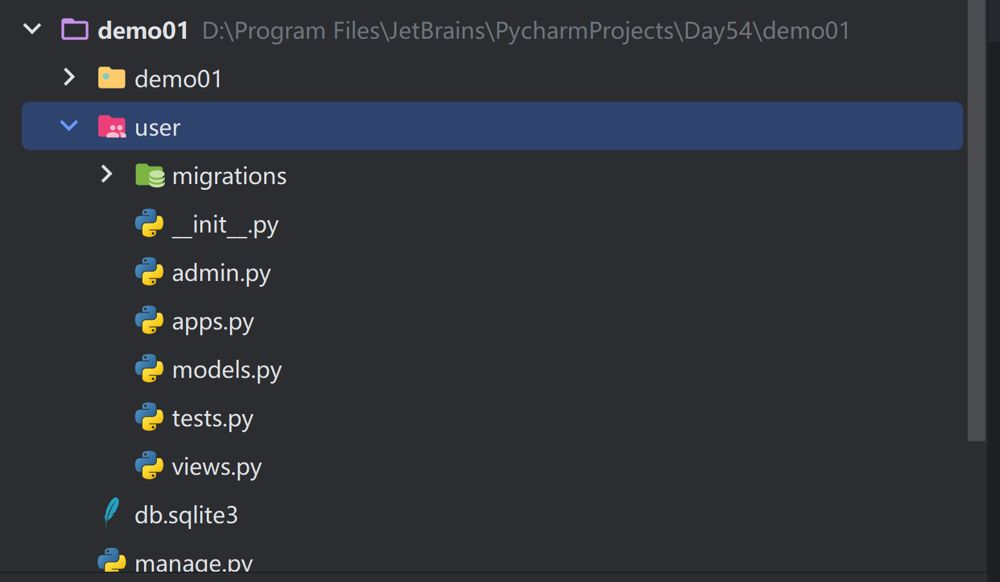

## 6.3 注册APP

- `settings.py` 中有一个代码快

```python
INSTALLED_APPS = [
    'django.contrib.admin',
    'django.contrib.auth',
    'django.contrib.contenttypes',
    'django.contrib.sessions',
    'django.contrib.messages',
    'django.contrib.staticfiles',
    # 直接放自己创建的app名字即可
    "user"
]
```

## 6.4 PyCharm创建APP

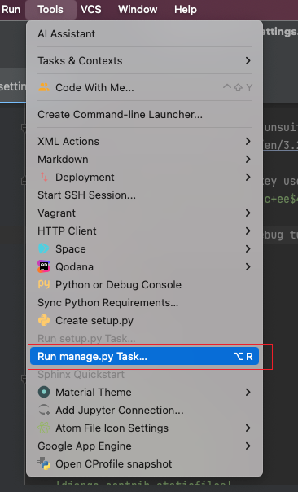

```
startapp app名字
```

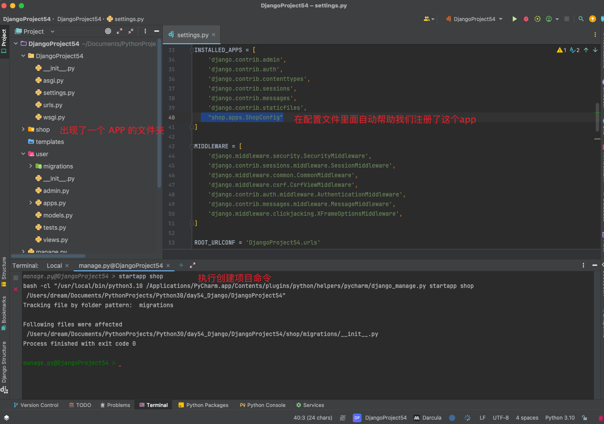

```python
INSTALLED_APPS = [
    'django.contrib.admin',
    'django.contrib.auth',
    'django.contrib.contenttypes',
    'django.contrib.sessions',
    'django.contrib.messages',
    'django.contrib.staticfiles',
    # 方式一 直接写 app 名字
    "user",
    # 方式二 ： 写具体的路径
    # 如果是PyCharm创建 写shop会自动写到ShopConfig
    "shop.apps.ShopConfig"
]
```

# 7 Django项目文件介绍

```
DjangoProject54 # 主项目名 必须
├── DjangoProject54 # 存放Django项目的基本配置的文件夹 和你的项目名是同名的 必须
│   ├── __init__.py # 初始化项目需要加载的代码 后面会写
│   ├── __pycache__ # Python解释器给Django项目的缓存文件  --- 在项目中看不到 不用管
│   │   ├── __init__.cpython-310.pyc # Python解释器缓存文件
│   │   └── settings.cpython-310.pyc # settings 更改后的缓存
│   ├── asgi.py # 上线到服务器之后都需要配置的启动文件 本地的项目不写 不动
│   ├── settings.py # Django的项目配置文件
│   ├── urls.py # 跟路由映射文件
│   └── wsgi.py # 基于 wsgiref 模块分装后的 wsgi 模块 去帮助你 创建 app 不动
├── manage.py # 加载Django项目的所有配置 并帮助我们启动Django项目
├── templates
└── user # 自己创建的 APP 的名字
    ├── __init__.py # 没有东西 后面会写 
    ├── admin.py # 我们在进入后台管系统之后注册内容 现在不写 后面 写
    ├── apps.py # 当前APP 的默认配置 不要瞎改  不要动
    ├── migrations # 数据库迁移记录文件夹 MySQL 将 Python代码定义的数据库结构转换成SQL 语句
    │   └── __init__.py # 没东西但是不允许删除 必须有
    ├── models.py # 存储我们自己定义的数据库模型 自己通过 Python代码定义的数据库字段
    ├── tests.py # Django的测试文件 不用管
    └── views.py # 自己写的业务逻辑在的地方
```

# 8 小白必会三板斧

```
from django.shortcuts import render,HttpResponse,redirect
```

```python
from django.shortcuts import render, HttpResponse, redirect


# Create your views here.
# 定义视图函数并且有一个 request 参数必写
def index(request):
    # 返回纯文本内容
    return HttpResponse("OK")


def login(request):
    # 返回 页面 对象
    return render(request, "login.html")


def register(request):
    print("欢迎来到注册函数")
    # 重定向路由
    # http://127.0.0.1:8000/register/
    # 自动帮你转接到 http://127.0.0.1:8000/login/
    return redirect("/login/")
    '''
    [27/Sep/2024 04:22:31] "GET /register/ HTTP/1.1" 302 0
    [27/Sep/2024 04:22:31] "GET /login/ HTTP/1.1" 200 145
    '''
```

