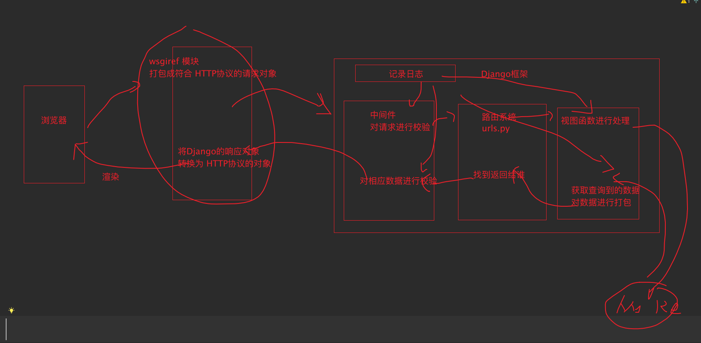

# 1 ORM数据表操作

```python
from django.db import models


# Create your models here.

# ORM 框架中的类对应数据库中的表
class Student(models.Model):
    # ORM 框架中的属性对应数据库表中的字段
    # name varchar(32)
    name = models.CharField(max_length=32)

    # age int()
    # age = models.IntegerField()
    age = models.CharField(max_length=32)

    # gender varchar(32)
    # gender = models.CharField(max_length=32, default="")

    # 在当前类下面配置一个 类 Meta
    class Meta:
        # 这个属性就是定义当前数据库中的表明的
        # 如果不配置 就是 以当前 app名_类名 命名
        db_table = "student"

# ORM 框架中的实例对应数据库表中的记录
```

````python
# 【一】SQL语句的数据库操作
# 【1】操作数据库
# create database 数据库名字
# use 数据库名字
# 【2】操作数据表
# create table 表名(字段信息)
# drop table 表名;
# show tables;
# 【3】操作数据
# select * from 表名;

# 【二】Django的ORM操作
# 【1】操作数据库 操作不了  xxx
# 直接连接某个数据库操作的
# 【2】操作数据表
# （1）创建表
# 在models.py文件中定义表模型就可以创建表了
# （2）删除表
# 比如 有一张表不想要了 想要删除
# 使用SQL语句删除某一张表会产生错乱 不建议这么删除
# 直接删除数据库 ---> 创建一个新的库 ---> 重新迁移数据库
# （3）修改表
# 修改表的字段信息
# [1] 增加表字段
# 在定义模型表的类里面新增字段信息
# 然后再进行数据库重载(生成迁移记录 迁移记录进入数据库)
'''
You are trying to add a non-nullable field 'gender' to student without a default;
we can't do that (the database needs something to populate existing rows).
Please select a fix:
 1) Provide a one-off default now (will be set on all existing rows with a null value for this column) (一般不用)
 2) Quit, and let me add a default in models.py
Select an option:
'''
# 选择 2 然后打开  models.py 找到定义的字段添加一个默认值
# gender = models.CharField(max_length=32, default="")

# [2] 删除表字段
# 不想要 gender 字段
# 找到不想要的字段 注解掉 ---> 重载

# [3] 修改某个字段的类型
# 打开 models.py 找到对应的字段
# 修改当前字段的类型 ---> 重载

# （4）查看表信息 Django 的 ORM
# 直接看 models.py 文件中定义了哪些类 ---> 现在有那些表

# 【3】约束条件
# sql : not null / null / unique / default
#  null=False  = not null 不能为空
#  null=True = null 允许为空
#  default="" = default 默认值
from django.db import models
age = models.CharField(max_length=32,
                       null=True,
                       default=""
                       )
````


# 2 ORM数据操作

````python
# 【一】前提
# 在Django中操作Django的模型表 必须让 Django 处于运行的状态
# 必须启动 Django 才能操作Django 的模型表
# 操作Django的模型表必须在视图函数内

# 【二】但是
# 有别的方法
# 为了测试数据的方便 Django提供给我们一种 解决办法
# 第一步：创建一个 main 入口
'''
if __name__ == '__main__':
'''
# 第二步：打开 manage.py 文件
# copy main 函数下面的 第一行代码
# os.environ.setdefault('DJANGO_SETTINGS_MODULE', 'djangoProject03.settings')
# 第三步：导入Django模块
# import django
# 第四步：执行Django启动命令
#  django.setup()
# 第五步：导入Django模型表
# from user.models import Student
# 第六步：操作模型表

# 这个运行环境是一次性的 执行完就自己关闭Django项目
# 如果我以当前模式启动Django项目 http://127.0.0.1:8000/index
# 问能看到 index 路径下的页面吗？
# 看不到我们的视图函数以及定义的页面
# 只能让我们临时操作Django ---> 临时进行数据库操作

# 第一步：创建一个 main 入口
if __name__ == '__main__':
    import os

    # 第二步：打开 manage.py 文件
    os.environ.setdefault('DJANGO_SETTINGS_MODULE', 'djangoProject03.settings')

    # 第三步：导入Django模块
    import django

    # 第四步：执行Django启动命令
    django.setup()

    # 第五步：导入Django模型表
    from user.models import Student

    # 第六步：操作模型表
    # 【1】增加数据
    # 语法：model.objects.create(字段名=字段值)
    # 新增一个人 name=dream age=8

    # （1）方式一：直接模型表.objects.create 常用的 ---> 我们常用
    # result = Student.objects.create(name="dream",age=18)
    # print(result) # Student object (2)
    # Django中如果 数据库中是字符串类型 在 创建语句中 会对数字类型进行强转

    # （2）方式二：直接模型表(字段名=字段值).save() --- 少用
    # student_obj = Student(name="dream01", age=18)
    # print(student_obj)  # Student object (None) 这里执行结束没有数据库记录生成
    # result = student_obj.save() # 相当于是提交事务 将数据插入到数据库中
    # print(result)  # None

    # 【2】查看数据
    # （1）方式一： 模型表.objects.all()
    '''
    result = Student.objects.all()
    print(result)  # 返回值是一个QuerySet对象并且会将数据库中的所有结果拿到
    # <QuerySet [<Student: Student object (1)>, <Student: Student object (2)>, <Student: Student object (3)>]>
    # <Student: Student object (1)>
    # 列表里面放的就是每一个数据
    student_obj_one = result[0]
    print(student_obj_one, type(student_obj_one))
    # Student object (1) <class 'user.models.Student'>
    # 直接通过对象.属性名获取属性值
    print(student_obj_one.name)  # dream
    print(student_obj_one.age)  # 18 
    print(student_obj_one.id)  # 1
    '''

    # （2）方式二：模型表.objects.get(属性名=属性值) 有就拿到具体的对象 没有 则直接报错 只能筛选一个对象对于1个就报错

    # 按照指定条件过滤数据 数据存在
    # student_one = Student.objects.get(id=1)
    # print(student_one)  # Student object (1)

    # 按照指定条件过滤数据 数据不存在
    # student_one = Student.objects.get(id=8)
    # user.models.Student.DoesNotExist: Student matching query does not exist.

    # 按照指定条件过滤数据  有两条数据都叫 dream
    # student_one = Student.objects.get(name="dream")
    # user.models.Student.MultipleObjectsReturned: get() returned more than one Student -- it returned 2!

    # （3）方式三：模型表.objects.filter()

    # [1] 按照指定条件过滤数据 获取到存在的数据
    # result = Student.objects.filter(id=1)
    # print(result) # 获取到的结果是 QuerySet 对象 返回值是一个列表
    # # <QuerySet [<Student: Student object (1)>]>
    # print(result[0]) # Student object (1)

    # [2]按照指定条件过滤数据 获取到存在的数据 获取到第一条符合的数据 / 最后一条符合的数据
    '''
    result = Student.objects.filter(id=1).first()  # === Student.objects.get(id=1)
    print(result)  # 获取到的结果是 QuerySet 对象 返回值是一个列表
    # Student object (1)
    
    result = Student.objects.filter(id=1).last()  # === Student.objects.get(id=1)
    print(result)  # 获取到的结果是 QuerySet 对象 返回值是一个列表
    # Student object (1)
    '''

    # [3]按照指定条件过滤数据 获取到不存在的数据  -- 空数据不会报错
    # result = Student.objects.filter(id=8)
    # print(result)  # 获取到的结果是 QuerySet 对象 返回值是一个列表
    # # <QuerySet []>

    # [4] 获取到多个数据 -- 不会报错
    # result = Student.objects.filter(name="dream")
    # print(result)  # 获取到的结果是 QuerySet 对象 返回值是一个列表
    # # <QuerySet [<Student: Student object (1)>, <Student: Student object (2)>]>

    # （4）方式四：过滤掉指定的数据 模型表.objects.exclude(属性名=属性值)

    # 按照指定条件过滤数据 排出掉当前符合条件的数据
    # result = Student.objects.exclude(name="dream")
    # print(result)  # 获取到的结果是 QuerySet 对象 返回值是一个列表
    # <QuerySet [<Student: Student object (3)>]>

    # (总结)
    # 模型表.objects.all()
    #   获取所有数据
    #   返回值是 QuerySet 对象 是一个列表
    # 模型表.objects.get()
    #   返回指定条件的数据
    #   返回值是一个 具体的对象
    #   只能获取1个 超过1个就报错 没有符合条件的数据也会报错
    # 模型表.objects.filter()
    #   返回过滤后的数据 符合条件的数据
    #   返回值是一个 QuerySet 对象 是一个列表
    #   没有符合条件的数据就是空的 QuerySet 对象 是一个空列表
    #   符合条件的多个数据 QuerySet 对象 是一个列表 ---> .first() / .last() 获取第一条或者最后一条数据
    # 模型表.objects.exclude()
    #   返回过滤后的数据 排除符合条件的数据
    #   返回值是一个 QuerySet 对象 是一个列表

    # 【3】删除数据
    # （1）方式一： 模型表.objects.filter(属性名=属性值).delete()

    # 只有一条符合数据的时候
    # Student.objects.filter(id=1).delete()

    # 有多条数据符合 --- 会删除所有符合条件的数据
    # Student.objects.filter(name="dream").delete()

    # （2）方式二：先过滤出制定的对象 然后再删除指定对象
    # student_obj = Student.objects.get(id=3)
    # student_obj.delete()

    # 【4】修改数据
    # Student.objects.create(
    #     name="dream",
    #     age=18
    # )

    # （1）方式一：模型表.objects.filter(属性名=属性值).update(新的参数)
    # 按照指定的参数进行过滤然后修改 返回值是修改成功的条件
    # result = Student.objects.filter(id=4).update(
    #     name="dream_1"
    # )
    # print(result) # 1

    # 同时修改三条符合条件的数据
    # result = Student.objects.filter(name="dream").update(
    #     age=999
    # )
    # print(result)  #3
    #
    # （2）方式二：对象.属性名=属性值 一定不要忘了 .save() 触发保存
    student_obj = Student.objects.get(id=4)
    student_obj.name = "dream_2"

    student_obj.save()
````


# 3 请求生命周期

````python
# 当一个请求进入到Django到走出Django到浏览器渲染的全生命流程

# 请 求 进 入  生命开始
# 到浏览器渲染  生命结束

# 【一】地址栏回车到浏览器渲染的流程
# 【1】在地址栏回车（浏览器输入地址）
# ---> 根服务器解析 IP 和 PORT
# 【2】浏览器向 IP 和 PORT 发起请求
# 【3】请求进入到服务端
# 服务端处理请求 ---> 返回数据
# 【4】服务器打包响应数据然后返回
# 【5】浏览器接收到返回的数据 并渲染

# 【二】Django的请求进入到走
# 【1】浏览器获取到IP和PORT
# 发起请求 ---> 走到Django 里面
# 【2】wsgiref 模块 打包
# 将你的浏览器请求进行打包 打包成符合 HTTP 协议的请求对象
# 【3】去Django框架里面
# （1）中间件 --> 整个Django框架的保安 对请求进行校验
# （2）urls.py 路由系统 ---> 对请求中的路径进行分发 ---> 找到对应的视图函数
# （3）view.py 视图系统 ---> 对请求中携带的数据或其他数据进行处理 ---> 返回一个 Django的响应对象 三板斧
# （4）中间件 --> 整个Django框架的响应数据进行校验
# 【4】wsgiref 模块 打包
# 八Django的相应数据打包成符合 HTTP 协议的响应数据
# 【5】回给客户端 （浏览器） 进行渲染
````




# 4 有名分组和无名分组

````python
# 【零】前提
# 有名分组和无名分组的前提是 基于正则表达式书写 路由
# 在以前 url 语法中
# 或者是 re_path 语法中

# 【一】无名分组
# 对路径中的某一个参数不进行命名
# 向访问 第几页 下的数据
# page/1/  访问第一页
# page/2/  访问第二页
# 路由设计 page/num/
# 无名分组语法
# re_path("page/(\d+)/",page)

'''
def page(request,a, *args, **kwargs):
    # page() takes 1 positional argument but 2 were given

    # 在这里接收到的就是 路径中携带的数子
    # 接收到这个数字可以用任意的变量名接受
    print(a)  # 1
    return render(request, "page.html")
'''

# 【二】有名分组
# re_path("page_name/(?P<page>\d+)/",page_name)
'''
def page_name(request,page, *args, **kwargs):
    # page_name() missing 1 required positional argument: 'a'
    print(args)
    print(kwargs) # {'page': '999'}
    print(page) # {'page': '999'}

    return render(request, "page.html")
'''
# 在定义路由的时候给定当前参数的名字
# 在后端的视图函数中必须用当前定义的参数名接受参数

# 【三】有名分组和无名分组的区别
# 【1】定义
# 要必须能写正则表达式
# 无名分组只写 正则匹配表达式  re_path("page/(\d+)/", page),
# 有名分组必须写 参数名 re_path("page_name/(?P<page>\d+)/", page_name)

# 【2】调用
# 无名分组传过来的参数就是可变长位置参数 任意参数名接受即可
# 有名分组传过来的参数就是可变长关键字参数 必须用指定的关键字接受参数

# 【四】有名分组和无名分组不允许混用
````


# 5 路由解析

````python
from django.urls import path
# _path(route, view, kwargs=None, name=None, Pattern=None):
# name 标识给当前地址起别名

# 【一】定义 路由
# 以 name 给当前 路由起了一个名字 login
#  path("login/adsadasd/dsadsadsad/sdasadads/sadsadsadsa/", login, name="login")

# 【二】路由解析语法
# 为了避免路由参数过长 记不住 或者就混了
# 于是就诞生了路由解析语法
# 先给当前路由起个名字
# 为了后续更高的找到当前路由

# 【三】前端使用
# <p><a href="">路径很全的网址</a></p>

# 【四】后端使用
'''
if a == "1":
    # 不使用路由解析需要将路径写全
    return redirect("/login/adsadasd/dsadsadsad/sdasadads/sadsadsadsa/")
elif a == "2":
    # 使用路由解析动态加载当前 地址
    return redirect(reverse("login"))
'''
````

