# 1 笔记软件Typora安装及介绍

## 1.1 typora介绍

Typora是一款非常流行的Markdown：编辑器，它能够将Markdown文本转化为漂亮的排版，并且支持实时预览。Typora具有简单易用的界面，使得用户可以轻松地编写和编辑Markdown文本。此外，Typora还支持多种平台，包括Windows、Mac和Linux。

## 1.2 下载安装包&安装

typoraio.cn

已有软件&激活码 省略相关信息

## 1.3 markdown语法介绍

```python
# 【一】标题级别
# 1-6 级标题
# 【1】代码写
# 我是1级标题
### 3级标题

# 【2】快捷键
# Ctrl + 数字1-6

# 【二】代码块
# ``` 反引号 英文模式

``` 编程语言（python、SQL等）
# 不同编程语言中代码的高亮不一样

# 工具栏创建
# 段落-代码块 （需要自己补充编程语言）

# 【三】无序列表

# 快捷键 ctrl + shift + ]

# 工具栏创建
# 段落-无序列表

# 【四】有序列表

# 快捷键 ctrl + shift + [

# 工具栏创建
# 段落-有序列表

# 【五】文本加粗
# 快捷键 ctrl + B

# 【六】插入表格
# 段落 - 插入表格

# 【七】导出文件
# 文件 - 导出 - pdf文件

```

## 1.4 Typora设置

1. 图片设置

   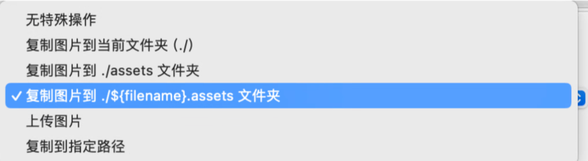

2. 上传图片

   将图片上传到服务器然后拿到服务器返回的图片地址渲染

   [七牛云 + Typora + PicGo 搭建图床 - Chimengmeng - 博客园 (cnblogs.com)](https://www.cnblogs.com/dream-ze/p/17680634.html)

3. 主题

   打开设置-主题-获取主题-下载主题-放到主题文件夹中即可生效


# 2 编程和编程语言

## 2.1 什么是编程语言

- 语言：人与人和人与动物之间沟通交流的媒介
- 编程语言：人与计算机之间沟通交流的媒介

## 2.2 什么是编程

- 将人的语言翻译成计算机能识别的语言

## 2.3 为什么会出现编程语言？

- 为了让人和计算机进行有效的沟通


# 3. 计算机的组成原理

## 3.1 什么是计算机

- 通电的智能设备，计算机也被叫做电脑，可以批量地执行命令

## 3.2 为什么要发明计算机

- 从古至今仍然会存在奴隶制制度，奴隶--->牛马
- 印度 种姓制
- 人类效益有限，招一个可以不休不止工作的人
- 因此是人类首选
- -以上并非正统知识 仅作趣味

## 3.3 计算机的五大组成部分

计算机由五大部件组成，包括***运算器、控制器、存储器、输入设备和输出设备组成。***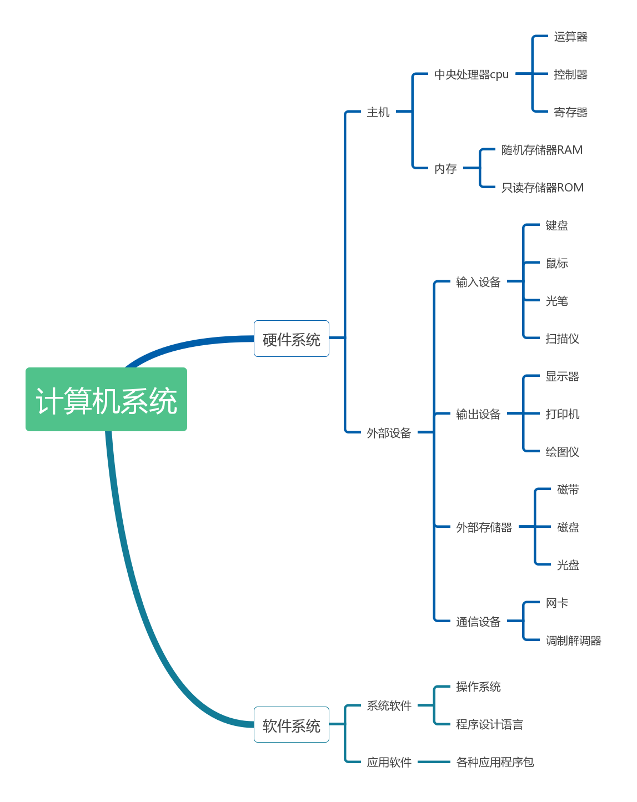

（1）控制器

- 相当于计算机的大脑，控制整个计算机的硬件协调工作

（2）运算器

- 执行计算机中的各种算数和逻辑运算
- 相当于人类大脑 的某部分
- 控制器 + 运算器 = CPU

（3）存储器

- 存储数据，存储电脑中临时或永久性的数据

- 外存：相当于硬盘（机械硬盘和固态硬盘）-负责永久性地存储数据

  - 固态硬盘：读取速度非常快 贵

  - 机械硬盘：读取速度慢 便宜

- 内存：相当于内存条 双8G 双16G

  - 临时性存储数据--->只要你电脑一断电数据就会消失

  - 台式机断电消失

（4）输出设备

- **是计算机硬件系统的终端设备，**用于接收计算机数据的输出显示、打印、声音、控制外围设备等。
- 显示器/音响/耳机
- 将计算机计算出的内容展示给用户
- 相当于你的感觉器官说话写文章

（5）输入设备

- 是向计算机中输入信息（程序、数据、声音、文字、图形、图像等）的设备。
- 键盘/鼠标/耳麦/扫描仪
- 相当于人的眼鼻嘴
- 外存储器也是一种输入设备。 

## 3.4 计算机五大组成部分小结

- 控制器 + 运算器 ---> 控制整体硬件的运行 和 控制算数运算和逻辑运算 ---> 构成了CPU
- 存储器：存储电脑运行产生的数据
  - 外存：存储永久性数据
  - 内存：存储临时性数据 人-海马体

- 输入设备和输出设备：向计算机中输入内容 和 计算机展示结果

## 3.5 计算机三大核心硬件

（1）CPU（中央处理器）

- 由控制器和运算器组成。
- **用于计算数据，执行程序的指令。**
- 负责控制计算机的操作。
- 计算机的"大脑”，决定程序执行的顺序和过程。
- 现在著名的中央处理器(CPU)制造商主要有Intel和AMD。
  - 这两家厂商都是外国的，我们中国有龙芯，但是主要还是用在嵌入式工控领域，很少用在个人PC领域，市面上也很少龙芯CPU的电脑。
  - 主要还是因为，我们的龙芯技术不行，没有人家的CPU性能好。

（2）硬盘

- 读取速度相对较慢。
- **用于永久保存数据，包括操作系统、应用程序和用户数据等。**
- 断电后数据不会丢失，是一种非易失性存储器。
- 作为长期存储的主要设备，容量通常较大。

（3）内存

- 读取速度快，基于电工作。
- **用于存储正在运行的程序和临时数据。**
- 断电后数据立即丢失，是一种易失性存储器。
- 作为CPU直接访问的存储介质，提供了高速的数据读写能力。

（4）补充：进制换算

```python
TB,PB, Eb, Zb, YB
1B= 8bit
1KB=2(10)B=1024B； 括号中的数字为2的指数(即多少次方) 
1MB=2(10)KB=1024KB=2(20)B； 
1GB=2(10)MB=1024MB=2(30)B。 
1TB=2(10)GB=1024GB=2(40)B 
1PB=2(10)TB=1024TB=2(50)B 
1EB=2(10)PB=1024PB=2(60)B 
1ZB=2(10)EB=1024EB=2(70)B 
1YB=2(10)ZB=1024ZB=2(80)B 

1Byte相当于一个英文字母
Kilobyte(KB)=1024B相当于一则短篇故事的内容。 
Megabyte(MB)=l024KB相当于一则短篇小说的文字内容。 
Gigabyte(GB)=1024MB相当于贝多芬第五乐章交响曲的乐谱内容。 
Terabyte(TB)=1024GB相当于一家大型医院中所有的X光图片资讯量。 
Petabyte(PB)=l024TB相当于50%的全美学术研究图书馆藏书资讯内容。 
Exabyte (EB)=1024PB；5EB相当于至今全世界人类所讲过的话语。 
Zettabyte(ZB)=1024EB如同全世界海滩上的沙子数量总和。 
Yottabyte(YB)=1024ZB相当于7000位人类体内的微细胞总和。
```

## 3.6 计算机的操作系统

（1）操作系统的由来

- 操作系统的出现是为了简化硬件操作，提供统一的接口供应用程序使用。
- 在开发应用程序时，不同开发者无需重复编写控制硬件的底层代码，而是调用操作系统提供的接口。
- 这样，开发者能够专注于应用程序的业务逻辑，提高开发效率。

（2）示例

- 暴风影音：视频打开观看的应用程序，换工作
  - windows系统：召集人手--->开发 暴风影音
  - MacOS系统：召集人手--->开发 暴风影音
  - windows系统：召集人手--->开发 暴风影音

- 找一家公共的公司：召集人手--->开发 暴风影音
  - 公司一：拿过来直接用即可

（3）常见的操作系统

- 客户端 Pc 电脑端
  - Windows系统
  - MacOS系统
  - Linux系统

- 移动端App
  - 安卓
  - iOS
  - 鸿蒙
  - …

（4）软件

- 系统软件：操作系统的软件 Windows系统，里面又安装了很多应用，打开文件夹是一个应用，被打包到了系统软件里
- 应用软件：根据用户的特定需求开发出来的软件，可以运行在操作系统之上


## 3.7 计算机系统的三层架构

（1）硬件层

- 负责所有的基础硬件设置

（2）操作系统层

- 在硬件层之上有一个操作系统来统筹所有的操作

（3）应用层

- 在操作系统之上安装应用


## 3.8 平台

- 平台就是硬件+操作系统
  - Windows平台
  - MacOS平台
  - Linux平台

- 有的应用可以在Windows上面用，有的只能在MacOS上面用
- 跨平台 --->一个应用可以在多个平台上面使用
- Python这门语言有极大的跨平台性 MacOS / window / linux 
  - 一次编写 处处运行

- 纯小白 学Python是最明智的选择


# 4. 编程语言介绍

## 4.1 什么是编程语言

- 人与计算机之间进行交流的媒介就是编程语言

## 4.2 按照发展阶段

（1）机器语言

- 计算机可以理解的，直接操作底层硬件的语言

- 因为计算机是基于电工作的，电有高低电频，0 / 1
- 就能控制计算机通过一段计算机的二进制指令执行不同的功能

```python
# 一个人是1，一个人是0
# 01 a
# 10 b

# 01010101 aaaa
# 10101010 bbbb

# 01100110 abab

# 0101010101010101 开机
# 1010101010101010 关机

# 2 2 2 2 16 
# 16 * 16 256
```

- 机器指令：就是二进制 0或1 组成的一串指令，可以直接操作底层硬件
- 有了机器指令，如何编写机器指令。
  - 首先要记住所有的二进制指令代表的含义
  - 编写机器指令的时候需要自己处理每一条指令，包括数据分配和内存输入输出
  - 十分繁琐

```python
'''指令部份的示例'''
 0000 代表 加载（LOAD）
 0001 代表 存储（STORE）
 ...
 
LOAD 0000  # 加载寄存器A
STORE 0001 # 存储到寄存器B

'''暂存器部份的示例'''
0000 代表暂存器 A 
0001 代表暂存器 B 
...

'''存储器部份的示例'''
000000000000 代表地址为 0 的存储器
000000000001 代表地址为 1 的存储器 
000000010000 代表地址为 16 的存储器
100000000000 代表地址为 2^11 的存储器
```

```python
# 机器语言的优点
# 执行效率高：机器语言直接操作底层硬件

# 机器语言的缺点
# 开发效率低：需要记住很多二进制指令
# 跨平台性差：不同的系统需要重新开发
# 学习成本高
```

（2）汇编语言

```python
# 计算机是 美国发明的 用来做战争 图灵测试

# 于是美国人就用 英文字母 + 特殊字符 表示某部分的机器指令代码 ---> 汇编语言

; hello.asm 
section .data            		; 数据段声明
    msg db "Hello, world!", 0xA ; 要输出的字符串
    len equ $ - msg             ; 字串长度
section .text            		; 代码段声明
    global _start            	; 指定入口函数
_start:                			; 在屏幕上显示一个字符串
    mov edx, len            	; 参数三：字符串长度
    mov ecx, msg            	; 参数二：要显示的字符串
    mov ebx, 1            		; 参数一：文件描述符(stdout) 
    mov eax, 4            		; 系统调用号(sys_write) 
    int 0x80            		; 调用内核功能
                    			; 退出程序
    mov ebx, 0            		; 参数一：退出代码
    mov eax, 1            		; 系统调用号(sys_exit) 
    int 0x80            		; 调用内核功能

# 汇编语言的优点
# 直接操作底层硬件： 执行效率高
# 操作灵活：可以用英文字母代替机器指令
# 可执行文件小：编译后的文件小

# 汇编语言的缺点
# 开发效率低：只停留在最初的阶段用一个字母或特殊字符代替一些指令，记住所有的字母和字符代替idea指令才行
# 跨平台性差：在不同的平台开发
# 复杂成都高：所以的英文字母 组合起来很麻烦
```

（3）高级语言

```py
● 从人的角度出发，以人类可读的字符编写程序
  ○ 而人类的字符是在向操作系统发送指令，而非直接操作硬件，所以高级语言是与操作系统打交道的
  ○ 此处的高级指的是高层、开发者无需考虑硬件细节
● 与低级语言相比，高级语言更贴近人类语言，使开发者无需考虑硬件细节，提高了开发效率。
● 但正因为高级语言离硬件较远，更贴近人类语言，执行效率相对较低。
  ○ 人类可以理解，而计算机则需要通过翻译才能理解，所以执行效率会低于低级语言。

# 高级语言的分类
# 按照翻译方式的不同分为两种：
# #编译型语言：c/ c++ / c# / java
# 解释型语言：python / go / php

#【三】什么是编译型语言
# ● 编译型语言将整篇源程序一次性翻译成目标代码，然后生成可执行文件。
# ● 修改源代码后，需要重新编译整个程序。虽然执行效率较高，但开发效率相对较低，跨平台性也较差。

# 例子：给你一篇英文文献，将整篇文章全部翻译完成后，再进行浏览

# 优点：
# 执行效率高：在执行运行文件之前要对文件进行编译 ---> 将你的 高级语言代码转化为 机器语言或者汇编语言 的文件 ---> 执行的是编译后的文件
# 缺点：
# 开发效率低：开发出一个程序之后如果修改程序，程序的源代码就需要重新编译然后才能运行
# 跨平台性差：先编译（根据你的操作系统进行文件的编译）

#【四】什么是解释型语言
# ● 解释型语言逐句翻译源程序成中间代码，由解释器逐句执行。
# ● 修改源代码后，不需要重新编译整个程序，直接执行即可。
# ● 执行效率较低，但开发效率高，且具有较强的跨平台性。

# 例子：给你一篇英文文献，在每一段的文献中进行翻译，翻译之后进行浏览

# 优点：
# 开发效率高：写的程序可以边编译边执行，如果其中一段代码报错然后修改，不需要等待所以的内容加载完后再去执行
# 跨平台性强：不需要经过编译

# 【五】总结
# 根据不同的优缺点比较不同的语言
# 执行效率：机器语言 > 汇编语言 > 高级语言
# 开发效率： 高级语言 > 汇编语言 > 机器语言
# 跨平台性： 解释型语言的跨平台性最高

# 首选Python的原因
# 极强的跨平台性
# 解释型语言，可以边编译边执行
```


# 5. Python

## 5.1 Python 含义

- 代表的是Python这门编程语言
- 代表的是Python的语法风格

```python
# python 这门语言的语法很有个性
```

## 5.2 Python的创始人

- Python的创始人为吉多·范罗苏姆（Guido van Rossum）。

## 5.3 Python在全球的排行榜

- Python这个名字，来自Guidol所挚爱的电视剧《Monty Python's Flying Circus》，他希望这个新的叫做Python的语言，能符合他的理想。
- 创造一种C和she‖之间，语法能够像shel‖一样简洁，易学易用、可拓展性强，同时兼顾C的强大功能。
- 于是Guido在1989年的圣诞节期间，开始编写能够解释Python语言语法的解释器。
- Python崇尚优美、清晰、简单，是一个优秀并广泛使用的语言。
- 最新的TIOBE排行榜，[TIOBE Index - TIOBE](https://www.tiobe.com/tiobe-index/)，Python已飙升至世界第一。

## 5.4 Python的应用领域有哪些

- 数据分析： Python 里面有很多别人写好的第三方模块
- 人工智能：同样有很多的第三方包
- 爬虫：从网页上自动采集数据
- 云计算
- Web开发
- 图像处理（人脸识别）：借助Python的opencv模块
- ···

## 5.5 Python的发展史

- 1989年，Guido开始写Python语言的编译器。
- 1991年，第一个Python编译器诞生。 

- 它是用C语言实现的，并能够调用C语言的库文件。
- 从一出生，Python已经具有了：类，函数，异常处理，包含表和词典在内的核心数据类型，以及模块为基础的拓展系统。

- Granddaddy of Python web frameworks, Zope 1 was released in 1999
- Python 1.0 - January 1994 增加了 lambda, map, filter and reduce.
- Python 2.0 - October 16, 2000，加入了内存回收机制，构成了现在Python语言框架的基础
- Python 2.4 - November 30, 2004, 同年目前最流行的WEB框架Django 诞生
- Python 2.5 - September 19, 2006
- Python 2.6 - October 1, 2008
- Python 2.7 - July 3, 2010
- In November 2014, it was announced that Python 2.7 would be supported until 2020, and reaffirmed that there would be no 2.8 release as users were expected to move to Python 3.4+ as soon as possible
- Python 3.0 - December 3, 2008 (细心的读者会发现，08年时就推出了3.0，2010年反而又推出了2.7？是因为3.0不向下兼容2.0，而很多公司已经基于2.0版本开发出了大量程序，公司已然投入了大量的人财物力，这就导致大家都拒绝升级3.0，无奈官方只能推出2.7过渡版本，之后我们都应该采用3.0解释器开发程序，但为了方便读者维护2.0版本的软件，我们在遇到两种版本的差异时会专门指出来)
- Python 3.1 - June 27, 2009
- Python 3.2 - February 20, 2011
- Python 3.3 - September 29, 2012
- Python 3.4 - March 16, 2014
- Python 3.5 - September 13, 2015
- Python 3.6 - 2016-12-23 发布python3.6.0版
- 2020年: Python 2正式结束支持，用户被鼓励转向Python 3。
- 2020年之后: Python社区继续推动Python 3的普及，许多库和框架逐渐停止对Python 2的支持。
- 2020年: Python 3.8发布，带来了一些新的语言特性和性能改进。
- 2021年: Python 3.9发布，引入了一些新的语法和模块。
- 2022年: Python 3.10发布，继续改进语言的功能和性能。
- 2023年**:** Python继续在各个领域取得成功，成为数据科学、人工智能和Web开发等领域的首选语言之一。社区和生态系统不断扩大，新的库和框架涌现。


- 我们用 Python 310 版本 
  - 现在的最新版本 3.12.x
  - 最新版本汪汪属于内侧版本 --->  可能会有很多 bug
  - 我们用最新版本的低两个版本 3.10 版本

## 5.6 Python解释器的种类

- **我们使用的的Python是cPython，底层是C语言编写的。**

```python
（1）CPython
● 官方的Python解释器本质就是基于C语言开发的一个软件，该软件的功能就是读取以.py结尾的文件内容，然后按照Guido定义好的语法和规则去翻译并执行相应的代码。
● 这种用C实现的解释器称为CPython，它是python领域性能最好，应用最广泛的一款解释器，我们在后面提到的解释器指的都是Cpython解释器。
● 但其实解释器作为一款应用软件，完全可以采用其他语言来开发，只要能解释python这门语言的语法即可。
● Python解释器的一些种类如下，简单了解即可

（2）Jython
● JPython解释器是用JAVA编写的python解释器，可以直接把Python代码编译成Java字节码并执行，它不但使基于java的项目之上嵌入python脚本成为可能，同时也可以将java程序引入到python程序之中。

（3）IPython
● IPython是基于CPython之上的一个交互式解释器，也就是说，IPython只是在交互方式上有所增强，但是执行Python代码的功能和CPython是完全一样的。
● 这就好比很多国产浏览器虽然外观不同，但内核其实都是调用了IE。
● CPython用>>>作为提示符，而IPython用In [序号]:作为提示符。

（4）PyPy
● PyPy是Python开发者为了更好地Hack Python而用Python语言实现的Python解释器。
● PyPy提供了JIT编译器和沙盒功能，对Python代码进行动态编译（注意不是解释），因此运行速度比CPython还要快。

（5）IronPython
● IronPython和Jython类似，只不过IronPython是运行在微软.Net平台上的Python解释器，可以直接把Python代码编译成.Net的字节码。
```


# 6. Python解释器的安装

## 6.1 Python官网

- [Welcome to Python.org](https://www.python.org/)

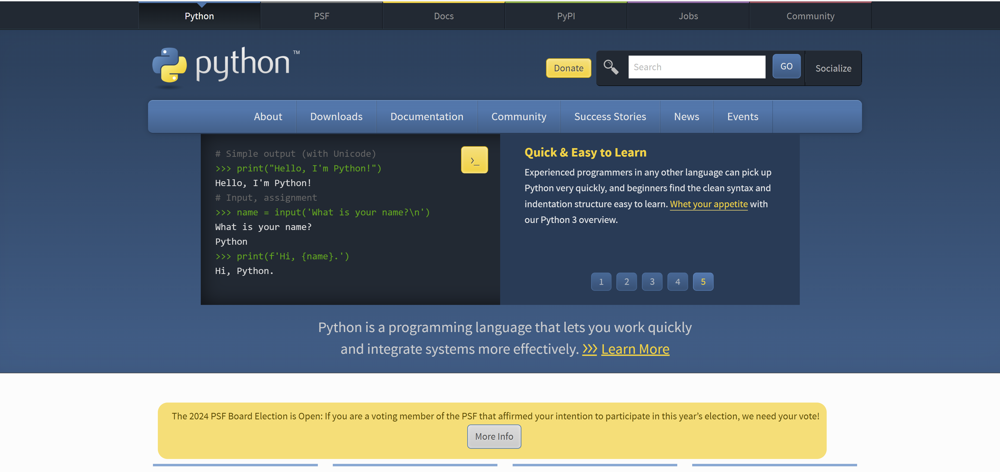

## 6.2 下载解释器

- 在downloads 点击 windows

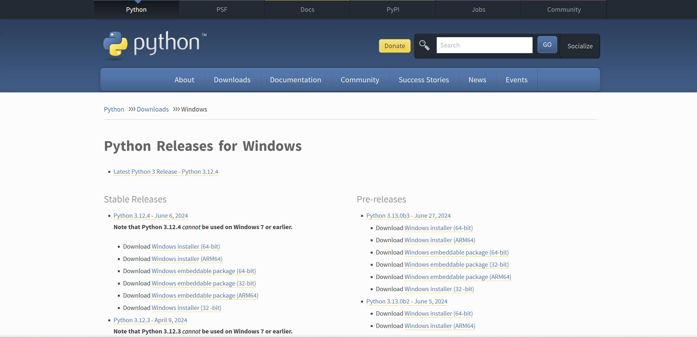

- 按 ctrl + f 搜索 3.10
- 下载安装包： [Windows installer (64-bit)](https://www.python.org/ftp/python/3.10.11/python-3.10.11-amd64.exe)

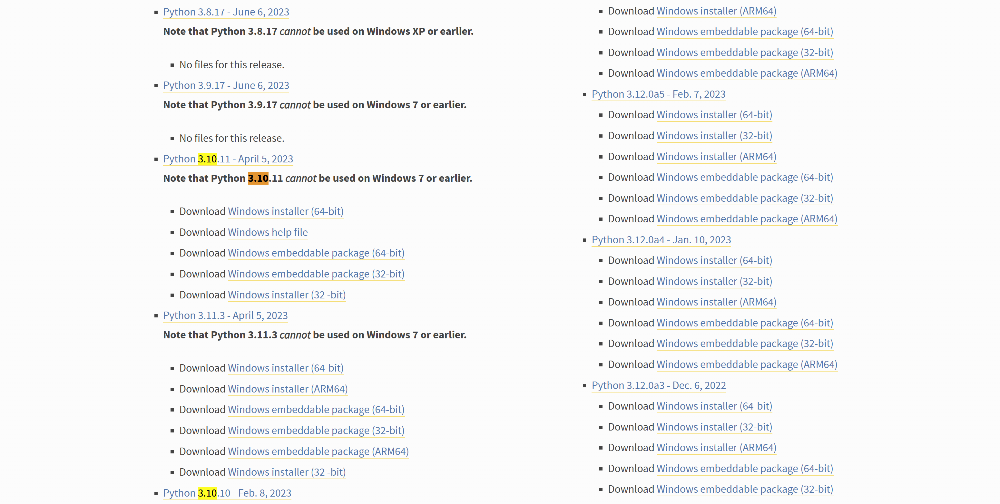

## 6.3 安装 Python解释器

- 自定义安装 Customize installation

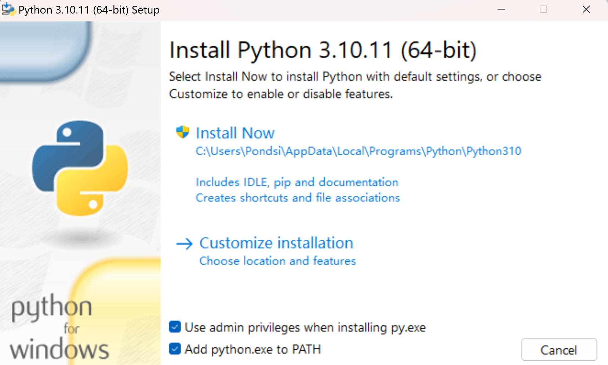

- 全勾上

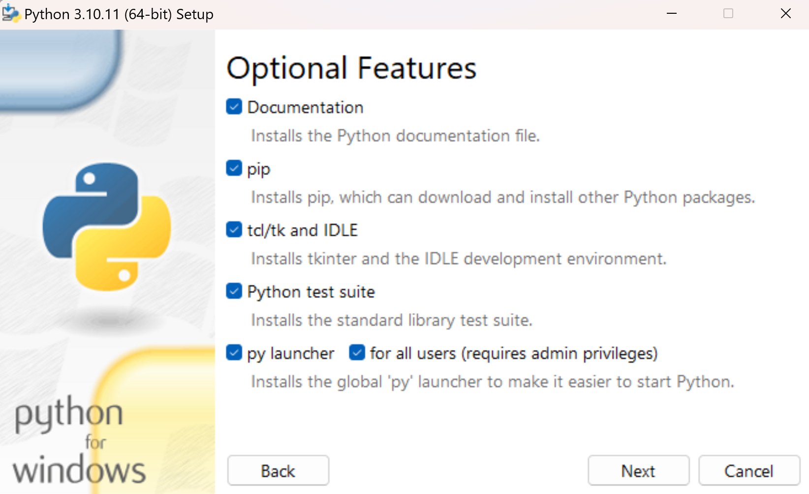

- 安装ing

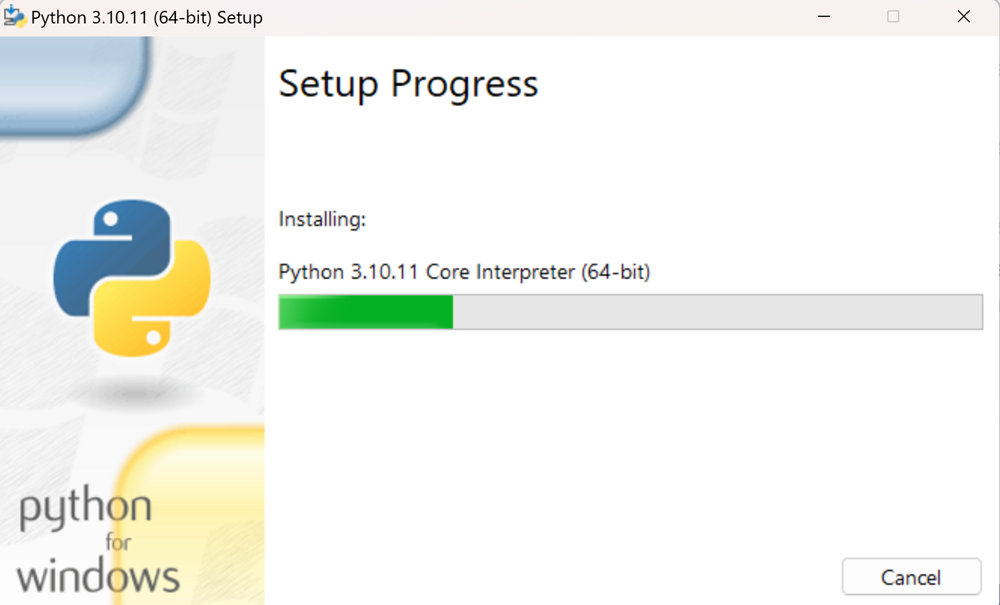

- 安装成功

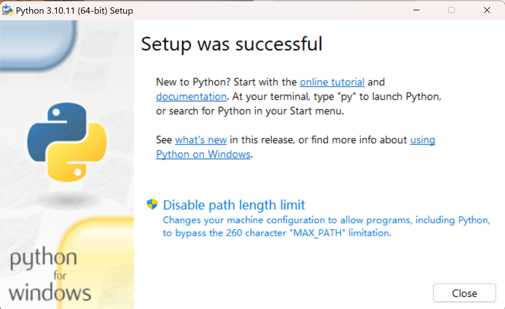

- pycharm

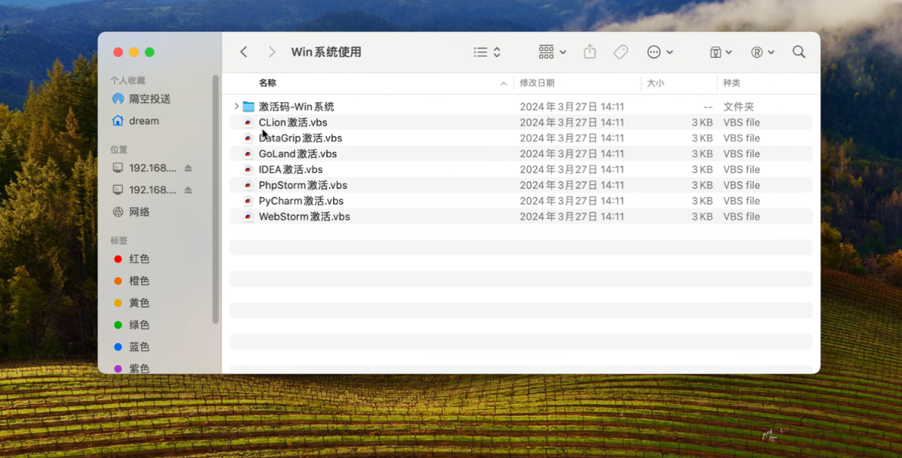

# 7 多版本解释器共存

## 7.1 打开系统环境变量

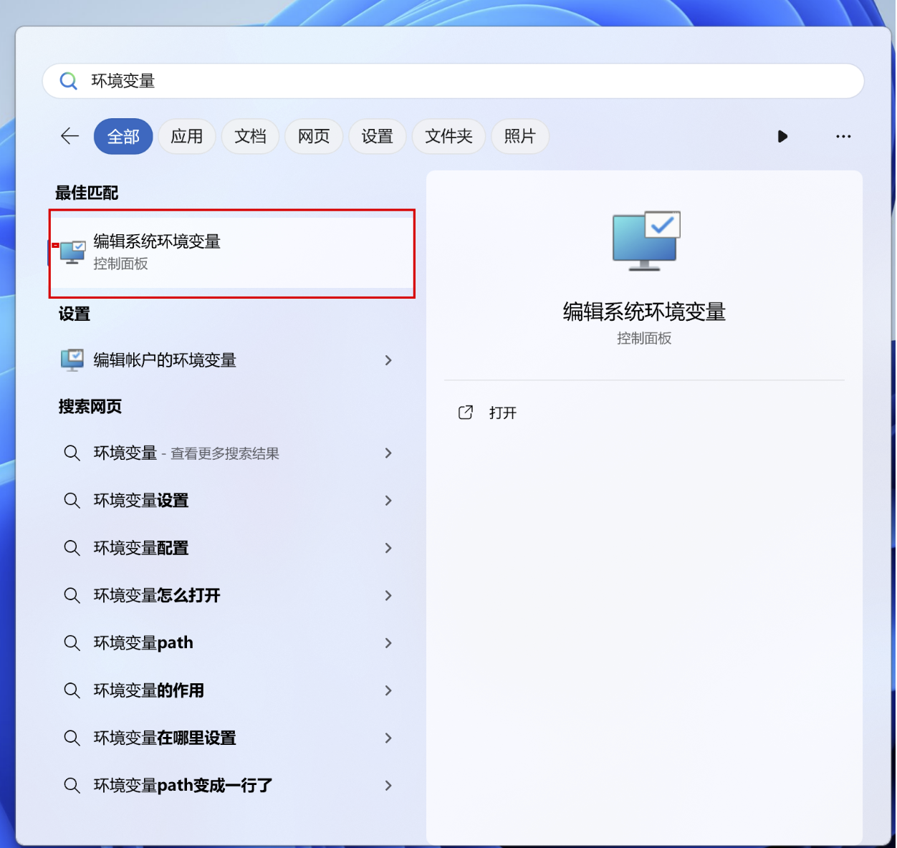

## 7.2 打开环境变量

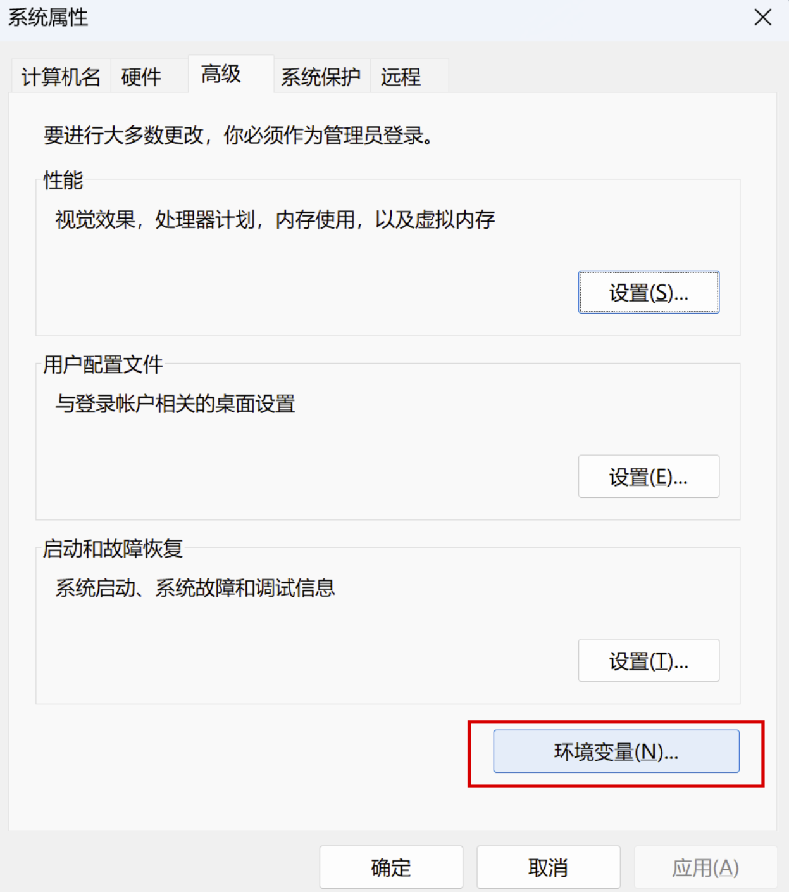

## 7.3 前言

- 一个系统中存在两个不同版本的Python解释器，如何分辨使用的是哪一个
- 现在想使用Python3.10解释器，但在终端执行cmd，输入python出来的是3.12

## 7.4 解决方案

- 复制当前 Python 安装目录下的 python.exe 程序 --->改个名字
- 把 python.exe 改成带版本号的名字
- 分别改为 python310.exe 和 python312.exe

## 7.5 默认Python解释器版本

- 在终端执行Python 出来的是 3.12 解释器 但想要出来的是 3.10
- 环境变量中 编辑 把 310 解释器放到 312 解释器前面


# 8 Python代码书写的三种方案

## 8.1 方案一：文本文件修改

- 先创建一个文本文件
- 然后在文本文件中书写Python代码
- 修改文件名和文件名后缀 .txt --> .py
- 打开终端 输入 Python + 文件路径 回车执行
- 就看到代码结果

## 8.2 方案二：直接在终端解释器中执行代码

- 打开终端 输入 python 回车 进入到终端环境
- 写Python代码

## 8.3 问题

- 文件写 Python代码 可以持久化存储代码 但是没有相关的提示 只能靠自己硬背硬记
- 终端解释器 执行Python代码 换行或者修改代码很不方便

## 8.4 第三方软件诞生

- 现在常用的 Pycharm 或者是 Vscode
- Pycharm是jetbrains 公司旗下的一款终端产品，专门为Python代码而诞生
- 里面集成了很多友好的操作


# 9 Pycharm软件安装

## 9.1 打开官网下载安装包

- 百度搜索Pycharm


1. 不要下ARM64，与架构相关

2. 关于破解，因为是24年的版本，就在bilibili搜了24年的方法，可用到26年。

- 进入官网


- 选择版本下载

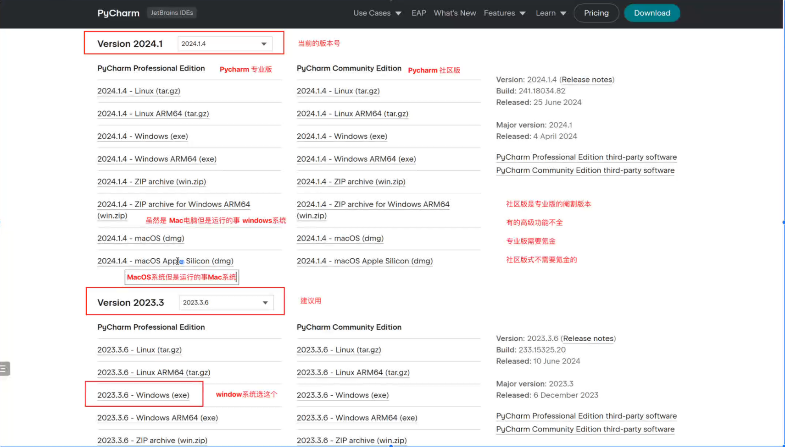

## 9.2 安装

- 启动安装器


- 不建议安装在C盘
- 勾选全部

- 默认是jetbreains不要改
- 安装完成

## 9.3 破解

搞定了 不记录 26年应该也不用24版本的Pycharm噜


# 10 Python补充

## 10.1 PIP换源

1. 引入

   在使用Python时，我们经常需要用到pip安装第三方包。

   但是，在某些情况下，由于网络速度慢或者其他各种原因，pip install会非常慢，甚至可能无法完成。

   为了解决这个问题，我们提供以下几种方法：

2. 永久换源

   永久性地将 pip 源从国外的源切换到国内的源

   ```shell
   pip config set global.index-url https://pypi.tuna.tsinghua.edu.cn/simple/
   ```

   ```python
   清华大学：	    https://pypi.tuna.tsinghua.edu.cn/simple/
   阿 里 云：	   https://mirrors.aliyun.com/pypi/simple/
   豆    瓣：	    https://pypi.douban.com/simple/
   中 科 大：	   https://pypi.mirrors.ustc.edu.cn/simple/
   ```

   ```python
   # 查看当前镜像源
   pip config get global.index-url
   ```

3. 临时换源

   当前源可能无法加载到指定的模块 于是可以临时切换到其他的源

   ```python
   pip install 模块名 -i https://pypi.tuna.tsinghua.edu.cn/simple/ 
   ```

## 10.2 系统环境和虚拟环境介绍

1. 系统环境

   系统环境是指安装在计算机全局范围内的Python环境。

   当你在计算机上安装Python时，它会成为系统环境的一部分。

   在系统环境中安装的Pytho解释器和库对整个计算机可见，所有项目都可以访问它们。

2. 虚拟环境

   虚拟环境是一种在项目级别隔离Python依赖的方法。

   通过创建虚拟环境，你可以为每个项目设置独立的Python环境，从而解决全局安装可能导致的问题。

   虚拟环境可以包含自己的Python解释器和依赖库，与其他虚拟环境和系统环境隔离开。

3. 开发项目

   有一个项目使用的是 Python 310 版本的解释器 但是使用的Django版本是 3.12

   有一个项目使用的是 Python 310 版本的解释器 但是使用的Django版本是 5.0

   于是为了给每个项目产生于一个独立的隔离解释器环境就有了虚拟环境

## 10.3 创建虚拟环境的三种方式

1. venv

   1. 介绍

      Python自带的虚拟环境工具，适用于Python3.3及以上版本。

   2. 使用

      打开命令行终端

      导航到项目所在的目录

      运行以下命令创建虚拟环境

      ```shell
      python -m venv 虚拟环境名字
      ```

      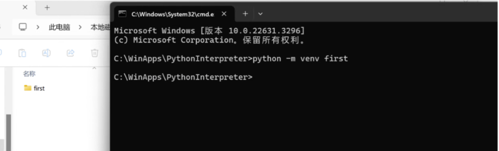

      进入到虚拟环境，在创建的虚拟环境的文件夹中 有一个Scripts文件夹 进入到当前文件夹执行 active

      退出虚拟环境 deactivate

2. virtualenv

   ```python
   pip install virtualenv
   ```

   增加模块，使虚拟环境在win上更好用

   virtualenvwrapper-win是一个增强模块，使得在Windows上使用虚拟环境更方便。

   使用以下命令安装virtualenvwrapper-win：

   ```python
   pip install virtualenvwrapper-win
   ```

   配置参数：打开系统环境变量添加一个变量名和变量值

   - WORKON_HOME

   找到Python3的安装目录，然后进入Scripts文件夹，双击运行virtualenvwrapper.bat文件

   例如E:\Python310\Scripts

   通过运行该脚本，可以同步配置Virtualenvi的使用环境和命令。

   创建虚拟环境

   ```shell
   mkvirtualenv 虚拟环境名称
   mkvirtualenv second
   ```

# 11 Pycharm补充

- 进入主页

  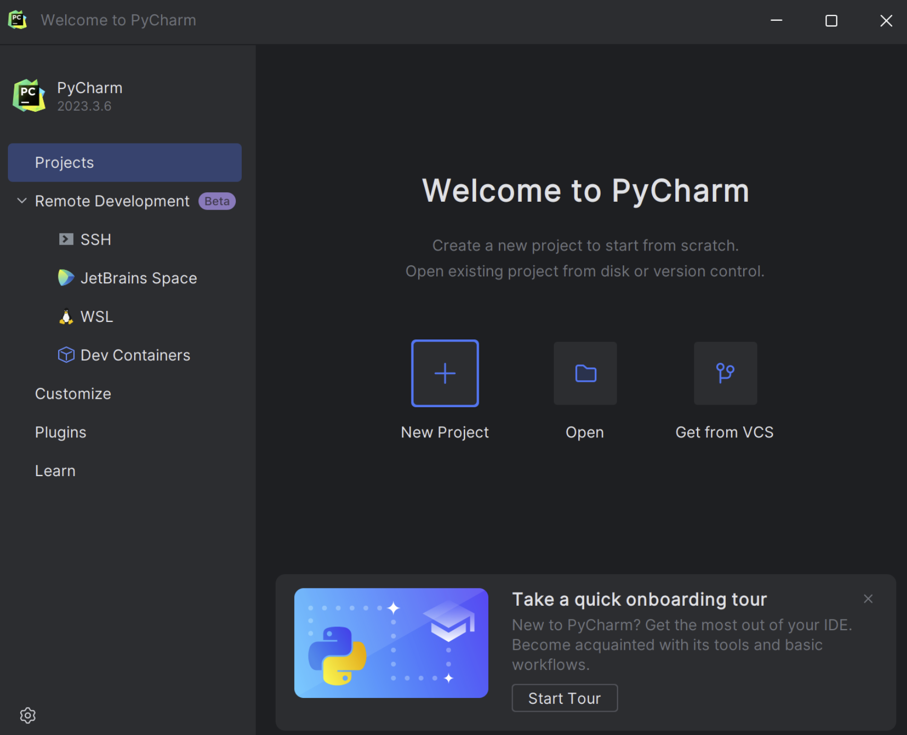

- 设置参数

  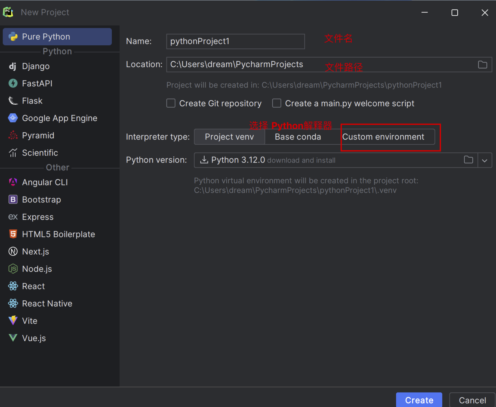

  Pure Python

  选择Custom environment

- 虚拟解释器

  

- 系统解释器

  

  Select existing 选择Python.exe

  点击Create PythonProject

- 创建成功

  

- 创建Python文件

  

- 书写代码和执行代码

  

## 11.1 快捷键

- Ctrl + /：行注释/取消行注释
- Ctrl + Alt + L：代码格式化
- Tab / Shift + Tab：缩进、不缩进当前行
- Ctrl + X / Shift + Delete：剪切当前行或选定的代码块到剪贴板
- Ctrl + C / Ctrl + Insert：复制当前行或选定的代码块到剪贴板
- Ctrl + V / Shift + Insert：从剪贴板粘贴
- Ctrl + B / Ctrl + Click：跳转到声明
- Ctrl + 鼠标左键：悬浮/单击鼠标左键，显示简介/进入代码定义
- Ctrl + D：复制选定的区域或行

```python
● Alt + #[0-9]：打开相应的工具窗口
● Ctrl + Alt + Y：同步
● Ctrl + Shift + F12：最大化编辑开关
● Alt + Shift + F：添加到最喜欢
● Alt + Shift + I：根据配置检查当前文件 正在为您搜索：继续
● Ctrl + Alt + S：打开设置对话框
● Ctrl + Shift + A：查找动作
● Ctrl + Tab：在窗口间进行切换
● Alt + Insert：生成代码
● Ctrl + /：注释（// 或者 /.../ ）
● Ctrl + Shift + /：添加/删除快注释（/**...*/）
● Ctrl + W：递进式取消选择代码块
● Ctrl + Shift + W：递进式选择代码块
● Alt + Q：精确定位到光标所在的代码块，然后再次按返回先前的位置
● Ctrl + Shift + ]/[：选中当前代码块的闭合部分，比如一对大括号中的所有内容
● Ctrl + F4：关闭当前编辑页签
● Ctrl + Shift + U：转换选中的文本（大写、小写、切换大小写）
                    
【1】基本编辑快捷键
● Ctrl + Space：基本的代码完成（类、方法、属性）
● Ctrl + Alt + Space：快速导入任意类
● Ctrl + Shift + Enter：语句完成
● Ctrl + P：参数信息（在方法中调用参数）
● Ctrl + Q：快速查看文档
● F1：外部文档
● Shift + F1：外部文档，进入web文档主页
● Ctrl + Shift + Z 或者 Ctrl + Y：撤销上一步操作 / 重做
● Ctrl + 鼠标左键：悬浮/单击鼠标左键，显示简介/进入代码定义
● Ctrl + F1：显示错误描述或警告信息
● Alt + Insert：自动生成代码
● Ctrl + O：重新方法
● Ctrl + Alt + T：选中
● Ctrl + /：行注释/取消行注释
● Ctrl + Shift + /：块注释
● Ctrl + W：选中增加的代码块
● Ctrl + Shift + W：回到之前状态
● Alt + Enter：快速修正
● Ctrl + Alt + L：代码格式化
● Ctrl + Alt + O：优化导入
● Ctrl + Alt + I：自动缩进
● Tab / Shift + Tab：缩进、不缩进当前行
● Ctrl+X/Shift+Delete：剪切当前行或选定的代码块到剪贴板
● Ctrl+C/Ctrl+Insert：复制当前行或选定的代码块到剪贴板
● Ctrl+V/Shift+Insert：从剪贴板粘贴
● Ctrl + Shift + V：从最近的缓冲区粘贴
● Ctrl + D：复制选定的区域或行
● Ctrl + Y：删除选定的行
● Ctrl + Shift + J：添加智能线
● Ctrl + Enter：智能线切割
● Shift + Enter：另起一行
● Ctrl + Shift + U：在选定的区域或代码块间切换
● Ctrl + Delete：删除到字符结束
● Ctrl + Backspace：删除到字符开始
● Ctrl + Numpad+/-：展开/折叠代码块（当前位置的：函数，注释等）
● Ctrl + shift + Numpad+/-：展开/折叠所有代码块
● Ctrl + F4：关闭运行的选项卡
                    
【2】查找/替换快捷键
● F3：下一个
● Shift + F3：前一个
● Ctrl + R：替换
● Ctrl + Shift + F 或者连续2次敲击shift：全局查找{可以在整个项目中查找某个字符串什么的，如查找某个函数名字符串看之前是怎么使用这个函数的}
● Ctrl + Shift + R：全局替换
                    
【3】运行快捷键
● Alt + Shift + F10：运行模式配置
● Alt + Shift + F9：调试模式配置
● Shift + F10：运行
● Shift + F9：调试
● Ctrl + Shift + F10：运行编辑器配置
● Ctrl + Alt + R：运行manage.py任务
                    
【4】调试快捷键
● F8：跳过
● F7：进入
● Shift + F8：退出
● Alt + F9：运行游标
● Alt + F8：验证表达式
● Ctrl + Alt + F8：快速验证表达式
● F9：恢复程序
● Ctrl + F8：断点开关
● Ctrl + Shift + F8：查看断点
                    
【5】导航快捷键
● Ctrl + N：跳转到类
● Ctrl + Shift + N：跳转到符号
● Alt + Right/Left：跳转到下一个、前一个编辑的选项卡（代码文件）
● Alt + Up/Down：跳转到上一个、下一个方法
● F12：回到先前的工具窗口
● Esc：从工具窗口回到编辑窗口
● Shift + Esc：隐藏运行的、最近运行的窗口
● Ctrl + Shift + F4：关闭主动运行的选项卡
● Ctrl + G：查看当前行号、字符号
● Ctrl + E：当前文件弹出，打开最近使用的文件列表
● Ctrl+Alt+Left/Right：后退、前进
● Ctrl+Shift+Backspace：导航到最近编辑区域 {差不多就是返回上次编辑的位置}
● Alt + F1：查找当前文件或标识
● Ctrl + B / Ctrl + Click：跳转到声明
● Ctrl + Alt + B：跳转到实现
● Ctrl + Shift + I：查看快速定义
● Ctrl + Shift + B：跳转到类型声明
● Ctrl + U：跳转到父方法、父类
● Ctrl + ]/[：跳转到代码块结束、开始
● Ctrl + F12：弹出文件结构
● Ctrl + H：类型层次结构
● Ctrl + Shift + H：方法层次结构
● Ctrl + Alt + H：调用层次结构
● F2 / Shift + F2：下一条、前一条高亮的错误
● F4 / Ctrl + Enter：编辑资源、查看资源
● Alt + Home：显示导航条
● F11：书签开关
● Ctrl + Shift + F11：书签助记开关
● Ctrl + #[0-9]：跳转到标识的书签
● Shift + F11：显示书签
            
【6】搜索相关快捷键
● Alt + F7 / Ctrl + F7：文件中查询用法
● Ctrl + Shift + F7：文件中用法高亮显示
● Ctrl + Alt + F7：显示用法
            
【7】重构快捷键
● F5：复制
● F6：剪切
● Alt + Delete：安全删除
● Shift + F6：重命名
● Ctrl + F6：更改签名
● Ctrl + Alt + N：内联
● Ctrl + Alt + M：提取方法
● Ctrl + Alt + V：提取属性
● Ctrl + Alt + F：提取字段
● Ctrl + Alt + C：提取常量
● Ctrl + Alt + P：提取参数
```

## 11.2 汉化、插件、UI

File -- Settings -- plugins -- Chinese

Plugins -- Atom Material icons 插件 美化图标

File -- Setting -- new UI 切换UI风格 


TASK:

1. 重装py。√

2. 笔记理一遍。√

3. 自己看五大组成部分相关内容。√

4. Pycharm下载。√

5. [七牛云 + Typora + PicGo 搭建图床 - Chimengmeng - 博客园 (cnblogs.com)](https://www.cnblogs.com/dream-ze/p/17680634.html) √  搞定了 但先本地吧 未付费所以都是小图片 这样不太舒适，后面如果需要，重新设置为高清模式按步骤顺一遍即可

6. venv/virtualenv/virtualenvwrapper-win 不懂 研究下√

   主要是不理解为什么会有这样&为什么要这样做：

   --因为项目采用不同版本的python，所依赖的库的版本也不一样，为了避免版本冲突，为每一个项目每个python版本创建一个虚拟环境，环境中所使用的依赖库也是独立存在，不会被其他版本或其他项目的库影响。

   --这三个就是虚拟化模块 可以提供虚拟环境 只是有一些差异 但使用原理步骤大同小异

7. 快捷键挨个试试 挑一些记住 后面有碰到但不会用的查询一下√

8. 其他


# 12 回顾

```python
# 【零】多版本Python解释器共存
# 电脑上安装了多个版本的 Python解释器
# 想要使用特定版本的解释器的时候
# 解决方案：复制原本的Python执行文件--->改个名字

# 如何确定当前系统默认的Python解释器版本
# 看自己的系统环境变量中不同版本解释器的环境顺序

# 【零】Python知识补充
# 【1】pip换源
# 我们使用的解释器是国外大佬写的，有很多第三方模块，安装很慢
# 于是各大名校机构就在自己的场地内建立了一个公共的平台，让我们能快速下载相应模块
# 全局换 ： pip set global_index 源地址
# 局部换 ： pip install 模块名 -i 源地址

# 【2】系统环境和虚拟环境
# 系统环境就是安装在我们电脑上面的解释器环境
# 虚拟环境是单独为某个项目创建的系统解释器的副本

# 为什么要使用虚拟环境
# 为了让不同项目之间的环境进行隔离

# 【3】如何创建虚拟环境
# (1) 方案一：通过Python自带的虚拟环境工具 venv
# python -m venv 虚拟环境名称
# 激活虚拟环境：进入到创建的虚拟环境的文件夹中--->Scripts文件夹--->activate.bat
# 退出虚拟环境：在虚拟环境中打开cmd--->输入deactivate
# (2) 方案二：借助第三方模块 virtualenv # pip install virtualenv
# 创建虚拟环境：virtualenv 虚拟环境名称 默认是根据计算机的默认解释器版本
# 创建不同解释器版本的虚拟环境，就要加上解析器版本
# virtualenv -p python310 虚拟环境名称
# 激活虚拟环境：进入到创建的虚拟环境的文件夹中--->Scripts文件夹--->activate.bat
# 退出虚拟环境：在虚拟环境中打开cmd--->输入deactivate
# (3) 方案三：直接使用Pycharm

# 【零】Pycharm安装
# 打开官网下载安装包
# 路径不选C盘
# 专业版
```
