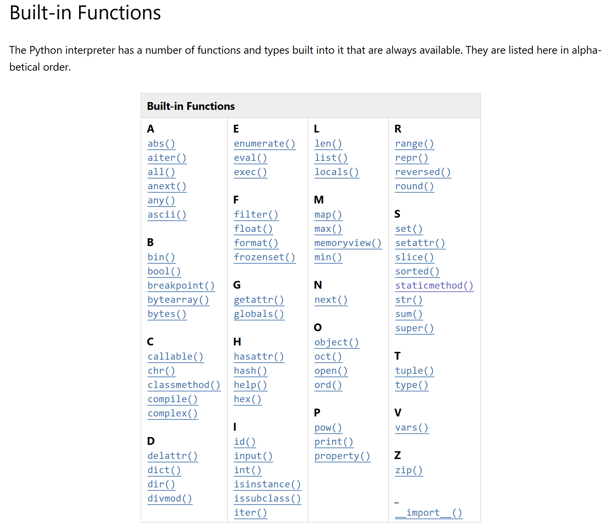

# 内置函数



```python
# 内置函数就是Python解释器自带的函数
# https://docs.python.org/3/library/functions.html#staticmethod
```

# 1 数据类型转换相关 8

```python
int()
float()
str()
bool()
dict()
list()
tuple()
set()

# 使用示例：
print(int('1'), type(int('1')))
```


# 2 进制转换 3

```python
bin()  # 十进制转二进制 binary 0b
oct()  # 十进制转八进制 octal 0o
hex()  # 十进制转十六进制 hexadecimal 0x
```


# 3 数学运算 8

```python
# 1.abs() # 返回绝对值 正数
print(abs(-1))

# 2.divmod() # 算余数和商
print(divmod(7, 3))
# (2, 1) divmod得到一组数

# 3.round() 四舍五入
# 注意一个python中的问题: 虽然round是四舍五入 但有点设置上的区别 如:
print(round(4.51))  # 5 后面跟大于0的数就可以进一位
print(round(4.50))  # 如果是 0 就进不上去

# 同时round可以后面加一个参数用于控制小数点的位数，它也带了上面的特性
print(round(4.051, 1))  # 4.1
print(round(4.050, 1))  # 4.0

# 4.pow() 幂次方
print(2 ** 2)
# 不使用pow
print(pow(2, 3))
# 8
# 两个参数:前面是基数,后面是次方数
print(pow(2, 3, 5))
# 3
# 三个参数:前面是基数,后面是次方数,最后是除数 得到的结果是 余数
print(pow(2, 3.0))
print(pow(2.0, 3))
print(pow(2.0, 3.0))
# 8.0
# 两个参数:前面是基数,后面是次方数,任一参数使用浮点数(小数),得到的结果就是浮点数

# 5.求和 sum(列表)

# 6.最小值 min(列表)

# 7.最大值 max(列表)

# 8.复数转换 complex(实数, 虚数)
print(complex(2, 3))  # 2+3j 算正余弦值 搞函数 搞信号
```


# 4 数据结构相关 9

```python
# 1.翻转 reversed()
# 将列表中的元素顺序颠倒
# 注意返回的是一个迭代器
name = "sheenagh"
print(list(reversed(name)))

# 2.切片 slice()
# 和切片器用法是类似的
num_list = [1, 2, 3, 4, 5, 6]
print(num_list[0:3])
print(num_list[slice(0, 3)])

# 3.计算长度 len()

# 4.排序 sorted()
# sorted(Iterable, key=函数(排序规则), reverse=False默认正序)
print(sorted([1, 5, 4, 6, 7, 3, 9]))
print(sorted([1, 5, 4, 6, 7, 3, 9], reverse=True))

# 根据指定的键给对应的值排序
student_tuple = ['Adam', 'Barta', 'Bob', 'Lisaaaa']


# 按照每个元素的长度进行排序
def index(x):
    return len(x)


print(sorted(student_tuple, key=index))

# 5.枚举 enumerate()
name_list = ['Adam', 'Barta', 'Bob', 'Lisaaaa']
# start 参数对应的是索引的起始值
# 不定义起始索引，默认从0开始
for index, name in enumerate(name_list):
    print(str(index).rjust(len(str(index)) + 6, "*"), name)

# 定义起始的索引坐标，从1开始
for index, name in enumerate(name_list, start=1):
    print(str(index).rjust(len(str(index)) + 6, "*"), name)

# 6.format()
# 字符串.format() 字符串插值和格式化
# format() 用于格式化任意值为字符串
# 数字是总宽度 符号代表了对齐方式
data = "hello world"
print(format(data, "^20"))  # 居中对齐     hello world
print(format(data, "<20"))  # 左对齐 hello world
print(format(data, ">20"))  # 右对齐          hello world

# 进制转换
print(format(999, "b"))  # 十进制转二进制 1111100111
print(format(1, "c"))  # unicode 对应的编码 A
print(format(999, "d"))  # 十进制转十进制 999
print(format(999, "o"))  # 十进制转八进制 1747
print(format(999, "x"))  # 十进制转十六进制(小写字母) 3e7
print(format(999, "X"))  # 十进制转十六进制(大写字母) 3E7
print(format(999, "n"))  # 十进制转十进制 3E7

# 科学计数法 e
print(format(123456789, 'e'))  # 1.234568e+08
print(format(123456789, 'E'))  # 1.234568E+08
print(format(123456789, '0.2e'))  # 1.23e+08
print(format(123456789, 'F'))  # 123456789.000000

# 7.字符串转二进制 bytes()
data = "今天你吃饱了吗"
print(data.encode())
# b'\xe4\xbb\x8a\xe5\xa4\xa9\xe4\xbd\xa0\xe5\x90\x83\xe9\xa5\xb1\xe4\xba\x86\xe5\x90\x97'
print(bytes(data, encoding="utf-8"))
# b'\xe4\xbb\x8a\xe5\xa4\xa9\xe4\xbd\xa0\xe5\x90\x83\xe9\xa5\xb1\xe4\xba\x86\xe5\x90\x97'

# 8.字符串转字节数组 bytearray()
print(bytearray(data, encoding="utf-8"))
# bytearray(b'\xe4\xbb\x8a\xe5\xa4\xa9\xe4\xbd\xa0\xe5\x90\x83\xe9\xa5\xb1\xe4\xba\x86\xe5\x90\x97')

# 9.返回当前字符串的原始格式 repr()
sentence = "my name is \n dream my age is \t 18"
print(sentence)
print(repr(sentence))  # 'my name is \n dream my age is \t 18'
```


# 5 字符编码 3

```python
# 1.根据字符找编码数字 ord()
print(ord('A'))
# 65
print(ord('Z'))
# 90

# 2.根据数字找字符 chr()
print(chr(65))
# A
print(chr(90))
# Z

# 3.根据ASCII码找ASCII码 ascii()
print(ascii("A"))
# 'A'
print(ascii(9))
# 9
print(ascii("@"))
# '@'
print(ascii('é'))
# '\xe9'（ASCII 不支持这个字符，所以会用 \x... 形式表示）
```


# 6 冻结数据集合 1

```python
# 冻结数据集合 frozenset
num_set = {1, 2, 3}
num_set.add(4)
print(num_set)
# 正常普通的集合set 可以add
# frozen set 字面意思理解 不可变版本的set 不能添加删除更新
# 在某些情况下我们不想让我们的集合被修改
frozen_set = frozenset(num_set)
# frozen_set.add(4)
# AttributeError: 'frozenset' object has no attribute 'add'
# frozenset可以求交并差集 会生成新的frozenset
```


# 7 判断条件 2

```python
num_list_have_false = [1, 0, '', [1], {}]
# 1.判断所有条件为真则为真 all
print(all(num_list_have_false))  # False

# 2.判断所有条件任一为真则为真 any
print(any(num_list_have_false))  # True
```


# 8 高阶函数 3

```python
# 1.打包函数 zip 拉链函数
# 将两个或多个可迭代类型打包成一个
name_list = ["dream", "hope", "opp"]
age_list = [18, 19, 20]
gender_list = ["male", "female", "male"]
addr_list = ["上海", "北京", "广东", "深圳"]

all_data_list = []
for i in range(len(name_list)):
    all_data_list.append((
        name_list[i],
        age_list[i],
        gender_list[i],
        addr_list[i]
    ))
print(all_data_list)

print('zip :>>>> ', zip(
    name_list,
    age_list,
    gender_list,
    addr_list
))
# <zip object at 0x116afac40>

print('zip :>>>> ', list(zip(
    name_list,
    age_list,
    gender_list,
    addr_list
)))
# zip :>>>>  [('dream', 18, 'male', '上海'), ('hope', 19, 'female', '北京'), ('opp', 20, 'male', '广东')]
# 如果传入的可迭代对象长度不一致，zip 会以最短的那个可迭代对象的长度为准。

# 2.过滤函数 filter
# 用来过滤序列中的元素 筛选出满足条件的元素
# 接受函数 可迭代对象
num_list = [1, 2, 3, 4, 5, 6, 7, 8, 9]
# 获取到奇数
print([i for i in num_list if i % 2 == 1])  # [1, 3, 5, 7, 9]
# 借助内置函数
print(filter(lambda x: x % 2 == 1, num_list))  # <filter object at 0x100663b50>
print(list(filter(lambda x: x % 2 == 1, num_list)))  # [1, 3, 5, 7, 9]


# 【匿名函数】
# 匿名函数就是没有名字的函数
def index(x):
    if x % 2 == 1:
        return x


print(list(filter(index, num_list)))  # [1, 3, 5, 7, 9]

# lambda x: x % 2 == 1
# lambda 形参名: 返回值


# 3.高阶函数之映射函数 map()
# map 可以将可迭代对象中的每一个元素传给指定的函数挨个运行
num_list = [1, 2, 3, 4, 5, 6, 7, 8, 9]


def pow_self(x):
    return x ** x


print(map(pow_self, num_list))
# <map object at 0x1012050c0>
# 这里没有计算 map有延迟计算的机制 这里只是创建了一个迭代器 并且直到怎么迭代
# 还有一个机制是按需计算 会逐个生成结果 这样处理大量数据或者流式数据的时候很有用
print(list(map(pow_self, num_list)))
# [1, 4, 27, 256, 3125, 46656, 823543, 16777216, 387420489]
```


# 9 作用域相关 2

```python
# 1.获取全局名称空间
print(globals())


# 用于查看当前模块的全局变量和定义
# {'__name__': '__main__', '__doc__': None, '__package__': None,
# '__loader__': <_frozen_importlib_external.SourceFileLoader object at 0x000002D26F9D8820>, '__spec__': None,
# '__annotations__': {}, '__builtins__': <module 'builtins' (built-in)>,
# '__file__': 'D:\\Program Files\\JetBrains\\PycharmProjects\\Day18\\05内置函数.py', '__cached__': None}


# 2.获取局部名称空间
# 用于查看当前函数或代码块的局部变量
def index():
    name = "local"
    print(locals())


index()
# {'name': 'local'}
```


# 10 迭代器和生成器相关 3

```python
# 1.range 函数生成一个可迭代的range 对象
print(range(0, 5))
# range(0, 5)

# 2.获取迭代器对象
num_list = [i for i in range(10)]
print(num_list)
# [0, 1, 2, 3, 4, 5, 6, 7, 8, 9]
num_list_iter = iter(num_list)
print(num_list_iter)
# <list_iterator object at 0x10c279d50>

# 3.迭代器对象取值
print(next(num_list_iter))
print(next(num_list_iter))
print(next(num_list_iter))
```


# 11 执行字符串类型的代码 3

```python
code_str_one = "print('hello world')"
code_str_two = "input('请输入 :>>>> ')"
code_str_three = '''age = input('请输入 :>>>> ')
if not age.isdigit():
    print(f"非法")
'''
# 1.eval 方法执行代码
# 如果是没有返回值代码则会直接执行 返回None
# 如果是有返回值的代码就会发挥指定的返回值
# 只能执行简单的简短的代码块
print(eval(code_str_one))
# code_str_one 会输出
# hello world
# 但是没有返回值 所以打印出来是None
print("-----")

# 2.exec 执行代码
# 可以执行多行代码 不会返回值
exec(code_str_one)
# 直接执行
# hello world
print(exec(code_str_two))
# code_str_two 会要求用户输入 但是没有返回值
# 所以print就是None
exec(code_str_three)
# code_str_two 会要求用户输入 但是没有返回值 返回的是None
print("-----")

# 3.编码指令 先将代码进行编译 编译后再交给 exec 或者 eval 执行
code_one = compile(code_str_three, '', 'exec')
exec(code_one)
# eval(code_one)
# code_one是多行 所以会失败


# code_one = compile(code_str_three, '', 'eval')
# eval 本身就不支持多行代码 所以也会失败
# exec(code_one)
# eval(code_one)
```


# 12 输入和输出 2

```python
# 1.输入 input
# 2.输出 print
```


# 13 哈希+文件操作+导入模块+帮助函数 4

```python
# 1.哈希
data = "sheenagh"
print(hash(data))
# 4774955088339551217
# 只能哈希 不可变数据类型

# 可变数据类型不能被 哈希
# print(hash([1, 2]))
# TypeError: unhashable type: 'list'
# 字典的键的底层原理 --- > 哈希

# 2.文件操作
'''
# open
fp = open("文件路径", mode='操作模式', encoding="编码格式")
fp.read()
fp.write()
fp.close()
'''

# 3.导入模块
import os

# 动态加载
os = __import__("os")
print(os.name)


# nt

# 4.帮助函数
# 查看函数 用来查看指定对象的方法的
# print(help(str))
```


# 14 调度+查看内置属性 2

```python
# 1.调度 当前对象是否可被调用 函数
# 可以被 () 调用的就会返回 True 否则就是 False
def index():
    ...


class Student():
    ...


a = 100
print(callable(a))
# False
print(callable(index))
# True
print(callable(Student))
# True


# 2.查看内置属性 dir
import os
# 可以查看指定的对象可以调用的方法有哪些
print(dir(os))
# 很长
```


# 15 异步 2

```python
# 1.异步迭代函数(aiter)
# ● aiter()函数 - py3.10+
# ● 语法：aiter(async_iterable)
# ● 其中 async_iterable 是一个异步可迭代对象，相当于调用 x.aiter()。
# ● 注意：与 iter() 不同，aiter() 没有两个参数的版本。
#   ○ aiter() 和 anext() 调用对象的 aiter() 和 anext()
#   ○ 它们本质上是 iter() 和 next() 的异步等价物。
#   ○ 在大多数情况下，很少需要直接使用新的内置函数, 我们可以直接用async for代替。
#   ○ async for 循环已经隐式调用了类的 aiter 和 anext 方法。

# 2.next异步变体(anext)
# ● anext()- py3.10+
# ● anext() 是 Python 3.10 版本中的一个新函数。
# ● 它在等待时从异步迭代器返回下一项
#   ○ 如果给定并且迭代器已用尽
#   ○ 则返回默认值。
# ● 这是 next() 内置的异步变体，行为类似。
```


# 16 调试器 1

```python
# 调试器(breakpoint)
# ● breakpoint()函数 - 3.7+
# ● Python 3.7添加了breakpoint()，此函数将您放入调用站点的调试器中。
# ● 具体来说，它调用sys.breakpointhook()，直接传递args和kws。
# ● 默认情况下，sys.breakpointhook()调用pdb.set_trace()，不需要参数。
#   ○ 在这种情况下，它纯粹是一个方便的函数，因此您不必显式地导入pdb或键入足够多的代码来进入调试器。
#   ○ 但是，sys.breakpointhook()可以设置为其他函数，breakpoint()将自动调用该函数，允许您进入所选的调试器。
```


# 17 id和type 2

```python
# 1.查看内存地址 id()
# 2.查看变量类型 type()
```


# 18 面对对象 11

```python
# 1.类的绑定方法 classmethod
# 2.类的静态方法 staticmethod
# 反射机制
# 3.获取对象的属性值 getattr()
# 4.设置对象的属性值 setattr()
# 5.删除对象的属性 delattr()
# 6.检查对象是否具有某个属性 hasattr()

# 7.判断对象类型 isinstance
a = "1"
if not a.isdigit():
    # 判断当前字符串是否符合整数格式
    ...
print(isinstance(a, int))
# False # 判断当前类型是否是指定的类型

# 8.判断一个类是否是另一个类的子类 issubclass
# issubclass()
# 9.基类 object()
# 10.property 装饰属性
# 11.超类 super()
```


# 19 补充 2

```python
# 1.查看内存属性 vars
print(vars())
# 2.内存查看对象(memoryview)
v = memoryview(bytearray("abcefg", 'utf-8'))
print(list(v))
print(v[1])
print(ord("a"))
print(ord("b"))
```

