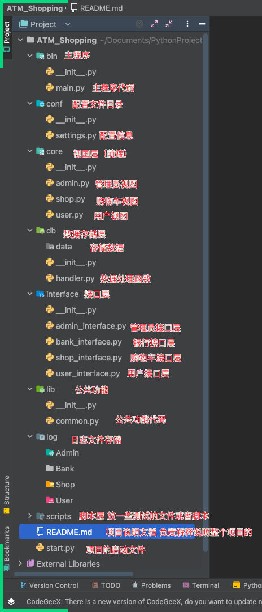

# 1 内容回顾

```python
# 【一】八个基本数据类型转换
# int()
# str()
# float()
# bool()
# list()
# tuple()
# dict()
# set()

# 【二】三个进制转换
# bin 十进制转二进制
# oct 十进制转八进制
# hex 十进制转十六进制

# 【三】数学运算 8
# abs() 绝对值
# divmod() 商和余数
# round() 四舍五入 # 5后面如果是0就不进1如果不是0就进1
# pow() 幂次方 两个参数是幂次方 三个参数是获取余数
# sum() 求和
# max() 求最大值
# min() 求最小值
# complex() 复数

# 【四】数据结构 6
# reversed() 排序翻转
# slice() 生成切片对象
# len() 计算长度
# sorted() 排序 reverse=True 降序 key 指定排序的方式
# enumerate() 枚举 生成索引和数据
# format() 对齐方式 进制转换 科学计数法

# 【五】字符串相关 3
# bytes("字符串",编码格式) 可以将字符串转为二进制数据
# bytearray("字符串",编码格式) 可以将字符串转为二进制数组
# repr() 可以查看当前字符串的原始数据格式

# 【六】字符编码相关 3
#  chr() 获取对应编码的ASCII值
#  ord() 获取对应ASCII值的编码
#  ascii()  获取当前字符串的ASCII值

# 【七】数据集合 冻结数据集合 1
#  new_set=frozenset(old_set) 冻结数据集合

# 【八】判断条件 2
# all 所有条件为真则为真
# any 任意条件为真则为真

# 【九】高阶函数 3
# obj = zip() 打包 可以将两个或多个列表中对应索引位置的数据打包成元组放在一个列表中
# obj = filter() 过滤 可以按照指定条件过滤数据 只会保留条件为真的数据
# obj = map() 映射 可以按照指定条件映射数据 返回对应函数的返回值

# 【十】作用域 2
# global() 获取全局名称空间
# locals() 获取局部名称空间

# 【十一】迭代器相关 3
# iter() 生成迭代器对象
# next() 迭代器向下取值
# range() 生成一个range的迭代器对象

# 【十二】执行字符串形式的代码 3
# eval() 执行字符串形式的代码 但是只能指定单行的代码
# exec() 执行字符串形式的代码 并且可以指定多行的代码
# compile() 编译字符串形式的代码 生成字节码对象

# 【十三】输入和输出 2
# input() 输入
# print() 输出

# 【十四】哈希值 1
# hash() 获取哈希值 只能获取不可变数据类型的哈希值

# 【十五】文件操作 1
# open() 打开文件 获取句柄对象

# 【十六】导入模块 1
# __import__("模块名")

# 【十七】帮助函数 1
# help() 查看当前对象的方法和解释

# 【十八】调度相关 1
# callable() 判断是否是可调用的

# 【十九】查看对象的内置属性 1
# dir(对象) 查看当前对象都有哪些内置的属性和方法

# 【二十】变量相关 2
# id() 查看当前变量的内存地址
# type() 查看当前变量的类型

# 【二十一】异步迭代器相关 2
# aiter() 获取异步迭代器对象
# anext() 异步迭代器向下取值

# 【二十二】调试器 1
# breakpoint() 设置断点

# 【二十三】面向对象相关 11
# classmethod()  获取类方法
# staticmethod() 获取静态方法
# getattr() 获取对象的属性
# setattr() 设置对象的属性
# delattr() 删除对象的属性
# hasattr() 判断对象是否有某个属性
# super() 超类 继承父类的所有属性
# object() 所有类的继承 可以生成一个类
# property() 生成属性

# isinstance() : 判断某个值是否是某个类型
# issubclass() : 判断某个类型是否是某个父类的子类

# 【二十四】了解的方法 2
# memoryview() 获取内存视图对象
# vars() 获取当前对象的所有属性
```


# 2 项目开发流程概述

```python
# 项目开发流程就是在公司中对某个项目从开始有需求到最后上线的一个主体的流程

# 【一】项目开发流程概述
# 在公司中项目开发主要分为 5 个步骤
# 1.需求分析
# 2.架构设计
# 3.分组开发
# 4.项目测试
# 5.交付上线

# 【二】需求分析
# 1.角色构成: 架构师 + 产品经理 + 开发者组长
# 2.任务
# 产品经理带着开发部门的老大(开发者组长) 去见客户 问客户的需求
# 在见到客户之前肯定不是 白班 开发者组长 会先生成一版初稿
# 然后再去见客户 沟通过程中会引导客户向初稿靠拢
# 能够快速地让客户和我们的意见达成一致
# 和客户沟通完成以后 确定客户的需求

# 【三】架构设计(重要)
# 1.角色构成: 架构师
# 2.任务
# 对当前项目的结构进行设计和选型

# 项目的主体编程语言 Python / Go / Java ...
# 项目的主体框架 Django / Flask / Tornado / Fastapi / Spring Boot
# 项目的主题数据库 MySQL / PostgreSQL / MongoDB / Redis

# 项目的组织结构 按开发者规范加入一些自己公司内部的元素

# 项目功能划分
# 将这个项目中的所有功能进行切分 ---> 按照指定的规范进行切分 把大项目切割成小项目

# 项目报价 技术层面需要花费多少钱
# 开发人员数量
# 开发人员薪资
# 开发周期 算一下大致这个项目开发完需要多长时间
# 算报价

# 报价生成之后去跟财务确定
# 财务进行叠加 算上其他部门的大概开销
# 财务算出一个总的报价 ---> 总经理确认
# 产品经理 带着你的财务 ---> 找客户 ---> 确认

# 【四】分组开发
# 1.角色构成: 开发者组长 + 开发者组员
# 2.分配功能
# 架构师和开发者组长确定好功能后 也切分完了
# 将成员进行分组 然后将 合适的功能分配给合适的组员
# 每个组员分配一部分 开发自己的分配到的功能
# 这样可以大大提高开发效率 每一个人都发挥自己的长处 降低开发的复杂度

# 3.测试代码
# 自己先测试自己部分的功能代码 保证没有低级错误 并且不要出现大量bug
# 将自己的代码交给组长 组长负责对整个项目进行整合 再测试一些功能
# 交给测试人员 测试人员负责对整个项目进行测试 测试人员负责对整个项目进行回归测试
# 测试过程中可能会出现 bug 出错多 影响绩效

# 4.薪资构成
# 总薪资
# 底薪
# 绩效
# 岗位津贴
# 生活补贴

# 【五】项目测试
# 对项目进行压力测试
# 每分钟可以抗住多少访问量 / 支持同时在线多少用户
# 有没有潜在的漏洞 sql注入 / xss攻击 / csrf攻击 ...
# 对所有的功能进行调试 保证每一个功能的正常运行
# 如果有错误会及时通知开发部门进行修改和完善

# 兼容性测试 / 可靠性测试 ...

# 【六】交付上线
# 项目组长会将所有源码进行打包
# 交给运维人员

# 1.对方公司的运维
# 对方公司只是甲方 找我们乙方来开发功能
# 他们自己有自己的运维来负责上线
# 上线到对方的服务器上面

# 2.自己公司的运维
# 对方公司 不负责IT
# 上线到自己公司的服务器上面
# 收取对方公司每年的正常维护和升级费用

# 【大公司or小公司】
# 1.大公司 技术含量高 技术难度大 技术要求高
# 一般都是分组开发 只负责能负责的那一部分

# 2.小公司 技术含量低 技术难度小 技术要求低
# 会比较累 需要全能一点 自己要做很多不同人员的职责
# 一般没有几个开发
```


# 3 ATM架构分析

```python
# 【一】项目大致需求
# 额度15000或自定义
# 支持多账户登录
# 可以查看账户余额
# 可以提现（可自定义手续费比例）
# 提供还款接口
# 支持账户间转账
# 记录每月日常消费流水
# 实现购物商城，买东西加入购物车，调用信用卡接口结账
# 提供管理接口，包括添加账户、用户额度，冻结账户等
# ATM记录操作日志
# 用户认证功能

# 【二】提炼功能
# 1.用户功能
# 注册
# 登陆
# 激活银行卡
# 取款
# 转账
# 充值余额
# 查看流水
# 查看日志
# 查看银行信息（用户名 卡号 身份 余额 流水信息...）

# 2.管理员功能
# 登陆
# 添加用户
# 修改用户权限
# 修改用户状态
# 查看所有用户信息
# 查看指定用户信息
# 修改额度
# 初始化商品信息
# 添加商品
# 删除商品
# 修改商品
# 查看所有商品信息
# 查看指定商品信息

# 3.购物车功能
# 查看商品信息
# 选择商品下单
# 清空购物车
# 删除购物车指定商品
# 下单商品(付款)
# 查看购物车商品

# 【三】架构设计(技术栈选型)
# 1.编程语言
# Python
# 2.技术栈知识点
# 文件操作
# 流程内置
# 数据类型的内置方法
# 内置模块 os sys random logging json time datetime ...
# 包的语法
# 函数 有参数 有返回值函数 装饰器

# 3.架构设计
# (1)以前
# 面条班 来写员工管理系统
# 从头写到位 不利于 某部分功能的完善和修改
# (2)函数版
# 将每一个功能提取成一个函数 然后再将函数进行整合
# 员工管理系统的函数版本
# (3)模块与包
# 分模块开发
# 分模块的atm功能
# (4)后续开发
# 在后续的开发过程中我们会更加倾向于使用 模块 + 包 进行分层开发
# 可以将员工部门细化 每一个人只负责自己负责部门
# 大大的提高开发效率

# 4.为什么要选择进行分层开发
# 小公司成员少，不会对部分进行太详细的划分，一个人可能身兼数职，这样可能造成的问题就是一个人的任务太多，根本忙不过来
# 大公司会将每个部门，和每个部门的成员细化，每个部门和每个成员都有自己的任务，这样各司其职，每个人都负责各自比较擅长的部分，这样会大大提高工作效率，节省时间

# 5.如何体会到分层版本的好处
# 建议大家没事多敲两遍，因为只有随着你敲得代码多了，哪怕是同一行代码，第一次和第五次的感觉都会不一样，尤其是对于基础不好的同学更应该如此
# 五遍之后你会更加深入的体会到分层的好处

# 【四】组织架构开发
# 先来研究一些常见的网站的开发流程
# 百度的登陆和京东购物平台
# 1.百度
# 在打开百度的时候的时候会看到右上角有一个登陆的按钮
# 点击登陆按钮之后会弹出一个登陆框
# 让用户输入用户名和密码
# 点击登陆 ---> 开始等待(将我们的数据提交给后端进行校验 数据是不是正确的)
# 返回结果 ---登录成功  / 登陆失败
# 在首页上看到登陆的提示信息

# 架构设计  --- 三层架构
# （1）视图层
# 负责给用户展示输入框和返回的信息（成功还是失败）
# （2）后端
# 负责对用户输入的数据进行校验
# （3）数据存储
# 将用户的数据存储到本地或者网络中

# 2.京东
# 在首页我们会看到京东的所有商品信息
# 会看到登陆按钮 ---> 进行登陆
# 用户登录后可以选择商品 进行下单
# 用户可以清空自己的购车 （付款）
# 用户数据和商品数据存储在服务器上 分开存储
# 在页面上展示成功或失败的信息

# （1）前端
# 负责给用户展示商品信息 登陆框 购物车信息
# 让用户进行商品的选择
# （2）后端
# 校验前端传入的用户信息
# 前端传入的购物车商品信息
# （3）数据存储
# 在服务器上或者本地存储用户数据和商品数据
# （4）接口
# 支付是由你的商家发起的吗？
# 银行发起付款 ---> 用户付款不是付款给个人 而是给 银行

# 【五】ATM架构设计
# 1.用户视图层 （前端）
# 给用户展示功能
# 让用户选择功能使用
# 让用户输入数据
# 给用户展示成功或失败的数据
# 2.逻辑接口层 （后端）
# 对前段输入的数据进行校验
# 返回给前端校验后的结果
# 调用数据处理进行读取和存储用户数据
# 3.数据处理层
# 负责对用户数据进行读取和存储
# 存储用户和商品数据

# 【六】ATM架构设计延伸
# 1.用户视图层 （前端）
# 使用 html + css + JavaScript
# 使用 Vue / React
# 2.逻辑接口层 （后端）
# Django 写后端
# Flask 写后端
# Fastapi 写后端
# 3.数据处理层
# MySQL数据存储数据
# Redis缓存数据
# 4.接口调用
# 支付宝的阿里支付
# 微信的微信支付
# 银联的银行支付 ....
```


# 4 ATM架构树

```python
# |- ATM（项目根目录）
#     |-- README.md                                # 项目说明书
#     |-- start.py                                # 项目启动文件的创建方式二，直接暴露在最外层
#     |-- bin（启动文件目录）                   # 存放启动文件的方式一，单独创建目录
#         |- main.py                             # 存放用户核心代码
#     |-- core（用户视图层）                   # 存放用户视图层代码文件
#         |--- user_src.py                    # 用户功能代码
#         |--- admin_src.py                    # 管理员功能代码
#         |--- shop_src.py                       # 购物功能代码
#     |-- interface（逻辑接口层）             # 存放核心业务逻辑代码
#         |--- user_interface.py             # 用户功能相关接口
#         |--- bank_interface.py             # 银行功能相关接口
#         |--- shop_interface.py             # 购物功能相关接口
#     |-- db（数据处理层）                        # 存放数据与数据处理层代码
#         |--- db_handler.py                   # 数据处理层代码
#         |--- user_data                         # 用户数据存储文件夹目录
#             |---- user_data.json           # 用户数据存储json文件
#     |-- conf                                 # 配置文件文件夹目录
#         |--- settings.py                    # 配置参数代码
#     |-- lib                                   # 公共方法文件夹目录
#         |--- common.py                            # 公共方法代码
#     |-- log(日志文件层)                          # 存放日志文件夹目录
#         |--- User                                  # 用户日志文件夹目录
#             |---- username.log                   # 某个用户的日志文件
#         |--- Admin                               # 管理员日志文件夹目录
#             |---- username.log                   # 某个用户的日志文件
#         |--- Shop                               # 购物日志文件夹目录
#             |---- username.log                   # 某个用户的日志文件
```


