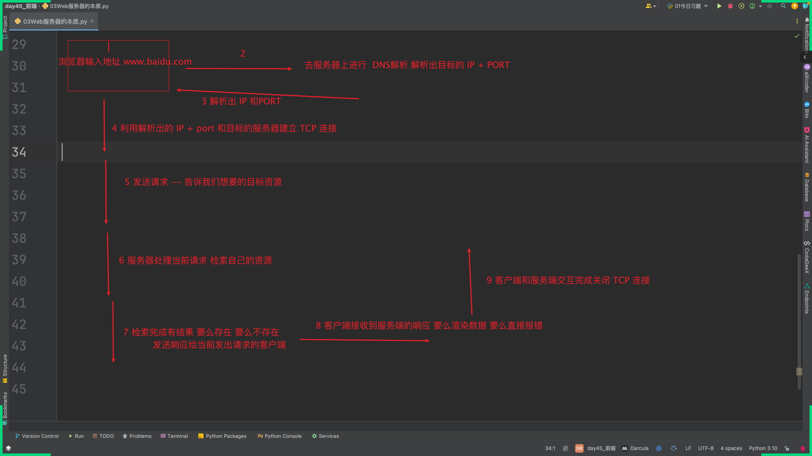
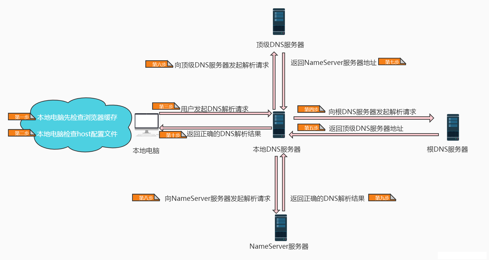
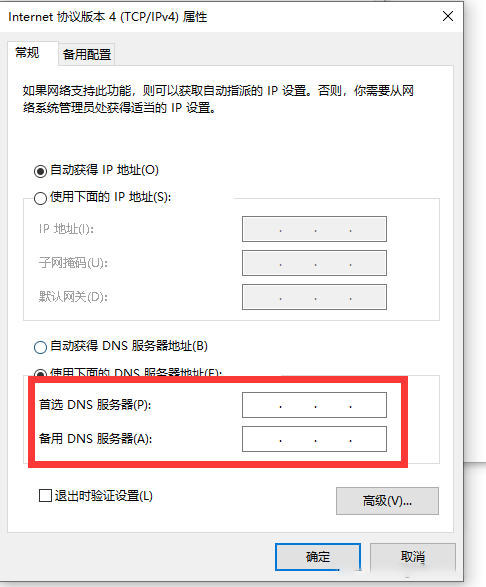

# 02 Web服务器的本质 + HTTP协议

## 1 Web服务器的本质

```python
# 【一】概览
# 在浏览器的地址栏输入一个地址回车到看到浏览器上渲染出页面信息的过程
# 1.在浏览器的地址栏输入目标地址--按下回车键 https://www.baidu.com
# 互联的本质 -> 根据指定的IP和端口确定到唯一的一个应用程序

# 2.DNS解析
# 浏览器会先检查是否缓存过当前域名，如果这个域名已经被喜欢存过就会直接访问
# 如果是第一次访问就需要进行DNS解析
# 有一个公共的服务器用来存储所有的网址和IP之间的映射关系
# 我们需要在服务器上映射找到我们www.baidu.com对应的IP和PORT
# 服务器会自动将wwi.baidu.com -> 转换成 IP+PORT -> 再向 ip+port 提起请求

# 3.建立TCP连接
# 浏览器根据解析到的 IP和端口 向服务器提交请求 与目标服务器建立连接
# 涉及到三次握手

# 4.发送请求(HTTP请求)
# 和服务器建立连接成功之后要提交请求给目标服务器
# 告诉目标服务器我需要访问到哪些资源
# 访问的过程中可能会对身份进行校验

# 5.服务器接受并处理请求
# 服务器在自己的服务资源中检索当前要求的资源是否存在
# Nginx做转发、Django做转发

# 6.服务器返回响应(HTTP响应)
# 要对数据进行包装
# 然后将包装好的数据原路返回

# 7.客户端接收到的服务器的响应并处理响应
# 解包服务器返回的资源并进行资源的渲染
# 将页面呈现在我们面前

# 8.断开TCP连接
# 四次挥手


# 【二】深度解析
# 1.总览
# ● 浏览器先分析超链接中的URL:分析域名是否规范
# ● 浏览器向DNS请求解析请求解析 https://www.example.com/index.html 中的ip地址
# ● DNS将解析出的ip地址返回浏览器
# ● 浏览器与服务器建立TCP连接（80端口，三次握手）
# ● 服务器接收到浏览器请求文档（GET/index.html）进行处理
# ● 服务器给出响应，将文档index.html发送给浏览器，浏览器进行解封装。
# ● 浏览器渲染 index.html 中的内容（渲染页面）
# ● 释放TCP连接（四次挥手）

# 2.浏览器分许超链接中的URL
# https://www.baidu.com
# http://192.168.1.96:1314/Python全站资源/【1.0】MySQL/01什么是索引.mp4
# 协议(http) + 域名(www.baidu.com) + 目录(Python全站资源/【1.0】MySQL) + 文件名(01什么是索引.mp4)
# 协议 + 域名 + 目录 + 文件名

# 协议(http) + 主机:端口(192.168.1.96:1314) + 目录(Python全站资源/【1.0】MySQL) + 文件名(01什么是索引.mp4)
# 协议 + 主机 + 端口 +  目录 + 文件名

# 协议： https://  |  http://

# 分析请求是否符合规范

# 数据传输过程中的数据分装流程
# 应用层 --- HTTP 二进制原始数据
# 传输层 --- TCP 的头
# 网络层 --- ip头
# 链路层 --- 以太网的头

# 3.DNS解析的过程
# ● 封装好HTTP请求报文之后，就需要获取目标服务器的ip地址（ip包里面有ip地址），虽然解析得到了域名，按理浏览器应该已经知道了目标服务器是谁了。
# ● 但是实际上，域名并不是目标服务器真正意义上的地址，互联网上每一台计算机都被全世界唯一IP地址标识着，但是IP地址并不方便记忆，所以才设计出了域名。
# ● 但是虽然域名容易被用户所接受和使用，但是计算机只能识别纯数字构成的IP地址，不能直接读取域名。
# ● 所以如果只是知道域名也不知道这个请求会被发送到哪里去。
# ● 那么就需要解析域名获取目标服务器的IP地址。
# ● 此时的浏览器就会向DNS请求解析请求解析 https://www.example.com:80/index.html 中的 IP地址
# ● 举个形象的例子
#   ○ 我们经常通过 ping www.baidu.com 来检验我们的服务器是否能连通外网
#   ○ 其实在 ping www.baidu.com 过程中，就发生了 DNS 解析操作
```








## 2 HTTP协议

```python
# 【一】可以充当TCP客户端的有哪些
# TCP的客户端
# 浏览器也可以当做客户端

# 【二】TCP充当客户端 可以正常交互数据

# 【三】浏览器充当客户端 可以提交请求 但是无法响应数据

# 【四】HTTP协议
# 不同的服务器之间交互数据的方式是不同的
# 为了实现不同设备之间数据交互方式的一致性于是就诞生了HTTP协议
# 用来约束不同设备之间数据交互传输方式的规范

# 1.什么是HTTP协议
# ● HTTP协议（HyperText Transfer Protocol，超文本传输协议）
#   ○ 由蒂姆·伯纳斯-李于1989年为了推广互联网技术而推出的一种无状态网络应用协议
# ● HTTP协议构建于TCP/IP协议族之上
#   ○ 属于应用层协议。
# ● 主要用于传输与超文本相关的资源文件
#   ○ 如HTML网页，css，js，图片，视频，音频等。

# 2.现行的HTTP协议基于数据是否加密，主要分两种。
# （1）HTTP协议
# ● 直接构建于TCP协议之上
#   ○ 没有进行加密传输数据的是HTTP协议
#   ○ 默认通信端口是80端口
#   ○ 常用端口有：3000，5000，8000，8080等。

# （2）HTTPS协议
# ● 构建于TLS或SSL协议之上
#   ○ 对数据使用SSL加壳加密传输数据的是HTTPS协议
#   ○ 默认通信端口是443端口
#   ○ 常用端口8443。

# 3.HTTP协议的特点
# （1）基于请求和响应的模型
# 服务端永远不会主动发消息给客户端
# 必须是由客户端想服务端请求数据才能建立连接通信

# （2）基于TCP和IP之上的应用层协议

# （3）无状态
# 每一次客户端的请求给了服务端，服务端都不会保留当前客户端的标识信息
# 服务端无法记住每个客户端是否是同一个客户端

# （4）短连接
# 交互一次就立马断开连接

# 长连接：网页上的微信用过，在你打开网页微信扫码的过程中，你扫了吗 必须点击登陆 不断向服务器地址发送请求 用来确认用户是否点击了登陆按钮


# 【四】完善我们自己的TCP服务端
# 1.请求模型数据格式
"""
GET / HTTP/1.1 # 第一行 请求首行 ：请求方式 + 请求路径 + 请求协议版本
Host: 127.0.0.1:9696 # 第二行 请求头：一大堆 k:v  键值对数据
Connection: keep-alive
Cache-Control: max-age=0
sec-ch-ua: "Chromium";v="128", "Not;A=Brand";v="24", "Google Chrome";v="128"
sec-ch-ua-mobile: ?0
sec-ch-ua-platform: "macOS"
Upgrade-Insecure-Requests: 1
User-Agent: Mozilla/5.0 (Macintosh; Intel Mac OS X 10_15_7) AppleWebKit/537.36 (KHTML, like Gecko) Chrome/128.0.0.0 Safari/537.36
Accept: text/html,application/xhtml+xml,application/xml;q=0.9,image/avif,image/webp,image/apng,*/*;q=0.8,application/signed-exchange;v=b3;q=0.7
Sec-Fetch-Site: none
Sec-Fetch-Mode: navigate
Sec-Fetch-User: ?1
Sec-Fetch-Dest: document
Accept-Encoding: gzip, deflate, br, zstd
Accept-Language: zh-CN,zh;q=0.9,en;q=0.8
Cookie: csrftoken=vl37aTIvsBczceOdsQ1iovyYOyeMLnzDy7VnJSnkr16G0s0uSgzNoQzxWYMDSxtK
# 第三行：换行（必带） \r\n
# 第四行：请求体数据 (针对的是 post 请求会携带请求体数据)
"""

# 总结
# 第一行带：请求首行（请求方式 + 请求路径 + 协议版本）

# 第二行带：请求头（一堆k:v键值对数据）

# 第三行带：换行(\r\n)

# 第四行带：请求体数据

# 2.响应数据模型数据格式
"""
第一行 响应首行:响应状态码 + 协议版本
第二行 响应头 ： 一堆kv键值对
第三行 换行 : \r\b
第四行 响应体数据
"""
```


```python
import socket

client = socket.socket()

client.connect(('127.0.0.1', 9696))

data_to_server = "我是客户端"
client.send(data_to_server.encode())
data_from_server = client.recv(1024)
print(f"data_from_server :>>>> \n{data_from_server.decode()}")
```

```python
"""
import socket

server = socket.socket()

server.bind(("127.0.0.1", 9696))

server.listen(5)


while True:
    conn, addr = server.accept()

    data_from_client = conn.recv(1024)

    print(f"data_from_client :>>>> \n{data_from_client.decode()}")

    # 响应
    data_to_client = f"你好，我是TCP的服务端!"
    conn.send(data_to_client.encode())
"""

import socket

server = socket.socket()

server.setsockopt(socket.SOL_SOCKET,socket.SO_REUSEADDR,1)
server.bind(("127.0.0.1", 9697))

server.listen(5)

while True:
    conn, addr = server.accept()

    data_from_client = conn.recv(1024)

    print(f"data_from_client :>>>> \n{data_from_client.decode()}")

    # 响应格式
    # 第一行 ： 响应状态码 + 协议版本 + 换行
    response_line = "HTTP/1.1 200OK\r\n"
    # 第二行 响应头数据 k:v + \r\n
    response_headers = "Host: 127.0.0.1:9696\r\nusername: dream\r\n"
    # 第三行 换行
    response_blank = '\r\n'
    # 第四行 响应体数据
    response_body = f"你好hello {addr}，我是TCP的服务端!"

    # 总结响应数据
    response_data = response_line + response_headers + response_blank + response_body

    conn.send(response_data.encode("gbk"))
```