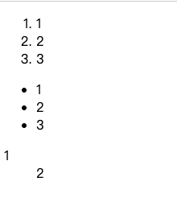

# 03 HTML基础

## 1 HTML简介

### 1.1 写前端代码的方式

```python
# 【一】写前端代码的方式
# 1.VSCODE
# 前端都比较喜欢还用 vscode
# 但是如果你用习惯了 PyCharm 你就会非常难受
# 2。硬写
# 用文本文件软件去写
# 3.使用jetbrains家的webstorm
# 4.使用jetbrains家的 PyCharm
```

### 1.2 HTML资源介绍

```python
# 1.HTML文件是什么？
# HTML表示超文本标记语言（Hyper Text Markup Language）。
# HTML文件是一个包含标记的文本文件。
# 这些标记保速浏览器怎样显示这个页面。
# HTML文件必须有htm或者html扩展名。
# HTML文件可以用一个简单的文本编辑器创建。

# 2.基础结构
"""
<html>
<head>
<title>Title of page</title>
</head>
<body>
This is my first homepage.
<b>This text is bold</b>
</body>
</html>
"""

# 标准的 html 骨架
"""
<!DOCTYPE html> # 声明当前文档是 html 类型的文档 / xml / wxml
<html lang="en"> # 告诉浏览器当前 html 标签内的代码是前端的代码  lang="en"  默认的语言是英文
<head> # 标签之间的 头信息 ，在前端是不显示的 但是可以配置一些参数
    <meta charset="UTF-8"> # 当前文档的一些配置信息  charset="UTF-8" 默认编码格式
    <title>Title</title> # 显示在页面上面的标题
</head> 
<body> # 标签之间包裹的是当前页面的代码体

</body>
</html> # 
"""
```


## 2 HTML的注释语法

- 由于HTML代码非常杂乱无章且非常多，所以我们习惯性的用注释来划分区域方便后续的查找

### 2.1 单行注释

```html
<!--注释内容既是单行注释又是多行注释-->
```

### 2.2 多行注释

```html
<!--注释内容
既是单行注释
又是多行注释-->
```


## 3 HTML的文档结构

```html
<!DOCTYPE html>
<html lang="en">
<head>
    <meta charset="UTF-8">
    <title>基本骨架</title>
</head>
<body>
<!--<h1>一级标题</h1>-->
</body>
</html>
```

- 首先，``<!DOCTYPE html>`` 声明定义了当前文件是一个 HTML 文件。 

  - 接下来是 ``<html>`` 标签，它是整个 HTML 文档的根元素。

  - 在 ``<html>`` 标签之内，有两个主要的部分： ``<head>`` 和 ``<body>``。

- ``<head>`` 用于定义文档的头部信息，其中可以包含一些重要的元素 

  - 例如 ``<title>`` 设置页面标题，``<meta>`` 设置字符编码、关键词等。

  - 这些元素通常不会展示在浏览器中，而是提供一些关于页面的描述和配置。

- ``<body>`` 则包含了整个页面的可见内容 

  - 例如段落、标题、图像、链接等。

  - 这些元素将直接影响和呈现到用户所看到的页面上。

- 需要注意的是，HTML 的标签是有层级关系的，内部的标签必须位于外部标签的范围之内，无法单独存在。


## 4 HTML标签分类

```html
<h2> 1.单标签 </h2>
<p>
    只有一侧的标签，也叫自闭标签
	
</p>

<h2> 2.双标签 </h2>
<p>
    有头和尾包裹的标签
</p>
```


## 5 head常用标签

```html
<h2> 1.title标签 </h2>
<p>
    定义在网页标签上显示的内容
</p>

<h2> 2.style 标签 </h2>
<p>
    定义css样式的标签
</p>

<h2> 3.script 标签 </h2>
<p>
    定义 JavaScript 代码的 添加事件动作
</p>


<h2> 4.meta 标签 </h2>
<p>
    定义 当前页面文档中的元数据
    定义描述当前数据的标签 作者 字符编码集 关键字 等信息
</p>


<h2> 5.link 标签 </h2>
<p>
    写css代码有两种方式
        一种是写在当前页面的 head 的 style 标签内
        另一种是写入到 css 文件中 ， 想让当前css文件加载到本地的 html文件中生效就需要借助 link标签
</p>
```

```html
<head>
    <meta charset="UTF-8"> <!-- 默认编码集 -->
    <meta name="viewport" content="viewport设置">：<!-- 用于定义移动设备上网页的视口设置，以控制网页的显示方式和缩放行为。 -->
    <meta name="keywords" content="HTML, web development, tutorials, learning resources">：<!-- 这个属性用于提供与页面内容相关的关键词列表。 -->
    <meta name="description" content="This is a website about learning HTML and web development."> <!-- 这个属性用于提供关于页面的简短描述。 -->
    <meta name="author" content="dream"> <!-- 这个属性用于指定文档的作者。。 -->
    <meta name="author" content="dream"> <!-- 这个属性用于指定文档的作者。。 -->

    <title>Title</title>
    <style>
        h1 {
            color: red;
        }
    </style>
    <script>

    </script>
    <link rel="stylesheet" href="">
    # href可以放其他css文件
</head>
```


## 6 body常用标签

```html
<body>
<h1> 【一】标题级别标签 </h1>
<p>
    h + 数字 就是几级标题 h1 - h6
    没有 7
</p>

<h1> 【二】加粗文本 b 标签</h1>
<p>
    这是一段 <b> 加粗 </b> 的 文本
</p>

<h1> 【三】斜体文本 i 标签</h1>
<p>
    这是一段 <i> 斜体 </i> 的 文本
</p>

<h1> 【四】文本线 标签 </h1>
<h2> 1.下划线 u </h2>
<p>
    这是一段 <u>下划线</u> 的文本
</p>
<h2> 2.删除线 s </h2>
<p>
    这是一段 <s>删除线</s> 的文本
</p>

<h1> 【五】段落标签 p </h1>
<p>
    一个 p 标签 就是一行
</p>
<p>
    一个 p 标签 就是一行
</p>

<h1>【六】换行标签 br </h1>
<p>
    这是一段文字
    上面和下面需要换行
</p>
<p>
    这是一段文字
    <br>
    上面和下面需要换行
</p>

<h1>【七】分割线标签 hr </h1>
<p>
    这是一段文字
    <hr>
    上面和下面需要分割
</p>

<h1>【八】其他常用标签</h1>

<p>
    img 标签: 渲染图片资源
    a 标签: 跳转到指定地址的
    ul 标签 + li: 无序列表 ·
    ol 标签 + li: 有序列表 1.
    span 标签:  ：行级标签
    div标签: ：块级标签 将每个区域分成一块
    table 标签：表格标签
        tr: 代表一行
        th: 加粗文本
        td: 普通文本
    form 标签: 用来传输表单数据的标签
</p>
</body>
```


## 7 标签的分类

```html
<body>
<p>
    在我们学的标签中除了按照 闭合来区分 还可以按照位置来区分
    分为块级标签和行级标签
</p>

<h1>【一】块级标签</h1>
<h2> 1.介绍</h2>
<p>
    ● 块级标签是指一类会独自占据一行的HTML元素。
    ● 它们从新的一行开始，直到遇到下一个块级标签或行内标签。
    ● 块级标签通常用于组织和结构化页面的不同部分，并且可以包含其他块级元素和行内元素。


</p>
👌<h2> 2.常见的块级标签</h2>
<p>
    div : 用于定义文档中的一个区域或一个区块。
    p 用于定义段落。
    h 用于定义标题的级别。
    ul 用于创建无序列表。
    ol 用于创建有序列表。
    table 用于定义表格。
</p>

<h1>【二】行级标签</h1>
<h2>
    1.介绍
</h2>
<p>
    ● 行内标签是指在一行内显示的HTML元素，它们不会打断当前行并且只占据所需的内容宽度。
    ● 行内标签通常用于插入和标记文本中的小片段或注释，并且不能包含块级元素，只能包含其他行内元素。
</p>
<h2> 2.常见的行级标签</h2>
<p>
    span 标签
    a 标签
    strong 标签
    em 标签
    img 标签
    br 标签
</p>

<h1>演示什么是 块级 什么是行级 </h1>
<div>1</div>
<div>2</div>
<hr>
<span>1</span>
<span>2</span>

<p>
    总结：
        块级标签多个标签之间每个标签都是一行
        行级标签 不管写多少个标签都是同一行
</p>
</body>
```


## 8 特殊符号

```html
<body>
<h1>【1】空格 nbsp</h1>
<p>
    这是一段文字 需要 三个 空格 这是空格后的文字
</p>
<p>
    这是一段文字 需要 三个 空格&nbsp;&nbsp;&nbsp;这是空格后的文字
</p>

<h1>【2】其他</h1>
<p>
    ○ 版权符号：©，表示方法为&copy; 或者 &#169;。
    <br>
    ○ 注册商标符号：®，表示方法为&reg; 或者 &#174;。
    <br>
    ○ 商标符号：™，表示方法为&trade; 或者 &#8482;。
    <br>
    ○ 惊叹号：！，直接输入"!" 即可。
    <br>
    ○ 问号：？，直接输入"?" 即可。
    <br>
    ○ 减号：-，直接输入 "-" 即可。
    <br>
    ○ 加号：+，直接输入 "+" 即可。
    <br>
    ○ 百分号：%，直接输入 "%" 即可。
    <br>
    ○ 等于号：=，直接输入 "=" 即可。
    <br>
    ○ 乘号：×，表示方法为 &times; 或者 &#215;。
    <br>
    ○ 除号：÷，表示方法为&divide; 或者 &#247;。
    <br>
    ○ 分号：；，直接输入";" 即可。
    <br>
    ○ 冒号：：，直接输入":" 即可。
    <br>
    ○ 单引号：'，直接输入"'" 即可。
    <br>
    ○ 双引号："，直接输入 """ 即可。
</p>
</body>
```


## 9 常用标签

### 9.1 img

```html
<body>
<h1>【一】img标签</h1>
<h2> 1.img标签渲染图片的两种方式 src 属性</h2>
<h3>（1）方式一：直接在 src 中仿网络连接</h3>

<h3>（2）方式二：直接加载本地的图片</h3>

<h2> 2.img 图片记载失败的提示信息 alt 属性</h2>

<h2> 3.img 图片悬浮的时候显示的标题信息 title 属性</h2>

<h2> 4.img 图片的高度和宽度 height / width 属性</h2>
<p>
    px 代表的意思是像素的单位
    如果不写就按照图片的默认尺寸填充图片
    如果写了就是按照自己定义的尺寸渲染图片
    auto 表示的意思是自动填充至指定的尺寸
</p>


</body>
```


### 9.2 a

```html
<body>
<a href="" id="start"></a>
<h1>a 标签 ：跳转到指定的地址上 </h1>
<h2> 1.href 属性：用来定义需要跳转到的指定的地址的</h2>
<p> 想要看到 a 标签就必须在 a标签中间 填充内容</p>
<a href="https://www.baidu.com"> 点我有惊喜 ! </a>
<h2> 2.target 属性：用来控制打开新标签的方式的</h2>
<p><a href="https://www.baidu.com" target="_self"> 原地跳转 </a></p>
<p><a href="https://www.baidu.com" target="_blank"> 打开新的页面挑转 </a></p>
<p><a href="https://www.baidu.com" target="_parent"> 原地跳转 </a></p>
<p> parent是在大框架里跳转 如果没有框架 和self 是一样的 </p>
<h2> 3.锚点 ： 定位到指定为止 </h2>

<p><a href="#start">点我回到顶部</a></p>
</body>
```


## 10 标签的两个重要属性

```python
# 公共属性之id和class
# 我们已经学了img + a 标签
# img 标签上的 src 属性 用到 a 标签上不会生效
'''
# 在 img 标签上的 src 会主动渲染图片

# 在 a 标签上的 src 不会主动渲染图片
<a href="" img="https://pic.netbian.com/uploads/allimg/240807/080123-17229888838040.jpg">点我有惊喜</a>
'''
# 【二】标签的公共属性
# 1.class
# 类似于对当前标签进行分类，只要带有当前分类的标签都会生效

# 2.id
# 给标签打上唯一标识，当前页面只有当前标签能够使用

# 【三】演示
'''
<!-- 两个带有共同 class 值的标签-->
<div class="div_1">1</div>
<div class="div_1">2</div>

<!-- 两个带有共同 id 值的标签-->
<div id="login">登陆按钮</div>
<div id="register">注册按钮</div>
'''
```


## 11 列表标签

```html
<!-- 有序列表 ： ol + li -->
<ol>
    <li>1</li>
    <li>2</li>
    <li>3</li>
</ol>

<!-- 无序列表 -->
<ul>
    <li>1</li>
    <li>2</li>
    <li>3</li>
</ul>

<!-- 标题列表 -->
<dl>
    <dt>1</dt>
    <dd>2</dd>
</dl>
```

