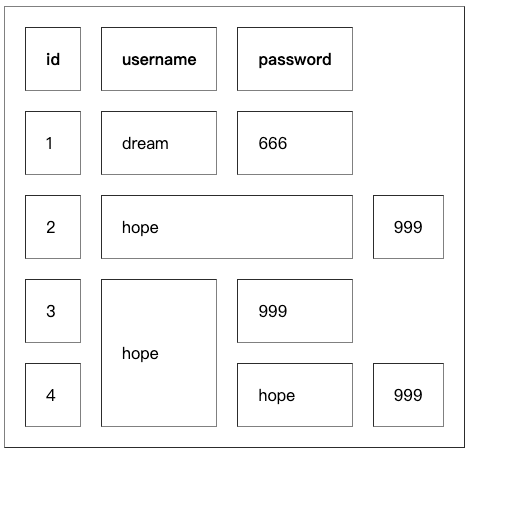

# 04 HTML进阶

## 1 表格标签

### 1.1 定义表格

```py
# 表格是由表头和表体构成
# 先由一个大标签声明是表格标签
'''
<table> // 声明当前是表格标签
<thead> // 声明是表头的内容
<tr> // 一个 tr标签代表就是一行的内容
<th>  // 一个 th 就是一个字段 加粗的字体 一般用来做表头的字段
</th>
<td>  // 一个 td 就是一个字段 正常的字体 一般用来做表体的内容
</td>
</tr>

</thead>
<tbody> // 声明当前是表体内容
</tbody>
</table>
'''

'''
<!-- 声明是一个表格标签 -->
<table>
    <!-- 声明是表头 -->
    <thead>
    <!-- 声明是一行数据 -->
    <tr>
        <!-- 声明是一个加粗的表头字段 -->
        <th>id</th>
        <th>username</th>
        <th>password</th>
    </tr>
    </thead>
    <!-- 声明是表体 -->
    <tbody>
    <!-- 声明是一行数据 -->
    <tr>
        <!-- 声明是一个正常的表体字段 -->
        <td>1</td>
        <td>dream</td>
        <td>666</td>
    </tr>

    <!-- 声明是一行数据 -->
    <tr>
        <!-- 声明是一个正常的表体字段 -->
        <td>2</td>
        <td>hope</td>
        <td>999</td>
    </tr>
    </tbody>
</table>
'''
```


### 1.2 增加属性

```python
# 【二】表格标签的一些属性
# <td colspan="2" rowspan="2">
# 一个 td 就是一个字段 正常的字体 一般用来做表体的内容
# colspan="2" 水平占两个单元格位置
# rowspan="2" 垂直占据两个单元格

# <table border="1">
# border:给当前表格添加边框
# cellpadding : 调整字体距离边框的位置
# cellspacing : 调整内边框距离外边框的距离
```

```html
<!-- 声明是一个表格标签 -->
<!--
# border:给当前表格添加边框
# cellpadding : 调整字体距离边框的位置
# cellspacing : 调整内边框距离外边框的距离
# 我们会看到在某些属性上面出现了一个 删除线 ： 意思是在当前版本已经弃用了当前增加样式的方式
-->
<table border="1" cellpadding="20" cellspacing="20">
    <!-- 声明是表头 -->
    <thead>
    <!-- 声明是一行数据 -->
    <tr>
        <!-- 声明是一个加粗的表头字段 -->
        <th>id</th>
        <th>username</th>
        <th>password</th>
    </tr>
    </thead>
    <!-- 声明是表体 -->
    <tbody>
    <!-- 声明是一行数据 -->
    <tr>
        <!-- 声明是一个正常的表体字段 -->
        <td>1</td>
        <td>dream</td>
        <td>666</td>
    </tr>

    <!-- 声明是一行数据 -->
    <tr>
        <!-- 声明是一个正常的表体字段 -->
        <!--
         # colspan="2" 水平占两个单元格位置
        # rowspan="2" 垂直占据两个单元格
         -->
        <td>2</td>
        <td colspan="2">hope</td>
        <td>999</td>
    </tr>

    <!-- 声明是一行数据 -->
    <tr>
        <!-- 声明是一个正常的表体字段 -->
        <!--
         # colspan="2" 水平占两个单元格位置
        # rowspan="2" 垂直占据两个单元格
         -->
        <td>3</td>
        <td rowspan="2">hope</td>
        <td>999</td>
    </tr>
    <!-- 声明是一行数据 -->
    <tr>
        <!-- 声明是一个正常的表体字段 -->
        <!--
         # colspan="2" 水平占两个单元格位置
        # rowspan="2" 垂直占据两个单元格
         -->
        <td>4</td>
        <td>hope</td>
        <td>999</td>
    </tr>
    </tbody>
</table>
```




## 2 form表单标签

```python
# 【一】表单标签介绍
# 我们在数据库 MySQL 的时候听过表单标签
# 当时说 用键和值构成的数据就叫表单数据

# 【二】表单的组成
# 1.表单域
# 用来接受用户输入的区域
# 常见的表单域：
#   文本域 输入的文本框
#   单选域 输入的选择的单选框
#   复选域 输入的选择的多选框
#   下拉选域 输入的选择的下拉选框

# 2.提交按钮
# 有了用户输入的内容应该有一个提交按钮提交数据给后端

# 3.取消按钮
# 一旦发现数据填错了就可以取消发送的按钮

# 4.标签
# 用来给当前用户操作的输入框添加解释和说明的

# 5.校验机制
# 对用户输入的文字进行字符串的长度的限制 数据格式的验证

# 【三】表单的语法
# 1.基础语法
'''
<form action="">

</form>

action 属性：用来定义当前提交数据给那个地址
    什么都不写：默认向当前地址提交请求
    写全地址：向指定的地址提交请求
    只写后缀：会以当前域名  +  定义的后缀名 构成地址发送请求
'''
```


## 3 input标签

```python
# input标签 ： 让用户输入数据的
# 1.介绍
# ● <input>标签是 HTML 中用于创建表单输入控件的标签之一。
# ● 它可以用于接受用户的输入，并将这些输入数据提交到服务器进行处理。

# 2.type 参数
#  <input type="text">
# text: 普通的文本输入框
# password: 密码输入框 ,输入的内容会被用 · 隐藏起来
# checkbox: 多选框  可以选择多个内容
# radio: 单选框  只能选择一个
# file: 文件上传框
# submit: 提交按钮
# button: 普通的按钮 需要在value 属性中添加值才能显示出内容
# reset: 重置按钮 在输入框的内容输入错误的时候可以清空所有输入框的内容

# 3.其他的参数
# name : 用来指定当前输入的值的键的名称
# value : 不写则使用的是当前这个输入框输入的值 写了就是用自己写的值
# placeholder : 在没有输入的时候显示在输入框内部的提示信息 一旦输入内容则会被清空
# required : 用来限制当前字段在输入内容的时候是必须输入的
# readonly : 用来限制当前字段只能看信息不能输入信息
# disabled : 用来限制当前字段只能看信息 选中也不被允许
# size : 用来限制当前输入框可以被看到的字符数
# maxlength : 用来限制当前输入框最大输入字符数
# autocomplete : 限制浏览器是否自动填充当前输入框
```


## 4 select标签

```python
# select标签 ： 选项框标签
# <select name="" id=""><option value="1">男</option></select>
# <select name="" id="" multiple><option value="1" selected>男</option></select>

# option 标签是下拉选项框中的每一个待选参数
# selected 默认选中的选项

# 1.name : 定义传递给后端的键的
# 2.id : 根据ID获取到当前选项框中选择到的值
# 3.multiple : 将单选下拉框变为多选下拉框

# 4.select + optgroup + option 构成二级选项
```


## 5 textarea标签

```python
# textarea 文本域标签
#  <textarea name="" id="" cols="30" rows="10" maxlength=""></textarea>
# 1.name ： 传递表单数据的时候的键
# 2.id ： 唯一标识
# 3.cols ： 显示的列数
# 4.rows ： 显示的行数
# 5.maxlength ： 控制当前输入框输入的最大字符数
```

```html
<!DOCTYPE html>
<html lang="en">
<head>
    <meta charset="UTF-8">
    <title>Title</title>

</head>
<body>
<form action="">
    <p>username :>>>> <input type="text" name="" value=""
                             placeholder="输入用户名"
                             required=required
                             readonly="readonly"
                             size="5"
                             disabled
    ></p>
    <p>password <input type="text"

                       maxlength="5"
    ></p>
    <p>password <input type="password"></p>
    <p>password <input type="checkbox"></p>
    <p>password <input type="radio"></p>
    <p>password <input type="file"></p>
    <p>password <input type="submit"></p>
    <p>password <input type="button" value="点我提交"></p>
    <p>password <input type="reset"></p>

    <p>
        gender :
        <select name="gender">
            <option value="1" >男</option>
            <option value="0" selected>女</option>
        </select>
    </p>
    <p>
        hobby :
    <select name="hobby" multiple>
        <option value="1" selected>篮球</option>
        <option value="2" selected>足球</option>
        <option value="3">乒乓球</option>
        <option value="4">羽毛球</option>
    </select>
    </p>
    <p>
        <select name="">
            <optgroup label="上海">
                <option value="1">周浦</option>
                <option value="2">陆家嘴</option>
                <option value="3">虹桥</option>
            </optgroup>
            <optgroup label="北京">
                <option value="1">朝阳</option>
                <option value="2">北三环</option>
                <option value="3">南三环</option>
            </optgroup>
        </select>
    </p>
    <p>
        <textarea name="" id="" cols="3" rows="6" maxlength="10"></textarea>
    </p>
</form>
</body>
</html>
```


## 6 验证form表单提交数据

### 6.1 前端

```html
<!DOCTYPE html>
<html lang="en">
<head>
    <meta charset="UTF-8">
    <title>前端页面</title>

</head>
<body>
<h1>注册页面</h1>
<!-- form 表单 -->
<!--<form action="" method="post">-->
<form action="http://127.0.0.1:5000/register" method="post">
    <p>avatar : <input type="file" name="avatar"></p>
    <!-- 定义一个输入框 类型是 text 传给后端的键是 username-->
    <p>username : <input type="text" name="username" placeholder="用户名" maxlength="5" minlength="2"></p>
    <p>password : <input type="password" name="password" placeholder="密码" required></p>
    
    <p>school : <input type="text" name="school" disabled value="清华大学"></p>
    
    <p>
        age : <input type="number" name="age">
    </p>

    <p>
        gender :
        男 <input type="radio" name="gender" value="male">
        女 <input type="radio" name="gender" value="female">
    </p>

    <p>
        hobby :
        music <input type="checkbox" name="hobby" value="music">
        listen <input type="checkbox" name="hobby" value="listen">
        dance <input type="checkbox" name="hobby" value="dance">
        rap <input type="checkbox" name="hobby" value="rap">
    </p>

    <p>
        birthday :
        <input type="date" name="birthday">
    </p>

    <p>
        love book :
        <select name="book">
            <option value="1">西游记</option>
            <option value="2" selected>水浒传</option>
            <option value="3">红楼梦</option>
            <option value="4">三国演义</option>
        </select>
    </p>

    <p>
        music :
        <select name="music" multiple>
            <option value="1" selected>青花瓷</option>
            <option value="2">七里香</option>
            <option value="3" selected>稻香</option>
            <option value="4">霍元甲</option>
        </select>
    </p>

    <p>
        address :
        <select name="addr">
            <optgroup label="上海">
                <option value="1_1">周浦</option>
                <option value="1_2">青浦</option>
                <option value="1_3">黄埔</option>
                <option value="1_4">虹桥</option>
            </optgroup>
            <optgroup label="北京">
                <option value="2_1">北三环</option>
                <option value="2_2">南三环</option>
                <option value="2_3">东三环</option>
                <option value="2_4">西三环</option>
            </optgroup>
        </select>
    </p>
    <p>
        description :
        <textarea name="description" cols="30" rows="10"></textarea>
    </p>
    <p><input type="submit"> | <input type="reset"></p>
</form>
</body>
</html>
```

### 6.2 后端

```python
# 用Flask 做后端
# 【一】第三方需要安装 pip install flask
# 【二】导入flask
from flask import Flask, render_template, request

# 【三】使用
# 1.创建一个 flask 的 app 对象
# 等价于 client = socket.socket()

app = Flask(__name__)


# 2.定义当前接口
# port : 5000 因为 flask 的默认端口是 5000
# 地址 ： http://127.0.0.1:5000/ ---> 首页
# 地址 ： http://127.0.0.1:5000/register/ ---> 注册数据
# methods=["GET", "POST"] 定义提交数据的方式
# GET ： http://127.0.0.1:5000/?username=dream
# POST ： http://127.0.0.1:5000/ 请求体数据以二进制数据传输
@app.route("/", methods=["GET", "POST"])
def index():
    # client.recv()
    print(request.form)
    return render_template("agent.html")

# http://127.0.0.1:5000/register
@app.route("/register", methods=["GET", "POST"])
def register():
    print(f"这是 register 函数的数据 :>>>> ")
    print(request.form)


# 3.启动flask项目

app.run(
    host="127.0.0.1",
    port=5000,
    debug=True
)
```

