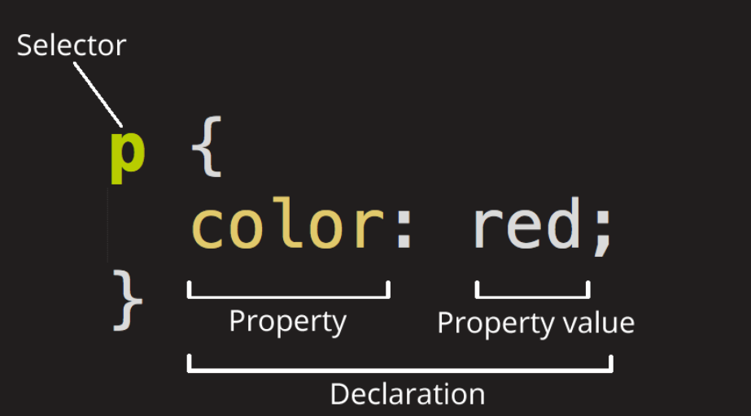

# 05 CSS基础

## 1 什么是CSS

- CSS也叫层级样式表，就是为了给html添加样式

- stylesheet -> css文件


## 2 注释语法

```py
# 用 /**/ 来包裹注释内容
# 单行注释和多行注释语法都是用 /**/
```


## 3 CSS的语法结构

- 规则：

```css
选择符 {
    样式属性名:样式属性值;
    样式属性名:样式属性值;
    样式属性名:样式属性值,样式属性值;
}
```



选择多个元素，为它们添加一组相同的样式，使用逗号分开，如：

```css
p,
li,
h1 {
  color: red;
}
```


```html
<!DOCTYPE html>
<html lang="en">
<head>
    <meta charset="UTF-8">
    <title>Title</title>
    <style>
       /*
        选择符 {
            样式属性名:样式属性值;
            样式属性名:样式属性值;
            样式属性名:样式属性值,样式属性值;
        }
        */
       h1 {
          color: #FF0000FF;
       }
    </style>
</head>
<body>
<h1>这是css基础语法</h1>

</body>
</html>
```


## 4 CSS的三种引入方式

```python
# 1.直接写在 head 标签内的 style 标签中

# 2.在当前标签上面写
'''
<h1 style="color: green"> 这是css基础语法 </h1>
'''
# 在标签上的属性的优先级大于在head里面的优先

# 3.直接写一个css文件 然后引入 css 文件
# 引入 css 文件要使用 link 标签

# 当都指定了同一个属性时
# 优先顺序：
# 行内 > style > css文件
# 即 内联样式 > <style>标签 > 外部样式文件
```


## 5 基本选择器

### 5.1 css中常用的选择符

```python
# 通用选择符 * 代表任意的标签
# 标签选择符 ele_name 查找当前页面上所有的相同名字的标签
# id选择符 id_name id是当前标签在当前页面上的唯一标识
# 类选择符 class_name class是当前标签一系列的共有属性
```


### 5.2 id选择符

```python
# 每个标签都有两个共同的属性 id 和 class
# id 是当前标签在当前页面上的唯一标识
# 选择具有特定ID的元素
# 单一页面中，每个ID只对应一个元素，一个元素只对应一个ID
```

```css
#unique {
    color: red;
}
```


### 5.3 类选择符

```python
# 类可以是当前页面上的多个标签的共同属性
# 选择具有特定类的元素
# 一个页面中，一个类可以有多个实例
```

```css
.box {
    color: orange;
}
```


### 5.4 标签选择符

```python
# 直接按照指定的标签名添加属性
# 作用范围是整个页面
# 如果指定div标签
# 所有当前页面上的 div 标签都会生效
# 在带有 class 和  id 选择符的标签不会生效
# 标签选择符 < class 选择符 < id 选择符
```

```css
h1 {
    color: yellow;
}
```


### 5.5 通用选择符

```python
# 用 * 号代表选择文档里的所有标签
```

```css
* {
    margin: 0;
}
```


### 5.6 小结

```python
# 所有的标签都会有对应的样式
# 其他的选择符添加的样式 不受影响

# 选择符优先级
# 通用选择符 < 标签选择符 < class 选择符 < id 选择符 < 行内样式
```


### 5.7 补充

```python
# 不知道会不会碰到
# 标签属性选择器
# 这组选择器根据一个元素上的某个标签的属性的存在以选择元素的不同方式
# 或者根据一个有特定值的标签属性是否存在来选择
```

```css
a[title] {
}
```

```css
a[href="https://example.com"] {
}
```


## 6 关系选择器

```python
# 【一】关系选择符
# 后代选择符 包含关系 E F
# 儿子选择符 儿子关系 E > F
# 毗邻选择符 相邻的标签 E + F
# 弟弟选择符 E - F

# 【二】后代选择器
# E F
# 后代选择器选择某个元素的所有后代（包括子元素、孙元素等）

# 【三】子选择器
# E > F
# 子选择器只选择直接的子元素，不包括孙元素及更深层次的后代

# 【四】相邻选择器
# E + F
# 相邻兄弟选择器会选择紧接在另一个元素之后的兄弟元素，且必须是相邻的兄弟元素。

# 【五】兄弟选择器
# E ~ F
# 一般兄弟选择器会选择某个元素后面所有兄弟元素（不一定相邻）。

# 【六】总结
# 1.后代选择器 E F
# E元素里 所有层次的F元素

# 2.子选择器 E > F
# E元素里 直接子元素F
# [注意] E里的F符合条件 F里包裹了其他类型的元素 也是会被影响到的 因为选中的是当前整个元素F
# 包括其他选择的时候也是如此 选择了p标签 那里面有其他标签 但也是属于当前p标签下的 都要被影响

# 3.相邻选择器E + F
# E元素 后面的 第一个元素F会受到影响
# 这里 只会选中紧接在E后面的p 如果有其他元素那就不会选中了

# 4.兄弟选择器E ~ F
# E 标签后面的所有 F 标签都会受到影响
# 只要是E的同级 在E后面 是F 即便隔着几个G元素 也会被影响
```


## 7 属性选择器

```python
# 【一】属性选择
# 按照对应的属性进行选择

# 【二】不同的属性选择符
# 选择符	版本	描述
# E[attr]	CSS2	选择具有attr属性的E元素。
# E[attr="val"]	CSS2	选择具有attr属性且属性值等于val的E元素。
# E[attr~="val"]	CSS2	选择具有attr属性且属性值为一用空格分隔的字词列表，其中一个等于val的E元素。
# E[attr^="val"]	CSS3	选择具有attr属性且属性值为以val开头的字符串的E元素。
# E[attr$="val"]	CSS3	选择具有attr属性且属性值为以val结尾的字符串的E元素。
# E[attr*="val"]	CSS3	选择具有attr属性且属性值为包含val的字符串的E元素。
# E[attr|="val"]	CSS2	选择具有attr属性且属性值为以val开头并用连接符"-"分隔的字符串的E元素，如果属性值仅为val，也将被选择。

# E可以写也可以不需要
```

**[attr]**

选择所有具有某个属性的元素，无论属性值是什么。

```css
<!-- HTML -->
<a href="https://example.com">Link 1</a>
<a>Link 2</a>

a[href] {
    color: red;
}
<!-- Link 1 变红 -->
```

**[attr="value"]**

选择具有指定属性，并且属性值等于某个特定值的元素。

```css
<!-- HTML -->
<input type="text" value="hello">
<input type="password" value="secret">

input[type="password"] {
    background-color: lightgrey;
}
<!-- 密码框背景为浅灰色 -->
```

**[attr~="value"]**

选择具有指定属性，且属性值是以空格分隔的值列表之一的元素。

```css
<!-- HTML -->
<div class="button primary">Button 1</div>
<div class="primary">Button 2</div>
<div class="button">Button 3</div>

[class~="button"] {
    background-color: yellow;
}
<!-- Button 1 、Button 3 背景为黄色 -->
```

**[attr|="value"]**

选择具有指定属性，并且属性值以某个值或该值后面接短横线开头的元素（常用于语言代码选择）。

```css
<!-- HTML -->
<p lang="en">English Paragraph</p>
<p lang="en-US">American English Paragraph</p>
<p lang="fr">French Paragraph</p>

p[lang|="en"] {
    font-weight: bold;
}
<!-- English 和 American English 会加粗 -->
```

**[attr^="value"]**

选择具有指定属性，并且属性值以某个特定值开头的元素。

```css
<!-- HTML -->
<a href="https://example.com">Secure Link</a>
<a href="http://example.com">Insecure Link</a>

a[href^="https"] {
    color: green;
}
<!-- Secure Link 变绿 -->
```

**[attr$="value"]**

选择具有指定属性，并且属性值以某个特定值结尾的元素。

```css
<!-- HTML -->
<a href="file.pdf">PDF File</a>
<a href="file.doc">Word File</a>

a[href$=".pdf"] {
    color: red;
}

<!-- PDF File 变红 -->
```

**[attr*="value"]**

选择具有指定属性，并且属性值包含某个子字符串的元素。

```css
<!-- HTML -->
<a href="https://example.com/page">Example Page</a>
<a href="https://test.com/page">Test Page</a>

a[href*="example"] {
    color: blue;
}

<!-- Example Page 变蓝 -->
```

可以结合使用 如：

```css
input[type="text"][placeholder] {
    border: 2px solid green;
}
<!--  只有具有 type="text" 并且同时带有 placeholder 属性的 input 元素会有绿色边框。 -->
```


