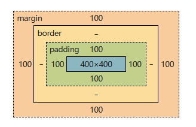

# 08 CSS之盒子模型和浮动

## 1 盒子模型

```python
# 【一】什么是盒子模型
# 盒子模型就是指在网页设计中 用于描述当前标签布局元素的一种模型

# 可以将四个边界的矩形看成一个盒子: 内容区域 内边框 外边框 外边距

# 内容区域: 自己定义的实际文本区域
# 内边距: 内容区域和边框之间的空间就是内边距
# 边框: 内边框
# 外边距: 内边框和外边框之间的空间就是外边距

# 以快递盒为例
# 内容区域: 放置的东西
# 内边距: 里面的物品和外边的包装盒之间的距离
# 边框: 包装盒的厚度
# 外边距: 外边的包装盒和其他物品之间的距离

# 【二】参数
# margin : 为元素设置所有四个方向（上右下左）的外边距。
# 如果提供四个参数值，将按上、右、下、左的顺序作用于四边；
# margin: 40px 60px 80px 100px;
# 提供三个，第一个用于上，第二个用于左、右，第三个用于下；
# margin: 40px 80px 100px;
# 提供两个，第一个用于上、下，第二个用于左、右;
# margin: 40px 100px;
# 只提供一个，同时用于四边
# margin: 100px;
```


```html
<!DOCTYPE html>
<html lang="en">
<head>
    <meta charset="UTF-8">
    <title>Title</title>
    <style>
        body {
            margin: 0;
        }
        #d1 {
            width: 400px;
            height: 400px;
            background-color: bisque;

            /* margin : 为元素设置所有四个方向（上右下左）的外边距。 */
            /* 如果提供四个参数值，将按上、右、下、左的顺序作用于四边； */
            /*margin: 40px 60px 80px 100px;*/
            /* 提供三个，第一个用于上，第二个用于左、右，第三个用于下； */
            /*margin: 40px 80px 100px;*/
            /* 提供两个，第一个用于上、下，第二个用于左、右； */
            /*margin: 40px 100px;*/
            /* 只提供一个，同时用于四边。 */
            margin: 100px;

            /* padding : 为元素设置所有四个方向（上右下左）的内边距。 */
            /* 如果提供四个参数值，将按上、右、下、左的顺序作用于四边； */
            /*padding: 40px 60px 80px 100px;*/
            /* 提供三个，第一个用于上，第二个用于左、右，第三个用于下； */
            /*padding: 40px 80px 100px;*/
            /* 提供两个，第一个用于上、下，第二个用于左、右； */
            /*padding: 40px 100px;*/
            /* 只提供一个，同时用于四边。 */
            padding: 100px;

        }
    </style>
</head>
<body>
<div id="d1">

</div>
</body>
</html>
```




## 2 浮动

```python
# 【一】浮动
# 浮动是所有网页布局必备的 可以将块级标签浮动起来
# 浮动起来的代码块原本有多大现在就有多大
# 浮动起来的元素 会遮挡下面的元素

# 【二】解决浮动带来的影响
# 1.同时浮动 - 代码冗余
# 2.都不浮动 - clear: both
# 3.最终方案: 做一个公共的类属性 然后给需要解除浮动的标签增加上指定的 类属性 即可解除浮动
```

```html
<!DOCTYPE html>
<html lang="en">
<head>
    <meta charset="UTF-8">
    <title>Title</title>
    <style>
        body {
            margin: 0;
        }

        div {
            width: 100px;
            height: 100px;
        }

        #d1 {
            background-color: red;
            float: left;
        }

        .cleared {
            clear: both;
        }

        #d2 {
            background-color: green;
            /*float: left;*/
            /*clear: left;*/
        }
    </style>
</head>
<body>

<div class="cleared" id="d1">

</div>
<div class="cleared" id="d2">

</div>
</body>
</html>
```


## 3 溢出属性

```python
# 【一】什么是溢出
# 在定义文本的时候指定宽度和高度
# 但是文本内容过多溢出了当前边框所限制的区域 就叫溢出

# 【二】解决溢出
"""
overflow:
visible：
对溢出内容不做处理，内容可能会超出容器。
hidden：
隐藏溢出容器的内容且不出现滚动条。
scroll：
隐藏溢出容器的内容，溢出的内容可以通过滚动呈现。
auto：
当内容没有溢出容器时不出现滚动条，当内容溢出容器时出现滚动条，按需出现滚动条。textarea元素的overflow默认值就是auto。
"""
```

```html
<!DOCTYPE html>
<html lang="en">
<head>
    <meta charset="UTF-8">
    <title>Title</title>
    <style>
        p {
            width: 100px;
            height: 100px;
            border: 2px solid blue;
            overflow: auto;
            /*  scroll、hidden、visible  */
        }
    </style>
</head>
<body>
<p id="p1">
    起笔描绘山水意，云淡风轻如诗情。倾情抒写欢乐悲，文字流露真我心。起笔描绘山水意，云淡风轻如诗情。倾情抒写欢乐悲，文字流露真我心。起笔描绘山水意，云淡风轻如诗情。倾情抒写欢乐悲，文字流露真我心。起笔描绘山水意，云淡风轻如诗情。倾情抒写欢乐悲，文字流露真我心。起笔描绘山水意，云淡风轻如诗情。倾情抒写欢乐悲，文字流露真我心。起笔描绘山水意，云淡风轻如诗情。倾情抒写欢乐悲，文字流露真我心。起笔描绘山水意，云淡风轻如诗情。倾情抒写欢乐悲，文字流露真我心。</p>
<p>起笔描绘山水意，</p>
<p>云淡风轻如诗情。</p>
<p>倾情抒写欢乐悲，</p>
<p>文字流露真我心。</p>
</body>
</html>
```


## 4 z-index模态框

```python
# 【一】在前端页面中我们会看到
# 再点击登陆之后会在输入用户名和密码的背景出现一层灰色的蒙版
# 这种效果我们就叫模态框

# 主要分为三块区域
#   第一块 没有点击登陆的时候的 底色
#   第二块 点击登陆之后输入框背景的蒙版
#   第三块 我们需要输入的输入框

# 【二】在前端开发过程中
# 为了区分三个区域的优先级 于是出现了一个参数
# z-index : 定义一个元素在文档中的层叠顺序
# 正数 数值越大优先级越高
# 负数 数值越小优先级越高
```

```html
<!DOCTYPE html>
<html lang="en">
<head>
    <meta charset="UTF-8">
    <title>Title</title>
    <style>
        /* body 的 margin 位 0*/
        body {
            margin: 0;
        }

        /* 制作覆盖层 中间层的 样式 */
        .cover {
            /* 相对整个文档进行偏移*/
            position: fixed;
            /* 左边偏移多少 */
            left: 0;
            /* 右边偏移多少 */
            right: 0;
            /* 上边偏移多少 */
            top: 0;
            /* 下边偏移多少 */
            bottom: 0;
            /* rgba(红,绿,蓝,透明度 小数 )  */
            background-color: rgba(0, 0, 0, 0.4);
            /* 优先级 99 */
            z-index: 99;
        }

        .modal {
            background-color: white;
            height: 400px;
            width: 700px;
            position: fixed;
            left: 30%;
            top: 40%;
            z-index: 100;
        }

    </style>
</head>
<body>
<div id="d1">
    最底下的显示页面
</div>

<div class="cover" id="d2">
    中间的透明层
</div>

<div class="modal">
    最上边的注册层
    <h1>这是登陆页面</h1>
    <form action="">
        <p>username : <input type="text"></p>
        <p>password : <input type="text"></p>
        <p>
            <input type="submit">
        </p>
    </form>
</div>
</body>
</html>
```


## 5 透明度opacity

```python
# opacity 和 rgba 都可以改变透明读
# 但是 opacity 不只是能修改颜色的透明读还可以修改内容的透明读
# rgba 只能该颜色
```

```html
<!DOCTYPE html>
<html lang="en">
<head>
    <meta charset="UTF-8">
    <title>Title</title>
    <style>
        #p1 {
            background-color: rgba(255, 255, 255, 0.4);
        }

        #p2 {
            background-color: rgb(255, 255, 255);
            opacity: 0.4;
        }
    </style>
</head>
<body>
<p id="p1">001</p>
<p id="p2">002</p>
</body>
</html>
```


