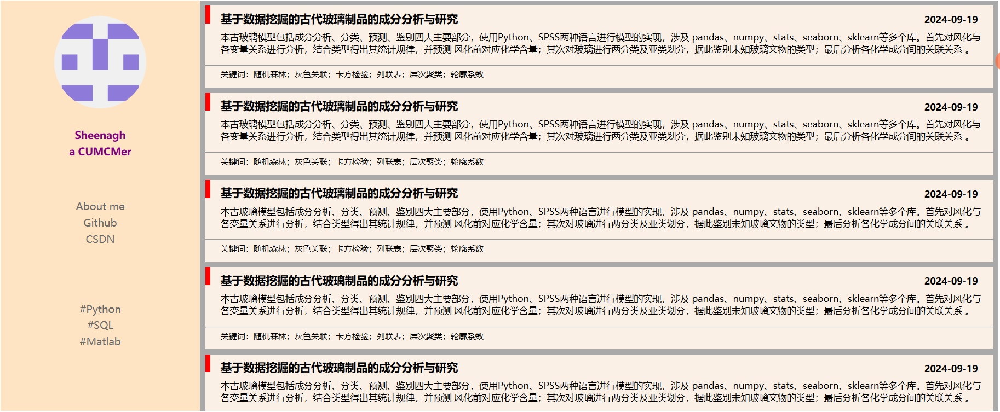

```html
<!DOCTYPE html>
<html lang="en">
<head>
    <meta charset="UTF-8">
    <title>主页</title>
    <style>
        body {
            margin: 20px;
        }
        .info {
            float: left;
            width: 20%;
            height: 800px;
            text-align: center;
            background-color: bisque;
        }
        .right {
            float: left;
            width: 80%;
            height: 800px;
            background-color: darkgrey;
            overflow: hidden;

        }
        #png {
            border-radius: 50%;
            margin-top: 30px;
            margin-bottom: 30px;
        }
        .first {
            color: purple;
            font-size: 20px;
            font-weight: 700;
            margin: 5px;
        }
        .mid {
            height: 120px;
            margin-top: 80px;
            margin-bottom: 80px;
        }
        .second {
            margin: 5px;
            color: dimgrey;
            font-size: 20px;
            font-weight: 700px;
        }
        a {
            text-decoration: none;
            color: dimgrey;
        }
        .article {
            margin: 10px;
            background-color: #FAF0E6;
            height: 20%;
            position: relative;
        }
        .tag {
            float:left;
            width: 10px;
            height: 35px;
            background-color: red;
        }
        .time {
            float: right;
            margin-top: 15px;
            margin-right: 30px;
            font-size: 18px;
            font-weight: 600;
        }
        .title, .content, .note {
            margin-left: 30px;
        }
        .title {
            font-size: 22px;
            padding-top: 10px;
            font-weight: 600;
        }
        .content {
            font-size: 18px;
            padding-top: 10px;
            margin-right: 20px;
        }
        hr {
            margin-top: 20px;
        }

        .note {
            height: 20%;
            bottom: 5px;
            position: absolute;
        }

    </style>
</head>
<body>
<div class="all">
    <div class="info">
        
        <p class="first">Sheenagh</p>
        <p class="first">a CUMCMer</p>
        <div class="mid">
            <p class="second">About me</p>
            <p class="second"><a href="https://github.com/sheenaghhhhh">Github</a></p>
            <p class="second"><a href="https://blog.csdn.net/sheenagh27?type=blog">CSDN</a></p>
        </div>
        <div class="mid">
            <p class="second">#Python</p>
            <p class="second">#SQL</p>
            <p class="second">#Matlab</p>
        </div>
    </div>
    <div class="right">
        <div class="article">
            <div class="tag"></div>
            <div class="time">2024-09-19</div>
            <div class="title">基于数据挖掘的古代玻璃制品的成分分析与研究</div>
            <div class="content"> 本古玻璃模型包括成分分析、分类、预测、鉴别四大主要部分，使用Python、SPSS两种语言进行模型的实现，涉及
pandas、numpy、stats、seaborn、sklearn等多个库。首先对风化与各变量关系进行分析，结合类型得出其统计规律，并预测
风化前对应化学含量；其次对玻璃进行两分类及亚类划分，据此鉴别未知玻璃文物的类型；最后分析各化学成分间的关联关系
。</div>
            <hr>
            <div class="note">关键词：随机森林；灰色关联；卡方检验；列联表；层次聚类；轮廓系数</div>


        </div>
        <div class="article">
            <div class="tag"></div>
            <div class="time">2024-09-19</div>
            <div class="title">基于数据挖掘的古代玻璃制品的成分分析与研究</div>
            <div class="content"> 本古玻璃模型包括成分分析、分类、预测、鉴别四大主要部分，使用Python、SPSS两种语言进行模型的实现，涉及
pandas、numpy、stats、seaborn、sklearn等多个库。首先对风化与各变量关系进行分析，结合类型得出其统计规律，并预测
风化前对应化学含量；其次对玻璃进行两分类及亚类划分，据此鉴别未知玻璃文物的类型；最后分析各化学成分间的关联关系
。</div>
            <hr>
            <div class="note">关键词：随机森林；灰色关联；卡方检验；列联表；层次聚类；轮廓系数</div>


        </div>
        <div class="article">
            <div class="tag"></div>
            <div class="time">2024-09-19</div>
            <div class="title">基于数据挖掘的古代玻璃制品的成分分析与研究</div>
            <div class="content"> 本古玻璃模型包括成分分析、分类、预测、鉴别四大主要部分，使用Python、SPSS两种语言进行模型的实现，涉及
pandas、numpy、stats、seaborn、sklearn等多个库。首先对风化与各变量关系进行分析，结合类型得出其统计规律，并预测
风化前对应化学含量；其次对玻璃进行两分类及亚类划分，据此鉴别未知玻璃文物的类型；最后分析各化学成分间的关联关系
。</div>
            <hr>
            <div class="note">关键词：随机森林；灰色关联；卡方检验；列联表；层次聚类；轮廓系数</div>


        </div>
        <div class="article">
            <div class="tag"></div>
            <div class="time">2024-09-19</div>
            <div class="title">基于数据挖掘的古代玻璃制品的成分分析与研究</div>
            <div class="content"> 本古玻璃模型包括成分分析、分类、预测、鉴别四大主要部分，使用Python、SPSS两种语言进行模型的实现，涉及
pandas、numpy、stats、seaborn、sklearn等多个库。首先对风化与各变量关系进行分析，结合类型得出其统计规律，并预测
风化前对应化学含量；其次对玻璃进行两分类及亚类划分，据此鉴别未知玻璃文物的类型；最后分析各化学成分间的关联关系
。</div>
            <hr>
            <div class="note">关键词：随机森林；灰色关联；卡方检验；列联表；层次聚类；轮廓系数</div>


        </div>
        <div class="article">
            <div class="tag"></div>
            <div class="time">2024-09-19</div>
            <div class="title">基于数据挖掘的古代玻璃制品的成分分析与研究</div>
            <div class="content"> 本古玻璃模型包括成分分析、分类、预测、鉴别四大主要部分，使用Python、SPSS两种语言进行模型的实现，涉及
pandas、numpy、stats、seaborn、sklearn等多个库。首先对风化与各变量关系进行分析，结合类型得出其统计规律，并预测
风化前对应化学含量；其次对玻璃进行两分类及亚类划分，据此鉴别未知玻璃文物的类型；最后分析各化学成分间的关联关系
。</div>
            <hr>
            <div class="note">关键词：随机森林；灰色关联；卡方检验；列联表；层次聚类；轮廓系数</div>


        </div>
    </div>

</div>
</body>
</html>
```




