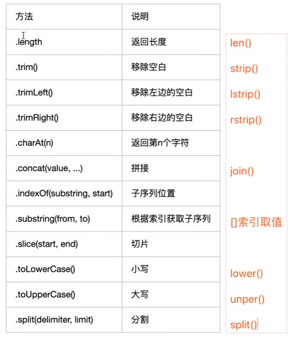

# 11 JavaScript之数据

## 1 常用的调试语句

```javascript
// alert 警告语句
alert("内容") --- 在页面上弹出一个警告框 点击确定后消失 刷新后重新触发
alert("这是警告语句")

// prompt 对话框 
prompt("提示内容",默认值)
result = prompt("出生年份",2001)

// console 打印语句
console.log("需要打印的内容")
console.log(result)
// 在我们写的 html / js 直接敲 log 自动补全  console.log()
```


## 2 javascript中的数据类型

### 2.1 js中有哪些数据类型

- 简单：Number、String、undefined、Boolean、null
- 复杂：object

### 2.2 如何查看变量的数据类型

```javascript
typeof 变量名

typeof "sheenagh"
'string'
typeof 23
'number'
typeof false
'boolean'
```

### 2.3 字面量

- 字面量是用于表达固定值的方法，又叫常量
- 所见即所得
- 比如：数字、字符串、布尔值等

### 2.4 特殊值

- Infinity 无穷：无穷大 Infinity , 无穷小 -Infinity，可以通过isFinite 来判断
- NaN：不是一个正常的数，是数字类型，可以通过 isNaN 来判断

```javascript
typeof Infinity
'number'
typeof NaN
'number'
40 - 23
17
NaN + 23
NaN
```


## 3 常量和变量

```javascript
// 常量就是定义之后不会改变的变量
// 变量是用来存储用户数据的标识

// 【一】声明变量的语法
// 关键字 var + 变量名 = 变量值
var name = "sheenagh"
undefined

// 输出了 undefined 就跟你在Python中调用了函数但是函数没有返回值 默认就是None = undefined

// 直接敲 name 输出 sheenagh 因为控制台内置了 log 语法 ， 不用写 print 关键字就能查看 变量的意思是一样的
name
'sheenagh'

// console.log 相当于调用了函数但是没有返回值 None = undefined
console.log(name)
sheenagh
undefined

// 【二】ES6新语法
// let + 变量名 = 变量值;
let name = "sheenagh";

//【三】var 和 let  的区别
// 变量的作用域不一样
// 用 var 声明的变量可以全局使用
// let 声明的变量只能局部使用

// 类似于在Python中内部 用 var 声明 在函数外也能使用
// 类似于在Python中内部 用 let 声明 在函数外不能使用

// 在Python中有严格的作用域 在函数内部的变量在函数外部无法调用

// 【四】jS中的变量名规范
// 变量名只能是 数字 + 字符 + 下划线 + $
// 变量名命名建议用驼峰体 小驼峰 userName passWord 
// 变量名不能关键字开头
// 变量名不能用数字开头

// 【五】常量
// 在Python中定义的常量可以改
// 在js代码中的常量 一旦定义无法修改
// const + 变量名 = 变量值;
const age = 18;
// 变量可以修改 而常量不允许

// 在控制台中直接输入name回车 就可以返回name的值 而js文件中 需要console.log(name)

```


## 4 数值类型Number

```javascript
// js中只有 number一种数值类型
typeof 18
'number'
typeof 18.805
'number'
```

```javascript
// NaN 是数值类型 但不是具体的数值

// NaN进行任何运算 结果仍旧是NaN 毕竟他是无限
```

```javascript
// parseInt() 字符串转整数
parseInt("213.231")
213
parseInt("213.231aasdasd")
213
parseInt("213.231aasdasd2312")
213
parseInt("asd213.231")
NaN

// parseFloat() 字符串转浮点数
parseFloat("213.231")
213.231
parseFloat("213.231asda")
213.231
parseFloat("213.231asda123")
213.231
parseFloat("asd213.231")
NaN

// 在js中 parseInt和parseFloat都是从头开始 如果有数字就取数字 取到非数字前一位为止 再转成想要的数字类型
```


## 5 字符类型String

```javascript
var name = "sheenagh"
undefined
name
'sheenagh'
typeof(name)
'string'

var school = 'Toronto'
undefined
school
'Toronto'
typeof(school)
'string'


// js 中 不可以用三引号的多行输出
var hobby = '''music'''
VM483:1 Uncaught SyntaxError: Unexpected string
var hobby = """music"""
VM524:1 Uncaught SyntaxError: Unexpected string
```

```javascript
// js 中 实现多行 需要借助 ` `
var sentence = `My
name
is
sheenagh`
undefined

// 打印
sentence
'My\nname\nis\nsheenagh'
typeof(sentence)
'string'


// 这样不好看 可以用${}进行格式化输出
var name = "sheenagh"
undefined
var sentence = `my name is ${name}`;
undefined
sentence
'my name is sheenagh'
```

**字符串内置方法**



```javascript
// 1.计算长度 .length
var name = "sheenagh"
undefined
name.length
8
// .length会计算空格
var name = "  sheenagh   "
undefined
name.length
13

// 2.移除空白 .trim()
// .trim() 有返回值 因此可以用给其他变量赋值
var name = "  sheenagh   "
undefined
name.trim()
'sheenagh'

// 3.移除左侧空白 .trimLeft() 
//   移除右侧空白 .trimRight()
var name = "  sheenagh   "
undefined
name.trimLeft()
'sheenagh   '
name.trimRight()
'  sheenagh'

// 4.返回指定索引的字符 .charAt(n)
// 索引从0开始
// 如果输入的索引无效 会返回第一个字符
name = "sheenagh"
'sheenagh'
name.charAt(1)
'h'
name.charAt(5)
'a'
name.charAt('a')
's'

// 5.返回指定字符对应的索引位置 .indexof(c)
// 找到字符第一次出现的位置
// 若找不到 返回-1
name = "sheenagh"
'sheenagh'
name.indexOf("e")
2
name.indexOf("h")
1
name.indexOf(1)
-1
name.indexOf("z")
-1

// 6.切片 .slice(起始索引,结束索引)
//		 .substring(起始索引,结束索引)
// 顾头不顾尾
name.slice(0,4)
'shee'
name.substring(0,4)
'shee'

// 区别 slice可以取0,-1 substring不行
name.slice(0,-1)
'sheenag'
name.substring(0,-1)
''

// 7.拼接 .concat(str1,str2,...)
name.concat("lily")
'sheenaghlily'
name.concat("lily","hoyo")
'sheenaghlilyhoyo'
name.concat("lily","hoyo","dsada")
'sheenaghlilyhoyodsada'

// 8.转大写字母 .toUpperCase()
//   转小写字母 .toLowerCase()
newname = name.toUpperCase()
'SHEENAGH'
newname.toLowerCase()
'sheenagh'

// 9.切分 .split(c)
lizi = "a|b|c|d"
'a|b|c|d'
lizi.split("|")
(4) ['a', 'b', 'c', 'd']

// 10.转字符串 .tolocalString()
k = lizi.split("|")
(4) ['a', 'b', 'c', 'd']
k.toLocaleString()
'a,b,c,d'
```


## 6 布尔类型Boolean

```javascript
// 在js中布尔类型是 true / false

// 为假的情况有：
// 0
// 空字符串
// null
// undefined
// NaN

Boolean(0)
false
Boolean("")
false
Boolean(null)
false
Boolean(undefined)
false
Boolean(NaN)
false
```


## 7 null和undefined

### 7.1 null

- 表示值为空，一般都是指定或清空一个变量

### 7.2 undefined

- 表示声明了一个变量但是没有进行初始化操作

### 7.3 比较

- null表示值是空，一般在需要指定或清空一个变量时才会使用，如name=null

- undefined表示当声明一个变量但未初始化时，该变量的默认值是undefined。还有就是函数无明确的返回值时，返回的也是undefined。

- null表示变量的值是空(null可以手动清空一个变量的值，使得该变量变为object类型，值为null)，undefined则表示只声明了变量，但还没有赋值。
