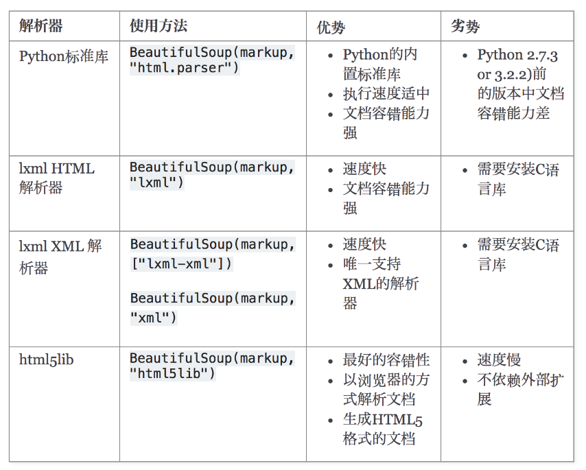

[Beautiful Soup 4.12.0 文档 — Beautiful Soup 4.12.0 documentation](https://www.crummy.com/software/BeautifulSoup/bs4/doc.zh/)

# 1 初识

## 1.1 介绍

1. 简言

简单来说，Beautiful Soup是python的一个库

最主要的功能是从网页抓取数据。

2. 官方解释

Beautiful Soup提供一些简单的、python式的函数用来处理导航、搜索、修改分析树等功能。

它是一个工具箱，通过解析文档为用户提供需要抓取的数据，因为简单，所以不需要多少代码就可以写出一个完整的应用程序。

3. 小结

Beautiful Soup 是一个可以从HTML或XML文件中提取数据的Python库

它能够通过你喜欢的转换器实现惯用的文档导航,查找,修改文档的方式

Beautiful Soup会帮你节省数小时甚至数天的工作时间

你可能在寻找 Beautiful Soup3 的文档,Beautiful Soup 3 目前已经停止开发,官网推荐在现在的项目中使用Beautiful Soup 4。

官方文档: https://beautifulsoup.readthedocs.io/zh_CN/v4.4.0/

## 1.2 安装

1. 安装库

```python
pip install BeautifulSoup4
```

2. 引入库

```python
from bs4 import BeautifulSoup
```

## 1.3 HTML解析器

1. 内置解析器html.parser

Beautiful Soup支持Python标准库中的HTML解析器,还支持一些第三方的解析器

如果我们不安装它，则 Python 会使用 Python默认的解析器

```python
soup=BeautifulSoup(页面源码,'html.parser')
```

2. 第三方解析器lxml

lxml 解析器更加强大，速度更快，推荐安装。

```python
pip3 install lxml
```

语法

```python
soup=BeautifulSoup(页面源码,'lxml')
```

3. 第三方解析器html5lib

另一个可供选择的解析器是纯Python实现的 html5lib

html5lib的解析方式与浏览器相同

可以选择下列方法来安装html5lib

```python
pip3 install html5lib
```

语法

```python
soup=BeautifulSoup(页面源码,'html5lib')
```

4. 解析器对比

（1）解析器优缺点



（2）解析器使用方法

| 解析器           | 使用方法                                                     | 优势                                                    | 劣势                                            |
| ---------------- | ------------------------------------------------------------ | ------------------------------------------------------- | ----------------------------------------------- |
| Python标准库     | BeautifulSoup(markup, "html.parser")                         | Python的内置标准库 执行速度适中 文档容错能力强          | Python 2.7.3 or 3.2.2)前 的版本中文档容错能力差 |
| lxml HTML 解析器 | BeautifulSoup(markup, "lxml")                                | 速度快 文档容错能力强                                   | 需要安装C语言库                                 |
| lxml XML 解析器  | BeautifulSoup(markup, ["lxml", "xml"]) 或BeautifulSoup(markup, "xml") | 速度快 唯一支持XML的解析器                              | 需要安装C语言库                                 |
| html5lib         | BeautifulSoup(markup, "html5lib")                            | 最好的容错性 以浏览器的方式解析文档 生成HTML5格式的文档 | 速度慢 不依赖外部扩展                           |

## 1.4 生成soup对象

从一个soup对象开始，以下两种方式生成一个soup对象

（1）方法一

```python
from bs4 import BeautifulSoup

# 指定HTML源码文件，传入文件源码
soup = BeautifulSoup(open("index.html"))
```

（2）方法二

```python
from bs4 import BeautifulSoup

# 直接放入 HTML 源码
soup = BeautifulSoup("<html>data</html>")
```

构造soup对象时，可以传入解析器参数

如果不传入的话，会以最好的方式去解析

## 1.5 示例

```python
html_doc = """
<html><head><title>The Dormouse's story</title></head>
<body>
<p class="title"><b>The Dormouse's story</b></p>

<p class="story">Once upon a time there were three little sisters; and their names were
<a href="http://example.com/elsie" class="sister" id="link1">Elsie</a>,
<a href="http://example.com/lacie" class="sister" id="link2">Lacie</a> and
<a href="http://example.com/tillie" class="sister" id="link3">Tillie</a>;
and they lived at the bottom of a well.</p>

<p class="story">...</p>
"""
```

（1）生成soup对象

使用BeautifulSoup解析这段代码,能够得到一个 BeautifulSoup 的对象

```python
# 导入 BeautifulSoup 库
from bs4 import BeautifulSoup

# 生成 BS4 对象
# 参数：(HTML源码,解析器)
# html.parser : 默认的解析器
soup = BeautifulSoup(html_doc, "html.parser")
```

（2）获取文档中的a标签

从文档中找到所有<a>标签的链接

```python
# 获取源码中所有的a标签
a_tags = soup.find_all('a')
# 遍历每一个a标签
for a in a_tags:
    # 提取每一个a标签中的 href 属性
    a_href = a.get("href")
```

（3）获取文章中所有的文本内容

从文档中获取所有文字内容

```python
# 获取源码中所有的文本内容
text = soup.get_text()
```


# 2 四种对象

## 2.0 引言

Beautiful Soup将复杂HTML文档转换成一个复杂的树形结构，并将每个节点都表示为Python对象。

在Beautiful Soup中，有四种主要的对象类型：

- BeautifulSoup
- Tag
- NavigableString
- Comment。

## 2.1 BeautifulSoup对象

代表整个解析后的HTML文档，是最顶层的对象。

它包含了整个文档的全部内容，并提供了操作HTML文档的方法和属性。

```python
from bs4 import BeautifulSoup

html_doc = """
<html><head><title>The Dormouse's story</title></head>
<body>
<p class="title"><b>The Dormouse's story</b></p>

<p class="story">Once upon a time there were three little sisters; and their names were
<a href="http://example.com/elsie" class="sister" id="link1">Elsie</a>,
<a href="http://example.com/lacie" class="sister" id="link2">Lacie</a> and
<a href="http://example.com/tillie" class="sister" id="link3">Tillie</a>;
and they lived at the bottom of a well.</p>

<p class="story">...</p>
</html>
"""

# 创建 BeautifulSoup 对象
soup = BeautifulSoup(html_doc, 'html.parser')
```

## 2.2 Tag对象

表示HTML中的标签，如<p>、<a>等。

Tag对象包含了标签的名称和对应的属性，并可以通过Tag对象来获取标签内的内容或进行进一步的操作。

可以通过传递HTML文档给BeautifulSoup类初始化的方式创建Tag对象。

（1）找tag对象

通过soup.tag名获取到指定标签对象

```python
# 输出head标签及其类型
print(soup.head, type(soup.head))
# <head><title>The Dormouse's story</title></head> <class 'bs4.element.Tag'>

# 输出title标签及其类型
print(soup.title, type(soup.title))
# <title>The Dormouse's story</title> <class 'bs4.element.Tag'>

# 输出第一个a标签及其类型
print(soup.a, type(soup.a))
# <a class="sister" href="http://example.com/elsie" id="link1">Elsie</a> <class 'bs4.element.Tag'>

# 输出第一个p标签下的第一个b标签
print(soup.p.b)
# <b>The Dormouse's story</b>
```

（2）查找tag对象的标签名和属性

通过soup.tag名.属性名获取到指定标签属性名对应的属性值

```python
# 输出第一个a标签的name属性值
print(soup.a.name)
# a

# 输出第一个p标签下的第一个b标签的name属性值
print(soup.p.b.name)
# b

# 输出第一个a标签的href属性值
print(soup.a["href"])
# http://example.com/elsie

# 输出第一个a标签的id属性值
print(soup.a.attrs)
# {'href': 'http://example.com/elsie', 'class': ['sister'], 'id': 'link1'}
```

（3）返回多值的属性

HTML 4定义了一系列可以包含多个值的属性.

在HTML5中移除了一些,却增加更多.

最常见的多值的属性是 class (一个tag可以有多个CSS的class).

还有一些属性 rel , rev , accept-charset , headers , accesskey .

在Beautiful Soup中多值属性的返回类型是list

```python
# 返回当前标签的 class 属性值
print(soup.a["class"])
# 返回列表
# ['sister']
```

（4）修改tag的属性

```html
<html><head><title>The Dormouse's story</title></head>
<body>
<p class="title"><b>The Dormouse's story</b></p>
<p class="story">Once upon a time there were three little sisters; and their names were
<a class="sister" href="http://example.com/elsie" id="link1">Elsie</a>,
<a class="sister" href="http://example.com/lacie" id="link2">Lacie</a> and
<a class="sister" href="http://example.com/tillie" id="link3">Tillie</a>;
and they lived at the bottom of a well.</p>
<p class="story">...</p>
</body></html>
```

tag的属性可以被添加、删除或修改

tag的属性操作方法与字典一样

```python
# 修改第一个a标签的 class 属性值
soup.a["class"] = ["sister c1"]
# 删除第一个a标签的id属性值
del soup.a["id"]
print(soup)
# 可以发现第一个a标签的id属性值被删除了
<html><head><title>The Dormouse's story</title></head>
<body>
<p class="title"><b>The Dormouse's story</b></p>
<p class="story">Once upon a time there were three little sisters; and their names were
<a class="sister c1" href="http://example.com/elsie">Elsie</a>,
<a class="sister" href="http://example.com/lacie" id="link2">Lacie</a> and
<a class="sister" href="http://example.com/tillie" id="link3">Tillie</a>;
and they lived at the bottom of a well.</p>
<p class="story">...</p>
</body></html>
```

（5）获取标签对象的文本内容

```python
# 拿到一个生成器对象, 取到p下所有的文本内容
print(soup.p.strings)
# <generator object Tag._all_strings at 0x1297b7370>

for i in soup.p.strings:
    print(i)
# The Dormouse's story
```

如果tag包含了多个子节点,tag就无法确定 

.string 方法应该调用哪个子节点的内容,

.string 的输出结果是 None

如果只有一个子节点那么就输出该子节点的文本， 

比如下面的这种结构

soup.p.string 返回为None

但soup.p.strings就可以找到所有文本

```python
p2 = soup.find_all("p")[1]
print(p2.string)
# None

print(p2.strings)
# <generator object Tag._all_strings at 0x1202b7300>
for i in p2.strings:
    print(i)
    
# Once upon a time there were three little sisters; and their names were
# 
# Elsie
# ,
# 
# Lacie
#  and
# 
# Tillie
# ;
# and they lived at the bottom of a well.
```

## 2.3 NavigableString对象

- 表示标签内的文本内容，或者说是非标签字符串。
- 当tag只包含单一的字符串时，可以使用tag.string或tag.text来获取该字符串。

```python
# 获取p标签的文本内容
print(soup.p.string)
# The Dormouse's story

# 获取p标签下所有的文本内容
print(soup.p.strings)
# <generator object Tag._all_strings at 0x102b7b300>

for i in soup.p.strings:
    print(i)
# The Dormouse's story
```

## 2.4 Comment对象

代表HTML文档中的注释内容。

当解析器遇到HTML文档中的注释时，Beautiful Soup会将注释封装成Comment对象。

```python
markup = "<b><!--Hey, buddy. Want to buy a used parser?--></b>"
soup = BeautifulSoup(markup, "html.parser")

# 输出注释内容
comment = soup.b.string
print(comment)
# Hey, buddy. Want to buy a used parser?

# 输出Comment对象的类型
print(type(comment))
# <class 'bs4.element.Comment'>
```

我们可以看到这时候

.string返回的对象不再是bs4.element.NavigableString

而是Comment


# 3 文档树操作

## 3.1 遍历文档树介绍

（1）什么是遍历文档树

遍历文档树，也被称为导航文档树，是指在一个文档对象模型（DOM）中按照特定的方法和规则来遍历和浏览其中的节点。

DOM是一种处理XML或HTML文档的标准编程接口，它将文档解析成由节点和对象组成的树状结构。

在遍历文档树的过程中，可以通过访问当前节点及其相关属性、子节点、父节点、兄弟节点等信息，来对文档进行操作和分析。

（2）常见的文档树遍历算法

选择起始节点

访问当前节点

处理当前节点

遍历子节点

遍历兄弟节点

返回父节点

结束条件

## 3.2 遍历文档树语法

首先导入BeautifulSoup库，并将HTML文档传入BeautifulSoup对象的构造函数中，指定解析器（这里使用lxml）。

```python
from bs4 import BeautifulSoup

html_doc = """
<html><head><title>The Dormouse's story</title></head>
<body>
<p class="title" name="first_p"><b>The Dormouse's story</b></p>

<p class="story">Once upon a time there were three little sisters; and their names were
<a href="http://example.com/elsie" class="sister" id="link1">Elsie</a>,
<a href="http://example.com/lacie" class="sister" id="link2">Lacie</a> and
<a href="http://example.com/tillie" class="sister" id="link3">Tillie</a>;
and they lived at the bottom of a well.</p>

<p class="story">...</p>
"""

soup = BeautifulSoup(html_doc, 'lxml')
# 也可以把这段代码 写在html_doc.html中，然后
# soup = BeautifulSoup(open("html_doc.html", "r").read(), "lxml")
```

（1）获取标签的名称

使用tag.name属性可以获取当前标签的名称。

例如，访问第一个p标签的名称：

```python
# 使用`tag.name`属性可以获取当前标签的名称
print(soup.p.name)
# p
```

（2）获取标签的属性

使用tag.attrs属性可以获取当前标签的属性字典。

例如，访问第一个p标签的属性字典：

```python
# 使用`tag.attrs`属性可以获取当前标签的属性字典。
print(soup.p.attrs)
# {'class': ['title'], 'name': 'first_p'}
```

（3）获取标签的内容

tag.string

- 使用tag.string属性可以获取当前标签内的文本内容。
- 如果标签内只有一个字符串，可以直接使用该属性获取内容。

- 例如，访问第一个p标签内的内容：

```python
# 使用`tag.string`属性可以获取当前标签内的文本内容。
# 如果标签内只有一个字符串，可以直接使用该属性获取内容。
print(soup.p.string)
# The Dormouse's story
```

若有多个字符串，则返回None。

tag.strings

- 使用tag.strings方法可以获取当前标签内所有子节点的文本内容，返回一个生成器对象。

- 例如，访问第一个p标签内所有文本内容：

```python
# 使用`tag.strings`方法可以获取当前标签内所有子节点的文本内容，返回一个生成器对象。
print(soup.p.strings)
# <generator object Tag._all_strings at 0x120eff370>
print(list(soup.p.strings))
# ["The Dormouse's story"]
```

tag.text

- 使用tag.text属性可以获取当前标签内所有子节点的文本内容，并将其连接在一起。

- 例如，访问第一个p标签内所有文本内容：

```python
# 使用`tag.text`属性可以获取当前标签内所有子节点的文本内容，并将其连接在一起。
print(soup.p.text)
# The Dormouse's story
```

tag.stripped_strings

- 使用tag.stripped_strings方法可以获取当前标签内所有子节点的文本内容，并去掉多余的空白字符。

- 该方法返回一个生成器对象。
- 例如，遍历输出所有标签内的文本内容：

```python
# 使用`tag.stripped_strings`方法可以获取当前标签内所有子节点的文本内容，并去掉多余的空白字符。
for line in soup.stripped_strings:
    print(line)
# Once upon a time there were three little sisters; and their names were
# Elsie
# ,
# Lacie
# and
# Tillie
# ;
# and they lived at the bottom of a well.
# ...
```

（4）嵌套选择

嵌套选择可以通过访问父子节点的方式来获取特定标签的文本内容。

在给定的示例中，我们使用text属性来访问特定标签的文本内容。

```python
print(soup.head.title.text)  
# 输出：The Dormouse's story

print(soup.body.a.text)  
# 输出：Elsie
```

（5）子节点、子孙节点

在BeautifulSoup中，可以通过.contents和.children属性来获取标签的子节点。

.contents属性返回一个包含所有子节点的列表，而.children属性返回一个迭代器，可以逐个访问子节点。

```python
# p下所有子节点
print(soup.p.contents)
# [<b>The Dormouse's story</b>]

# 得到一个迭代器，包含p下所有子节点
print(soup.p.children)
# <list_iterator object at 0x123583fa0>

# 使用enumerate对迭代器进行遍历
for i, child in enumerate(soup.p.children, 1):
    print(i, child)
# 1 <b>The Dormouse's story</b>

# 获取子孙节点，p下所有的标签都会被选择出来
print(soup.p.descendants)
# <generator object Tag.descendants at 0x12327f300>

# 使用enumerate对子孙节点进行遍历
for i, child in enumerate(soup.p.descendants, 1):
    print(i, child)
# 1 <b>The Dormouse's story</b>
# 2 The Dormouse's story

# 针对第二个p标签的子孙节点进行遍历
for i, child in enumerate(soup.find_all("p")[1].descendants, 1):
    print(i, child)
# 1 Once upon a time there were three little sisters; and their names were
#
# 2 <a class="sister" href="http://example.com/elsie" id="link1">Elsie</a>
# 3 Elsie
# 4 ,
#
# 5 <a class="sister" href="http://example.com/lacie" id="link2">Lacie</a>
# 6 Lacie
# 7  and
#
# 8 <a class="sister" href="http://example.com/tillie" id="link3">Tillie</a>
# 9 Tillie
# 10 ;
# and they lived at the bottom of a well.
```

（6）父节点、祖先节点

使用.parent属性可以获取标签的父节点

而.parents属性则可以获取标签的所有祖先节点，从父亲的父亲开始一直到最顶层的祖先节点。

```python
# 获取a标签的父节点
print(soup.a.parent)

# 获取a标签的父节点的文本内容
print(soup.a.parent.text)

# 找到a标签所有的祖先节点，父亲的父亲，父亲的父亲的父亲...
print(soup.a.parents)
```

（7）兄弟节点

BeautifulSoup提供了相关方法来获取标签的兄弟节点。

.next_sibling属性返回下一个兄弟节点，

而.previous_sibling属性返回上一个兄弟节点。

此外，.next_siblings属性返回一个生成器对象，可以逐个访问后面的兄弟节点。

```python
print(soup.a.next_sibling)  # 输出：<class 'bs4.element.NavigableString'>

print(soup.a.next_sibling.next_sibling) #下一个兄弟

print(soup.a.previous_sibling.previous_sibling) #上一个兄弟

print(list(soup.a.next_siblings)) #下面的兄弟们=>生成器对象

print(soup.a.previous_siblings)  
# 输出：生成器对象，包含上面的兄弟节点
# 上面的兄弟们=>生成器对象
```

## 3.3 搜索文档树介绍

recursive 是否从当前位置递归往下查询，如果不递归，只会查询当前soup文档的子元素

string 这里是通过tag的内容来搜索，并且返回的是内容，而不是tag类型的元素

kwargs 自动拆包接受属性值，所以才会有soup.find_all('a',id='title') ，id='title'为kwargs自动拆包掺入

BeautifulSoup定义了很多搜索方法,这里着重介绍2个:

find() 和 find_all()

其它方法的参数和用法类似

## 3.4 搜索文档树语法

```python
from bs4 import BeautifulSoup

html_doc = """
<html><head><title>The Dormouse's story</title></head>
<body>
<p class="title" name="first_p"><b>The Dormouse's story</b></p>

<p class="story">Once upon a time there were three little sisters; and their names were
<a href="http://example.com/elsie" class="sister" id="link1">Elsie</a>,
<a href="http://example.com/lacie" class="sister" id="link2">Lacie</a> and
<a href="http://example.com/tillie" class="sister" id="link3">Tillie</a>;
and they lived at the bottom of a well.</p>

<p class="story">...</p>
"""

soup = BeautifulSoup(html_doc, 'lxml')
```

**（1）查找多个find_all**

语法

```python
find_all( name , attrs , recursive , string , **kwargs )
```

（1）name参数

name 五种过滤器: 字符串、正则表达式、列表、方法、True

[1]字符串-直接放指定的标签名

例如 soup.find_all(name='a') 将返回所有的 <a> 标签。

```python
#  `soup.find_all(name='a')` 将返回所有的 `<a>` 标签。
print(soup.find_all(name='a'))
# [<a class="sister" href="http://example.com/elsie" id="link1">Elsie</a>, <a class="sister" href="http://example.com/lacie" id="link2">Lacie</a>, <a class="sister" href="http://example.com/tillie" id="link3">Tillie</a>]
```

[2]正则表达式

可以使用正则表达式来匹配标签名。

例如 soup.find_all(name=re.compile('^b')) 将返回以 'b' 开头的标签，包括 <body> 和 <b> 标签。

```python
# 找出b开头的标签，结果有body和b标签
print(soup.find_all(name=re.compile('^b')))
# [<body>
# <p class="title" name="first_p"><b>The Dormouse's story</b></p>
# <p class="story">Once upon a time there were three little sisters; and their names were
# <a class="sister" href="http://example.com/elsie" id="link1">Elsie</a>,
# <a class="sister" href="http://example.com/lacie" id="link2">Lacie</a> and
# <a class="sister" href="http://example.com/tillie" id="link3">Tillie</a>;
# and they lived at the bottom of a well.</p>
# <p class="story">...</p>
# </body>, <b>The Dormouse's story</b>]
```

[3]列表

如果传入一个列表参数，Beautiful Soup会返回与列表中任何元素匹配的内容。

例如 soup.find_all(name=['a', 'b']) 将返回文档中所有的 <a> 标签和 <b> 标签。

```python
#  `soup.find_all(name=['a', 'b'])` 将返回文档中所有的 `<a>` 标签和 `<b>` 标签
print(soup.find_all(name=['a', 'b']))
# [<b>The Dormouse's story</b>, <a class="sister" href="http://example.com/elsie" id="link1">Elsie</a>, <a class="sister" href="http://example.com/lacie" id="link2">Lacie</a>, <a class="sister" href="http://example.com/tillie" id="link3">Tillie</a>]
```

[4]方法

如果没有合适的过滤器，可以定义一个方法来匹配元素。

这个方法只接受一个元素参数，如果方法返回 True 表示当前元素匹配并被找到，否则返回 False。

```python
# 只返回具有 class 属性而没有 id 属性的 标签
def has_class_but_no_id(tag):
    return tag.has_attr('class') and not tag.has_attr('id')


print(soup.find_all(name=has_class_but_no_id))
# [<a class="sister" href="http://example.com/elsie" id="link1">Elsie</a>, <a class="sister" href="http://example.com/lacie" id="link2">Lacie</a>, <a class="sister" href="http://example.com/tillie">Tillie</a>]
```

[5]True

- 通过find_all(True)可以匹配所有的tag，不会返回字符串节点。
- 在代码中，会使用循环打印出每个匹配到的tag的名称(tag.name)。

```python
def has_class_but_no_id(tag):
    return tag.has_attr('class') and tag.has_attr('id')


print(soup.find_all(True))
for tag in soup.find_all(True):
    print(tag.name)
    
# html
# head
# title
# body
# p
# b
# p
# a
# a
# a
# p

print(soup.find_all(has_class_but_no_id))
# [<a class="sister" href="http://example.com/elsie" id="link1">Elsie</a>, <a class="sister" href="http://example.com/lacie" id="link2">Lacie</a>, <a class="sister" href="http://example.com/tillie" id="link3">Tillie</a>]
```

（2）keyword 参数

keyword 参数用于按照属性值进行搜索。

如果一个指定名字的参数不是内置的参数名，Beautiful Soup会将其当作指定名字的属性来搜索。 

例如包含 href 的参数将搜索每个tag的 href 属性。

指定属性值： 

例如 soup.find_all(href="http://example.com/tillie") 返回所有 href 属性等于 "http://example.com/tillie" 的标签。

正则表达式匹配属性值： 

例如 soup.find_all(href=re.compile("^http://")) 返回所有 href 属性以 "http://" 开头的标签。

多个属性： 

可以同时指定多个属性值

例如 soup.find_all(href=re.compile("http://"), id='link1') 返回同时满足 href 以 "http://" 开头并且 id 等于 "link1" 的标签。

```python
# 返回所有 `href` 属性等于 "http://example.com/tillie" 的标签。
print(soup.find_all(href="http://example.com/tillie"))

# 返回所有 `href` 属性以 "http://" 开头的标签。
print(soup.find_all(href=re.compile("^http://")))

# 拥有id属性的tag
print(soup.find_all(id=True))

# 多个属性
print(soup.find_all(href=re.compile("http://"), id='link1'))

# 注意，class是Python的关键字，所以class属性用class_
print(soup.find_all("a", class_="sister"))

print(soup.find_all("a", attrs={"href": re.compile("^http://"), "id": re.compile("^link[12]")}))

# 通过 find_all() 方法的 attrs 参数定义一个字典参数来搜索包含特殊属性的tag:
data = soup.find_all(attrs={"data-foo": "value"})
print(data)
```

（3）text参数

text 参数用于根据内容搜索标签。可以接受字符串、列表或正则表达式。

字符串：

返回包含指定内容的标签。

例如 soup.find_all(text="Elsie") 返回所有包含文本 "Elsie" 的标签。

列表：

返回包含列表中任一元素内容的标签。

例如 soup.find_all(text=["Tillie", "Elsie", "Lacie"]) 返回所有包含文本 "Tillie"、"Elsie" 或 "Lacie" 的标签。

正则表达式：

使用正则表达式来匹配内容。

例如 soup.find_all(text=re.compile("Dormouse")) 返回所有包含文本中包含 "Dormouse" 的标签。

```python
import re

# 返回所有包含文本 "Elsie" 的标签
print(soup.find_all(text="Elsie"))
# ['Elsie']

# 返回所有包含文本 "Tillie"、"Elsie" 或 "Lacie" 的标签。
print(soup.find_all(text=["Tillie", "Elsie", "Lacie"]))
# ['Elsie', 'Lacie', 'Tillie']

# 返回所有包含文本中包含 "Dormouse" 的标签。
# 只要包含Dormouse就可以
print(soup.find_all(text=re.compile("Dormouse")))
# ["The Dormouse's story", "The Dormouse's story"]
```

（4）limit参数

find_all() 方法返回全部的搜索结构,如果文档树很大那么搜索会很慢.

如果我们不需要全部结果,可以使用 limit 参数限制返回结果的数量

效果与SQL中的limit关键字类似

当搜索到的结果数量达到 limit 的限制时,就停止搜索返回结果.

例如 soup.find_all("a", limit=2) 返回前两个 <a> 标签。

```python
print(soup.find_all("a", limit=2))
# [<a class="sister" href="http://example.com/elsie" id="link1">Elsie</a>, <a class="sister" href="http://example.com/lacie" id="link2">Lacie</a>]
```

（5）recursive 参数

recursive 参数用于控制是否递归往下查询。

默认情况下，Beautiful Soup会检索当前tag的所有子孙节点。

如果想要仅搜索tag的直接子节点，可以设置 recursive=False。

例如 soup.find_all("div", recursive=False) 只会查找当前soup文档的直接子元素中的 <div> 标签。

```python
# 只会查找当前soup文档的直接子元素中的 `<div>` 标签。
print(soup.find_all("div", recursive=False))
```

**（2）查找单个find**

find()方法用于在文档中查找符合条件的tag，并返回第一个匹配的结果。

它可以通过指定name、attrs、recursive和string等参数来过滤查找结果。

```python
find( name , attrs , recursive , string , **kwargs )
```

name: 指定要查找的tag名称，可以是字符串或正则表达式。

attrs: 指定tag的属性，可以是字典或字典的列表。

recursive: 指定是否递归查找子孙tag，默认为True。

string: 指定查找的文本内容，可以是字符串或正则表达式。

**（3）find_all() 和find()比较**

find_all() 方法将返回文档中符合条件的所有tag,尽管有时候我们只想得到一个结果

比如文档中只有一个<body>标签

使用 find_all() 方法来查找<body>标签就不太合适

使用 find_all 方法并设置 limit=1 参数不如直接使用 find() 方法

下面两行代码是等价的:

```python
soup.find_all('title', limit=1)
# [<title>The Dormouse's story</title>]

soup.find('title')
# <title>The Dormouse's story</title>
```

唯一的区别是

find_all() 方法的返回结果是值包含一个元素的列表

find() 方法直接返回结果

find_all() 方法没有找到目标是返回空列表

find() 方法找不到目标时,返回 None

**（4）标签名多次调用**

soup.head.title 是 tag的名字 方法的简写

这个简写的原理就是多次调用当前tag的 find() 方法

```python
soup.head.title
# <title>The Dormouse's story</title>

soup.find("head").find("title")
# <title>The Dormouse's story</title>
```

**（5）方法拓展**

 **find_parents() 和 find_parent()**

https://www.crummy.com/software/BeautifulSoup/bs4/doc/index.zh.html#find-parents-find-parent

find_parents() 和 find_parent() 方法用于查找当前tag的父级tag。

find_parents():

返回所有符合条件的父级tag，结果是一个生成器。

可以传入参数来进一步筛选父级tag。

find_parent():

返回第一个符合条件的父级tag。

```python
a_string = soup.find(text="Lacie")
print(a_string)  # Lacie

# 查找当前tag的所有父级tag
print(a_string.find_parent())
# <a class="sister" href="http://example.com/lacie" id="link2">Lacie</a>


print(a_string.find_parents())

# 查找第一个符合条件的父级tag
print(a_string.find_parent("p"))
'''
<p class="story">
    Once upon a time there were three little sisters; and their names were
    <a class="sister" href="http://example.com/elsie" id="link1">Elsie</a>,
    <a class="sister" href="http://example.com/lacie" id="link2">Lacie</a> and
    <a class="sister" href="http://example.com/tillie" id="link3">Tillie</a>;
    and they lived at the bottom of a well.
</p>

'''
```

**find_next_siblings() 和 find_next_sibling()**

find_next_siblings() 和 find_next_sibling() 方法用于查找当前tag后面的兄弟tag。 

find_next_siblings(): 

返回所有符合条件的后续兄弟tag，结果是一个列表。

可以传入参数来进一步筛选兄弟tag。

find_next_sibling(): 

返回第一个符合条件的后续兄弟tag。

```python
first_link = soup.a

# 查找当前tag后面的第一个符合条件的兄弟tag
print(first_link.find_next_sibling("a"))
# <a class="sister" href="http://example.com/lacie" id="link2">Lacie</a>

# 查找当前tag后面的所有符合条件的兄弟tag
print(first_link.find_next_siblings("a"))
'''
[<a class="sister" href="http://example.com/lacie" id="link2">Lacie</a>,
<a class="sister" href="http://example.com/tillie" id="link3">Tillie</a>
]
'''
```

find_previous_siblings() 和 find_previous_sibling()的使用类似于find_next_sibling和find_next_siblings。

**find_all_next() 和 find_next()**

find_all_next() 和 find_next() 方法用于在当前tag之后查找符合条件的tag和字符串。 

find_all_next(): 

返回所有符合条件的后续tag和文本内容，结果是一个生成器。

可以传入参数来进一步筛选结果。

find_next(): 

返回第一个符合条件的后续tag或文本内容。

```python
first_link = soup.a

# 查找当前tag之后所有的文本内容
print(first_link.find_all_next(string=True))
# ['Elsie', ',\n', 'Lacie', ' and\n', 'Tillie', ';\nand they lived at the bottom of a well.', '\n', '...', '\n']

# 查找当前tag之后第一个符合条件的文本内容
print(first_link.find_next(string=True)) # Elsie
```

find_all_previous() 和 find_previous()的使用类似于find_all_next() 和 find_next()。


# 4 CSS选择器

## 4.1 引言

css选择器的方法为select(css_selector) 

详见官网:

https://www.crummy.com/software/BeautifulSoup/bs4/doc/index.zh.html#id37

目前支持的选择器如下案例 

css选择器可以参考

https://www.w3school.com.cn/cssref/css_selectors.ASP

## 4.2 select

```python
html_doc = """
<html><head><title>The Dormouse's story</title></head>
<body>
<p class="title">
    <b>The Dormouse's story</b>
    Once upon a time there were three little sisters; and their names were
    <a href="http://example.com/elsie" class="sister" id="link1">
        <span>Elsie</span>
    </a>
    <a href="http://example.com/lacie" class="sister" id="link2">Lacie</a> and
    <a href="http://example.com/tillie" class="sister" id="link3">Tillie</a>;
    <div class='panel-1'>
        <ul class='list' id='list-1'>
            <li class='element'>Foo</li>
            <li class='element'>Bar</li>
            <li class='element'>Jay</li>
        </ul>
        <ul class='list list-small' id='list-2'>
            <li class='element'><h1 class='yyyy'>Foo</h1></li>
            <li class='element xxx'>Bar</li>
            <li class='element'>Jay</li>
        </ul>
    </div>
    and they lived at the bottom of a well.
</p>
<p class="story">...</p>
"""
from bs4 import BeautifulSoup
soup=BeautifulSoup(html_doc,'lxml')

# 选取title元素
soup.select("title")  
# 输出: [<title>The Dormouse's story</title>]

# 选取第三个p元素（class为story）
soup.select("p:nth-of-type(3)")  
# 输出: [<p class="story">...</p>]

# 选取body下的所有a元素
soup.select("body a")
# 输出:
# [<a class="sister" href="http://example.com/elsie" id="link1">Elsie</a>,
#  <a class="sister" href="http://example.com/lacie"  id="link2">Lacie</a>,
#  <a class="sister" href="http://example.com/tillie" id="link3">Tillie</a>]

# 选取html head title元素
soup.select("html head title")  
# 输出: [<title>The Dormouse's story</title>]

# 选取head下直接子元素title
soup.select("head > title")  
# 输出: [<title>The Dormouse's story</title>]

# 返回所有<p>标签下的直接子级<a>标签
soup.select("p > a")
# 结果：[<a class="sister" href="http://example.com/elsie" id="link1">Elsie</a>,
#        <a class="sister" href="http://example.com/lacie"  id="link2">Lacie</a>,
#        <a class="sister" href="http://example.com/tillie" id="link3">Tillie</a>]


soup.select("p > a:nth-of-type(2)")
# 返回所有<p>标签下第二个<a>标签（直接子级）
# 结果：[<a class="sister" href="http://example.com/lacie" id="link2">Lacie</a>]

soup.select("p > #link1")
# 返回所有<p>标签下拥有id="link1"的<a>标签（直接子级）
# 结果：[<a class="sister" href="http://example.com/elsie" id="link1">Elsie</a>]

# 返回所有<body>标签下的直接子级<a>标签
soup.select("body > a")

# 返回拥有id="link1"的<a>标签之后所有同级的class="sister"的<a>标签
soup.select("#link1 ~ .sister")
# 结果：[<a class="sister" href="http://example.com/lacie" id="link2">Lacie</a>,
#         <a class="sister" href="http://example.com/tillie"  id="link3">Tillie</a>]

# 返回拥有id="link1"的<a>标签之后紧邻的下一个同级的class="sister"的<a>标签
soup.select("#link1 + .sister")
# 结果：[<a class="sister" href="http://example.com/lacie" id="link2">Lacie</a>]

# 返回所有class="sister"的<a>标签
soup.select(".sister")
# 结果：[<a class="sister" href="http://example.com/elsie" id="link1">Elsie</a>,
#         <a class="sister" href="http://example.com/lacie" id="link2">Lacie</a>,
#         <a class="sister" href="http://example.com/tillie" id="link3">Tillie</a>]

# 返回所有class属性中包含“sister”的<a>标签
soup.select("[class~=sister]")
# 结果：[<a class="sister" href="http://example.com/elsie" id="link1">Elsie</a>,
#         <a class="sister" href="http://example.com/lacie" id="link2">Lacie</a>,
#         <a class="sister" href="http://example.com/tillie" id="link3">Tillie</a>]

# 返回拥有id="link1"的<a>标签
soup.select("#link1")
# 结果：[<a class="sister" href="http://example.com/elsie" id="link1">Elsie</a>]

# 返回拥有id="link2"且为<a>标签的元素
soup.select("a#link2")
# 结果：[<a class="sister" href="http://example.com/lacie" id="link2">Lacie</a>]

# 返回拥有id="link1"或id="link2"的<a>标签
soup.select("#link1,#link2")
# 结果：[<a class="sister" href="http://example.com/elsie" id="link1">Elsie</a>,
#         <a class="sister" href="http://example.com/lacie" id="link2">Lacie</a>]

# 选取包含 href 属性的所有 <a> 标签
soup.select('a[href]')
# 结果为一个列表，包含所有具有 href 属性的 <a> 标签
# [<a class="sister" href="http://example.com/elsie" id="link1">Elsie</a>,
#  <a class="sister" href="http://example.com/lacie" id="link2">Lacie</a>,
#  <a class="sister" href="http://example.com/tillie" id="link3">Tillie</a>]

# 选取 href 属性等于 "http://example.com/elsie" 的 <a> 标签
soup.select('a[href="http://example.com/elsie"]')
# 结果为一个列表，只包含 href 属性等于 "http://example.com/elsie" 的 <a> 标签
# [<a class="sister" href="http://example.com/elsie" id="link1">Elsie</a>]

# 选取 href 属性以 "http://example.com/" 开头的 <a> 标签
soup.select('a[href^="http://example.com/"]')
# 结果为一个列表，只包含 href 属性以 "http://example.com/" 开头的 <a> 标签
# [<a class="sister" href="http://example.com/elsie" id="link1">Elsie</a>,
#  <a class="sister" href="http://example.com/lacie" id="link2">Lacie</a>,
#  <a class="sister" href="http://example.com/tillie" id="link3">Tillie</a>]

# 选取 href 属性以 "tillie" 结尾的 <a> 标签
soup.select('a[href$="tillie"]')
# 结果为一个列表，只包含 href 属性以 "tillie" 结尾的 <a> 标签
# [<a class="sister" href="http://example.com/tillie" id="link3">Tillie</a>]

# 选取 href 属性中包含 ".com/el" 的 <a> 标签
soup.select('a[href*=".com/el"]')
# 结果为一个列表，只包含 href 属性中包含 ".com/el" 的 <a> 标签
# [<a class="sister" href="http://example.com/elsie" id="link1">Elsie</a>]


multilingual_markup = """
 <p lang="en">Hello</p>
 <p lang="en-us">Howdy, y'all</p>
 <p lang="en-gb">Pip-pip, old fruit</p>
 <p lang="fr">Bonjour mes amis</p>
"""
multilingual_soup = BeautifulSoup(multilingual_markup)

# 选取 lang 属性以 "en" 开头的 <p> 标签
multilingual_soup.select('p[lang|=en]')
# 结果为一个列表，只包含 lang 属性以 "en" 开头的 <p> 标签
# [<p lang="en">Hello</p>,
#  <p lang="en-us">Howdy, y'all</p>,
#  <p lang="en-gb">Pip-pip, old fruit</p>]
```

## 4.3 select_one

返回查找到的元素的第一个

## 4.4 获取属性

```python
print(soup.select('#list-2 h1')[0].attrs)
```

## 4.5 获取内容

```python
print(soup.select('#list-2 h1')[0].get_text())
```


# 5 案例