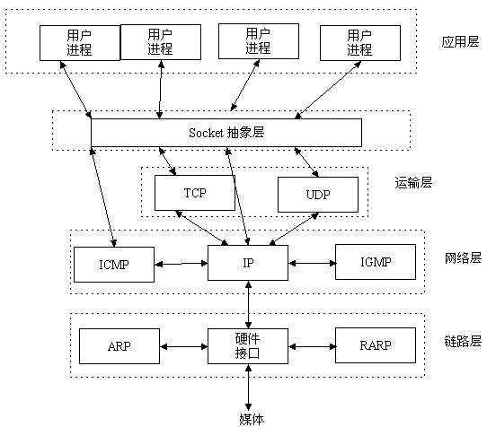

# 0 内容回顾

````python
# 【一】CS架构和BS架构
# CS架构就是 客户端与服务器模型
# BS架构就是 浏览器与服务器模型

# 【二】网络通信基础
# 1.什么是网络编程
# 网络编程就是编写程序，让两个或多个设备相互交换数据
# 涉及到的协议
# TCP/IP：传输协议
# HTTP：超文本传输协议
# FTP：文件传输协议

# 2.学习网络编程的目的
# 更方便开发客户端与服务器模型

# 3.发展史
# 来源 美国军方
# 计算机 -> 介质硬盘 -> 网线 -> 网络编程
# 转为民用

# 4.早期通信发展史
# 一开始大家用的是座机电话 -> 需要用电话线链接彼此的座机
# 电脑（大脑袋） -> 需要插线 -> 网线
# 智能手机 -> 只需要插入电话卡

# 5.互联网的本质
# 每一台设备是一个独立的个体，只能自己和自己玩
# 网线的出现不同设备之间可以在同一个网络中相互通信（局域网）
# 互联网的出现不同设备之间可以在同一个网络中相互通信（互联网）
# 接入到互联网中的设备必须按照一定的约束和规范才能接入

# 一系列统一的标准，这些标准称之为互联网协议
# 互联网的本质就是一系列的协议，总称为“互联网协议”（Internet Protocol Suite)
# 定义计算机如何接入Internet,以及接入Internet的计算机通信的标准

# 【三】OSI七层协议
# 应用层 ： 展示你的应用程序
# 表示层 ： 构成应用程序
# 会话层 ： 创建管理会话
# 传输层 ： 打包你的应用程序数据的 TCP/UDP协议
# 网络层 : 定义通信的目标地址 IP / 子网掩码 / ARP
# 数据链路层 ： 规范电信号的分组方式 以太网协议 / Mac地址 / 广播
# 物理层 ： 底层硬件设备

# 【四】TCP/IP五层协议
# 应用层 ： 展示你的应用程序，创建管理会话等 ...
# 传输层 ： 打包你的应用程序数据的 TCP/UDP协议
# 网络层 : 定义通信的目标地址 IP / 子网掩码 / ARP
# 数据链路层 ： 规范电信号的分组方式 以太网协议 / Mac地址 / 广播
# 物理层 ： 底层硬件设备

# 1.以太网协议
# 早期的时候每一个区域内的分组方式，后来形成的标准，被称为以太网协议 ethernet
# 每组电信号是一帧 包括 head 和 data 两部分

# 2.Mac地址
# 局域网协议规定每一个接入到当前局域网内的设备都要具备网卡 用来储存内部的发送和接收端地址
# Mac地址 网卡的地址 出厂时烧制的唯一一串地址 48位2进制 12位16进制
# 12位16进制 前6位标识设备制造商，后6位标识具体设备

# 3.广播
# 当你有了Mac地址，用网线介入到了局域网内
# 如何在局域网内区分不同的设备 -> 广播(通过arp协议在局域网内获取另一台主机的地址)
# 向所有人发布当前目标地址的数据 每一台设备拿到后解开对比是否是自己的地址

# 4.IP地址
# 规范了当前设备在互联网中的网络地址就叫 ip地址 采用ipv4版本 ipv6
# 每个IP地址 长度 32位2进制数 分成4段
# 192.168.1.96
# 相同的 ip 地址 不一定是在同一个局域网下

# 5.子网掩码
# ip地址有对应的子网掩码 用来区分ip地址的网络地址和主机地址 区分不同的局域网

# 6.TCP/UDP协议
# TCP协议叫流式协议，比较安全和稳定，在TCP传输数据的时候所有的数据像流水一样
# UDP协议叫报式协议，不安全，在UDP传输数据的时候所有的数据一次性打包全部传输

# 7.三次握手和四次挥手
# (1)三次握手
# 建立连接
# 第一次 客户向服务发起连接请求
# 第二次 服务向客户发起同意连接请求
# 第三次 客户接收到服务端的请求并建立连接

# (2)四次挥手
# 断开连接
# 第一次 客户向服务发起断开请求
# 第二次 服务向客户发起请求(等待断开连接),对没有传输完的数据进行传输
# 第三次 服务向客户发起断开连接请求,数据全部接受完成
# 第四次 客户接收到服务端的请求并断开连接
````


# 1 socket层

```python
# 【一】socket层
# 介于 应用层 和 传输层之间的抽象层

# ● Socket是应用层与TCP/IP协议族通信的中间软件抽象层，它是一组接口。
#   ○ 在设计模式中，Socket其实就是一个门面模式，它把复杂的TCP/IP协议族隐藏在Socket接口后面
#   ○ 对用户来说，一组简单的接口就是全部，让Socket去组织数据，以符合指定的协议。
# ● 所以，我们无需深入理解tcp/udp协议，socket已经为我们封装好了，我们只需要遵循socket的规定去编程，写出的程序自然就是遵循tcp/udp标准的。
# ● 也有人将socket说成ip+port
#   ○ ip是用来标识互联网中的一台主机的位置
#   ○ 而port是用来标识这台机器上的一个应用程序
#   ○ ip地址是配置到网卡上的
#   ○ 而port是应用程序开启的
#   ○ ip与port的绑定就标识了互联网中独一无二的一个应用程序
# ● 而程序的pid是同一台机器上不同进程或者线程的标识

# 【二】套接字
# ● 套接字起源于 20 世纪 70 年代加利福尼亚大学伯克利分校版本的 Unix,即人们所说的 BSD Unix。
# ● 因此,有时人们也把套接字称为“伯克利套接字”或“BSD 套接字”。
# ● 一开始,套接字被设计用在同 一台主机上多个应用程序之间的通讯。
# ● 这也被称进程间通讯,或 IPC。套接字有两种（或者称为有两个种族）,分别是
#   ○ 基于文件型的
#   ○ 基于网络型的

# 1.基于文件型的套接字
# 名字：AF_UNIX
# Address Family UNIX
# 一切皆文件 基于文件的套接字模型，用底层的文件系统来获取数据

# 2.基于网络型的套接字
# 名字: AF_INET
# Address Family Internet
# ● (还有AF_INET6被用于ipv6，还有一些其他的地址家族，不过，他们要么是只用于某个平台，要么就是已经被废弃，或者是很少被使用，或者是根本没有实现
#   ○ 所有地址家族中，AF_INET是使用最广泛的一个
#   ○ python支持很多种地址家族，但是由于我们只关心网络编程，所以大部分时候我么只使用AF_INET)

# 【三】套接字工作流程
# 以生活中的场景来说做说明 --- 打电话模型来做说明

# 【1】服务端（接电话）
# 1. 拥有一台手机
# 2. 插上电话卡
# 3. 开启手机等待别人打电话进来
# 4. 别人打电话进来，接听这个人的电话
# 5. 接收到打电话的人的信息
# 6. 给打电话的人回信息
# 7. 挂断电话
# 8. 关机

# 【2】客户端（打电话）
# 1. 拥有一台手机
# 2. 插上电话卡
# 3. 知道对方的电话号码
# 4. 拨打电话
# 5. 和对方进行交流
# 6. 听到对方说的话
# 7. 挂断电话
# 8. 关机
```



# 2 TCP客户端服务端模型一

```python
# 所有案例都先放server再放client

# 借助第三方的模块
import socket

# 【1】服务端
# 1.创建socket对象
# family : 使用的是哪个套接字家族 （基于网络型的套接字对象）
# type : 使用的是哪种套接字类型 （SOCK_STREAM TCP 协议流式套接字 SOCK_DGRAM UDP 协议报式套接字）

# 使用 AF_INET 表示使用 IPv4 地址
# SOCK_STREAM 表示使用 TCP 协议（面向连接的可靠协议）
# 这个 server 对象代表服务器端的通信端点。
server = socket.socket(family=socket.AF_INET, type=socket.SOCK_STREAM, proto=0)


# 2.绑定地址和端口
# bind() 方法将服务器 socket 绑定到指定的 IP 地址（127.0.0.1）和端口（9696）
# 这相当于将服务器的“电话号码”和“位置”固定下来，客户端可以通过这个地址和端口找到服务器。
addr = "127.0.0.1"  # 0.0.0.0 / localhost 域名 是 ip 127.0.0.1
prot = 9696
# 监听 127.0.0.1:9696 这个应用程序的数据传输
server.bind((addr, prot))


# 3.监听连接请求
# listen(5) 方法让服务器开始监听客户端的连接请求
# 参数 5 表示允许的最大等待连接数
# 即最多可以有 5 个客户端在队列中等待连接。
server.listen(5)


# 4.接受连接
# accept() 方法使服务器进入“阻塞”状态，等待客户端的连接请求
# 一旦有客户端连接，服务器返回两个值：
# client_socket（表示客户端的 socket 对象，用于与客户端通信）
# client_addr（表示客户端的地址信息）
client_socket, client_addr = server.accept()
print(f"client_socket :>>>> {client_socket}")
# client_socket :>>>> <socket.socket fd=4, family=AddressFamily.AF_INET, type=SocketKind.SOCK_STREAM,
# proto=0, laddr=('127.0.0.1', 9696), raddr=('127.0.0.1', 49984)>
print(f"client_addr :>>>> {client_addr}")
# client_addr :>>>> ('127.0.0.1', 49984)


# 5.接收数据
# recv(1024) 方法从客户端接收数据
# 1024 是缓冲区大小，表示一次最多接收 1024 字节的数据。
data_from_client = client_socket.recv(1024)
print(f"data_from_client :>>>> {data_from_client.decode()}")
# data_from_client :>>>> 你好!我是客户端!


# 6.发送数据
# 服务器处理完数据后，通过 send() 方法将响应数据发送给客户端
# 数据在发送前需要编码为字节形式
data_to_client = f"你好!我是服务端!{client_addr}"
client_socket.send(data_to_client.encode("utf-8"))


# 7.关闭连接
# 通信完成后，服务器关闭与客户端的连接，以及整个服务器的 socket 对象
client_socket.close()
server.close()
```

```python
# 借助第三方模块
import socket

# 【2】客户端
# 1.创建socket对象
# 这里默认使用了 AF_INET 和 SOCK_STREAM，即使用 IPv4 和 TCP 协议。这个 client 对象代表客户端的通信端点。
# 默认走的是基于网络的套接字模型且是流式协议（TCP协议）
client = socket.socket()

# 2.连接到服务器：connect() 方法将客户端 socket 连接到指定的服务器地址和端口（127.0.0.1:9696）。这相当于“拨号”到服务器。
addr = "127.0.0.1"
prot = 9696
client.connect((addr, prot))


# 3.发送数据：客户端通过 send() 方法将数据发送给服务器。数据在发送前需要编码为字节形式。
data_to_server = f"你好!我是客户端!"
client.send(data_to_server.encode("utf-8"))


# 4.接收数据：recv(1024) 方法从服务器接收数据。1024 是缓冲区大小，表示一次最多接收 1024 字节的数据。
data_from_server = client.recv(1024)
print(f"data_from_server :>>>> {data_from_server.decode()}")
# data_from_server :>>>> 你好!我是服务端!('127.0.0.1', 49984)

# 5.关闭连接：通信完成后，客户端关闭与服务器的连接。
client.close()
```

```python
from socket import socket, AF_INET, SOCK_STREAM

# 【一】服务端
# 创建服务端对象
server = socket(family=AF_INET, type=SOCK_STREAM)
# 绑定ip和端口
server.bind(("127.0.0.1", 9696))
# 监听客户端连接
server.listen(5)
# 接收到客户端连接
conn, addr = server.accept()
# 接收到客户端的数据 (二进制数据)
recv_data = conn.recv(1024)
# 向客户端发送数据
send_data = ''
conn.send(send_data.encode())
# 断开客户端连接
conn.close()
# 断开服务端连接
server.close()

# 【二】客户端
# 创建客户端对象
client = socket(family=AF_INET, type=SOCK_STREAM)
# 创建连接
client.connect(("127.0.0.1", 9696))
# 发送数据
send_data = ''
client.send(send_data.encode())
# 接受数据(二进制数据)
recv_data = client.recv(1024)
# 关闭客户端对象
client.close()


# 【总结】
# ● s.bind() 绑定(主机,端口号)到套接字
# ● s.listen() 开始TCP监听
# ● s.accept() 被动接受TCP客户的连接,(阻塞式)等待连接的到来

# ● s.connect() 主动初始化TCP服务器连接
# ● s.connect_ex() connect()函数的扩展版本,出错时返回出错码,而不是抛出异常

# ● s.recv() 接收TCP数据
# ● s.send() 发送TCP数据(send在待发送数据量大于己端缓存区剩余空间时,数据丢失,不会发完)
# ● s.sendall() 发送完整的TCP数据(本质就是循环调用send,sendall在待发送数据量大于己端缓存区剩余空间时,数据不丢失,循环调用send直到发完)
# ● s.recvfrom() 接收UDP数据
# ● s.sendto() 发送UDP数据
# ● s.getpeername() 连接到当前套接字的远端的地址
# ● s.getsockname() 当前套接字的地址
# ● s.getsockopt() 返回指定套接字的参数
# ● s.setsockopt() 设置指定套接字的参数
# ● s.close() 关闭套接字
```


# 3 TCP客户端服务端模型二(通信循环)

```python
# 借助第三方的模块
import socket

server = socket.socket(family=socket.AF_INET, type=socket.SOCK_STREAM, proto=0)
addr = "127.0.0.1"
prot = 9696
server.bind((addr, prot))
server.listen(5)
# 这部分和04文件夹一样 创建了socket对象并绑定好了地址和端口

while True:
    # 用来获取到不同的客户端连接对象
    client_socket, client_addr = server.accept()
    # 一旦有客户端链接进来 就有socket可以进行通信了
    while True:
        # 持续的和当前链接好的客户端进行交互
        data_from_client = client_socket.recv(1024)
        print(f"data_from_client :>>>> {data_from_client.decode()}")
        data_to_client = data_from_client.decode().upper()
        client_socket.send(data_to_client.encode("utf-8"))
        # 把进来的对象变大写后发了出去
```

````python
# 借助第三方模块
import socket

client = socket.socket()
addr = "127.0.0.1"
prot = 9696
client.connect((addr, prot))
# 和04文件夹一样 创建了socket对象并连接到了服务器


while True:
    data_to_server = input("请输入给服务端的数据 :>>>> ").strip()
    client.send(data_to_server.encode("utf-8"))
    # 输入数据转成字节发送到服务器
    data_from_server = client.recv(1024)
    # 通过recv接收了服务器的相应并打印出来了
    print(f"data_from_server :>>>> {data_from_server.decode()}")

````


# 4 TCP客户端服务端模型三(循环问题空数据)

````python
# 借助第三方的模块
import socket

server = socket.socket(family=socket.AF_INET, type=socket.SOCK_STREAM, proto=0)
addr = "127.0.0.1"
prot = 9696
server.setsockopt(socket.SOL_SOCKET,socket.SO_REUSEADDR,1) #就是它，在bind前加
server.bind((addr, prot))
server.listen(5)
while True:
    # 用来获取到不同的客户端连接对象
    client_socket, client_addr = server.accept()
    while True:
        # 持续的和当前链接好的客户端进行交互
        data_from_client = client_socket.recv(1024)
        print(f"data_from_client :>>>> {data_from_client.decode()}")
        data_to_client = data_from_client.decode().upper()

        client_socket.send(data_to_client.encode("utf-8"))
````

````python
# 借助第三方模块
import socket

client = socket.socket()
addr = "127.0.0.1"
prot = 9696
client.connect((addr, prot))
while True:
    data_to_server = input("请输入给服务端的数据 :>>>> ").strip()

    # 判断当前客户端输入的内容是否是空数据
    # 如果是空数据就会导致服务端和和客户端阻塞
    if not data_to_server:
        continue
    # 客户端会跳过发送空数据的操作，直接重新提示用户输入
    client.send(data_to_server.encode("utf-8"))
    data_from_server = client.recv(1024)
    print(f"data_from_server :>>>> {data_from_server.decode()}")

````


# 5 端口占用问题解决方案

````python
# # OSError: [Errno 48] Address already in use
# 端口被占用
# 解决办法一：查看到当前端口正在使用的进程 主动杀死进程
# windows :
# netstat -ano|findstr 端口号
# taskkill /pid 进程号 /F

# MacOS/Linux ：
# ps aux|grep 端口号
# sudo kill 进程号 -9

# 解决办法二：修改端口号
# 把链接端口号改一下
# 原来的端口号

# 解决办法三：
# 在创建连接之前加一句话
# server.setsockopt(socket.SOL_SOCKET,socket.SO_REUSEADDR,1) #就是它，在bind前加
# server.bind((addr, prot))
````


# 6 UDP客户端服务端模型

```python
# 借助第三方的模块
from socket import socket, AF_INET, SOCK_DGRAM

# 创建 服务端对象
server = socket(family=AF_INET, type=SOCK_DGRAM)
# 就是改了这里 TCP就是type=SOCK_STREAM 流式套接字
# UDP是type=SOCK_DGRAM 数据报套接字

# 监听IP 和 端口
addr = "127.0.0.1"
prot = 9696
server.bind((addr, prot))
# 持续的和当前链接好的客户端进行交互
data_from_client, client_address = server.recvfrom(1024)
# print(data_from_client) # b'a'
# TCP要使用accept UDP通过recvfrom和sendto就可以了
# UDP比较不可靠 是无连接的


print(f"data_from_client :>>>> {data_from_client.decode()}")
# data_from_client :>>>> a
data_to_client = data_from_client.decode().upper()
server.sendto(data_to_client.encode("utf-8"), client_address)
```

```python
# 借助第三方模块
from socket import socket, AF_INET, SOCK_DGRAM

client = socket(family=AF_INET, type=SOCK_DGRAM)
addr = "127.0.0.1"
prot = 9696
data_to_server = input("请输入给服务端的数据 :>>>> ").strip()
# 判断当前客户端输入的内容是否是空数据
# 如果是空数据就会导致服务端和和客户端阻塞
client.sendto(data_to_server.encode("utf-8"), (addr, prot))
data_from_server = client.recvfrom(1024)
print(f"data_from_server :>>>> {data_from_server}")

```


# 7 UDP客户端服务端模型(通信循环)

```python
# 借助第三方的模块
from socket import socket, AF_INET, SOCK_DGRAM

# 创建 服务端对象
server = socket(family=AF_INET, type=SOCK_DGRAM)

# 监听IP 和 端口
addr = "127.0.0.1"
prot = 9696
server.bind((addr, prot))
while True:
    # 持续的和当前链接好的客户端进行交互
    data_from_client, client_address = server.recvfrom(1024)
    # print(data_from_client) # b'a'

    print(f"data_from_client :>>>> {data_from_client.decode()}")
    # data_from_client :>>>> a
    data_to_client = data_from_client.decode().upper()
    server.sendto(data_to_client.encode("utf-8"), client_address)

```

```python
# 借助第三方模块
from socket import socket, AF_INET, SOCK_DGRAM

client = socket(family=AF_INET, type=SOCK_DGRAM)
addr = "127.0.0.1"
prot = 9696
while True:
    data_to_server = input("请输入给服务端的数据 :>>>> ").strip()
    # 判断当前客户端输入的内容是否是空数据
    # 如果是空数据就会导致服务端和和客户端阻塞
    if not data_to_server:
        continue
    client.sendto(data_to_server.encode("utf-8"), (addr, prot))
    data_from_server, server_addr = client.recvfrom(1024)
    print(f"data_from_server :>>>> {data_from_server.decode()}")

```


# 8 TCP客户端服务端模型完整版

```python
# 借助第三方的模块
import socket

server = socket.socket(family=socket.AF_INET, type=socket.SOCK_STREAM, proto=0)
addr = "127.0.0.1"
prot = 9696
server.setsockopt(socket.SOL_SOCKET, socket.SO_REUSEADDR, 1)  # 就是它，在bind前加
# 允许端口重用
server.bind((addr, prot))
server.listen(5)
while True:
    # 用来获取到不同的客户端连接对象
    client_socket, client_addr = server.accept()
    print(f"客户端地址：{client_addr}")
    while True:
        try:
            # 持续的和当前链接好的客户端进行交互
            data_from_client = client_socket.recv(1024)
            # 判断客户端是否已经断开连接 如果客户端断开连接则这里接收到的数据是 空 就会一直循环
            if not data_from_client:
                break

            result = data_from_client.decode()
            if result == "q":
                break

            print(f"data_from_client :>>>> {result}")
            data_to_client = input("请输入给客户端的数据 :>>>> ").strip()

            client_socket.send(data_to_client.encode("utf-8"))
        except Exception as e:
            break
    client_socket.close()
server.close()

```

````python
# 借助第三方模块
import socket

client = socket.socket()
addr = "127.0.0.1"
prot = 9696
client.connect((addr, prot))
while True:
    data_to_server = input("请输入给服务端的数据 :>>>> ").strip()

    # 判断当前客户端输入的内容是否是空数据
    # 如果是空数据就会导致服务端和和客户端阻塞 所以要避免
    if not data_to_server:
        continue

    client.send(data_to_server.encode("utf-8"))

    # 如果输入q代表要退出
    if data_to_server == "q":
        break

    data_from_server = client.recv(1024)
    result = data_from_server.decode()
    # 如果返回q也退出
    if result == "q":
        break
    print(f"data_from_server :>>>> {result}")

# 在edit configuations 里面可以勾选 multiple instance (允许当前实例多开)
# 多开的客户端对象在链接服务端之后，服务端没办法接收到除了第一个链接的客户端以外的客户端数据
# 原因是当前的服务端只有一个单进程没有多进程所以只能接收到一个客户端的数据交互
# 如果想要让第二个客户端和服务端交互就必须将第一个客户端结束(杀死)才能进行交互

````


# 9 粘包问题

## 9.1 问题演示

```python
# 【一】渣包问题出现的前提条件
# 前提条件是在 TCP 协议中才会有粘包问题产生
# 在UDP协议中不存在粘包问题

# UDP协议是报式协议 ： 每一次发送的数据只会发送一次
# TCP协议是流式协议 ： 发送的数据会封装成数据包发送，数据包之间相互独立，可以进行有序发送

# 服务端 1G ---> 客户端 一次性只能接受 500MB ---> 剩下的 500MB 去哪了？
# 剩下的 500mb 数据就会跟下一次的数据粘在一起发送

# 1234567 ---> 12345
# 8912345 ---> 67891

# 当在客户端输入命令 ifconfig / ipconfig
# 在服务端会执行当前的命令并且拿到 当前执行命令后的结果 （这个结果会非常多！）
# 服务端在返回给客户端数据的时候因为每一次只能接受 1024 个字节的数据
# 导致没有接收完的数据会随着下一次客户端的输入而发送过来
```

````python
# 借助第三方模块
import socket
import struct

client = socket.socket()
addr = "127.0.0.1"
prot = 9696
client.connect((addr, prot))
while True:
    data_to_server = input("请输入给服务端的数据 :>>>> ").strip()

    # 判断当前客户端输入的内容是否是空数据
    # 如果是空数据就会导致服务端和和客户端阻塞
    if not data_to_server: continue

    client.send(data_to_server.encode("utf-8"))
    if data_to_server == "q":
        break

    # 最开始接收到的数据一定是四个字节的二进制数据
    data_length_bytes = client.recv(4)
    # 让 struct 模块将打包号的四个字节的二进制数据解包
    data_length_all = struct.unpack("i",data_length_bytes)[0]
    print(data_length_all) # 获取到所有的数据的全部长度
    # 接下来遍历每一次的固定值提取数据
    count_data = 0
    data = b""
    buffer_size = 1024
    while count_data < data_length_all:
        # 每次提取固定大小的数据 拼接到总数据中
        data += client.recv(buffer_size)
        # 计算已经提取了多少数据
        count_data += buffer_size
    result = data.decode()
    if result == "q":
        break
    print(f"data_from_server :>>>>\n {result}")

````

```python
# 借助第三方的模块
import socket
import subprocess
import struct

def run_cmd(cmd):
    obj = subprocess.Popen(
        # 需要执行的命令
        cmd,
        # 执行的事 shell 命令行
        shell=True,
        # 将执行正确的结果放入管道中
        stdout=subprocess.PIPE,
        # 将执行错误的结果放入管道中
        stderr=subprocess.PIPE,
        # 对结果进行编码
        encoding="utf-8"
    )
    # 返回的结果
    true_result = obj.stdout.read()
    false_result = obj.stderr.read()

    return true_result if true_result else false_result


server = socket.socket(family=socket.AF_INET, type=socket.SOCK_STREAM, proto=0)
addr = "127.0.0.1"
prot = 9696
server.setsockopt(socket.SOL_SOCKET, socket.SO_REUSEADDR, 1)  # 就是它，在bind前加
server.bind((addr, prot))
server.listen(5)
while True:
    # 用来获取到不同的客户端连接对象
    client_socket, client_addr = server.accept()
    print(f"客户端地址：{client_addr}")
    while True:
        try:
            # 持续的和当前链接好的客户端进行交互
            data_from_client = client_socket.recv(1024)
            # 判断客户端是否已经断开连接 如果客户端断开连接则这里接收到的数据是 空 就会一直循环
            if not data_from_client:
                break

            cmd = data_from_client.decode()
            if cmd == "q":
                break

            print(f"data_from_client :>>>> {cmd}")

            # 获取当前命令的结果
            data_to_client = run_cmd(cmd)

            # 将结果转为二进制数据
            data_to_client_bytes = data_to_client.encode("utf-8")

            # 统计二进制数据的大小
            data_to_client_bytes_len = len(data_to_client_bytes)
            print(data_to_client_bytes_len)

            # 用 struct 模块将上面的 字节总数 打包成四个字节的二进制数据
            data_to_client_bytes_len_bytes = struct.pack('i', data_to_client_bytes_len) # b'\xdb\x10\x00\x00'

            # 再去发送数据
            client_socket.send(data_to_client_bytes_len_bytes)
            client_socket.send(data_to_client_bytes)
            '''
            # 将当前数据大小的数字转为字符串后再转为二进制才能在 tcp 中传输
            data_to_client_bytes_len_bytes = str(data_to_client_bytes_len).encode()
            
            # 发送
            # 先发送当前数据的大小
            client_socket.send(data_to_client_bytes_len_bytes)
            # 再发送当前总数据
            client_socket.send(data_to_client_bytes)
            '''


        except Exception as e:
            break
    client_socket.close()
server.close()
```

## 9.2 解决思路

```python
# 【二】解决思路
# 【1】提高当前客户端的接受数据大小
# 将  1024  提高 2048 4096 ...
# 【2】让客户端知道整个数据的大小
# 在服务端执行命令获取结果后得到的数据对于客户端来说是不知道数据的总大小的
# 于是为了解决不知道的问题 在发送数据的时候 就将当前数据的大小一并发送给客户端
# 客户端知道总大小后再按此接受

# （1）服务端如何做让客户端知道数据的大小
# 得到字符串形式的结果
# 将字符串形式的结果转为二进制数据
# 计算二进制数据的大小
# 先发送二进制数据的大小
# 然后再发送本体数据

# （2）客户端如何从总的数据中依次提取出所有数据
# 客户端如何知道当前数据所占大小的数字的字节数？


# 【4】优化借助第三方模块进行打包
import struct
import subprocess


def run_cmd(cmd):
    obj = subprocess.Popen(
        # 需要执行的命令
        cmd,
        # 执行的事 shell 命令行
        shell=True,
        # 将执行正确的结果放入管道中
        stdout=subprocess.PIPE,
        # 将执行错误的结果放入管道中
        stderr=subprocess.PIPE,
        # 对结果进行编码
        encoding="utf-8"
    )
    # 返回的结果
    true_result = obj.stdout.read()
    false_result = obj.stderr.read()

    return true_result if true_result else false_result


result = run_cmd(cmd="ifconfig").encode()
# print(len(result))  # 4315
# 将当前字节数据的结果打包成四个字节的二进制数据
res = struct.pack("i", len(result))
print(res)  # b'\xdb\x10\x00\x00'
# print(res.decode()) # UnicodeDecodeError: 'utf-8' codec can't decode byte 0xdb in position 0: invalid continuation byte
res = struct.unpack("i", res)
print(res)

#   ○ x --- 填充字节
#   ○ c --- char类型，占1字节
#   ○ b --- signed char类型，占1字节
#   ○ B --- unsigned char类型，占1字节
#   ○ h --- short类型，占2字节
#   ○ H --- unsigned short类型，占2字节
#   ○ i --- int类型，占4字节
#   ○ I --- unsigned int类型，占4字节
#   ○ l --- long类型，占4字节（32位机器上）或者8字节（64位机器上）
#   ○ L --- unsigned long类型，占4字节（32位机器上）或者8字节（64位机器上）
#   ○ q --- long long类型，占8字节
#   ○ Q --- unsigned long long类型，占8字节
#   ○ f --- float类型，占4字节
#   ○ d --- double类型，占8字节
#   ○ s --- char[]类型，占指定字节个数，需要用数字指定长度
#   ○ p --- char[]类型，跟s一样，但通常用来表示字符串
#   ○ ? --- bool类型，占1字节

```

```python
import hashlib
import json
import os.path
# 借助第三方模块
import socket
import struct

client = socket.socket()
addr = "127.0.0.1"
prot = 9696
client.connect((addr, prot))
while True:
    data_to_server = input("请输入给服务端的数据 :>>>> ").strip()  # girl

    # 判断当前客户端输入的内容是否是空数据
    # 如果是空数据就会导致服务端和和客户端阻塞
    if not data_to_server: continue

    client.send(data_to_server.encode("utf-8"))
    if data_to_server == "q":
        break

    # 最开始接收到的数据一定是四个字节的二进制数据
    pack_data = client.recv(4)
    # 让 struct 模块将打包号的四个字节的二进制数据解包
    print(pack_data)
    json_data_length_all = struct.unpack("i", pack_data)[0]
    # 接收到的结果应该是当前字典转为json字符串后再转为二进制数据的长度
    file_data_dict = json.loads(client.recv(json_data_length_all))
    # 提取出当前文件数据的总长度
    data_length_all = file_data_dict.get('data_all')
    print(f"data_length_all :>>>> {data_length_all}")
    count_data = 0
    data = b""
    buffer_size = 1024
    while count_data < data_length_all:
        # 每次提取固定大小的数据 拼接到总数据中
        data += client.recv(buffer_size)
        # 计算已经提取了多少数据
        count_data += buffer_size
    # 计算当前总数据的哈希值
    md5 = hashlib.md5()
    md5.update(data)

    # 从json字典中取出原本的哈希值
    file_hex = file_data_dict.get('file_hex')
    print(f"old_hex :>>>> {file_hex}")
    print(f"new_hex :>>>> {md5.hexdigest()}")
    if file_hex != md5.hexdigest():
        print("文件已损坏!")
        break
    file_name = 'nb_' + file_data_dict.get("file_name")
    file_type = file_data_dict.get("file_type")
    file_path = os.path.join(os.path.dirname(__file__), file_name + '.'+file_type)
    with open(file_path, "wb") as fp:
        fp.write(data)

```

```python
import hashlib
import json
import os.path
# 借助第三方的模块
import socket
import subprocess
import struct


def run_cmd(cmd):
    obj = subprocess.Popen(
        # 需要执行的命令
        cmd,
        # 执行的事 shell 命令行
        shell=True,
        # 将执行正确的结果放入管道中
        stdout=subprocess.PIPE,
        # 将执行错误的结果放入管道中
        stderr=subprocess.PIPE,
        # 对结果进行编码
        encoding="utf-8"
    )
    # 返回的结果
    true_result = obj.stdout.read()
    false_result = obj.stderr.read()

    return true_result if true_result else false_result


def read_data(file_name):
    file_path = os.path.join(os.path.dirname(__file__), file_name + '.png')
    with open(file_path, "rb") as fp:
        data = fp.read()
    return data


server = socket.socket(family=socket.AF_INET, type=socket.SOCK_STREAM, proto=0)
addr = "127.0.0.1"
prot = 9696
server.setsockopt(socket.SOL_SOCKET, socket.SO_REUSEADDR, 1)  # 就是它，在bind前加
server.bind((addr, prot))
server.listen(5)
while True:
    # 用来获取到不同的客户端连接对象
    client_socket, client_addr = server.accept()
    print(f"客户端地址：{client_addr}")
    while True:
        try:
            # 持续的和当前链接好的客户端进行交互
            data_from_client = client_socket.recv(1024)
            # 判断客户端是否已经断开连接 如果客户端断开连接则这里接收到的数据是 空 就会一直循环
            if not data_from_client:
                break

            file_name = data_from_client.decode()
            # girl
            if file_name == "q":
                break
            # 下载图片数据到客户端本地
            file_data = read_data(file_name=file_name)
            # 统计二进制数据的大小
            data_to_client_bytes_len = len(file_data)
            print(data_to_client_bytes_len)
            # 验证数据的完整性 ---> md5 哈希值
            md5 = hashlib.md5()
            md5.update(file_data)
            # 拼接一个数据字典 ---> 携带当前文件的信息
            # 代文件名字 + md5 哈希值 + 文件类型
            file_data_dict = {
                "file_name": file_name,
                "file_type": "png",
                "file_hex": md5.hexdigest(),
                # 携带当前文件数据的大小
                "data_all": data_to_client_bytes_len
            }

            file_data_dict_str = json.dumps(file_data_dict)

            file_data_dict_bytes = file_data_dict_str.encode("utf-8")

            # 用 struct 模块将上面的 字节总数 打包成四个字节的二进制数据
            pack_data = struct.pack('i', len(file_data_dict_bytes))  # b'\xdb\x10\x00\x00'
            # 再去发送数据
            # 发送字典转成的二进制数据打包后的长度
            client_socket.send(pack_data)
            # 发送字典的二进制数据
            client_socket.send(file_data_dict_bytes)
            # 发送当前的文件数据
            client_socket.send(file_data)


        except Exception as e:
            break
    client_socket.close()
server.close()

```

