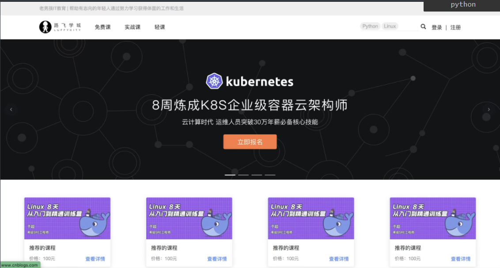

# Vue回顾

```python
# 1 前端发展历史
	-纯前后端混合 -> 模板语法 -> dtl
    -ajax技术 -> render+ajax -> 页面局部更新
    -前端纯html，css，js，ajax  后端配合接口 -> 无框架
    -框架:工程化 react，vue
    -大前端：小程序，app，web，桌面，设备大屏，鸿蒙
    	aosp 
    -uniapp，flutter
    
# 2 vue介绍
	-版本：2.x 3.x
    - vue特点
    	1 渐进式
        2 单页面应用 spa
        	-必须配合 vue-router
        3 单页面组件  xx.vue
        4 mvvm架构
        
# 3 插值语法
	{{}}  必须放在标签内部
# 4 指令之文本指令
	v-text
    v-html
    v-if
    v-show
    
# 5 事件指令
	@事件名='函数'
    
# 6 属性指令
	:属性='变量'
    
# 7 小案例：点击选美女
	-定时器 
    -数组中随机一个值
    
# 8 style和class
	
# 9 条件渲染
	v-if  v-else-if  v-else
    
# 10 v-for       key
	-数组
    -对象
    -数字
    -字符串
    
# 11 购物车案例

# 12 v-model

# 13 input的事件
	-input
    -change
    -blur
    -focus
    
# 14 过滤案例

# 15 箭头函数

# 16 js循环方式
	for (let i=0;i<10;i++)
    for of
    for in
    数组.each
    jq循环
    
# 17 事件修饰符
	-once
    -prevent
    -stop
    -self
    
# 18 按键事件  修饰符

# 19 表单控制--input
	-chechbox
    -radio
    
# 20 购物车案例

# 21 跟后端交互
	-axios
    
# 22 小电影案例
	-跨域问题
    
# 23 计算属性

# 24 监听属性

# 25 生命周期

# 26 组件 -> 单文件组件

# 27 组件间通信
	-父传子
    	-props
    -子传父
    -ref属性
    
# 28 插槽

# 29 混入

# 30 插件

# 31 vuex

# 32 本地存储

# 33 vue-router
	-js跳转
    -标签跳转
    -路由守卫
    
# 34 vue3 介绍

# 33 vite创建项目

# 34 setup，reactive，ref

# 35 计算属性

# 36 监听属性

# 37 生命周期

# 38 setup写法
	1 组件使用
    2 父传子：自定义属性
    	
    3 子传父自定义事件
    4 ref属性
    
# 39 toRefs，toRef

# 40 axios
	-配置项：headers，url，method
    
    -封装：请求拦截器和响应拦截器
    
# 41 promise语法
	promise对象.then(函).catch(函数)
    
    async function a(){}
    
    # a().then()
    try:
    	let res=await a()
        let res=await b()
    catch:
        pass
    
# 42 vue-router

# 43 pinia

# 44 elementui-plus
```

# 今日内容

# 0 前后端分离后cookie

```python
# 1 前后端分离登录认证
	- token认证方案
    	-登录后 -> 后端签发 token[三段式] -> 响应体中返回给前端
        -前端 -> 从响应体中取出 token[三段式] -> 需要自己使用js操作把token保存到某个位置
        -可以放在：cookie，localStorage，sessionStorage
        -后续，某个接口需要登录后才能访问
        -自己在发送请求之前，从本地存储中取出 当时存的token，放到请求头中携带 -> 到后端
        
    - session认证方案
    	-登录后 -> 后端生成一个随机字符串[asdfasdf],存到django-session表中用户信息 -> 随机字符串返回给前端
        	asdfasdf 用户信息数据[加密了]
            
        -前端 -> 从响应体中取出随机字符串 -> 需要自己使用js操作把token保存到某个位置
        -后续完全一样
        
 # 2 前后端混合
	-session认证方案
    	-登录成功 -> 后端 request.session['name']="sheenagh"
        	内部本质：生成一个随机字符串，把 name数据机密 -> 存到django-session表中 -> 调用set_cookie，把随机字符串写入到前端浏览器cookie中
        -前端会把响应头中得cookie取出来 -> 存到本地cookie中
            
        -后续访问需要登录后才能访问的接口 -> 浏览器会自动携带cookie放到请求头中
        	-当前地址有的cookie，只要再访问当前地址，就会自动携带cookie
            
        -后端有个 session中间件 -> 取出cookie[随机字符串]，去django-session表中查，查到数据，放到request.session中
    
# 3 如果发送ajax请求，无论是分离还是混合
	-请求头中都不会自动携带cookie的值
    
# 4 postman可以
	-postman登录后 -> 发现响应头中有cookie -> 存到本地
    -以后再向同一个域发请求，会自动携带cookie
  
# 5 前端显示图片，一般都是服务端的一个地址（可以动态变）
	
    后端存路径：前端路由
    
    img :src='user.avatar'
    user.avatar='./img/1.png'
```


# 1 企业项目类型

```python
# 0 两大类
	-面向互联网用户：互联网公司
    -传统软件行业：专门的客户
    	
# 1 面向互联网用户：商城类项目
	-微信小程序商城
    
# 2 面向互联网用户：二手交易类的
	-咸鱼
    -转转
    
# 3 公司内部项目：python写的重点
	-oa系统
    -打卡系统工资核算系统
    -第三方公司做的：
    	-给医院 互联网，内部的项目
        -银行 内部系统
        -政府 
        -钢材市场，商户
    - 微信小程序订餐
    	-二维火 餐饮行业
    -零售行业
    -问卷网
    -考试系统
    -django+simpleui：二次定制
    
# 4 个人博客

# 5 内容收费站
	-掘金
    
# 6 房屋租赁
	-青客
  	-蛋壳
  	-自如
```


# 2 企业项目开发流程

```python
开发流程
    -立项(高管)
    -需求分析（产品经理）
        # 互联网项目
            -需求调研和分析：产品经理设计出来的
        # 传统软件
            -需求调研和分析：市场人员,产品跟客户对接
    
	-原型设计：产品经理 
		-懂业务
    -分任务开发（前端，后端，ui）
    	-前端团队
            -UI设计
            -前端写代码（pc，小程序，移动端）
        -后端团队
        	-架构，数据库设计
            -分任务开发：用户，商品板块
           
        -联调测试（测试团队，质量控制部 -> 质控部）
        
    -项目上线（运维团队）

# 你在公司开发流程是什么？
	-开新项目，先开会，设计技术选型，数据库设计
    	-产品，原型图做好了
        -老大在项目管理平台（禅道）分配任务给我
        -进入到管理平台就能看到任务，相关功能的原型图
        	-需求，原型图，实现的效果
        -开发 -> 有不明白的需求，找产品对接 -> 自测
        -提交到版本仓库(git，svn)
        
        -所有都开发完了，分支合并
        -跟前端联调
        -发版：1周一版，一月一版
    
    -如果是老项目
        	-老大在项目管理平台（禅道）分配任务给我
            -进入到管理平台就能看到任务，相关功能的原型图
                -需求，原型图，实现的效果
            -开发---有不明白的需求，找产品对接- -> 自测
            -提交到版本仓库(git，svn)

            -所有都开发完了，分支合并
            -跟前端联调
            -发版：
```


# 3 路飞项目需求

```python
# 线上销售课程的
	-商城
    -知识付费类：掘金，拉钩教育
    
# 项目需求
	-首页功能
    	-轮播图接口
    	-推荐课程接口
        
    -用户功能
    	-用户名密码登录
        -手机号验证码登录
        -发送手机验证码
        -验证手机号是否注册过
        -注册接口
        
   -课程列表功能
		-课程列表接口
    	-排序，过滤，分页
        
   -课程详情
		-课程详情接口
    	-视频播放功能
        -视频托管（第三方，自己平台）
        
   -下单功能
		-支付宝支付：生成支付链接，付款，回调修改订单状态
   		-购买成功功能
```




# 4 pip 换源

```python
# 1  pip install -> pypi 上下载 -> 国外 -> 下载慢
# 2  pip install -i 国内源  -> 国内源把pypi上所有的包都复制了一份
	-豆瓣
    -清华
    -阿里：推荐用

# 3 以后再电脑上，只要pip install ，自动选择国内源
	1、文件管理器文件路径地址栏敲：%APPDATA% 回车，快速进入 C:\Users\Pondsi用户名\AppData\Roaming 文件夹中
    2、新建 pip 文件夹并在文件夹中新建 pip.ini 配置文件
    3、新增 pip.ini 配置文件内容
    
[global]
index-url = https://mirrors.aliyun.com/pypi/simple
[install]
use-mirrors =true
mirrors =https://mirrors.aliyun.com/pypi/simple
trusted-host =mirrors.aliyun.com
    
# 4 以后装模块，都会使用阿里云镜像站

# 5 自己写的代码，可以打包成whl -> 可以看 自己代码传到pypi上 相关博客的详细步骤
	-自己试试
```


# 5 虚拟环境

```python
# 1 虚拟环境出现的原因
	-本地有python解释器环境
    	-开发项目一使用django 3，如果要运行，本地解释器要装 django 3
        -开发项目二使用django 4，如果要运行，本地解释器要装 django 4
        -没法同时装 django的两个版本，没法同时在我们机器上运行这俩项目
    -虚拟换环境,解决这个问题
    	-一个项目，一个环境 -> 放在项目根路径下 -> 装的依赖，跟其他项目没有影响
        
# 2 创建和使用虚拟环境
	-1 python官方方案  -> Python 使用 venv 模块来创建虚拟环境
    -2 第三方方案：Virtualenv:咱们用；  pipenv，conda
    	-Anacond的介绍Anaconda指的是一个开源的Python发行版本，其包含了conda、Python、numpy，pandas，jupyter...
        
# 3 无论哪种创建虚拟环境的方式，都会有个文件夹
	-可以在项目目录下
    	-lib
        	-site-package
            	-第三方模块
    	-Scripts
        	-pip.exe
		    -python.exe
    -可以在项目根目录下，也可以在其他目录下
    
# 4 借助于pycharm 创建和操作虚拟环境

# 5 服务器项目上线 -> 服务器装pycharm？
	-会用命令操作虚拟环境
    
# 6 借助于两个模块
	pip3 install virtualenv    # 释放命令：virtualenv.exe
	pip3 install virtualenvwrapper-win # 是否批处理文件：virtualenvwrapper.bat
    # pip3 install virtualenvwrapper   mac 和linux使用它
    
# 7 搭建步骤：
	-1 安装两个模块
    -2 配置环境变量
    	-环境变量中加入： WORKON_HOME: D:\Virtualenvs
	-3 创建文件夹 D:\Virtualenvs
    -4 D:\Program Files\Python310\Scripts\virtualenvwrapper.bat => 双击
        
# 8 常用命令 创建虚拟环境到配置的WORKON_HOME路径下

# 选取默认Python环境创建虚拟环境：
	-- mkvirtualenv 虚拟环境名称
# 基于某Python环境创建虚拟环境：
	-- mkvirtualenv -p python 虚拟环境名称

# 2、查看已有的虚拟环境
	-- workon

# 3、使用某个虚拟环境
	-- workon 虚拟环境名称
	
# 4、进入|退出 该虚拟环境的Python环境
	-- python | exit()

# 5、为虚拟环境安装模块
	-- pip或pip3 install 模块名

# 6、退出当前虚拟环境
	-- deactivate

# 7、删除虚拟环境(删除当前虚拟环境要先退出)
	-- rmvirtualenv 虚拟环境名称
```


# 作业

```python
# 0 vue 回顾
# 1 pip换源和虚拟环境

# 2 创建vue和drf项目
	-vue-axios封装请求和响应
	-统一异常处理
    	{code，message}
    -实现登录->查询所有图书 [登录后才能访问，使用elementui表格]
    	请求头
    
    
# 2 禅道 
```


