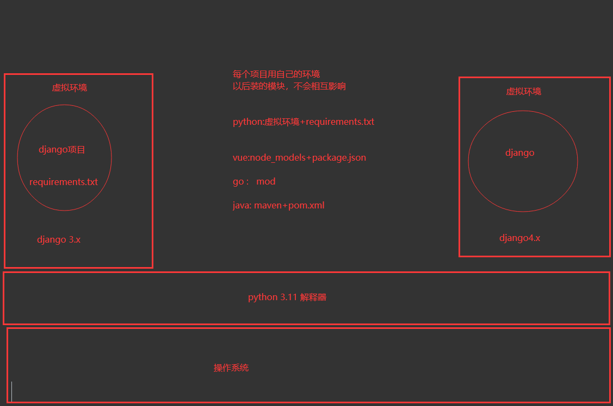
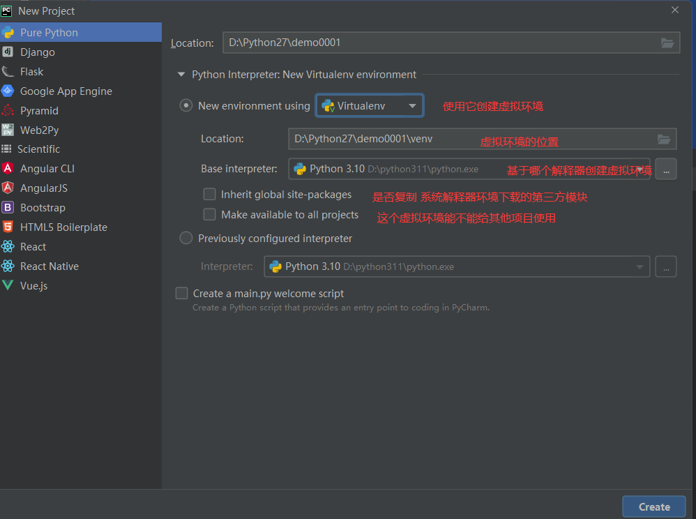

# 昨日回顾

```python
# 1 企业项目类型
	
# 2 企业项目开发流程
	-立项
    -需求分析
    -原型设计
    -分任务开发
    	-ui
        -前端
        -后端
    -联调，测试
    -上线运行

# 3 pip换源
	-写配置
    
# 4 虚拟环境
	-pychanrm中创建虚拟环境
    -使用Virtualenv创建虚拟环境
    	-两个模块
        pip3 install virtualenv # 释放命令：virtualenv.exe，用来创建虚拟环境
	    pip3 install virtualenvwrapper-win # 是否批处理文件：virtualenvwrapper.bat，辅助创建虚拟环境，让操作虚拟环境更方便
        -创建环境变量
        -执行bat
        -使用命令操作虚拟环境
        	-创建：mkvirtualenv -p python 虚拟环境名称
            -查看：workon
            -进入：workon 名字
            -退出：deactivate
            -删除:直接删文件夹  或  rmvirtualenv 虚拟环境名称
            
     -用命令创建出虚拟环境了，在pycharm中使用
    	-让项目跟虚拟环境关联上
        
     -创建了虚拟环境，使用pycharm创建django项目时，需要先装djanog，再创建
```






# 1 项目后台创建目录调整

## 1.1 步骤

```python
# 0 先在虚拟环境中安装django
    pip install django==4.2.17

# 1 创建后端项目
    	-pycharm创建
        -命令创建：在虚拟环境中使用命令创建
        
# 2 pycharm创建 django
	-选择创建的虚拟环境 -> 虚拟环境里已经安装好了咱们需要的版本的django
    
# 3 命令创建
	-进入到虚拟环境：保证django装好了
    -django-admin startproject luffy_api
    
# 4 调整一下项目目录
"""
├── luffy_api
    ├── logs/				# 项目运行时/开发时日志目录 - 包
    ├── manage.py			# 脚本文件
    ├── luffy_api/      		# 项目主应用，开发时的代码保存 - 包
        ├── apps/      		# 开发者的代码保存目录，以模块[子应用]为目录保存 - 包
        ├── libs/      		# 第三方类库的保存目录[第三方组件、模块] - 包
        ├── settings/  		# 配置目录 - 包
			├── dev.py   	# 项目开发时的本地配置
			└── prod.py  	# 项目上线时的运行配置
		├── urls.py    		# 总路由
		└── utils/     		# 多个模块[子应用]的公共函数类库[自己开发的组件]
    └── scripts/       		# 保存项目运营时的脚本文件 - 文件夹
"""

# 5 把settings.py 移动到了 settings -> dev.py 中了
	-python manage.py runserver  # 找不到配置文件了
    -只需要修改 manage.py 中配置文件的路径即可 -> 测试阶段这么运行
    os.environ.setdefault('DJANGO_SETTINGS_MODULE', 'luffy_api.settings.dev')
    
    -wsgi.py asgi.py配置文件路径改掉 -> 项目上线要用这两个，而不用manage.py
    os.environ.setdefault('DJANGO_SETTINGS_MODULE', 'luffy_api.settings.prod')

# 6 想让app都创建在 apps文件夹下
	-进入到这个文件夹下 cd luffy_api/apps
    -python ../../manage.py startapp home
    
# 7 注册app后，运行项目 -> 报错 ->  No module named 'home'
	INSTALLED_APPS = [
        ...
        'home'
    ]
    
# 8 导入模块 -> 要从 环境变量开始导起 -> 我们想直接写app名字 -> 直接可以导入
	 -把 apps目录，加入到环境变量即可
    
# 9 settings-->dev.py 调整如下
import sys, os
BASE_DIR = Path(__file__).resolve().parent.parent
sys.path.insert(0, os.path.join(BASE_DIR, 'apps'))
# 把D:\Python27\luffy_api\luffy_api\apps加入到了环境变量
# 把BASE_DIR 也加入到环境变量   以后，只要是在环境变量中得路径，都能从这个路径开始导起
# 到目前位置：项目根路径，小luffy_api和apps都在环境变量
sys.path.insert(0, str(BASE_DIR))

# 步骤89的思路可以理解为: 不同django项目写出来 大家习惯不同 目录设置是不太一样的
# 通过掌握环境的知识点 我们就可以把想要的路径添加到环境配置中 后面需要使用的时候找顺手或者最近的路径写就可以了
```

## 1.2 补充

```python
# 配置文件中，内置app和内置中间件 -> 其实都可以注释掉
# 注释掉后，如果使用drf -> 会报错
# 保证drf不报错
	REST_FRAMEWORK = {
   	 "UNAUTHENTICATED_USER": None,
	}
```

## 1.3 配置文件

```python
# 1 用来做目录获取和拼接的
from pathlib import Path
import os,sys
BASE_DIR = Path(__file__).resolve().parent.parent
# BASE_DIR 是哪个目录？ D:\Python27\luffy_api\luffy_api   就是小luffy_api

# print(BASE_DIR)
# 把apps目录加入到环境变量--以后我们导入模块，就可以从apps目录下开始导起
sys.path.insert(0,os.path.join(BASE_DIR,'apps'))
# 把小luffy_api也加入环境变量--以后我们导入模块，就可以从小luffy_api目录下开始导起
sys.path.insert(0,str(BASE_DIR))
# 以后导入模块，三个路径都可以用，建议从最短路径开始导

# 2 秘钥 -> 后续session加密，密码加密，都会使用这个秘钥
SECRET_KEY = 'django-insecure-md9*4ef6&zspyxwt86ee)s2$gu&6lg-92tf9#29g#xp0pg+196'

# 3 调试模式，上线要改成true
DEBUG = True

# 4 允许服务端部署在的域(地址)，如果DEBUG为True，这可以不写，但是如果DEBUG为False，这个必须写，不写就报错
ALLOWED_HOSTS = ['*']

# 5 项目所有app
INSTALLED_APPS = [
    'django.contrib.admin', # 后台管理
    'django.contrib.auth',  # auth 权限6表
    'django.contrib.contenttypes', # 记录了所有内置或你写的app的表
    'django.contrib.sessions',   # 咱们用的session，  django-session表
    'django.contrib.messages',   # 消息框架
    'django.contrib.staticfiles', # 静态文件
    'home',
    'user'
]

# 6 项目所有中间件
MIDDLEWARE = [
    'django.middleware.security.SecurityMiddleware',  # 安全中间件 -> 用户认证
    'django.contrib.sessions.middleware.SessionMiddleware',# session相关
    'django.middleware.common.CommonMiddleware', # 
    'django.middleware.csrf.CsrfViewMiddleware', # csrf相关
    'django.contrib.auth.middleware.AuthenticationMiddleware', # 认证相关
    'django.contrib.messages.middleware.MessageMiddleware', # 消息框架
    'django.middleware.clickjacking.XFrameOptionsMiddleware',
]

# 7 根路由
ROOT_URLCONF = 'luffy_api.urls'

# 8 模板
TEMPLATES = [
    {
        'BACKEND': 'django.template.backends.django.DjangoTemplates',
        'DIRS': [BASE_DIR / 'templates']
        ,
        'APP_DIRS': True,
        'OPTIONS': {
            'context_processors': [
                'django.template.context_processors.debug',
                'django.template.context_processors.request',
                'django.contrib.auth.context_processors.auth',
                'django.contrib.messages.context_processors.messages',
            ],
        },
    },
]

# 9 wsgi -> 上线使用的文件
WSGI_APPLICATION = 'luffy_api.wsgi.application'

# 10 数据库
DATABASES = {
    'default': {
        'ENGINE': 'django.db.backends.sqlite3',
        'NAME': BASE_DIR / 'db.sqlite3',
    }
}

# 11 认证
AUTH_PASSWORD_VALIDATORS = [
    {
        'NAME': 'django.contrib.auth.password_validation.UserAttributeSimilarityValidator',
    },
    {
        'NAME': 'django.contrib.auth.password_validation.MinimumLengthValidator',
    },
    {
        'NAME': 'django.contrib.auth.password_validation.CommonPasswordValidator',
    },
    {
        'NAME': 'django.contrib.auth.password_validation.NumericPasswordValidator',
    },
]

# 12 国际化
LANGUAGE_CODE = 'zh-hans'
TIME_ZONE = 'Asia/Shanghai'
USE_I18N = True
USE_TZ = False


# 13  静态文件
STATIC_URL = 'static/'

# 14 所有表，id字段默认使用BigAutoField
DEFAULT_AUTO_FIELD = 'django.db.models.BigAutoField'
```


# 2 封装logger

```python
# 1 咱们正式的企业项目，都必须有日志
log4j
	-python内置日志：咱么现在用的
    -第三方日志：logru 
    	-配置更简单，效率更高
        -日志存到文件
        
# 2 配置步骤
	-1 配置文件dev.py中写 配置
    # 15 日志配置
    LOGGING = {
        'version': 1,
        'disable_existing_loggers': False,
        'formatters': {
            'verbose': {
                'format': '%(levelname)s %(asctime)s %(module)s %(lineno)d %(message)s'
            },
            'simple': {
                'format': '%(levelname)s %(module)s %(lineno)d %(message)s'
            }
        },
        'filters': {
            'require_debug_true': {
                '()': 'django.utils.log.RequireDebugTrue',
            },
        },
        'handlers': {
            'console': {
                # 实际开发建议使用WARNING
                'level': 'DEBUG',
                'filters': ['require_debug_true'],
                'class': 'logging.StreamHandler',
                'formatter': 'simple'
            },
            'file': {
                # 实际开发建议使用ERROR
                'level': 'ERROR',
                'class': 'logging.handlers.RotatingFileHandler',
                # 日志位置,日志文件名,日志保存目录必须手动创建，注：这里的文件路径要注意BASE_DIR代表的是小luffyapi
                'filename': os.path.join(os.path.dirname(BASE_DIR), "logs", "luffy.log"),
                # 日志文件的最大值,这里我们设置300M
                'maxBytes': 300 * 1024 * 1024,
                # 日志文件的数量,设置最大日志数量为10
                'backupCount': 10,
                # 日志格式:详细格式
                'formatter': 'verbose',
                # 文件内容编码
                'encoding': 'utf-8'
            },
        },
        # 日志对象
        'loggers': {
            'django': {
                'handlers': ['console', 'file'],
                'propagate': True, # 是否让日志信息继续冒泡给其他的日志处理系统
            },
        }
    }
    
    -2 在utils中编写一个日志对象 utils/common_logger.py
        import logging
        logger=logging.getLogger('django')
    
    -3 在视图类，或者其他文件使用日志对象，导入使用即可
    from utils.common_logger import logger  # 编辑器报错，实际代码没错
    logger.info('info级别的日志')
    logger.error('程序崩了')
    
# 3 注意：
	  # 以后再项目中，不能再出现 print 了 -> 现在统一都用日志 -> logger.info
      # 好处是可以通过控制日志级别控制 ：输出的内容
        
 # 4 导入模块，编辑器爆红问题解决
	-把在环境变量中得路径，都做成source root
    
# 5 由于有多个环境变量路径 -> 导入模块，就会有很多导入路径
	-从最短路径开始导
    	-如果都在同一个文件夹下：用相对导入
        -如果不在同一个文件夹下，从最短导
        -如果用长路径，可能会报错（后面你遇到，注意一下）
```


# 3 封装全局异常

## 3.1 自定义异常类

```python
# 这是学习如何自定义 没有放在项目里
# python ：Exception，IndexOutOfRange.....
# django : 数据不存在。。。
# drf ：ValidationError。。。

# 我们写项目，通常也会封装一些异常类，更细粒度的区分是什么异常或错误

class PasswordError(Exception):
    def __init__(self,msg,detail='默认参数'):
        super().__init__(msg)
        self.detail=detail

try:
    # raise Exception('sss')
    raise PasswordError('密码错了','好小子，敢乱登录我们系统')
except Exception as e:
    print(e.detail)
```

## 3.2 封装全局异常

```python
# utils/common_exception.py
from rest_framework.views import exception_handler
from .common_logger import logger
from rest_framework.response import Response
def common_exception_handler(exc, context):
    # 1 记录日志 -> 只要是到这里，就是出异常了 -> 记录日志方便后期排查
    request=context.get('request')
    view=context.get('view')
    # '用户【】，访问地址【】，请求方式是【】，访问视图类【】，错误是【】'
    user = request.user.username or '匿名用户'
    path = request.get_full_path()
    method = request.method
    logger.error(f'用户【{user}】，访问地址【{path}】，请求方式是【{method}】，访问视图类【{str(view)}】，错误是【{str(exc)}】')
    # 2 统一返回格式
    res=exception_handler(exc,context) # 只会处理drf的异常
    res_dict={'code':999,'msg':'系统错误，请联系系统管理员'}
    if res:
        # 说明是drf的异常，它统一处理了
        if isinstance(res.data,dict):
            msg = res.data.get('detail') or res.data or '服务器异常，请联系系统管理员'
        elif isinstance(res.data,list):
            msg = res.data[0]

        res_dict['code']=998
        res_dict['msg']=msg
    else:
        # 非drf异常，没处理，我们需要处理
        msg=str(exc)
        res_dict['code'] = 997
        res_dict['msg'] = msg

    return Response(res_dict)

class PasswordError(Exception):
    def __init__(self,msg,detail='默认参数'):
        super().__init__(msg)
        self.detail=detail
```

## 3.3 以后使用

```python
# 1 放心大胆写代码，出了任何异常，前端都会收到固定的返回格式

# 2 遇到问题，直接抛异常 -> 统一异常处理会执行
# 16 drf的配置
REST_FRAMEWORK = {
    "EXCEPTION_HANDLER": "utils.common_exception.common_exception_handler",
}
```


# 4 封装response

```python
# 1 我们自己封装Response -> 更简单的使用
	return APIResponse()---->    {code:100,msg:成功}
	return APIResponse(status=201)---->    {code:100,msg:成功}  http响应状态码是201
	return APIResponse(headers={xx:xx})---->    {code:100,msg:成功} 响应头中带xx
	return APIResponse(code=109)---->    {code:109,msg:成功}
	return APIResponse(code=109,msg='请求错误')---->    {code:109,msg:请求错误}	
	return APIResponse(token='asdfa.adsfa.ss',username='lqz')---->    {code:100,msg:成功，token:asdfa.adsfa.ss,username:lqz}	
return APIResponse(results=[{},{}])---->  {code:100,msg:成功,results:[{},{}]}	
return APIResponse(result={})---->  {code:100,msg:成功,result:{}}	
```


```python
# utils/common_response
from rest_framework.response import Response

class APIResponse(Response):
    def __init__(self, code=100, msg='成功', status=200, headers={}, **kwargs):
        data = {'code': code, 'msg': msg}
        if kwargs: # 只要kwargs不为空，统一都放到响应体中
            data.update(kwargs)
        super().__init__(data=data, status=status, headers=headers)

```


# 5 前端项目创建及配置

```python
# 1 使用vue3编写

# 2 创建项目
	cnpm config set registry https://registry.npmmirror.com
    cnpm config get registry
    
    (可能会更新语句 如果以后用到可以注意一下最新怎么写的)
	cnpm create vite@latest
    
# 3 安装第三方：
cnpm install vue-router@4 -S
cnpm install pinia -S
cnpm install element-plus -S
cnpm install axios -S

# 4 引入router
	1 router/index.js
    2 main.js中注册
    	import router from './router'
		createApp(App).use(router)
    3 App.vue中只写   <router-view></router-view>

# 5 引入pinia
	1 store/index.js
    2 main.js中注册
    3 组件中使用
        import {definedMain} from '../store';
        let $store = definedMain()
        console.log($store.username)

# 6 引入element-plus

# 7 编写全局样式-所有前端都会做-去除浏览器默认样式 

# 8 在main.js中只要引入样式，样式就全局生效
```

## 5.1 vue-router使用

**router/index.js**

```js
// 导入路由创建的相关方法
import {createRouter,createWebHistory} from 'vue-router'

// 导入vue组件
import HomeView from '../views/HomeView.vue'

// 创建路由对象,声明路由规则
const router = createRouter({
    history: createWebHistory(),
    routes:[
        {
            path:'/',
            component:HomeView
        },
    ]
})

// 对外暴露路由对象
export default router;
```

**App.vue**

```vue
<template>
	<router-view></router-view>
</template>
```

**main.js**

```js
import { createApp } from 'vue'
import App from './App.vue'
import router from './router'
import { createPinia } from 'pinia'
let pinia= createPinia()
import ElementPlus from 'element-plus'
import 'element-plus/dist/index.css'
// 全局样式，导入一下即可
import './assets/css/global.css'
createApp(App).use(router).use(pinia).use(ElementPlus).mount('#app')
```

## 5.2 pinia

**store/index.js**

```js
import {defineStore} from 'pinia'
export const definedLuffy = defineStore(
    'definedLuffy', //必须唯一
    {
        state: () => { // state中用于定义数据
            return {
                title:'luffy学城'

            }
        },
        getters: {
        },
        actions: {
        }
    }
)

```


## 5.3 elementui-plus

```python
## main.js使用
import ElementPlus from 'element-plus'
import 'element-plus/dist/index.css'
createApp(App).use(ElementPlus).mount('#app')
```

## 5.4 去除默认标签样式

**assets/css/global.css**

```css
body, h1, h2, h3, h4, h5, h6, p, table, tr, td, ul, li, a, form, input, select, option, textarea {
    margin: 0;
    padding: 0;
    font-size: 15px;
}

a {
    text-decoration: none;
    color: #333;
}

ul {
    list-style: none;
}

table {
    border-collapse: collapse; /* 合并边框 */
}

```

**main.js**

```python
// 全局样式，导入一下即可
import './assets/css/global.css'
```

**HomeView**

```vue
<template>
<h1>首页-luffy=={{$store.title}}</h1>
  <el-button>点我</el-button>
  <div class="main"></div>
</template>

<script setup lang="js">
import {definedLuffy} from '../store'
 let $store = definedLuffy()
 console.log($store.title)
</script>

<style scoped>
.main{
  background-color: pink;
  width: 100%;
  height: 500px;
}
</style>
```


# 6 后端数据库

## 6.1 创建库和创建用户

```python
# 1 使用mysql数据库,django 4.x以上，需要使用mysql8.0以上

# 2 创建数据库，项目配置文件dev.py修改

# 3 后期公司的项目，不会使用root用户作为项目的数据库用户
	-数据库 root用户权限很高
    	-root用户，知道密码 -> 能够访问所有数据库
        -一旦root用户信息泄露 -> 所有库都能能访问 -> 存在问题
        -给每个项目创建一个数据库，给每个数据库创建用户 -> 即使当前项目的用户数据泄露 -> 只会泄露当前项目中的库中的表
    -多个项目使用一个数据库软件 -> 不同数据库-->不同用户
    
# 4 创建普通用户，给这个用户只授权 某个 库的权限
    # 4.1 创建luffy库，给项目使用
    # mysq7中，使用utf8编码或者使用utf8mb4编码
    # mysq8中，utf8没了，变成了utf8mb3，utf8mb4编码还是原来的
    create database luffy default charset=utf8mb4;
    # 4.2 查看用户
    SELECT User, Host FROM mysql.user;
    # 4.3 创建用户
    CREATE USER 'luffy_api'@'localhost' IDENTIFIED BY 'Luffy123?';
    CREATE USER 'luffy_api'@'%' IDENTIFIED BY 'Luffy123?';
    GRANT ALL PRIVILEGES ON luffy.* TO 'luffy_api'@'localhost' WITH GRANT OPTION;
    GRANT ALL PRIVILEGES ON luffy.* TO 'luffy_api'@'%' WITH GRANT OPTION;
    
	FLUSH PRIVILEGES;
    
# 5 使用 luffy_api 用户，密码是：Luffy123? 登录了，只能看到luffy库
mysql -u luffy_api -P 3308 -p

# 补充：
# 本地连接
# 本质是两个用户
sheenagh	%            # 允许sheenagh用户远程链接  mysql -ulqz -h 192.168.1.252 -P 3306 -p
sheenagh	localhost    # 允许sheenagh本地连接      mysql -ulqz -p
```

## 6.2 项目使用mysql

```python
# 1 安装模块：
	pip install mysqlclient
    
# 2 项目配置文件指定使用luffy用户链接数据库
# 环境变量上面添加上去
mysql_pwd = os.environ.get('MYSQL_PWD', 'Luffy123?')
mysql_user = os.environ.get('MYSQL_USER', 'luffy')
DATABASES = {
    'default': {
        'ENGINE': 'django.db.backends.mysql',
        'NAME': 'luffy',
        'HOST': '127.0.0.1',
        'PORT': '3306',
        'USER': mysql_user,
        'PASSWORD': mysql_pwd
    }
}

# 3 重要数据，放到环境变量 -> 如果重新设置了环境变量 -> 需要重启项目
	import os
    print(os.environ.get('MYSQL_PWD'))
    print(os.environ.get('MYSQL_USER'))
```


# 作业

```python
# 1 写个简单python项目，使用logru记录日志
	-控制台显示
    -保存到文件中
# 2 logru集成到django中

# 3 讲到哪写到哪
```

