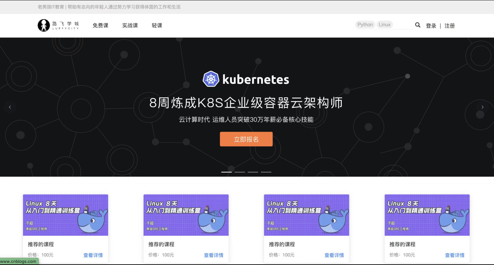
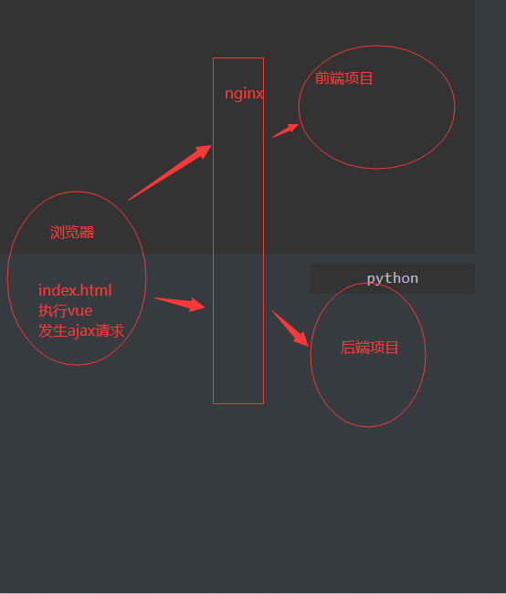
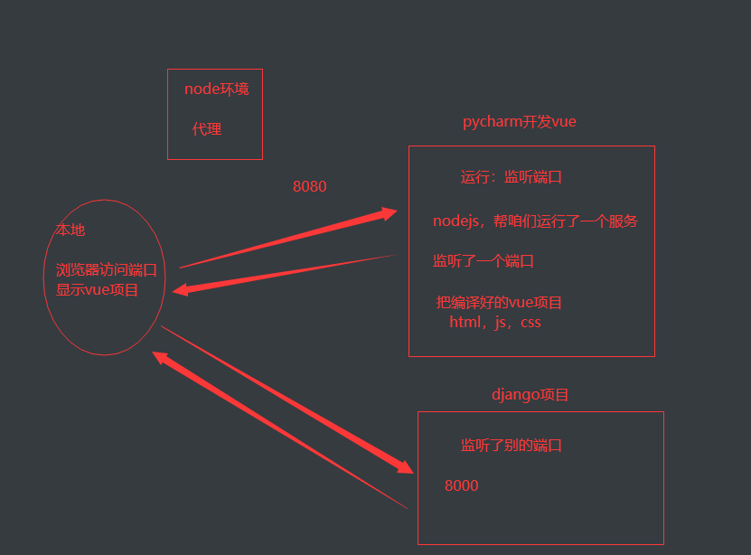

# 上节回顾

```python
# 1 后端项目目录调整
	1 核心代码都移动到 luffy_api目录下
    	-apps:所有app放在这里
        	来到这个目录下创建,相对路径找到manage.py
        -libs
        -utils
        	公共代码
        -url.py
        -settings
        	-dev
            -prod
    2  修改manage.py配置文件目录和名字
    	wsgi.py  asgi.py :目前用不到,上线才用
    3 创建了app,在配置文件中注册 -> 直接写app名字
    	把 apps luffy_api目录 加入到环境变量
       
# 2 配置文件详解

# 3 封装logger
	-内置日志
    -配置文件配置:
    -utils -> 封装公共代码 -> logger对象
    
# 4 全局异常
	-自定义异常类 -> 抛出我们的异常 -> 捕获
	-统一返回格式
    -记录日志:只要走到这里,都是error了
    	-用户id,时间,地址,视图类。。。
        
# 5  封装response
class APIResponse(Response):
    def __init__(self, code=100, msg='成功', status=200, headers={}, **kwargs):
        data = {'code': code, 'msg': msg}
        if kwargs: # 只要kwargs不为空,统一都放到响应体中
            data.update(kwargs)
        super().__init__(data=data, status=status, headers=headers)
return APIResponse()

# 6 前端项目创建
	-vue3 --vite创建
    -安装依赖:vue-router, pinia,elementui-plus,axios
    -全局css -> 去除标签默认样式
    	main.js中引入 -> css全局生效
    -创建了HomeView ,删除所有组件
    -App.vue--->只保留router-view标签

# 7 后端数据库
	-1 新建库给项目用:luffy
    -2 创建用户 luff_api
    	-允许远程和本地登录
        -授权:luffy库所有表所有权限
    -3 项目配置
    	-用户名和密码隐藏 -> 使用环境变量
```


# 今日内容

# 1 后端user表

## 1.1 user表设计

```python
# 1 先把用户表设计好,使用auth的user表,扩写字段
# 2 在最开始,迁移之前,就要搞好
```

```python
from django.db import models
from django.contrib.auth.models import AbstractUser
class User(AbstractUser):
    mobile = models.CharField(max_length=11, unique=True)
    # 需要pillow包的支持
    icon = models.ImageField(upload_to='icon', default='icon/default.png')

    class Meta:
        db_table = 'luffy_user'
        verbose_name = '用户表'
        verbose_name_plural = verbose_name

    def __str__(self):
        return self.username
# 配置文件
# 扩写auth的user表
AUTH_USER_MODEL='user.User'

# 安装pillow
pip install pillow

# 执行迁移
python manage.py makemigration
python manage.py migrate
```

## 1.2 软件开发模式

```python
# 瀑布开发
	-项目开发完（周期比较久） -> 再测试 -> 再上线
# 敏捷开发
	scrum:敏捷开发
    敏捷开发管理软件:Jira 禅道 
    	-甘特图
    sprint:一个周期是多少  一般都是一周到四周
	Sprint指Scrum团队完成一定数量工作所需的短暂、固定的周期。Sprint是Scrum和敏捷的核心
```


## 1.3 开启media访问

```python
# 1 访问用户头像要开启访问
# 2 创建media文件夹 -> 配置文件配置了 -> 头像默认传到 media/icon了

# 1 配置文件
MEDIA_URL = '/media/'
MEDIA_ROOT = os.path.join(BASE_DIR, 'media')

# 2 创建文件夹
小路飞下创建media

# 3 配一个路由-总路由中
from django.views.static import serve
from django.conf import settings
path('media/<path:path>', serve, {'document_root': settings.MEDIA_ROOT})

### 补充
auth的user表,密码加密方式
	-使用sha256+使用SECRET_KEY作为秘钥+盐
    
自定义用户表,参照这种方式设置密码这个字段
	md5+随机生成盐
    123 -> 随机生成盐 -> 23243 -> fsfasfsadfa
    盐$加密后的密码
    123$fsfasfsadfa
```


# 2 主页功能

```python
# 1 根据原型图,分析首页功能
	-假设导航动态变化 -> 写成接口
    	-查询首页显示导航接口
        {code,msg,results:[{id:1,name:免费课},{id:2,name:实战课},{id:1,name:轻课}]}
        -用户和导航一对多关系
        用户:user
        id   name   pwd
        1    张三  123
        2    李四   444
        导航表
        id  name   order  user_id
        1   免费课  1       1
        2   实战课  2       1
        3   实战课  1       2
        4   轻课    2       2
        
	-轮播图接口
    	-创建轮播图表
        	-id,名字,地址,跳转链接,图片顺序,上传时间,是否删除,是否展示
            -是否删除,是否展示,上传时间,顺序 -> 别的表:课程表也会用
         -封装一个基表,用来继承 -> 类似于AbstractUser
    -推荐课程接口
    	-创建课程表
        -个性化推荐
```



## 2.1 BaseModel抽象表

```python
# 所有app可能都会用
# 所以创建utils/common_model.py
from django.db import models

# 这个表不能再数据库中创建出来,只用来继承
class BaseModel(models.Model):
    created_time = models.DateTimeField(auto_now_add=True, verbose_name='创建时间')
    updated_time = models.DateTimeField(auto_now=True, verbose_name='最后更新时间')
    is_delete = models.BooleanField(default=False, verbose_name='是否删除')
    is_show = models.BooleanField(default=True, verbose_name='是否上架')
    orders = models.IntegerField(verbose_name='优先级')

    class Meta:
        abstract = True  # 只用来继承,不在数据库中生成表
```

## 2.2 Banner轮播图表

```python
# home/model.py
from utils.common_model import BaseModel
from django.db import models
class Banner(BaseModel):
    title = models.CharField(max_length=16, unique=True, verbose_name='名称')
    image = models.ImageField(upload_to='banner', verbose_name='图片')
    # web, 小程序, app  -> 轮播图 -> 可以点击 -> 点击 -> 跳转到某个地址
    # 跳转有两种情况:1 外链  2 自己的页面
    link = models.CharField(max_length=64, verbose_name='跳转链接')
    info = models.TextField(verbose_name='详情')
    
    class Meta:
    db_table = 'luffy_banner'
    verbose_name = "轮播图表"
    verbose_name_plural = verbose_name

    def __str__(self):
        return self.title
```

## 2.3 serializer

```python
# home/serializer.py
from rest_framework import serializers
from .models import Banner


class BannerSerializer(serializers.ModelSerializer):
    class Meta:
        model = Banner
        fields = ['id', 'image', 'link']
```

## 2.4 common_view

```python
# utils/common_view.py
from rest_framework.mixins import ListModelMixin,RetrieveModelMixin,UpdateModelMixin,DestroyModelMixin,CreateModelMixin
from utils.common_response import APIResponse
class CommonListModelMixin(ListModelMixin):
    def list(self, request, *args, **kwargs):
        res=super().list(request, *args, **kwargs)
        # 取出响应体中数据
        # res.data
        return APIResponse(results=res.data)
```

## 2.5 view

```python
# home/views.py
from rest_framework.viewsets import GenericViewSet
from rest_framework.mixins import ListModelMixin
from .models import Banner
from .serializer import BannerSerializer
from utils.common_view import CommonListModelMixin as ListModelMixin
class BannerView(GenericViewSet,ListModelMixin):
    # 只显示前三张轮播图
    queryset = Banner.objects.filter(is_delete=False,is_show=True).order_by('orders')[:3]
    serializer_class = BannerSerializer
```

## 2.6 访问

```python
http://127.0.0.1:8000/api/v1/home/banner/
```


# 3 跨域问题详解

```python
# 1 为什么会有跨域问题
	-因为浏览器的 【同源策略】,当js发送跨域请求【不是浏览器上的:域名,端口,协议】时,浏览器同源策略给拦截报错
    -我们能正常发送请求,后端也会正常处理 -> 但是返回的数据,被浏览器拦截了
    
    
# 2 什么是同源策略
同源策略（Same origin policy）是一种约定,它是浏览器最核心也最基本的安全功能,如果缺少了同源策略,则浏览器的正常功能可能都会受到影响

请求的url地址,必须与浏览器上的url地址处于同域上,也就是域名,端口,协议相同.

比如:我在本地上的域名是127.0.0.1:8000,请求另外一个域名:127.0.0.1:8001一段数据

浏览器上就会报错,这个个就是同源策略的保护,如果浏览器对javascript没有同源策略的保护,那么一些重要的机密网站将会很危险

# 3 跨域问题解决
	-1 使用cors解决:跨域资源共享   -> 后端配置
    	-代码控制:响应头中加东西
        -nginx控制:响应体中统一加
    -2 JSONP:忽略
    -3 nginx代理跨域（服务器代理）
    -4 vue 代理（开发阶段）
    	-有node环境
        -上线前端,不需要node环境
    
# 4 cors是什么:跨域资源共享 -> 用来解决跨域问题的后端技术
	-1 CORS请求分成两类:简单请求（simple request）和非简单请求（not-so-simple request）。
	-2 简单请求,只发一次
    -3 非简单请求先发送一次options请求【预检请求】,如果后端运行,再发送真实请求
    
# 5 什么是简单请求,什么是非简单请求
    1 请求方法是以下三种方法之一:
            HEAD
            GET
            POST
     2 HTTP的头信息不超出以下几种字段:
        Accept
        Accept-Language
        Content-Language
        Last-Event-ID
        Content-Type:只限于三个值application/x-www-form-urlencoded、multipart/form-data、text/plain
    
# 6 演示简单请求和非简单请求
	1 简单请求,只发一次
    2 非简单请求先发送一次options请求【预检请求】,如果后端运行,再发送真实请求
    
# 7 后端使用cors处理跨域
```





## 3.1 自己解决

```python
from django.utils.deprecation import MiddlewareMixin


class CorsMiddleware(MiddlewareMixin):
    def process_response(self, request, response):
        response['Access-Control-Allow-Origin'] = '*'
        # 处理非简单请求
        if request.method == 'OPTIONS':
            response['Access-Control-Allow-Headers'] = '*'
            response['Access-Control-Allow-Methods'] = '*'
        return response
```

## 3.2 第三方方案解决

```python
#1 使用pip安装
pip install django-cors-headers

#2 添加到setting的app中
INSTALLED_APPS = (
	...
	'corsheaders',
	...
)
# 3 添加中间件
MIDDLEWARE = [  
	...
	'corsheaders.middleware.CorsMiddleware',
	...
]
# 4 setting下面添加下面的配置
CORS_ORIGIN_ALLOW_ALL = True
CORS_ALLOW_METHODS = (
	'DELETE',
	'GET',
	'OPTIONS',
	'PATCH',
	'POST',
	'PUT',
	'VIEW',
)

CORS_ALLOW_HEADERS = (
	'XMLHttpRequest',
	'X_FILENAME',
	'accept-encoding',
	'authorization',
	'content-type',
	'dnt',
	'origin',
	'user-agent',
	'x-csrftoken',
	'x-requested-with',
	'Pragma',
	'token'
)


# 源码:第三方中间件:CorsMiddleware
	-process_response没有
    -支持异步的写法:__call__:同步会触发  ,__acall__:异步会触发
		self.add_response_headers(request, response)
```


# 4 前后端打通

```vue
<template>
<h1>首页-luffy</h1>
</template>

<script setup lang="js">
import {ref,reactive} from "vue";
import axios from "axios";
const banner_list=reactive({})
axios.get('http://127.0.0.1:8000/api/v1/home/banner/').then(res=>{
  Object.assign(banner_list,res.data)
  console.log(banner_list)
})
</script>

<style scoped>
.main{
  background-color: pink;
  width: 100%;
  height: 500px;
}
</style>
```


# 作业

```python
# 1 上课讲的写完

# 2 轮播录入点数据 -> 前端使用elementui把轮播图循环展示出来

# 3 读一下跨域源码

# 后端返回的时候
	obj.set_cookie('token','asfas.asdfas.asdf')
    本质在响应头中有:set-cookie:token=asfas.asdfas.asdf
# 前后端混合 -> 前端会自动存到浏览器中
	浏览器读到 set-cookie,会自动存到浏览器的cookie中
    再发请求,不用携带 -> 浏览器自动会把cookie放到请求头中
    
# 前后端分离,ajax发送请求
	axios -> res.headers-->不会自动放到浏览器cookie中得
    咱们手动来做
    
    再发请求,需要手动携带
    
    
```


